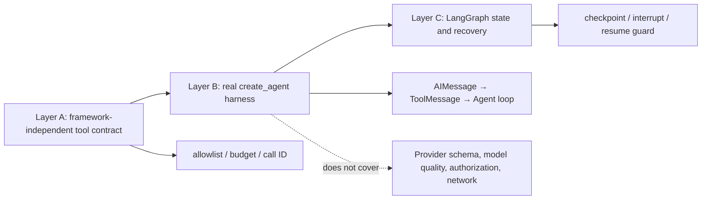

# Project: Keyless `create_agent` Runtime Contract

## Project objective

This layer runs `create_agent` in pinned `langchain==1.3.14` without accessing a model provider, requiring an API key, or writing business data. It fills the gap between the framework-independent [[langchain/beginner-route/07-project-offline-tool-agent-skeleton|Layer A offline tool loop]] and the [[langchain/beginner-route/08-project-langgraph-recoverable-approval-flow|Layer C LangGraph recovery flow]]. Layer A fixes framework-independent safety contracts; this lesson verifies how the current LangChain harness connects model messages, tool calls, and `ToolMessage` objects.

> [!important] Evidence boundary
> This project's `ScriptedToolModel` is a small test shim for `FakeMessagesListChatModel`. To let `create_agent` run, it bypasses real-provider `bind_tools` serialization. A green result therefore proves only the local Agent graph, `ToolNode` dispatch, tool-call IDs, and explicit error policy in the pinned version. It **does not** prove that OpenAI, Anthropic, or another provider accepts the same schema; that a real model selects the correct tool; that object-level authorization is correct; or that a network call succeeds.

## How the three project layers connect



Do not use the three layers as substitutes for one another. A successful framework runtime does not automatically authorize Layer A tools, nor does a Layer C checkpoint become a cross-system transaction.

## Files and dependencies

```text
examples/langchain_layer_b/
├── requirements.txt                 # Pinned versions for three direct runtime dependencies
├── scripted_create_agent.py         # Directly runnable scripted trajectories
└── test_scripted_create_agent.py    # Eight regression tests
```

`requirements.txt` pins all direct runtime dependencies used by this example: `langchain==1.3.14`, `langchain-core==1.4.9`, and `langgraph==1.2.9`. Before building the Agent, the script verifies all three installed versions individually and fails closed with a nonzero exit code on any mismatch. This is a teaching contract, not a replacement for a complete resolved lockfile. Transitive dependencies such as Pydantic still affect behavior; a real project must preserve its complete lockfile and rerun this lesson and the adjacent Layer C when upgrading.

## What actually runs

`scripted_create_agent.py` runs three prewritten trajectories through the same real `create_agent`:

| Mode | Model-message request | Expected ToolMessage | Boundary under test |
| --- | --- | --- | --- |
| `success` | `bounded_add(a=2, b=3)` | `success`, the same `call-add-2-3`, content `5` | Normal tool dispatch and call-ID correspondence |
| `unknown_tool` | A tool not in the registry | `error`; the function never runs | The runtime does not map an unknown name to an available tool |
| `invalid_arguments` | `bounded_add(a="2", b=3)` | `error`; the function never runs | Strict Pydantic schema and error observability |

The example explicitly sets `handle_validation_error="invalid_tool_arguments"` on a `StructuredTool`. This is this project's chosen failure policy; do not assume that every `create_agent` or `ToolNode` configuration automatically turns validation exceptions into messages that can continue. If retries are necessary, use bounded middleware only for classified transient exceptions. Invalid input or authorization errors cannot be bypassed through retries.

## Run in an isolated environment

Run from the repository root:

```powershell
$example = Resolve-Path '.\docs-EN\langchain\beginner-route\examples\langchain_layer_b'  # Resolve the Layer B example directory so later relative paths remain stable.
Push-Location $example  # Enter the example directory temporarily.
try {  # Ensure finally restores the current directory even when one mode fails.
    uv run --isolated --with-requirements '.\requirements.txt' python -B '.\scripted_create_agent.py' --mode success  # Verify normal tool dispatch and call-ID correspondence.
    uv run --isolated --with-requirements '.\requirements.txt' python -B '.\scripted_create_agent.py' --mode unknown_tool  # Verify that an unknown tool name is rejected before function execution.
    uv run --isolated --with-requirements '.\requirements.txt' python -B '.\scripted_create_agent.py' --mode invalid_arguments  # Verify that invalid arguments are rejected during schema validation.

    uv run --isolated --with-requirements '.\requirements.txt' python -B -m unittest -v '.\test_scripted_create_agent.py'  # Run the full contract suite in normal interpreter mode.
    uv run --isolated --with-requirements '.\requirements.txt' python -B -O -m unittest -v '.\test_scripted_create_agent.py'  # Check that production validation does not rely on bare assert.
    uv run --isolated --with-requirements '.\requirements.txt' python -B -W error -m unittest -v '.\test_scripted_create_agent.py'  # Elevate warnings to failures to check compatibility boundaries.
    uv run --isolated --with-requirements '.\requirements.txt' python -B -O -W error -m unittest -v '.\test_scripted_create_agent.py'  # Cover the combination of optimized mode and strict warnings.
} finally {  # Always restore the location stack, regardless of script or test outcome.
    Pop-Location  # Return to the caller's project root.
}
```

Installation accesses a package index; the script itself does not access a network, read keys, or create a database. The CLI emits JSON explicitly in UTF-8 so Windows subprocesses can parse even negative paths containing Chinese text consistently, and it prints the three verified versions. In the isolated run on 2026-07-22, all eight tests passed once each in normal, `-O`, `-W error`, and `-O -W error` modes. CLI subtests compared the complete JSON contract for all three trajectories between normal and `-O`.

## A real-provider smoke test remains separate

In the project's own test environment, build a small smoke-test set with controlled cost and credentials. At minimum record the provider package and model ID, schema passed to `bind_tools`, actual tool call and `ToolMessage.tool_call_id`, timeout/error classification, structured-output policy, and a trace without raw sensitive inputs. This smoke test can validate provider-side schema conversion; it still does not replace offline authorization, idempotency, RAG, or recovery regression tests.

> [!warning] A tool schema is not authorization
> Even when a real provider passes a smoke test, a model-supplied `order_id`, URL, SQL statement, or path is untrusted input. Object-level authorization, resource scope, approval, idempotency keys, and recovery from an unknown outcome must be implemented on the tool/service side. See [[tool-calling-function-calling/00-index|Tool Calling (including Function Calling)]].

## Acceptance

- [ ] Run the three CLI modes in an environment with the three pinned runtime dependencies and check their reported versions.
- [ ] All eight tests pass in normal, `-O`, `-W error`, and `-O -W error` modes without relying on bare `assert`.
- [ ] Explain why the function does not execute for an unknown tool or schema error.
- [ ] Explain what the fake shim proves and does not prove.
- [ ] Treat real-provider smoke testing, authorization, and quality evaluation as separate gates rather than treating this example's “completed” result as release evidence.

## Next step

Continue with the [[langchain/beginner-route/08-project-langgraph-recoverable-approval-flow|LangGraph recoverable approval flow]] to place this lesson's limited tool loop into recoverable, explicit state control.

## Source baseline

Official facts and the isolated run were checked on 2026-07-22.

- [LangChain Agents](https://docs.langchain.com/oss/python/langchain/agents)
- [LangChain Tools](https://docs.langchain.com/oss/python/langchain/tools)
- [LangChain v1 migration](https://docs.langchain.com/oss/python/migrate/langchain-v1)
- [LangChain Agent Evals](https://docs.langchain.com/oss/python/langchain/test/evals)
- [PyPI: langchain 1.3.14](https://pypi.org/project/langchain/1.3.14/)
