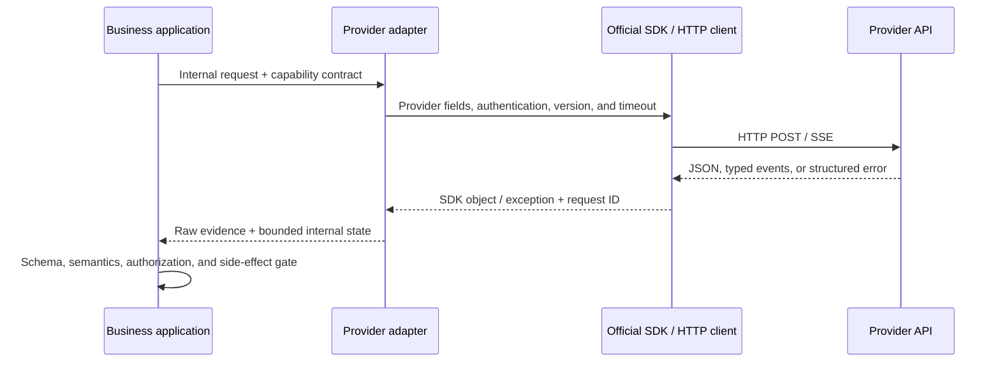

# HTTP, SDKs, and the Request Lifecycle

## Objectives

Understand that an SDK wraps an HTTP API, and be able to locate failures in serialization, connection, server processing, parsing, and business validation.

## What one call passes through

1. The application validates input, context budget, and permissions.
2. The adapter maps a provider-neutral request to current SDK/HTTP fields.
3. The SDK serializes JSON, adds authentication and version headers, and sends an HTTP request over TLS.
4. The server authenticates, rate-limits, and runs model inference.
5. The client receives complete JSON or an SSE event stream.
6. The adapter converts it to a unified result; the application validates schema, semantics, and authorization.
7. The application records redacted metrics and the request ID, then responds to the user or performs the next step.

Knowing the stage makes classification correct: a local JSON-serialization error should not be retried; DNS or a broken connection may be temporarily recoverable; HTTP 401 usually requires fixing authentication; HTTP 429 requires honoring rate-limit information; and a successful response can still fail during business validation.

## SDK or direct HTTP

An official SDK usually supplies types, authentication, connection pooling, streaming iteration, and error classes, which suits most projects. Direct HTTP is useful for learning the protocol or handling a capability the SDK does not cover, but then you must maintain version headers, SSE framing, event parsing, error shapes, retries, and compatibility yourself. In either case, keep provider objects within the adapter layer.

An SDK can have built-in retries and a very long default timeout. If an outer layer, SDK, gateway, and queue each retry independently, the worst-case request count multiplies. For the course-pinned `openai-python 2.46.0`, the official README records the default `max_retries=2`: connection errors, 408, 409, 429, and `>=500` are automatically retried. One SDK call can therefore produce up to three transport attempts. Its default timeout is ten minutes, and a timeout itself enters the default retry behavior. If an outer layer also permits three attempts, the worst case is nine network attempts. This conclusion applies only to this SDK baseline; do not generalize it to another SDK or infer that every 409 is business-idempotent.

Inspect and record the actual SDK version and defaults, designate a single retry owner, and bound total attempts and the business deadline. When customization is needed, prefer the SDK's public configuration interface rather than modifying private transport state. Even after disabling SDK retries, retain application-level error classification, jitter, and total budgets.

Timeout is not one number: at minimum distinguish connection, read/stream-idle, single-call, and total business deadlines. The SDK can limit one network wait; the application deadline decides whether this business request is still worth continuing. Execute real side effects after generation in a separate, idempotent business step.

## Client and stream lifecycles

Treat a client as a long-lived resource: create and reuse its connection pool when the process or worker starts, and call public `close()/aclose()` methods or use a context manager at shutdown. Do not create a client for every call; doing so loses connection reuse and amplifies DNS/TLS cost. Do not share synchronous and asynchronous clients across the wrong event loops.

A stream has its own lifecycle. When the consumer completes normally, the user cancels, the deadline expires, or parsing fails, close the response context; stopping reads does not guarantee that a connection was released. For asynchronous tasks, propagate cancellation downward and clean up in `finally` blocks or context managers so a background reader cannot continue consuming tokens or holding a socket.

## Keep three representations distinct

A streaming call has at least three representations. Do not conflate them in tests:

| Layer | Example | What it can prove |
| --- | --- | --- |
| wire | HTTP headers and SSE `event:`/`data:` bytes | framing, encoding, proxies, and disconnect behavior |
| SDK typed object | event/exception parsed by the SDK | types and public properties of a pinned SDK version |
| application canonical | internal events such as `response.started` | a stable business contract, not the provider's raw protocol |

Offline canonical tests cannot prove wire framing. A typed projection made from hand-written dictionaries also cannot prove that the SDK can decode a live response. A production adapter needs separate fixture, SDK-integration, and live-smoke tests.

## Response metadata

Retain server request ID, HTTP status, completion/stop reason, usage, cache information, and raw error type; do not depend on error-message strings because wording changes. For the current `openai-python`, the public `_request_id` on a successful response and `APIStatusError.request_id` on failure can assist troubleshooting; do not guess IDs from other private fields. Adapt other SDKs through their respective public interfaces. Do not persist raw requests/responses by default when they contain personal information or secrets.

An HTTP request ID differs from an application `operation_id`: the former usually changes on every attempt and is used for provider troubleshooting; the latter stays stable across all attempts for one business operation and is used for local deduplication and tracing. Do not use a request ID as a business idempotency key.

## Exercise and self-check

Draw the seven-stage sequence of an SDK call, then place “no key,” “connection timeout,” “429,” “missing JSON field,” “model refusal,” and “business-rule failure” at their appropriate stages. Self-check: which failures can be retried automatically, and which require changing the request or human intervention?

## Mastery checklist

- [ ] I can place serialization, connection, server, stream parsing, business-validation, and authorization errors at a concrete layer.
- [ ] I have determined the SDK version, default timeout, and default retries in use, and do not let policies multiply across layers.
- [ ] Connection, read/stream-idle, single-call, and business deadlines each have a clear owner.
- [ ] The client reuses its connection pool and closes explicitly; streams clean up on completion, cancellation, deadline, and parsing failure.
- [ ] Wire SSE, SDK typed events, and application canonical events are tested separately; I do not present a projection as live evidence.
- [ ] I record server request ID separately from application operation ID and do not treat the former as an idempotency key.
- [ ] Provider raw objects exist only in the adapter layer; the application contract does not depend on their private fields.

## Next step

Continue to [[llm-api-integration/03-messages-configuration-and-version-awareness|Messages, Configuration, and Version Awareness]].

## References

- [RFC 9110: HTTP Semantics](https://www.rfc-editor.org/rfc/rfc9110)
- [OpenAI: API errors](https://developers.openai.com/api/docs/guides/error-codes) (accessed 2026-07-21)
- [OpenAI: official Python SDK—Retries, timeouts, request IDs and closing](https://github.com/openai/openai-python) (accessed 2026-07-21)
- [Anthropic: API errors](https://platform.claude.com/docs/en/api/errors) (accessed 2026-07-21)
- [Anthropic: Python SDK](https://platform.claude.com/docs/en/cli-sdks-libraries/sdks/python) (client lifecycle, accessed 2026-07-21)
- [Google Gen AI SDK: Client reference](https://googleapis.github.io/python-genai/genai.html) (closing synchronous and asynchronous clients, accessed 2026-07-21)
