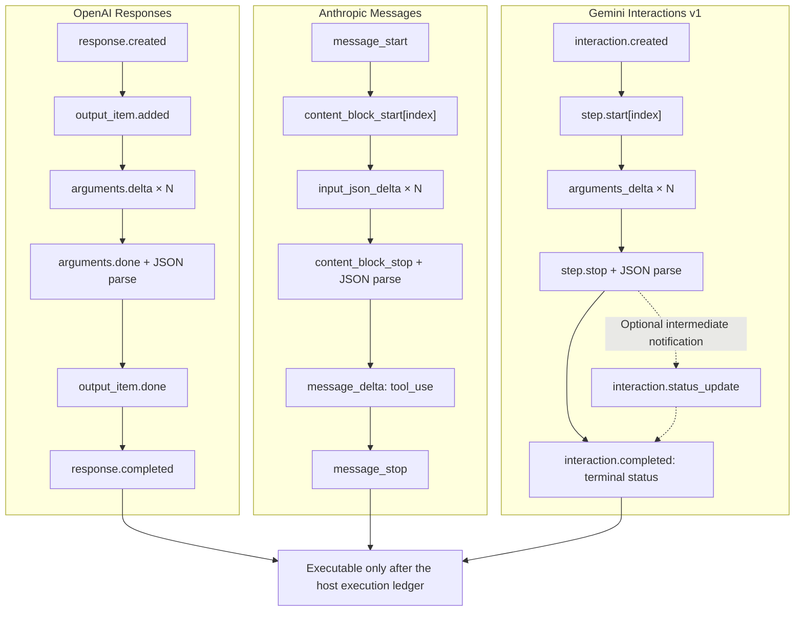

# Project: Three-Provider Contract Tests

> [!important] Evidence boundary
> This project is completely offline: it reads no secrets, imports no provider SDKs, and calls no real APIs. It proves that, against the **official API Reference and SDK type baselines pinned on 2026-07-21**, event-projection parsing, identity association, terminal gates, and continuation payloads satisfy a local contract. When consulting machine schemas, separately check their API version; do not mix a `v1beta` union into stable `v1`. The OpenAI/Gemini fixtures are `typed-sse-projection`; the Anthropic fixture is `wire-sse-envelope-projection`. They are not real SSE bytes, SDK instances, or live-conformance evidence.

## Why add this layer after the reliable client?

[[llm-api-integration/07-project-reliable-client-and-self-tests|The reliable client project]] handles provider-neutral responsibilities: timeout boundaries, one retry budget, temporary/permanent errors, partials and terminals, operation IDs, and observability. It deliberately uses local canonical events, so it cannot prove real provider contracts.

This project adds the next layer: it separately consumes event shapes for OpenAI Responses, Anthropic Messages, and Gemini Interactions v1, and constructs each provider's tool-result continuation. All three share the concept “the model proposes a call, the host executes it, then returns the result,” but there is no lossless common wire JSON:

| Boundary | OpenAI Responses | Anthropic Messages | Gemini Interactions v1 |
| --- | --- | --- | --- |
| One-turn output | ordered heterogeneous `output` Items | ordered `content` blocks | ordered `steps` |
| Client call | `function_call` Item | `tool_use` block | `function_call` step |
| Result association key | `call_id`, not Item `id` | `tool_use_id` | `call_id`, corresponding to function-call step `id` |
| Tool-turn terminal | inspect output after `response.completed`; completed can still contain only calls | `message_stop`, final `stop_reason=tool_use` | `interaction.completed`, Interaction `status=requires_action` |
| Stateful continuation | ordinary HTTP `previous_response_id`; prior Response must be retrievable | no server conversation handle; replay complete message history | `previous_interaction_id`; prior Interaction must have been stored |
| Stateless continuation | canonical prior-input Items + current complete output Items + results | inherently complete-history replay | unified Step array; a create snapshot supplements prior input, while a GET snapshot must not supplement it again |
| Configuration resent | official documentation says `instructions` do not inherit through a previous ID; local policy also explicitly resends tools/tool choice and other caller-owned controls | caller sends `system`, tools, messages, and request controls | previous ID does not inherit tools, system, or generation configuration |
| Streaming association | `sequence_number + output_index + item_id` | block `index` | step `index` only associates within one stream; optional `event_id` can deduplicate resumption |

The internal dataclasses provide only the bounded projections needed for orchestration while retaining the original Item/block/step. They do not rename provider fields and falsely claim the three semantics are identical.

After parsing, every provider turn stores a local canonical snapshot digest. Before copying history, call identity, or an opaque block, continuation constructors check that digest again. This can detect accidental mutation of an in-memory object after parsing; it does not replace signatures, database CAS, or cross-process authenticity proofs. A tool declaration must also include the function name actually observed in the current turn, so a schema of the same shape from another tool cannot silently be applied to the result.

## Correct two conclusions that easily become stale

### Gemini Interactions is already GA

As of 2026-07-21, Google officially describes Interactions as Generally Available since June 2026, with its stable endpoint in `v1`; it must no longer be labeled preview/beta. Google describes GenerateContent as **legacy but fully supported**: it remains a stable, widely deployed API family that requires maintenance, not something deprecated or about to be removed.

Record stability at four layers:

| Layer | What to record | Project baseline |
| --- | --- | --- |
| API version | `v1` or mutable `v1beta` | Interactions `v1` |
| API family | the endpoint's own GA, legacy, or preview status | Interactions GA; GenerateContent legacy and fully supported |
| Model | whether a precise model ID is stable/preview | fixtures use synthetic opaque values and make no live-availability claim |
| Individual capability and SDK | schema/tool combinations, SDK default endpoint, and concrete behavior | `google-genai 2.12.1`; a real client still explicitly selects `api_version="v1"` |

The Interactions migration in May–June 2026 changed `outputs` to `steps` and changed structured output and SSE events. Old blog posts, old fixtures, or cached `outputs` are not the current v1 contract.

### SDK automatic retries are not server idempotency

As of the review date, the public references and current Python SDKs for OpenAI Responses and Anthropic Messages do not provide a general contract that permits claiming **server-side exactly-once** for `/responses` or `/messages`; Google materials likewise did not reveal a general idempotency-key promise for generation requests. The latter is an audit conclusion from not finding that contract in official materials, not proof that a server has absolutely no internal deduplication.

All three Python SDKs can also retry some connection failures, timeouts, 429s, or 5xxs by default. Therefore:

```text
SDK automatic retry != server deduplication != tool-side-effect idempotency != exactly-once
```

The safe baseline is to complete a provider turn to a terminal state first, then write pending calls into the host execution ledger. Write tools also need a business idempotency key, approval, and result reconciliation. Reposting after a timeout can yield a new response/message/interaction and a new call ID; a provider call ID cannot serve as the business-unique key by itself.

## Project files

| File | Responsibility |
| --- | --- |
| [[llm-api-integration/examples/provider_contracts/provider_contracts.py\|provider_contracts.py]] | strict fixture loader, three independent state machines, opaque identity, result-set binding, and five continuation constructors |
| [[llm-api-integration/examples/provider_contracts/test_provider_contracts.py\|test_provider_contracts.py]] | 99 tests for normal paths, drift, interleaving, truncation, error, replay, source attacks, and limits |
| [[llm-api-integration/examples/provider_contracts/fixtures/openai_responses_tool_stream.json\|OpenAI fixture]] | current Responses Reference `sequence_number`, argument delta/done, Item done, and terminal output |
| [[llm-api-integration/examples/provider_contracts/fixtures/anthropic_messages_tool_stream.json\|Anthropic fixture]] | named SSE-envelope projection, ping, text/tool blocks, `input_json_delta`, and `message_stop` |
| [[llm-api-integration/examples/provider_contracts/fixtures/gemini_interactions_tool_stream.json\|Gemini fixture]] | Interactions GA v1 typed SSE projection, `event_id`, argument delta, status, and terminal |

All three fixtures pin provider, API family/version, contract revision, SDK baseline, review date, and official URL. The loader binds URLs to the corresponding official-documentation domains and SDK GitHub repository. It validates percent encoding per GitHub-path segment before decoding, then rejects `.`/`..`, empty segments, duplicate or encoded separators, backslashes, nested encodings, and cross-repository paths. Userinfo, lookalike subdomains, and non-default HTTPS ports also fail. Explicit `allow_local_source_urls=True` opens loopback only for the local fixture harness. This allowlist is metadata-hygiene validation, not content signing, TLS pinning, or an authenticity proof. Example IDs and model values are synthetic and do not depend on documentation prefixes such as `resp_`, `msg_`, `toolu_`, or `int_`.

## Run the project

Use only the Python 3.11 standard library. From the project root that contains both `docs-EN/` and `.website/`, run:

```powershell
Push-Location -LiteralPath 'docs-EN\llm-api-integration\examples\provider_contracts'  # Enter the provider-contract example directory so tests import fixtures predictably.
py -3.11 -B -W error -m unittest -v test_provider_contracts.py  # Run the three-provider offline contract regression tests normally.
py -3.11 -O -B -W error -m unittest -v test_provider_contracts.py  # Repeat in optimized mode to show critical checks do not depend on bare assert.
Pop-Location  # Restore the working directory from before the command.
```

`-B` prevents bytecode output, `-W error` treats warnings as failures, and `-O` proves that critical gates do not rely on bare `assert` that an optimizer removes. Tests make no network calls and have no real waits.

## Three state machines, not an event-name substitution table



### Shared safety invariants

The three implementations share only these host invariants:

1. Accumulate argument fragments by provider identity key, then strictly parse JSON after a completion event.
2. Arguments must be a JSON object; duplicate keys, `NaN/Infinity`, non-UTF-8 text, overly deep, or oversized values fail.
3. Parallel calls cannot be associated through one “current call” variable.
4. EOF, an in-stream error, failed/truncated terminal, and illegal sequence do not release a provisional call.
5. Every call in a turn must have exactly one result; missing, extra, and duplicate results are all forbidden.
6. Treat provider IDs as opaque text; do not depend on example prefixes.
7. Missing known required fields fail; new optional fields and unknown telemetry are retained. Unknown block/step/status fails closed when it could change execution semantics.

“Allowing new fields” and “detecting drift” do not conflict: fixture metadata and known critical fields form a versioned golden contract, while raw payloads remain available for CI review during SDK/OpenAPI upgrades. Setting every provider object to `additionalProperties:false` would create meaningless outages when official APIs add optional fields.

## OpenAI Responses: Items, call ID, and a complete terminal

The authoritative current fields for Responses function-argument streaming are:

- `response.function_call_arguments.delta`: `delta`, `item_id`, `output_index`, `sequence_number`, and `type`;
- `response.function_call_arguments.done`: also carries complete `arguments` and `name`;
- `response.output_item.done`: supplies the final function-call Item;
- `response.completed`: supplies the complete Response.

The project uses `(output_index, item_id)` to separate interleaved argument streams and requires strictly increasing `sequence_number`; it does not invent a requirement that numbering begins at zero or is contiguous. Concatenated delta values must agree with done, Item done, and terminal output for identity and arguments. Non-function Items must also bind an entire lifecycle by index, not merely validate their `type`.

> [!warning] Current drift in official material
> Some function-calling-guide event examples still include `response_id` and omit `sequence_number`; the API Reference and generated types in `openai-python 2.46.0` on 2026-07-21 require `sequence_number`, while argument delta/done types have no `response_id`. This fixture takes the machine Reference plus pinned SDK tag as its baseline while allowing future extra fields. On upgrade, compare both sources again rather than silently copying an old example.

`response.completed` means this Response step finished; its output can contain one or more `function_call` Items and does not mean that a final assistant text already exists. The orchestrator must continue the tool loop until it receives a business-validated final message/refusal, or an explicit failure, truncation, or cancellation. The terminal must also contain complete output consistent with the earlier Item added/done lifecycle; correct function-call pairing does not justify ignoring a missing reasoning, message, or other non-function Item.

`build_openai_responses_continuation()` constructs stateful continuation as follows:

```json
{
  "model": "fixture-model",
  "previous_response_id": "response-A",
  "store": false,
  "instructions": "Controlled instructions resent explicitly on every turn",
  "tool_choice": "auto",
  "parallel_tool_calls": false,
  "max_output_tokens": 512,
  "tools": [
    {
      "type": "function",
      "name": "lookup_order",
      "parameters": {
        "type": "object",
        "properties": {"order_ref": {"type": "string"}},
        "required": ["order_ref"],
        "additionalProperties": false
      },
      "strict": true
    }
  ],
  "input": [
    {
      "type": "function_call_output",
      "call_id": "call-A",
      "output": "{\"status\":\"shipped\"}"
    }
  ]
}
```

Read the fields as follows:

- `model` is a synthetic model identifier for the local fixture; a real deployment obtains it through controlled model configuration.
- `previous_response_id` binds a preceding Response proven retrievable by the server; it cannot be replaced with an arbitrary string.
- `store` chooses storage for the new Response; whether the preceding Response can continue is a separate question.
- `instructions` must be sent explicitly on this turn and cannot be assumed to inherit automatically from the prior response.
- `tool_choice`, `parallel_tool_calls`, and `max_output_tokens` are local request controls to set under business budgets and policy.
- `strict` and JSON Schema in `tools` constrain the shape of function arguments; they do not grant server-side authorization.
- The `function_call_output.call_id` in `input` must precisely match the prior function call, and `output` must contain only a validated tool result.

Use `call_id`, never the function-call Item `id`. For the ordinary HTTP `POST /responses` covered by this project, `previous_response_was_stored=True` is a local-constructor precondition proving that the preceding Response can be retrieved by the server; it is not an official request field. Responses WebSocket mode has a memory-cache exception for the most recent turn on the current connection, which is outside this constructor. The new request's `store` independently decides whether the new Response is saved. Continuing from a stored predecessor while setting the new turn to `store=false` is valid and distinct.

Official documentation states that `instructions` do not inherit through `previous_response_id`, and earlier input tokens on the chain remain billed; a server handle is not “free context.” This project further treats `tool_choice`, parallel setting, output budget, tools, and other caller-owned controls as per-request configuration. It resends them through explicit `request_controls` and rejects attempts to override protected fields. That is an auditable local security policy, not a claim that every field has the same official non-inheritance guarantee.

For manually managed context under `store=false`/ZDR, pass canonical prior-input Item objects and replay **every** `response.output` Item in original order, especially reasoning Items, before appending results. The project does not collapse this path into “replay only visible text.” Direct-function caller metadata is retained as-is. Programmatic callers and namespaces whose semantics are not implemented fail closed so that another call origin is not incorrectly downgraded to an ordinary function.

## Anthropic Messages: block order and stateless history

The Anthropic fixture is a **wire-SSE envelope projection**: it retains the named event and JSON `data` layers and checks they agree, but does not claim coverage of real byte framing or SDK decoding. `ping` can occur, and `event: error` can arrive after HTTP success. An SDK can filter ping and turn error into an exception, so an envelope projection and SDK-object fixture must not be written as one layer.

Tool arguments come from multiple `input_json_delta.partial_json` fragments in the same block index. An empty string is a valid delta, and a zero-argument tool can complete from an initial `{}` at block start. Parse an object only after `content_block_stop`, and allow execution only after both final `message_delta.stop_reason=tool_use` and `message_stop`. When eager/fine-grained input streaming is explicitly enabled, official behavior permits incomplete JSON at stream end. The local state machine places it in recovery calls and forces a continuation result with `is_error=true`; it must never execute that input. If the same truncated turn contains complete sibling calls, those siblings also enter recovery rather than executing first.

Messages does not continue through a response ID. `build_anthropic_messages_continuation()` explicitly replays:

1. `user`/`assistant` history before the call;
2. the current turn's complete assistant content, including ordinary text before/after tools, thinking/redacted thinking, signatures, server-tool blocks, and every `tool_use`;
3. all `tool_result` values in the next `user` message;
4. top-level `system`, model, max tokens, the same tool definitions, and explicit request controls.

Results for multiple parallel calls must be in one user message, with every `tool_result` before ordinary text. Anthropic natively supports `is_error`, so an error result must not be disguised as successful text. `server_tool_use` is an Anthropic-executed server-side tool; when a turn mixes server/client tools, replay all complete assistant blocks but submit only client `tool_use` to the host for execution.

Local `AnthropicMessagesTurn.calls` exposes only executable calls whose `stop_reason=tool_use` and input are parseable. Calls with invalid JSON or `max_tokens` truncation enter a separate `recovery_calls` collection. This is not a native Anthropic field; it prevents a caller that merely filters `input_error is None` from bypassing the whole-turn terminal gate.

Top-level `system` can be a string or an array of text blocks and remains the default with the broadest coverage. Anthropic currently also offers mid-conversation system messages for a few verified models. As of the review date these include Fable 5, Mythos 5, and Opus 4.8, but not Sonnet 5 used in this course's introductory example. A mid-conversation system message must immediately follow a user turn, or an assistant turn ending in a server-tool result. Consecutive system blocks can belong to one group, after which history can only end or continue with an assistant. The constructor therefore permits `role=system` in history only when the caller explicitly proves model capability and these positional rules; otherwise it fails closed.

> [!warning] Dynamic beta: server-side fallback
> Anthropic currently provides the server-side fallback beta only for requests to **Claude Fable 5** through the Claude API and Claude Platform on AWS. A request must include `fallbacks` and use exact beta `server-side-fallback-2026-06-01`; Message Batches, Amazon Bedrock, Google Cloud, and Microsoft Foundry do not support this server-side parameter. Only a safety-classifier decline triggers fallback; 429/rate limiting, overload, and server errors return unchanged and must not be treated as model fallback. Allowed targets must not be hard-coded from a tutorial: query the Models API with this beta and read `allowed_fallback_models` from the primary-model entry. An empty list means that primary model does not support `fallbacks`. When fallback occurs, the response adds a `{"type":"fallback","from":{"model":...},"to":{"model":...}}` block; in a stream it is a no-delta `content_block_start/stop` pair and `usage.iterations` gains `fallback_message`. Its position also has semantics during next-turn replay and cannot be deleted or moved.
>
> This project pins a Messages wire projection with that beta disabled and does not implement retention/discard rules for thinking/tool blocks before and after fallback. A `fallback` block therefore raises `UnsupportedProviderState`; additional red-team tests prove it is not ignored as unknown telemetry. Support is safe only after creating a beta-specific fixture, pinning beta/SDK, covering `usage.iterations` and multi-turn replay. This project does not guess a parser from documentation fragments.

Known current stop reasons include `end_turn`, `max_tokens`, `stop_sequence`, `tool_use`, `pause_turn`, `refusal`, and `model_context_window_exceeded`. Only `tool_use` enters this project's client-tool execution path; every other value and future new values retain their raw type and stop call release. A production adapter needs an explicit recovery path for each.

## Gemini Interactions: GA v1, storage, and stream resumption

Interactions SSE uses `event_type`. The current baseline includes:

- `interaction.created`;
- `step.start / step.delta / step.stop`;
- optional `interaction.status_update`, which only reports intermediate progress;
- `interaction.completed`;
- `error`.

Function arguments live in the `arguments_delta.arguments` string. That field is optional in the v1 schema, so an absent field must not be stringified as `"None"`. A zero-argument tool can complete from initial `{}`, and parsing occurs only after `step.stop`. `status_update` may not occur at all and cannot override the terminal's authoritative status. A tool turn uses `requires_action`, and the event name `interaction.completed` itself does not guarantee that Interaction `status` equals `completed`.

Events can carry `event_id`. The project treats a replay with identical ID and identical payload as idempotent delivery; the same ID with different payload is a conflict. The official `last_event_id` resumes a **still-retrievable stored Interaction's GET stream**. It is not a general recovery cursor for an arbitrary creation POST. A real implementation must persist both interaction ID and high-water event ID; it cannot replay an entire POST after disconnect as if it were the same request.

The `index` on `step.start / step.delta / step.stop` is only an association key within one stream. The current v1 reference does not promise that it starts at zero, is contiguous, is monotonic, or equals an index in final `interaction.steps`. The implementation therefore accepts negative/non-contiguous values in int32 range and stores a step in the observation order of `step.start`. Stable v1 currently defines 15 Step discriminators. That is a protocol baseline, not a claim that every model supports every tool combination; only `function_call` is client-executed. Thoughts, model output, and Google-hosted search, code, URL, file, maps, and other steps remain non-client steps and must not be presented as function calls. Current v1beta/SDK preview schemas have another MCP-server step, which the stable-v1 parser treats as unknown semantics and fails closed.

Interactions defaults to `store=true`. Google's current documentation gives one day of free retention; paid projects can configure 7, 14, 28, or 55 days, and 55 days is both default and maximum. This is a privacy/governance choice, not an SDK default the application should accept implicitly. The stateful constructor separately requires `previous_interaction_was_stored=True` (proof that the prior object is referenceable) and an explicit current `store: bool` (which decides whether the new Interaction is saved). The two cannot merge into one switch.

With `store=false`, do not send `previous_interaction_id`; submit a unified canonical Step array instead: initial `user_input`, complete model-generated steps for the current turn, and results. A create response's `steps` includes only model-generated steps, so supplement it with `prior_input_steps`; a GET snapshot already includes input history and must not be supplemented again. When a stream has only fully reconstructable function-call steps, the constructor can create a stateless continuation directly. Thoughts can be replayed after summary/signature are verified in a complete create/GET snapshot, while model output and hosted tools with locally unproven semantic completeness are opaque steps that fail closed. Bind every snapshot to interaction ID, origin, and call ID; never infer array position from SSE `index`.

`previous_interaction_id` does not inherit tools, system instruction, or generation configuration. Both constructors require explicitly resending these fields, and can resend `response_format` for a structured final answer. A Gemini native function declaration is `{"type":"function","name":...,"parameters":...}` and does not accept OpenAI's `strict` field. A JSON final format is `{"type":"text","mime_type":"application/json","schema":...}`. The current total-usage fields are optional `total_input_tokens`, `total_output_tokens`, and `total_tokens`; absence is not zero, so adapters retain complete raw usage.

GenerateContent still needs separate maintenance: it uses `contents -> candidates -> content.parts`, caller replay of history, candidate-level `finishReason`, and a safety envelope, and may require retaining Gemini 3 `thoughtSignature` unchanged. Do not feed GenerateContent to an Interactions `steps/status/event_id` parser.

## Tool-argument constraints and a structured final answer are not one switch

All three providers require this distinction:

| Contract | Object constrained | What it still cannot prove |
| --- | --- | --- |
| Native provider tool/function schema constraints | shape of arguments proposed by the model, such as an OpenAI function's `strict` | permission, resource ownership, business correctness, side-effect safety, or idempotency |
| structured final output | the final model answer after the tool loop | that a refusal, truncation, or safety block necessarily conforms to the schema |

OpenAI Responses puts final format in `text.format`; Anthropic puts it in `output_config.format`; Gemini Interactions puts it in `response_format`. Tool-declaration shapes also differ: OpenAI uses `parameters` and may state `strict`, Anthropic uses `input_schema`, and Gemini uses `type=function + parameters` without OpenAI's `strict`. Do not copy Chat Completions `response_format` or one provider's field to all three.

OpenAI's default must also be distinguished by API family: an omitted Responses function-tool `strict` first tries to normalize a schema to strict mode and falls back to non-strict only on failure, reporting `strict:false` on the response tool; omission in Chat Completions remains non-strict. The project examples set `strict:true` explicitly and require objects to disable `additionalProperties` and list every property in `required`, avoiding implicit conversion. Even when a provider supplies native schema constraints, the host still needs local schema, semantic, authorization, and approval validation. When Anthropic's structured-output SDK helper transforms a schema, retain both original and actually-sent schema.

## What the 99 tests cover

| Layer | Representative counterexamples |
| --- | --- |
| Fixture provenance | duplicate JSON keys, non-finite values, BOM, wrong API version/revision/layer, URL userinfo, HTTP source, lookalike official subdomain, cross-SDK repository, dot segment, encoded/repeated separator and backslash, explicit local-loopback opt-in, empty event |
| OpenAI stream | interleaved dual calls, duplicate/reversed sequence, Item lifecycle, direct-caller retention, programmatic/namespace fail closed, delta/done/terminal mismatch, EOF, failed/incomplete/error |
| Anthropic stream | ping, zero arguments, eager invalid JSON, all sibling calls enter recovery on truncation, event/data drift, block overlap, thinking/redacted thinking, server/client tool mixture, server-side-fallback beta fail closed, usage regression, missing `message_stop` |
| Gemini stream | event-ID idempotency/conflict, optional status update, current usage fields, negative/non-contiguous index, thought snapshot, create/GET history boundary, opaque step fail closed, unknown status, error, missing terminal, interleaved dual calls |
| Continuation | exact call-ID sets, native tool shape for all three, caller controls, field-overwrite prevention, Anthropic system capability gate and `is_error`, OpenAI/Gemini prior-storage proof separated from current `store` |
| Data boundary | non-UTF-8, non-finite values, overly deep/large/long JSON, malformed URL, event/fragment limits, nested snapshot mutation after parse, caller-owned-config mutation prevention, protected audit not added by a constructor |

These tests check real seams rather than merely asserting that “the program did not crash.” The final row proves only that constructors do not add protected audit on their own. Callers must still separate internal audit from model-visible results as in [[tool-calling-function-calling/05-results-errors-and-untrusted-data|Tool Result dual projection]]. If a caller places a secret directly in `ModelVisibleToolResult.output`, no serializer can restore correct data classification for it.

## What the project does not prove

- It neither installs nor runs any of the three SDKs, and does not validate live SSE framing, SDK typed-object decoding, HTTP, proxy, TLS, timeout, or rate-limit headers.
- It does not claim documentation-example models remain available; fixture model values and IDs are synthetic.
- It does not execute OpenAI built-in/programmatic tools, Anthropic server tools, Gemini hosted steps, or GenerateContent wire. Gemini stable v1's 15 Step types are discriminator coverage only; opaque deltas such as model output/hosted tools cannot be proven losslessly reconstructable locally.
- It does not implement Anthropic `server-side-fallback-2026-06-01` beta fallback blocks, `usage.iterations`, or cross-model history replay; the pinned contract explicitly fails closed on that block.
- It does not cover multimodal tool results such as images/files.
- Gemini `response_format` validates fields for text/JSON and only known discriminators for audio/image/video; it does not prove media configuration or live output.
- It has no durable request/execution ledger, database transaction, approval, or business idempotency key.
- It does not prove live strict/structured decoding behavior, model tool-selection quality, or actual cost.
- Fixture parity is not live conformance and still less a proof of server-side exactly-once.

## Extend it into live contract tests

A real integration should create a separate, explicitly credential-gated, low-cost, side-effect-free integration suite:

1. Create and lock an environment outside the vault, pinning SDK and API version.
2. Disable or budget default SDK retries for every provider so they do not multiply [[llm-api-integration/07-project-reliable-client-and-self-tests|the outer retry budget]].
3. Run a smoke test that returns only fixed short text, then read-only tools.
4. Capture redacted raw-wire/SDK-typed fixtures and record SDK, API, model, date, and schema/hash.
5. Compare golden fixtures to review new fields, enums, event order, and default-storage changes.
6. Fault-inject EOF, in-stream error, 429, recovery cursor, and duplicate delivery.
7. Connect real side-effect tools only last, requiring a durable ledger, approval, business idempotency, and state query.

The offline suite always remains the default test. A live suite must not cause ordinary course verification to fail merely because secrets are absent.

## Self-check questions

1. Why can OpenAI `response.completed` still not be a final user answer?
2. What are the respective purposes of a Responses function-call Item `id` and `call_id`?
3. Why must Anthropic replay complete assistant content instead of only `tool_use`? What is lost when thinking, server tools, and client tools mix?
4. What does each of `message_stop`, `content_block_stop`, and `stop_reason=tool_use` prove?
5. Why is Gemini `status_update` neither a required event nor an authority that can override terminal status?
6. Why must `previous_interaction_id` separately prove prior storage and decide current `store`, and why cannot tools/system/configuration be omitted?
7. Why cannot a Gemini SSE step `index` be used directly as a final `steps` array index?
8. Why are SDK default retries, provider call IDs, and business idempotency keys three different mechanisms?
9. When should unknown fields be accepted, and when must an unknown event/block/status fail closed?

## Mastery checklist

- [ ] I can run the normal and `-O` groups of 99 tests and explain at least one red-team case.
- [ ] I can identify the provisional, provider-terminal, and host-executable stages in the three provider streams.
- [ ] I can explain the identity boundaries of OpenAI Item/call, Anthropic block/tool-use, and Gemini step/interaction.
- [ ] I can construct correct continuations for all three providers without assuming configuration inheritance, result order, or storage defaults.
- [ ] I separate strict tools, structured finals, business validation, authorization, and idempotency into different control layers.
- [ ] I can state clearly what fixture tests, SDK integration tests, live model evaluation, and production audit each prove.

## Primary references

### OpenAI

- [Responses API: Function calling](https://developers.openai.com/api/docs/guides/function-calling) (`strict` family differences; accessed 2026-07-21)
- [Responses streaming events reference](https://developers.openai.com/api/reference/resources/responses/streaming-events) (accessed 2026-07-21)
- [Conversation state](https://developers.openai.com/api/docs/guides/conversation-state) (accessed 2026-07-21)
- [Programmatic tool calling](https://developers.openai.com/api/docs/guides/tools-programmatic-tool-calling) (accessed 2026-07-21)
- [Structured Outputs](https://developers.openai.com/api/docs/guides/structured-outputs) (accessed 2026-07-21)
- [openai-python 2.46.0](https://github.com/openai/openai-python/releases/tag/v2.46.0) (released 2026-07-17)

### Anthropic

- [Streaming Messages](https://platform.claude.com/docs/en/build-with-claude/streaming) (accessed 2026-07-21)
- [Handle tool calls](https://platform.claude.com/docs/en/agents-and-tools/tool-use/handle-tool-calls) (accessed 2026-07-21)
- [Fine-grained tool streaming](https://platform.claude.com/docs/en/agents-and-tools/tool-use/fine-grained-tool-streaming) (accessed 2026-07-21)
- [Mid-conversation system messages](https://platform.claude.com/docs/en/build-with-claude/mid-conversation-system-messages) (accessed 2026-07-21)
- [Stop reasons and fallback](https://platform.claude.com/docs/en/build-with-claude/handling-stop-reasons) (accessed 2026-07-21)
- [Refusals and fallback](https://platform.claude.com/docs/en/build-with-claude/refusals-and-fallback) (Fable 5, trigger conditions, beta header, fallback block, platform, and streaming semantics; accessed 2026-07-21)
- [Models API: Get a Model (beta)](https://platform.claude.com/docs/en/api/beta/models/retrieve) (`allowed_fallback_models`; accessed 2026-07-21)
- [Structured outputs](https://platform.claude.com/docs/en/build-with-claude/structured-outputs) (accessed 2026-07-21)
- [API errors](https://platform.claude.com/docs/en/api/errors) (accessed 2026-07-21)
- [anthropic-python 0.117.0](https://github.com/anthropics/anthropic-sdk-python/releases/tag/v0.117.0) (released 2026-07-16)

### Google

- [Gemini Interactions overview](https://ai.google.dev/gemini-api/docs/interactions-overview) (accessed 2026-07-21)
- [Interactions API v1 reference](https://ai.google.dev/api/interactions-api-v1) (accessed 2026-07-21)
- [Interactions v1beta OpenAPI](https://ai.google.dev/static/api/interactions.openapi.json) (accessed 2026-07-21; only for version-drift comparison, not a stable v1 union)
- [Interactions streaming](https://ai.google.dev/gemini-api/docs/streaming) (accessed 2026-07-21)
- [Gemini function calling](https://ai.google.dev/gemini-api/docs/function-calling) (accessed 2026-07-21)
- [May 2026 breaking changes](https://ai.google.dev/gemini-api/docs/interactions-breaking-changes-may-2026) (accessed 2026-07-21)
- [google-genai 2.12.1](https://github.com/googleapis/python-genai/releases/tag/v2.12.1) (released 2026-07-16)

## Next step

Bind the provider call identity produced by this project to the trusted execution context of [[tool-calling-function-calling/07-tool-calling-evaluation-and-offline-project|Tool Result v2]]. For persistence, continue to [[tool-calling-function-calling/08-project-sqlite-persistent-idempotency-and-outbox-recovery|SQLite Idempotency and Outbox Recovery]]. Return to [[llm-api-integration/00-index|LLM API Integration Learning Path]].
