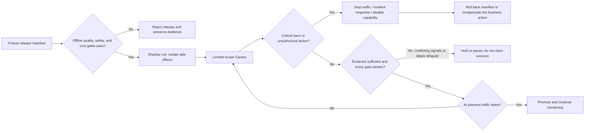

# Canary, Rollback, and Change Management

## Goal

Introduce an LLM release unit that passed its offline gate into real traffic gradually, with explicit actions for expansion, pause, rollback, and insufficient evidence before the next step.

## Why LLM releases need progressive evidence

Offline evaluation cannot cover every real input, provider-capacity condition, tool permission, or user behavior. LLM output is also stochastic, so comparing only a few requests can mistake noise for a regression. A Canary is not “letting a few users test for us”; it is a controlled way to collect evidence that offline evaluation cannot supply.

## Change record before release

At a minimum, every release record should state:

- the exact differences between the candidate and current-baseline manifests;
- the reason for the change, expected improvement, and known risks;
- offline-evaluation and safety-check results, plus unresolved uncertainty;
- experimental unit, traffic allocation, and contamination controls;
- expansion, pause, and rollback conditions and their decision maker;
- the rollback manifest, emergency degradation plan, and plan for disabling tools;
- observation period, minimum sample size, label delay, and post-release review time.

Human approval is appropriate for high-risk changes. Approval must not be merely a clickable button: the approver needs the evidence bound to this fixed manifest.

## Offline replay, shadowing, Canary, and A/B tests

| Method | Does candidate output affect users? | Main question it can answer |
| --- | --- | --- |
| Offline replay | No; uses historical or synthetic inputs | Did known samples regress? |
| Shadow run | No; duplicates live requests but does not adopt its result | Real input distribution, latency, simulated tool result, and candidate difference |
| Canary | Yes, within a limited scope | Is the candidate operable in the real causal chain? |
| A/B test | Yes; usually for product-effect optimization | What is the relative effect of two options on a business outcome? |

A shadow run is no longer “no user impact” if it genuinely sends email, places orders, or writes to a database. Use a tool sandbox, read-only mode, or side-effect isolation rather than copying every request unchanged.

## Avoid contamination in traffic assignment

In a multi-turn conversation, repeatedly moving a user between releases during the same task contaminates both the context and comparison. Assignment normally needs to be stable by user, session, or task, and the actual allocation rationale should be recorded. Also check:

- whether candidate and baseline serve comparable tasks, regions, and time periods;
- whether excluding high-value users produces only a low-risk conclusion;
- whether a cache shared across releases can return another release's answer;
- whether external provider capacity and time-of-day change concurrently.

## Expand, pause, and roll back

*Figure 1. State machine for LLM release gates. Alternative text: a fixed release first passes offline gates, then goes through a side-effect-isolated shadow run and a limited Canary. Critical harm moves immediately to incident response; insufficient evidence holds or pauses the release. Only when quality, safety, performance, and cost gates all pass does traffic expand in stages; already-created side effects follow a separate compensation path. The diagram synthesizes this section's release decision table, general Kubernetes rollout/rollback mechanisms, and the cited evaluation guidance; the Mermaid source is the reproducible form.*

Do not treat “no alert fired” as the only expansion condition. One possible decision table is:

| Evidence | Action |
| --- | --- |
| Critical safety failure, unauthorized tool use, or clear user harm | Stop traffic, follow the incident procedure, and roll back or disable capability when needed |
| Materially worse latency or errors | Pause expansion, check the release and provider state, and roll back when needed |
| Conflicting quality signals or labels not yet returned | Hold the current scope or stop; do not claim success |
| Planned sample size and observation period reached; quality, safety, performance, and cost all meet policy | Expand by the predeclared step and continue observing |

There is no universal observation duration or traffic fraction. Work backward from event rate, label delay, expected effect, and risk.

## What a complete rollback means

The rollback unit is the release manifest: prompt, context, retrieval snapshot and configuration, model, tools, gateway routing, and safety policy. If the new release has already written external state, rolling back code does not automatically unsend an email or undo an order. Those effects need a business-compensation plan and human handling.

Also distinguish “roll back to the old release” from “degrade to no LLM or no tool invocation.” During a provider outage or data leak, the old release may be unsafe too.

## Exercise and self-check

Design a release plan for an agent that can read calendars and create meetings. Specify how the shadow environment disables writes, the Canary grouping, quality/safety/cost metrics, expansion conditions, and a compensation plan for meetings already created. Then answer:

1. Why must a shadow agent not use real write tools?
2. Why does random assignment on every request contaminate a multi-turn conversation?
3. In which failures is disabling the LLM capability safer than rolling back to an older release?

## Summary and next step

A Canary is a controlled change with preregistered decision conditions, not a magic percentage. When its decision fails or users are affected, follow [[llmops/production-engineering/07-incident-response-and-continuous-improvement|Incident Response and Continuous Improvement]].

## References

- [Kubernetes Deployments](https://kubernetes.io/docs/concepts/workloads/controllers/deployment/) — accessed 2026-07-14; general basis for version replacement and rollback.
- [Kubernetes Canary Deployments](https://kubernetes.io/docs/concepts/workloads/management/#canary-deployments) — accessed 2026-07-14; traffic allocation implementation depends on components such as a gateway or service mesh.
- [OpenAI Evaluation best practices](https://developers.openai.com/api/docs/guides/evaluation-best-practices) — accessed 2026-07-14.
