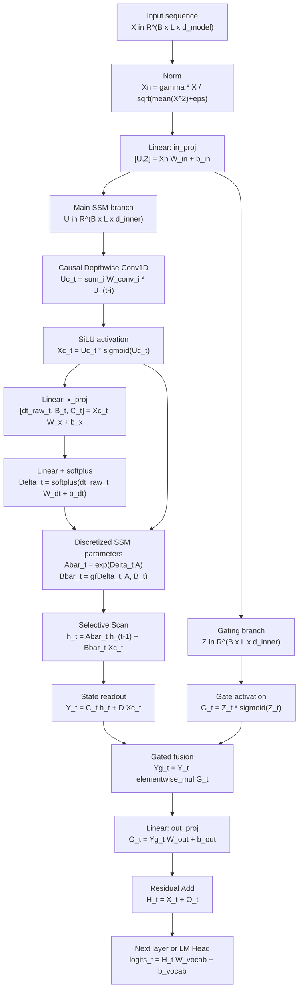

# Mamba Models

<!-- graph-links:start -->
## Related notes

- Same-directory note: [[machine-learning/transformer-models|Transformer Models]]
<!-- graph-links:end -->

## One-sentence explanation

Mamba is a sequence-modeling architecture based on a **Selective State Space Model (Selective SSM)**. It aims to retain the linear-complexity advantage for long sequences while allowing the model to decide from current-token content what to remember, forget, and propagate.

It is often compared with [[machine-learning/transformer-models|Transformer]]. Transformer uses attention to explicitly compare tokens, offering strong expression at high long-sequence cost. Mamba compresses history into continually updated state, making inference more recurrent-like and more economical for long sequences and streaming.

> [!note] Key sources
>
> The original Mamba paper introduced selective SSMs and emphasized linear scaling with length, fast inference, and long-sequence performance. Mamba-2 further explains a connection between SSMs and attention through State Space Duality. Mamba-3 continues improving the Mamba family through inference efficiency and state-expression capability.

> [!warning] Implementation and runtime boundary
> This page explains concepts; it is not a Windows installation tutorial. On 2026-07-22, the upstream `state-spaces/mamba` repository listed Linux, Python 3.10+, and PyTorch 1.12+ as core requirements. The CUDA selective-scan extension additionally needs suitable GPU/CUDA conditions, and the installation mode affects whether that extension is compiled. The course environment has not installed or run it. Do not infer from an architecture diagram that every machine can reproduce a paper's throughput.

## Background: why Mamba?

Transformer self-attention computes relationships between every token and other tokens in a sequence. At sequence length $L$, full attention's compute and memory typically grow with $L^2$. This cost is acceptable for short or medium context, but becomes a primary bottleneck for million-length DNA, long audio, long logs, or very long documents.

Before Mamba, researchers explored many sub-quadratic sequence models, including linear attention, convolutions, RNN variants, and Structured State Space Models (SSMs). Though economical, these models often underperformed attention on discrete, information-dense tasks such as language. Mamba's core judgment is that a major weakness of earlier SSMs was overly fixed parameters that could not select reasoning behavior sufficiently from input content.

## From SSM to Selective SSM

A traditional state-space model can be written:

$$
h_t = A h_{t-1} + B x_t
$$

$$
y_t = C h_t
$$

where:

- $x_t$ is the input token or feature at step $t$.
- $h_t$ is the hidden state retained by the model, interpretable as compressed historical memory.
- $A$ decides how the old state is preserved or decayed.
- $B$ decides how current input writes into state.
- $C$ decides what output is read from state.

When $A$, $B$, and $C$ are largely fixed, every position uses the same state-update rule. That is efficient but insufficiently flexible for discrete text, where token importance varies substantially.

Mamba's Selective SSM turns some SSM parameters into functions of input. Intuitively:

- at an important token, the model can write more information into state;
- at an irrelevant token, it can quickly forget or skip;
- different positions can use different information-propagation behavior.

Thus, “selective” in Mamba does not merely filter tokens. It makes the state-update mechanism change with input content.

## Complete computation flowchart

The following diagram shows how one Mamba block processes a sequence. A real model stacks many blocks, and commonly has normalization, residual connections, embedding, and an output head outside the block.

## What each step does

The diagram includes the principal formula for each node. The following explains the role of every step.

1. **Input sequence X**: the shape is commonly `batch x length x d_model`. Every position is a token embedding or the previous block's output.
2. **Norm**: normalize the channel dimension for every token to keep numerical scale stable across layers. Many modern sequence models use pre-norm: normalize before core computation.
3. **Input linear projection `in_proj`**: project a $d_{model}$ representation into a larger internal dimension, then split it into two branches. The main branch performs state-space computation; the gate branch decides how much final information passes through.
4. **Main branch u**: the primary content stream entering the Mamba SSM. Later convolution, parameter generation, and selective scan all operate around it.
5. **Gate branch z**: does not write state directly; it gates output at the end. It controls how much SSM output the current token permits.
6. **Causal depthwise Conv1D**: applies a short-window convolution per channel without viewing future tokens. It adds local-neighborhood information before long-range state updates.
7. **SiLU activation**: adds nonlinearity to convolution features. Without it, stacked linear transformations have materially less expressive power.
8. **`x_proj` generates selective parameters**: this is the Mamba key. From current-token features, the model generates $\Delta_t$, $B_t$, $C_t$, and other parameters so every position can use a different state update.
9. **`dt_proj` + softplus**: $\Delta_t$ can be understood as the state-update step size for the current token. `softplus` keeps it positive, preventing an unreasonable time step.
10. **Discretize A and B**: continuous-form SSM parameters become values usable in discrete sequence computation. Intuitively, $A$ determines old-state decay/retention and $B_t$ determines current-input writes.
11. **Selective Scan**: Mamba's core computation updates hidden state left to right:

    $$
    h_t = \bar{A}_t h_{t-1} + \bar{B}_t u_t
    $$

    Here $\bar{A}_t$ and $\bar{B}_t$ depend on current input. Training accelerates this scan with a parallel algorithm; inference can retain only current state and update token by token.

12. **Readout $y_t$**: generate output from current state:

    $$
    y_t = C_t h_t + D u_t
    $$

    $C_t h_t$ reads from state memory, while $D u_t$ is a direct skip connection retaining local current-input information.

13. **Gated output**: after SiLU, the gate branch multiplies $y_t$ elementwise. The model can dynamically suppress useless output or amplify currently important information.
14. **Output linear projection `out_proj`**: map the internal dimension back to $d_{model}$ so it can add residually to block input and feed the next layer.
15. **Residual Add**: add block input back to output, forming a residual connection. It reduces difficulty in deep training and preserves the original representation when complex transformation is unnecessary.
16. **Next-layer representation or final output**: repeat the process for later Mamba blocks; in a language model's final layer, normalization and an LM head normally map hidden representations to vocabulary logits.

Selective scan is the engineering key. Because parameters depend on input, the efficient convolution form traditionally used by SSMs no longer directly applies. Mamba uses hardware-friendly parallel scan so training remains efficiently parallel, while inference updates state token by token like an RNN.

## Core difference from Transformer

| Dimension | Transformer | Mamba |
| --- | --- | --- |
| Core mechanism | self-attention explicitly compares token relationships | selective SSM recursively updates compressed state |
| Length complexity | standard full attention is commonly $O(L^2)$ | approximately linear along sequence length |
| Inference cache | retain KV cache, which grows with length | mainly retain fixed-size state |
| Long-range dependency | directly access historical token representations | depends on whether state retained enough information |
| Best-fit scenarios | general language modeling, multimodality, explicit historical relation retrieval | long sequences, streaming inference, audio, genomics, low-latency generation |

This comparison does not say Mamba is always better than Transformer. More accurately, Mamba exchanges compressed state for long-sequence efficiency; Transformer exchanges explicit token–token interaction for more direct global modeling. Asymptotic complexity also does not equal end-to-end latency, throughput, or cost: implementation, hardware, sequence shape, batch, precision, cache, and task quality all need measurement.

## Why Mamba inference is more economical

During autoregressive generation, a Transformer makes every new token query historical KV cache. Historical keys/values do not need recomputation, but the cache grows with context length.

Mamba inference resembles:

$$
state \leftarrow update(state, x_t)
$$

For every token, it updates state whose size is relatively fixed with respect to sequence length. Therefore inference state does not grow linearly with context length like a KV cache. The cost is compression: historical information resides in state and cannot be directly revisited as every original token representation can under attention.

## Later development in the Mamba family

The Mamba-2 paper proposes the State Space Duality (SSD) framework, connecting SSMs and several attention variants and designing a faster Mamba-2 core from it. Its importance is not only “faster”; it also explains why some SSM structures can approach attention's modeling behavior.

Mamba-3 further improves linear models from an inference-first perspective, including stronger SSM recurrent expression, complex-valued state updates, and MIMO (multi-input multi-output) forms. It shows the direction of the Mamba family: not simply replacing Transformer, but seeking better tradeoffs among long context, low cache, inference efficiency, and state-modeling capability.

## When to consider Mamba first

Mamba is more suitable when:

- sequences are so long that standard attention compute or KV-cache cost is too high;
- data is naturally continuous, such as audio, time series, or sensor logs;
- the task needs low-latency autoregressive inference;
- input length can far exceed the common training-time context;
- you want to try a sub-quadratic backbone for information-dense sequences such as language, genomics, or audio.

Do not assume Mamba replaces every Transformer. Attention still has clear advantages for tasks requiring exact copying of long-context fragments, explicit retrieval of many distant tokens, complex tool-call traces, or strong dependence on original context detail.

## Common misconceptions

- **“Linear complexity means it must be stronger”**: no. Linear complexity is chiefly an efficiency advantage; expression still depends on structure, scale, training data, and task.
- **“Mamba has no attention, so it cannot model long-range dependencies”**: also inaccurate. Mamba propagates long-range information through state, but the information is compressed.
- **“Mamba state is complete memory”**: no. State is a compressed representation and necessarily makes information tradeoffs.
- **“Selective SSM is just a gated RNN”**: oversimplified. Mamba also depends on SSM parameterization, discretization, hardware-friendly scan, and integration with modern deep-network blocks.

## Learning handles

Understand Mamba through three statements:

1. It compresses sequence history into a continually updated state.
2. It makes state-update parameters depend on current input, providing content-selective capability.
3. Through hardware-friendly selective scan, it turns a recurrent state model into a trainable, scalable modern backbone.

Before comparing architectures, master data boundaries, baselines, and metrics in [[machine-learning/00-index|Machine Learning]], plus training loop, loss, and attention in [[deep-learning/00-index|Deep Learning]]. An architecture paper's efficiency conclusion does not replace quality, cost, safety, and reliability evaluation for the target task.

## References

Review date: **2026-07-22**. Paper conclusions are limited to their data, scale, and experimental setup. Follow day-of-run documentation for upstream implementation interfaces and dependencies.

- Gu, A., & Dao, T. **Mamba: Linear-Time Sequence Modeling with Selective State Spaces**. arXiv:2312.00752.
- Dao, T., & Gu, A. **Transformers are SSMs: Generalized Models and Efficient Algorithms Through Structured State Space Duality**. arXiv:2405.21060.
- Lahoti, A., Li, K. Y., Chen, B., Wang, C., Bick, A., Kolter, J. Z., Dao, T., & Gu, A. **Mamba-3: Improved Sequence Modeling using State Space Principles**. arXiv:2603.15569.
- `state-spaces/mamba` GitHub repository: <https://github.com/state-spaces/mamba>
