# Transformer Models

<!-- graph-links:start -->
## Related notes

- Same-directory note: [[machine-learning/mamba-models|Mamba Models]]
<!-- graph-links:end -->

## One-sentence explanation

A Transformer is a sequence-modeling architecture centered on **self-attention**. Rather than recursively process a sequence step by step as an RNN does, it lets each token view other tokens at the same time and aggregate information by relevance.

Its core advantages are high training parallelism, short paths for long-range dependencies, and flexible modeling of global token relationships. Modern large language models, BERT-like encoders, ViT vision models, and many multimodal models build on Transformer variants.

> [!note] Key source
>
> The Transformer comes from the 2017 paper **Attention Is All You Need**. The paper proposed a fully attention-based encoder–decoder architecture, using self-attention and feed-forward networks in place of RNNs/CNNs as the main sequence-modeling modules.

## Background: what problem does a Transformer solve?

Before Transformers, sequence tasks commonly used RNNs, LSTMs, GRUs, or CNNs. An RNN naturally computes in time-step order: position $t$ depends on hidden state $t-1$. That matches sequence intuition, but provides poor training parallelism and can weaken long-range dependencies.

Attention instead lets a model at one position assign weights directly to relevant positions across the sequence rather than depend only on the immediately prior hidden state. Transformer moves this idea to the center: the model chiefly consists of attention and position-wise feed-forward networks.

## Complete computation flowchart

The diagram retains the original Transformer's **encoder–decoder** data flow and attention formulas. For readability it uses common **pre-norm** notation, applying LayerNorm before every sublayer. The original paper's `Add & Norm` adds residual output before LayerNorm (post-norm). Use this diagram to understand information flow, not as a line-by-line implementation of the 2017 paper; dropout, padding masks, and training engineering details are omitted. A modern decoder-only LLM can be understood as largely retaining the right-side decoder's masked self-attention and MLP while removing encoder/cross-attention.

```mermaid
flowchart TD
    SRC["Source input token IDs<br/>s = tokenizer(source)"] --> SE["Input Embedding<br/>X0 = Emb_src(s) * sqrt(d_model)"]
    SE --> SP["Position addition<br/>X = X0 + PE(pos)"]

    subgraph ENC["Encoder Layer x N"]
        SP --> EN1["LayerNorm<br/>Xn = gamma*(X-mu)/sqrt(var+eps)+beta"]
        EN1 --> EQKV["Self-Attn Linear<br/>Q=Xn W_Q; K=Xn W_K; V=Xn W_V"]
        EQKV --> ES["Score<br/>S = Q K^T / sqrt(d_k)"]
        ES --> EA["Softmax weights<br/>A = softmax(S)"]
        EA --> EC["Weighted sum<br/>C = A V"]
        EC --> EO["Heads + Linear<br/>M = concat(C_1...C_h) W_O + b_O"]
        EO --> ER1["Add residual<br/>X1 = X + M"]
        ER1 --> EN2["LayerNorm<br/>X1n = LN(X1)"]
        EN2 --> EF1["FFN expansion + activation<br/>F = act(X1n W_1 + b_1)"]
        EF1 --> EF2["FFN projection down<br/>F2 = F W_2 + b_2"]
        EF2 --> ER2["Add residual<br/>E = X1 + F2"]
    end

    ER2 --> MEM["Encoder Memory<br/>K_enc=E W_Kc; V_enc=E W_Vc"]

    TGT["Target input shifted right<br/>y_in = shift_right(y)"] --> TE["Output Embedding<br/>Y0 = Emb_tgt(y_in) * sqrt(d_model)"]
    TE --> TP["Position addition<br/>Y = Y0 + PE(pos)"]

    subgraph DEC["Decoder Layer x N"]
        TP --> DN1["LayerNorm<br/>Yn = gamma*(Y-mu)/sqrt(var+eps)+beta"]
        DN1 --> DQKV["Masked Self-Attn Linear<br/>Q=Yn W_Q; K=Yn W_K; V=Yn W_V"]
        DQKV --> DS["Masked Score<br/>S = (Q K^T + M_causal) / sqrt(d_k)"]
        DS --> DA["Softmax weights<br/>A = softmax(S)"]
        DA --> DC["Weighted sum<br/>C = A V"]
        DC --> DO["Heads + Linear<br/>M = concat(C_1...C_h) W_O + b_O"]
        DO --> DR1["Add residual<br/>Y1 = Y + M"]
        DR1 --> DN2["LayerNorm<br/>Y1n = LN(Y1)"]
        DN2 --> CQ["Cross-Attn Query<br/>Q_c = Y1n W_Qc"]
        MEM --> CKV["Cross-Attn Key/Value<br/>K_c=K_enc; V_c=V_enc"]
        CQ --> CS["Cross Score<br/>S_c = Q_c K_c^T / sqrt(d_k)"]
        CKV --> CS
        CS --> CA["Softmax weights<br/>A_c = softmax(S_c)"]
        CA --> CC["Aggregate encoder information<br/>C_c = A_c V_c"]
        CC --> CO["Cross Heads + Linear<br/>M_c = concat(C_c1...C_ch) W_Oc + b_Oc"]
        CO --> DR2["Add residual<br/>Y2 = Y1 + M_c"]
        DR2 --> DN3["LayerNorm<br/>Y2n = LN(Y2)"]
        DN3 --> DF1["FFN expansion + activation<br/>F = act(Y2n W_1 + b_1)"]
        DF1 --> DF2["FFN projection down<br/>F2 = F W_2 + b_2"]
        DF2 --> DR3["Add residual<br/>H = Y2 + F2"]
    end

    DR3 --> OUT["Output Linear<br/>logits = H W_vocab + b_vocab"]
    OUT --> PROB["Softmax<br/>p(token) = softmax(logits)"]
```

## What each step does

The diagram writes the principal formula at every computation node. The following explains each role.

1. **Source input token IDs**: a source sentence or input sequence is first tokenized into integer IDs, which enter the encoder.
2. **Input Embedding + Position**: embedding maps discrete IDs to continuous vectors; position information supplies token order. Without it, self-attention knows a token set but not sequence order.
3. **Encoder LayerNorm**: this diagram uses pre-norm to stabilize channel scales for each token before self-attention. The original paper used post-norm, normalizing after residual addition. Both aid deep-training stability, but their computation order differs.
4. **Encoder self-attention Q, K, V**: the encoder derives $Q$, $K$, and $V$ from the same input representation. Every source token can then relate to every other source token.
5. **Score, Softmax, weighted sum**: the score measures token match, softmax turns scores into weights, and the weights aggregate $V$. This is where self-attention retrieves information from context.
6. **Heads + Linear**: multiple heads perform attention in different representation subspaces, then concatenate and linearly project back to model dimension.
7. **Encoder residual and FFN**: add attention output to input, then enter FFN through the next pre-norm. Attention handles interaction between tokens; FFN performs nonlinear feature transformation inside each token. To reproduce the original paper, put LayerNorm after every residual addition.
8. **Encoder Memory**: final encoder output $E$ becomes the decoder's external memory. Cross-attention does not view source token IDs directly; it views processed $K_{enc}$ and $V_{enc}$.
9. **Target input shifted right**: during decoder training, input is the right-shifted target sequence, ensuring a position can predict only from known history.
10. **Output Embedding + Position**: target tokens likewise become vectors with position information, forming the decoder input representation.
11. **Masked Self-Attention**: the decoder first performs self-attention within the target, with a causal mask blocking future tokens so training cannot peek at answers.
12. **First decoder residual**: add masked self-attention result back to target input, retaining its original target-history representation; the next LayerNorm continues pre-norm order.
13. **Cross-Attention**: the decoder creates queries from its hidden state and keys/values from encoder memory. The currently generated target token retrieves relevant source-sequence information.
14. **Second decoder residual**: add aggregated source information back to decoder representation, combining generated history and source context; the next LayerNorm continues pre-norm order.
15. **Decoder FFN**: independently apply a nonlinear transform at every target position to further process attention-aggregated features.
16. **Output Linear + Softmax**: final hidden states become vocabulary logits through a linear layer, then softmax yields candidate-token probabilities. Generation usually selects the most probable next token or samples under a strategy.

## Scaled dot-product attention and multi-head attention

The basic Transformer attention form is scaled dot-product attention:

$$
\text{Attention}(Q, K, V) = \text{softmax}\left(\frac{QK^\top}{\sqrt{d_k}}\right)V
$$

Here $Q$ is Query, $K$ is Key, $V$ is Value, and $d_k$ is key dimension. Dividing by $\sqrt{d_k}$ avoids overly large dot products that make softmax extreme too early.

One attention head can view token relationships through one representation subspace. Multi-head attention performs multiple attention computations in parallel:

$$
\text{head}_i = \text{Attention}(QW_i^Q, KW_i^K, VW_i^V)
$$

$$
\text{MultiHead}(Q,K,V) = \text{Concat}(\text{head}_1,\dots,\text{head}_h)W^O
$$

Different heads can attend to different relation types: local neighboring words, syntactic dependencies, entity references, or long-distance correspondences.

Modern large models commonly change the original paper's post-norm to pre-norm, and make many engineering changes to activation, normalization, positional encoding, and attention variants. The core remains stacked attention + MLP + residual connections. When comparing models, first verify norm order, positional mechanism, mask, training objective, and actual inference path instead of only asking whether they “use a Transformer.”

## Why positional encoding is necessary

Self-attention sees similarity among tokens but has no intrinsic knowledge of their order. Without positional information, a model struggles to distinguish “cat chases dog” from “dog chases cat.”

Transformers therefore need positional encoding or bias. Common approaches include:

- sinusoidal positional encoding from the original paper;
- learned absolute position embeddings;
- relative position encoding;
- RoPE (Rotary Position Embedding), common in modern decoder-only LLMs;
- position biases such as ALiBi for long-context extrapolation.

Position mechanisms are not decoration. They are an important design choice for how a model understands order, distance, and context length.

## Encoder, decoder, and common variants

The original Transformer is an encoder–decoder architecture mainly for machine translation:

- **Encoder**: reads the source sequence; every layer has self-attention and a feed-forward network.
- **Decoder**: autoregressively generates a target sequence; every layer has masked self-attention, cross-attention, and a feed-forward network.
- **Cross-attention**: the decoder queries keys/values from encoder output to retrieve source information.

Later models split this structure into common variants:

- **Encoder-only**: e.g. BERT, suited to understanding, classification, extraction, and retrieval representations.
- **Decoder-only**: e.g. GPT-style models, suited to autoregressive text generation.
- **Encoder–decoder**: e.g. T5 and BART, suited to input-to-output transformation.

## Masked self-attention

In autoregressive generation, a model must not peek at future tokens. Decoder-only models use a causal mask so position $t$ can view only historical positions 1 through $t$.

This allows training to process the whole sequence in parallel while attention weights at every position cover only legal history. At inference, generation proceeds token by token and caches historical keys/values to avoid recomputation.

## Advantages and costs

Principal Transformer advantages:

- Directly model dependencies between any two positions.
- High training parallelism and better GPU/TPU fit than RNNs.
- General architecture transferable to text, images, speech, multimodal work, and more.
- Clear scaling behavior and strong large-scale pretraining results.

Principal Transformer costs:

- Standard full attention has roughly quadratic compute and memory growth with sequence length.
- Autoregressive inference needs a KV cache, whose cost grows with long context.
- Attention weights are not a complete explanation; high weight is not automatically a causal reason.
- Without an appropriate positional mechanism, order and length extrapolation can be unstable.

## Relationship to Mamba

[[machine-learning/mamba-models|Mamba]] and Transformer are both sequence-model backbones, but preserve history differently.

Transformer retains historical token keys/values so a current token can explicitly inspect earlier positions. Mamba compresses history into state and propagates information through state updates. The former resembles consulting a history table at any time; the latter resembles continuously maintaining a compressed summary.

Their difference is not primarily “which is more advanced,” but an efficiency/expression tradeoff:

- Transformer is stronger at explicit token–token interaction.
- Mamba emphasizes linear scaling with long sequences and fixed-state inference.
- Some new architectures mix attention, SSMs, convolutions, or gating.

## Learning handles

Understand Transformer through three statements:

1. Query–Key–Value attention decides where each token retrieves information.
2. Multi-head attention lets a model inspect a sequence from multiple relation subspaces at once.
3. Stacking attention, MLP, residual connections, and normalization forms powerful general representations and generation.

If you cannot yet explain the relationship among logits, cross entropy, training/validation/testing, and gradient updates, first return to the [[machine-learning/00-index|Machine Learning]] main path or the training loop in [[deep-learning/00-index|Deep Learning]]. Understanding an architecture diagram is not the same as being able to train, evaluate, or deploy a model safely.

## References

Review date: **2026-07-22**. This page uses the original paper to explain the classic architecture. Implementation details, defaults, and performance conclusions of current frameworks must follow current documentation and experiments for the chosen implementation.

- Vaswani, A., Shazeer, N., Parmar, N., Uszkoreit, J., Jones, L., Gomez, A. N., Kaiser, L., & Polosukhin, I. **Attention Is All You Need**. arXiv:1706.03762.
- NeurIPS paper PDF: <https://papers.neurips.cc/paper/7181-attention-is-all-you-need.pdf>
