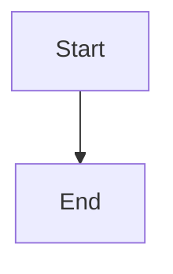
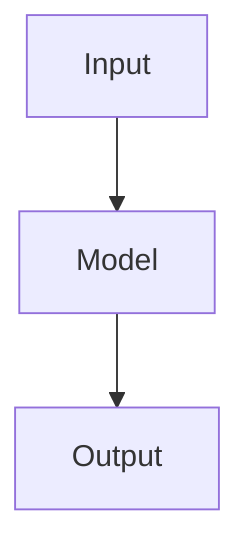
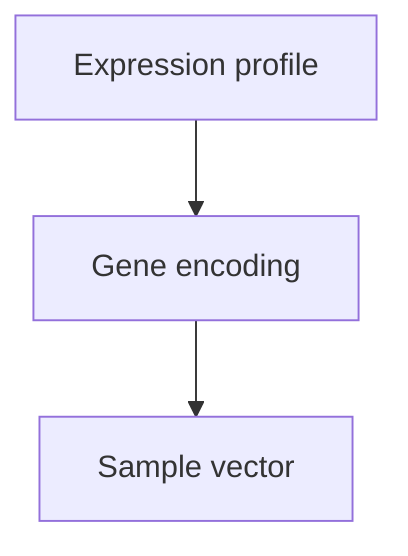
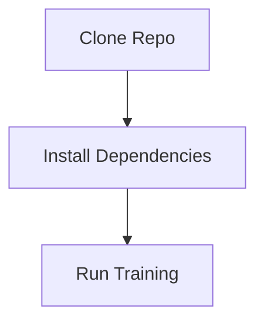

# The Complete Mermaid Tutorial: Draw Flowcharts, Architecture Diagrams, and Project Diagrams with Markdown Text

Mermaid is a diagramming syntax that describes diagrams with text. It can be embedded directly in Markdown and automatically rendered as flowcharts, sequence diagrams, class diagrams, state diagrams, Gantt charts, and more. It is particularly useful for technical documentation, project architecture descriptions, deep-learning model diagrams, code call graphs, and method flows in papers or surveys.

> [!warning] Version and host boundaries
> This is a retained large reference tutorial. Mermaid upstream and the versions bundled by Obsidian or GitHub can change. For current corrections about platform enablement, subgraph direction, sequence arrows, class-diagram relationships, and experimental diagram types, use the [[markdown/references-versions-and-compatibility#Mermaid large-tutorial compatibility notes|Mermaid compatibility notes]].

---

## 1. What Mermaid is

Mermaid's central idea is to describe nodes, relationships, and direction in code instead of drawing lines manually.

For example:

~~~mermaid
flowchart TD
    A[Start] --> B[Process data]
    B --> C{Succeeded?}
    C -->|yes| D[Output result]
    C -->|no| E[Report an error and exit]
~~~

It renders as a flowchart:

- `flowchart TD` means draw a flowchart from top to bottom.
- `A[Start]` declares a node whose ID is `A` and whose display text is “Start.”
- `A --> B` means an arrow from A to B.
- `C{Succeeded?}` declares a decision node.
- `-->|yes|` means an arrow with text.

Mermaid is best for diagrams with clear structural relationships, such as flows, modules, training flows, call flows, class relationships, state transitions, and project plans.

---

## 2. Using Mermaid in Markdown

Mermaid is normally written in a Markdown code fence.

The standard form is:

~~~~markdown

~~~~

In an editor that supports Mermaid, this renders automatically as a diagram.

Common supporting environments include:

- Obsidian;
- GitHub Markdown;
- Typora;
- VS Code plus a Mermaid extension;
- GitLab;
- some Notion contexts;
- documentation sites such as MkDocs, Docusaurus, and VitePress;
- Mermaid Live Editor.

If a platform cannot display a diagram, a common cause is that Mermaid rendering is not enabled there. Check syntax and host behavior together rather than assuming one cause.

---

## 3. Flowcharts: `flowchart`

Flowcharts are Mermaid's most common diagram type. They suit algorithm flows, model architecture, module relationships, and training flows.

### 3.1 Basic syntax

~~~mermaid
flowchart TD
    A[Input] --> B[Process]
    B --> C[Output]
~~~

The code:

~~~markdown
flowchart TD
~~~

creates a flowchart whose direction is `TD`, top to bottom.

Common directions:

| Form | Meaning |
| --- | --- |
| `TD` | Top Down |
| `TB` | Top Bottom; similar to TD |
| `BT` | Bottom Top |
| `LR` | Left Right |
| `RL` | Right Left |

For example, left to right:

~~~mermaid
flowchart LR
    A[Input] --> B[Model] --> C[Output]
~~~

---

## 4. Node forms

In Mermaid, a node normally consists of a node ID plus a node shape.

### 4.1 Rectangle

~~~mermaid
flowchart TD
    A[Ordinary rectangle]
~~~

Code:

~~~markdown
A[Ordinary rectangle]
~~~

### 4.2 Rounded rectangle

~~~mermaid
flowchart TD
    A(Rounded node)
~~~

Code:

~~~markdown
A(Rounded node)
~~~

### 4.3 Circle

~~~mermaid
flowchart TD
    A((Circular node))
~~~

Code:

~~~markdown
A((Circular node))
~~~

### 4.4 Decision

~~~mermaid
flowchart TD
    A{Condition satisfied?}
~~~

Code:

~~~markdown
A{Condition satisfied?}
~~~

Decision nodes commonly represent if/else branches, success tests, or whether training has finished.

### 4.5 Database

~~~mermaid
flowchart TD
    A[(Database)]
~~~

Code:

~~~markdown
A[(Database)]
~~~

This suits a database, data file, vector store, cache, or result table.

### 4.6 Parallelogram

~~~mermaid
flowchart TD
    A[/Input or output/]
~~~

Code:

~~~markdown
A[/Input or output/]
~~~

It commonly represents input, output, manual input, or file output.

### 4.7 Subroutine

~~~mermaid
flowchart TD
    A[[Subroutine / module]]
~~~

Code:

~~~markdown
A[[Subroutine / module]]
~~~

This suits a function, module, component, or subprocess.

---

## 5. Connectors

### 5.1 Ordinary arrow

~~~mermaid
flowchart TD
    A[Start] --> B[Next step]
~~~

### 5.2 Arrow with text

~~~mermaid
flowchart TD
    A[Data] -->|Normalize| B[Normalized data]
~~~

Put arrow text between `|text|`.

### 5.3 Connection without an arrow

~~~mermaid
flowchart TD
    A[Node A] --- B[Node B]
~~~

### 5.4 Dashed arrow

~~~mermaid
flowchart TD
    A[Module A] -.-> B[Module B]
~~~

This can represent an optional relationship, auxiliary relationship, weak dependency, or reference relationship.

### 5.5 Thick arrow

~~~mermaid
flowchart TD
    A[Key input] ==> B[Core module]
~~~

This can emphasize the main path.

### 5.6 Dashed arrow with text

~~~mermaid
flowchart TD
    A[Module A] -.->|Auxiliary information| B[Module B]
~~~

---

## 6. Chaining multiple nodes

Mermaid can write several steps on one line:

~~~mermaid
flowchart TD
    A[Load data] --> B[Preprocess] --> C[Train model] --> D[Save results]
~~~

Or split them across lines:

~~~mermaid
flowchart TD
    A[Load data] --> B[Preprocess]
    B --> C[Train model]
    C --> D[Save results]
~~~

For a complex diagram, split across lines to make modification and debugging easier.

---

## 7. Line breaks in nodes

When a node's content is long, use ` ` for a line break.

~~~mermaid
flowchart TD
    A[Before expression profile shape: B × G] --> B[Gene Encoder shape: B × G × d]
~~~

This is useful for labeling tensor dimensions in deep-learning architecture diagrams.

---

## 8. Subgraphs: `subgraph`

When a diagram is complex, use `subgraph` to group nodes.

~~~mermaid
flowchart TD
    subgraph Data[Data-processing module]
        A[Raw data] --> B[Normalize]
        B --> C[Feature construction]
    end

    subgraph Model[Model module]
        D[Encoder] --> E[Prediction head]
    end

    C --> D
    E --> F[Output result]
~~~

The basic form is:

~~~markdown
subgraph Display name
    nodes and connections
end
~~~

Or:

~~~markdown
subgraph ID[Display name]
    nodes and connections
end
~~~

The second form is recommended because it gives the subgraph a stable ID.

---

## 9. Subgraph direction

A subgraph can also set its internal direction:

~~~mermaid
flowchart TD
    subgraph Encoder[Encoder module]
        direction LR
        A[Input] --> B[MLP] --> C[Output]
    end

    C --> D[Prediction head]
~~~

Here the outer diagram is top to bottom, while the subgraph is left to right. Note that external connections can cause a subgraph direction to be inherited from the parent; check the compatibility notes for this condition.

---

## 10. Comments

Use `%%` for comments in Mermaid.

~~~mermaid
flowchart TD
    %% This comment does not display in the diagram
    A[Input] --> B[Output]
~~~

Comments are useful for explaining design intent in a complex diagram.

---

## 11. Styling

Mermaid can set node colors, borders, and font styles.

### 11.1 Style one node with `style`

~~~mermaid
flowchart TD
    A[Input] --> B[Core module] --> C[Output]

    style B fill:#f9f,stroke:#333,stroke-width:2px
~~~

Meaning:

- `fill`: fill color;
- `stroke`: border color;
- `stroke-width`: border width.

### 11.2 Define a style class with `classDef`

~~~mermaid
flowchart TD
    A[Input] --> B[Encoder] --> C[Prediction head] --> D[Output]

    classDef core fill:#e8f4ff,stroke:#1f77b4,stroke-width:2px
    class B,C core
~~~

`classDef core` defines a style class; `class B,C core` applies it to B and C.

### 11.3 Recommended use

In technical documentation, do not overuse color. Mermaid's core value is structural clarity; use color only to distinguish key modules.

---

## 12. Complete flowchart example: training flow

~~~mermaid
flowchart TD
    A[Read configuration] --> B[Load dataset]
    B --> C[Build Dataset / DataLoader]
    C --> D[Initialize model]
    D --> E[Forward pass]
    E --> F[Compute loss]
    F --> G[Backward pass]
    G --> H[Update parameters]
    H --> I{Maximum epoch reached?}
    I -->|no| E
    I -->|yes| J[Save model and logs]
~~~

This diagram suits a deep-learning project document that explains the main training flow.

---

## 13. Deep-learning architecture diagram example

~~~mermaid
flowchart TD
    A[Before expression profile B × G] --> C[Gene-wise Feature Builder]
    B[After expression profile B × G] --> C

    C --> D[Gene Encoder MLP / Transformer / GNN]
    D --> E[Expression tokens B × G × d]

    E --> F[Gene Selection Top-k / Attention / Sparse Gate]
    F --> G[Sample Pooling Attention Pooling / Set Pooling]
    G --> H[Sample vector B × d]

    H --> I[Prediction Head]
    I --> J[Perturbation-response prediction]
~~~

When writing a deep-learning architecture diagram, include:

- input data;
- tensor dimensions;
- core modules;
- direction of information flow;
- output target.

Do not write only module names, which makes a diagram look empty. Do not make every node too long either, which makes the diagram cluttered.

---

## 14. Complex model-structure diagram example

~~~mermaid
flowchart TD
    subgraph Input[Input]
        A1[Before expression profile B × G]
        A2[Perturbation information drug / target / dose]
        A3[Gene priors pathway / GO / network]
    end

    subgraph GeneEncoding[Gene-level encoding]
        B1[Expression-value encoding]
        B2[Gene embedding]
        B3[Expression-gene fusion]
    end

    subgraph SampleEncoding[Sample-vector construction]
        C1[Important-gene selection]
        C2[Set / Attention Pooling]
        C3[Sample vector B × d]
    end

    subgraph Prediction[Prediction module]
        D1[Perturbation-condition fusion]
        D2[Response prediction head]
        D3[Uncertainty head]
    end

    A1 --> B1
    A3 --> B2
    B1 --> B3
    B2 --> B3
    B3 --> C1 --> C2 --> C3
    A2 --> D1
    C3 --> D1 --> D2
    D1 --> D3
~~~

This type of diagram suits project design documents, architecture explanations, and drafts of paper method figures.

---

## 15. Sequence diagrams: `sequenceDiagram`

Sequence diagrams suit “who calls whom,” for example a user calling Codex, a program calling modules, or services communicating.

### 15.1 Basic example

~~~mermaid
sequenceDiagram
    participant User as User
    participant App as Application
    participant Server as Server
    participant DB as Database

    User->>App: Click query
    App->>Server: Send request
    Server->>DB: Query data
    DB-->>Server: Return result
    Server-->>App: Return response
    App-->>User: Display result
~~~

### 15.2 Arrow types

| Form | Meaning |
| --- | --- |
| `->>` | solid arrow |
| `-->>` | dashed return arrow |
| `-)` | asynchronous message |
| `--x` | failure or interruption |

### 15.3 Sequence diagram with a decision

~~~mermaid
sequenceDiagram
    participant User as User
    participant System as System
    participant Model as Model

    User->>System: Submit input
    System->>Model: Call prediction

    alt Prediction succeeds
        Model-->>System: Return result
        System-->>User: Display prediction result
    else Prediction fails
        Model-->>System: Return error
        System-->>User: Explain failure reason
    end
~~~

---

## 16. Class diagrams: `classDiagram`

Class diagrams suit code classes, attributes, methods, and relationships between classes.

~~~mermaid
classDiagram
    class Dataset {
        +load_data()
        +normalize()
        +get_item()
    }

    class Model {
        +forward()
        +encode()
        +predict()
    }

    class Trainer {
        +train()
        +evaluate()
        +save_checkpoint()
    }

    Dataset --> Trainer
    Model --> Trainer
~~~

### 16.1 Relationships between classes

| Form | Meaning |
| --- | --- |
| `A --> B` | A uses B (association) |
| `A <|-- B` | B inherits A |
| `A *-- B` | composition |
| `A o-- B` | aggregation |
| `A ..> B` | dependency |

Inheritance example:

~~~mermaid
classDiagram
    class BaseModel
    class TransformerModel
    class GNNModel

    BaseModel <|-- TransformerModel
    BaseModel <|-- GNNModel
~~~

---

## 17. State diagrams: `stateDiagram`

State diagrams suit program, training, task, and workflow states.

~~~mermaid
stateDiagram-v2
    [*] --> Initialize
    Initialize --> Training
    Training --> Validation
    Validation --> SaveModel
    SaveModel --> Training
    Validation --> Finished: Maximum epoch reached
    Finished --> [*]
~~~

`[*]` represents a start or end state. Write this token without a space.

---

## 18. Gantt charts: `gantt`

Gantt charts suit project plans, paper-writing plans, and experiment plans.

~~~mermaid
gantt
    title Review-writing plan
    dateFormat  YYYY-MM-DD

    section Literature organization
    Organize existing papers :a1, 2026-04-29, 3d
    Add new papers :a2, after a1, 5d

    section Main-text writing
    Write first draft :b1, after a2, 7d
    Revise and polish :b2, after b1, 3d
~~~

Common fields:

- `title`: title;
- `dateFormat`: date format;
- `section`: group;
- `task name :task ID, start time, duration`;
- `after a1`: start after task `a1`.

---

## 19. Pie charts: `pie`

Pie charts suit proportions.

~~~mermaid
pie title Dataset split
    "Training set" : 70
    "Validation set" : 15
    "Test set" : 15
~~~

Pie charts are simple. They should show proportional relationships, not complex analysis.

---

## 20. Git diagrams: `gitGraph`

Git diagrams suit branches, commits, and merge flows.

~~~mermaid
gitGraph
    commit
    branch dev
    checkout dev
    commit
    commit
    checkout main
    merge dev
    commit
~~~

They suit development flow, version evolution, and experiment-branch management.

---

## 21. ER diagrams: `erDiagram`

ER diagrams suit database entity relationships.

~~~mermaid
erDiagram
    USER ||--o{ ORDER : places
    ORDER ||--|{ ORDER_ITEM : contains
    PRODUCT ||--o{ ORDER_ITEM : included_in

    USER {
        int id
        string name
        string email
    }

    ORDER {
        int id
        int user_id
        date created_at
    }

    PRODUCT {
        int id
        string name
        float price
    }
~~~

The relationship symbols mean approximately:

| Symbol | Meaning |
| --- | --- |
| <code>&#124;&#124;</code> | one and only one |
| <code>o&#124;</code> | zero or one |
| `o{` | zero or more |
| <code>&#124;{</code> | one or more |

---

## 22. Mindmaps

Some environments support Mermaid's `mindmap`.

~~~mermaid
mindmap
  root((Mermaid))
    Flowcharts
      flowchart
      subgraph
    Sequence diagrams
      sequenceDiagram
    Code structure
      classDiagram
    Project management
      gantt
~~~

Support for mindmaps differs across platforms. If it does not render, use a flowchart instead.

---

## 23. Common Mermaid templates

### 23.1 Ordinary flow template

~~~mermaid
flowchart TD
    A[Start] --> B[Perform step 1]
    B --> C[Perform step 2]
    C --> D{Condition satisfied?}
    D -->|yes| E[Run success flow]
    D -->|no| F[Run failure flow]
    E --> G[End]
    F --> G
~~~

### 23.2 Module-architecture template

~~~mermaid
flowchart TD
    subgraph Input[Input module]
        A[Input data]
    end

    subgraph Processing[Processing module]
        B[Preprocess]
        C[Feature extraction]
        D[Feature fusion]
    end

    subgraph Output[Output module]
        E[Prediction head]
        F[Output result]
    end

    A --> B --> C --> D --> E --> F
~~~

### 23.3 Deep-learning training template

~~~mermaid
flowchart TD
    A[Load configuration] --> B[Load data]
    B --> C[Build DataLoader]
    C --> D[Initialize model]
    D --> E[Forward]
    E --> F[Loss]
    F --> G[Backward]
    G --> H[Optimizer step]
    H --> I{Finish training?}
    I -->|no| E
    I -->|yes| J[Save checkpoint]
~~~

### 23.4 Inference-flow template

~~~mermaid
flowchart TD
    A[Input sample] --> B[Load model weights]
    B --> C[Feature preprocessing]
    C --> D[Model inference]
    D --> E[Postprocess]
    E --> F[Output prediction]
~~~

### 23.5 Codex / Agent workflow template

~~~mermaid
flowchart TD
    A[User task] --> B[Read project documents]
    B --> C[Read code repository]
    C --> D[Analyze current implementation]
    D --> E[Consult relevant sources]
    E --> F[Propose a design]
    F --> G[Modify code or generate documents]
    G --> H[Summarize changes and next suggestions]
~~~

---

## 24. Advice for technical architecture diagrams

### 24.1 Define the purpose first

Before drawing, ask what the diagram should explain.

Common purposes include:

- overall system structure;
- model forward-pass flow;
- training flow;
- data dependency between modules;
- relationship between code classes;
- experiment flow;
- the core idea of a paper's method.

Different purposes need different levels of detail.

For example:

- For yourself: show every function and tensor transformation if helpful.
- For paper readers: retain only core modules.
- For Codex to analyze a project: add detail so the model can locate code logic.
- For team collaboration: emphasize inputs, outputs, dependencies, and responsibility boundaries.

### 24.2 Make the main path clear

In a complex diagram, the main path matters most. Connect it as one top-to-bottom or left-to-right line:

~~~markdown
Input → Encode → Fuse → Predict → Output
~~~

Use dashed connectors for auxiliary information so it does not interrupt the main path.

~~~mermaid
flowchart TD
    A[Input expression profile] --> B[Encoder] --> C[Prediction head] --> D[Output]

    E[Gene-prior information] -.-> B
    F[Training configuration] -.-> C
~~~

### 24.3 Do not make a node too long

Not recommended:

~~~markdown
A[Normalize expression profile, calculate differential expression, concatenate gene embeddings, process masks and dropout, then encode with a multilayer MLP]
~~~

Prefer splitting it:

~~~mermaid
flowchart TD
    A[Normalize expression profile] --> B[Calculate differential expression]
    B --> C[Concatenate gene embeddings]
    C --> D[MLP encoding]
~~~

### 24.4 Layer complex diagrams

For a complex project, use three diagram types:

The first is an overview showing only the main modules.

The second is a module-detail diagram that expands one module.

The third is a dataflow diagram emphasizing tensor dimensions and inputs/outputs.

Do not try to put every detail in one diagram, or it becomes hard to read.

---

## 25. Using Mermaid in Obsidian

In Obsidian, write:

~~~~markdown

~~~~

Then switch to Reading View or Live Preview to see the diagram.

### 25.1 Recommendations for Obsidian

For project notes, put Mermaid diagrams in a dedicated architecture document, for example:

~~~~markdown
# Current model architecture

## Overview

## Sample-encoding module

~~~~

### 25.2 What if a diagram is too wide?

If a diagram is too wide, you can:

- change `LR` to `TD`;
- shorten node text;
- split it into several subgraphs;
- use `subgraph` to divide modules;
- move details into a separate next diagram.

---

## 26. Using Mermaid in GitHub

GitHub Markdown supports Mermaid. You can write this directly in a README:

~~~~markdown

~~~~

It is suitable for showing in a repository README:

- project structure;
- usage flow;
- model architecture;
- data-processing flow;
- training and evaluation flow.

GitHub's Mermaid version may not be the latest, so newer syntax can fail to render.

---

## 27. Mermaid Live Editor

Mermaid provides the online Mermaid Live Editor.

Common uses:

- quickly test syntax;
- export SVG or PNG;
- adjust diagram layout;
- inspect error locations.

For a complex diagram, tune it in Live Editor first, then copy it back into the Markdown document.

---

## 28. Common errors and troubleshooting

### 28.1 Special characters in node text

Some characters can cause parsing failure, such as parentheses, colons, angle brackets, and slashes.

If a node's text is complex, quote it:

~~~mermaid
flowchart TD
    A["input: before/after expression"] --> B["output: sample vector"]
~~~

### 28.2 Non-ASCII text generally works

Non-ASCII text normally causes no problem:

~~~mermaid
flowchart TD
    A[Input expression profile] --> B[Sample encoder] --> C[Prediction result]
~~~

When special symbols are mixed in, add quotes:

~~~mermaid
flowchart TD
    A["Expression profile shape: B × G"] --> B["Token shape: B × G × d"]
~~~

### 28.3 Inconsistent indentation

Mermaid is not as strict as Python about indentation, but good indentation reduces mistakes in `subgraph`, `sequenceDiagram`, and `gantt`.

Recommended:

~~~mermaid
flowchart TD
    subgraph A[Module A]
        A1[Step 1] --> A2[Step 2]
    end
~~~

Do not cram all content together.

### 28.4 Forgetting `end` for a subgraph

Incorrect:

~~~markdown
subgraph A[Module A]
    A1 --> A2
~~~

Correct:

~~~markdown
subgraph A[Module A]
    A1 --> A2
end
~~~

### 28.5 Duplicate node IDs confuse a diagram

A node ID is a node's unique identifier. This treats the two `A` entries as the same node:

~~~mermaid
flowchart TD
    A[Input] --> B[Process]
    A[Another input] --> C[Process]
~~~

Use clearer IDs:

~~~mermaid
flowchart TD
    Input1[Input 1] --> B[Process]
    Input2[Input 2] --> C[Process]
~~~

---

## 29. Mermaid diagram naming conventions

Use English or short abbreviations for node IDs; display text may use another language.

Recommended:

~~~mermaid
flowchart TD
    Input[Input expression profile] --> Encoder[Encoder]
    Encoder --> Output[Output result]
~~~

Not recommended:

~~~mermaid
flowchart TD
    InputExpressionProfile[Input expression profile] --> EncoderNode[Encoder]
~~~

Non-ASCII IDs can work in many environments, but English IDs are less likely to create compatibility problems in complex diagrams.

---

## 30. Mermaid-generation prompts for Codex

To ask Codex to generate a Mermaid diagram from code, you can say:

~~~text
Generate a Mermaid architecture diagram from the current repository code and output it as a Markdown file. Requirements:
1. Use flowchart TD.
2. Give an overall model overview first, then detailed diagrams for data processing, sample encoding, prediction head, and training flow.
3. Label key tensor dimensions, such as [B,G], [B,G,d], and [B,d].
4. Use subgraph to divide modules.
5. Use solid arrows for the main path and dashed arrows for auxiliary configuration, prior information, masks, and similar input.
6. Do not draw only coarse modules. Expand to major operations, but do not turn every source line into a node.
7. After the diagrams, briefly explain each diagram's meaning and corresponding code location.
~~~

To have Codex revise an existing diagram:

~~~text
Check whether the current Mermaid architecture diagram matches the code implementation. Focus on:
1. Whether a module is missing.
2. Whether dataflow direction is correct.
3. Whether tensor dimensions are correct.
4. Whether the diagram contains a module absent from the code.
5. Whether the code contains a key module absent from the diagram.
Return the corrected Mermaid diagram directly and explain the main corrections.
~~~

---

## 31. Mermaid compared with hand-drawn diagrams

Advantages of Mermaid:

- suitable for version control and can live in Git;
- easy to modify without dragging shapes again;
- well suited to technical documentation;
- combines naturally with Markdown, Obsidian, and GitHub;
- friendly to Codex and ChatGPT, which can generate and modify it directly.

Disadvantages of Mermaid:

- less layout freedom than draw.io, Figma, or PowerPoint;
- less effective than professional drawing tools for complex polished visuals;
- unsuitable for very fine visual diagrams or final publication layout figures;
- Mermaid versions supported by different platforms can vary.

Recommendation:

- For project documents, code architecture, and experiment flows, prefer Mermaid.
- For final paper figures and commercial presentation visuals, first use Mermaid as a structural sketch, then polish it with BioRender, draw.io, Figma, or PowerPoint.

---

## 32. Mermaid learning path

For routine projects, master these first:

1. `flowchart TD / LR`;
2. node shapes;
3. arrows and arrow text;
4. `subgraph`;
5. ` ` line breaks;
6. `sequenceDiagram`;
7. `classDiagram`;
8. `gantt`.

For deep learning, code projects, and paper surveys, the most common are:

- `flowchart`: model architecture, data flow, training flow;
- `sequenceDiagram`: call flow, Agent workflow, service communication;
- `classDiagram`: code class structure;
- `gantt`: writing plan and experiment plan.

---

## 33. Recommended Mermaid-diagram set for a deep-learning project

For a deep-learning project, prepare at least the following diagrams.

### 33.1 Overall architecture

Show input, core modules, and output.

~~~mermaid
flowchart TD
    A[Input data] --> B[Encoding module]
    B --> C[Fusion module]
    C --> D[Prediction module]
    D --> E[Output result]
~~~

### 33.2 Data-processing flow

Show how raw data becomes training samples.

~~~mermaid
flowchart TD
    A[Raw data] --> B[Clean]
    B --> C[Normalize]
    C --> D[Build sample pairs]
    D --> E[Split train / validation / test]
~~~

### 33.3 Model-detail diagram

Show internal logic for each module.

~~~mermaid
flowchart TD
    A[Expression profile] --> B[Gene-wise encoding]
    B --> C[Gene tokens]
    C --> D[Attention pooling]
    D --> E[Sample vector]
    E --> F[Prediction head]
~~~

### 33.4 Training-flow diagram

Show the training loop.

~~~mermaid
flowchart TD
    A[Load batch] --> B[Forward]
    B --> C[Compute loss]
    C --> D[Backward]
    D --> E[Update parameters]
    E --> F{Finished?}
    F -->|no| A
    F -->|yes| G[Save model]
~~~

### 33.5 Evaluation/inference-flow diagram

Show how the model is used for prediction.

~~~mermaid
flowchart TD
    A[Input new sample] --> B[Load preprocessing parameters]
    B --> C[Build model input]
    C --> D[Load checkpoint]
    D --> E[Model inference]
    E --> F[Output prediction]
~~~

---

## 34. Practical principles for Mermaid diagrams

1. Draw the main path first, then add auxiliary paths.
2. Keep node text short.
3. Use `subgraph` for complex modules.
4. Write data dimensions into key nodes.
5. Do not put too much content in one diagram.
6. Use solid lines for the main path and dashed lines for auxiliary relationships.
7. Keep direction stable: `TD` is common for model architecture and `LR` for system architecture.
8. Ensure the diagram is correct before considering visual polish.
9. Each diagram should answer one core question.
10. Mermaid diagrams suit maintenance but not necessarily final publication-grade images.

---

## 35. Quick reference

### 35.1 Diagram types

| Type | Form | Use |
| --- | --- | --- |
| Flowchart | `flowchart TD` | flow, architecture, dataflow |
| Sequence diagram | `sequenceDiagram` | call relationship, interaction flow |
| Class diagram | `classDiagram` | code structure, class relationship |
| State diagram | `stateDiagram-v2` | state transition |
| Gantt chart | `gantt` | project plan |
| Pie chart | `pie` | proportions |
| Git diagram | `gitGraph` | branches and commits |
| ER diagram | `erDiagram` | database relationship |
| Mindmap | `mindmap` | knowledge structure |

### 35.2 Flowchart direction

| Form | Meaning |
| --- | --- |
| `TD` | top to bottom |
| `TB` | top to bottom |
| `BT` | bottom to top |
| `LR` | left to right |
| `RL` | right to left |

### 35.3 Common nodes

| Form | Result |
| --- | --- |
| `A[text]` | rectangle |
| `A(text)` | rounded rectangle |
| `A((text))` | circle |
| `A{text}` | decision |
| `A[(text)]` | database |
| `A[[text]]` | subroutine |
| `A[/text/]` | parallelogram |

### 35.4 Common connectors

| Form | Meaning |
| --- | --- |
| `A --> B` | ordinary arrow |
| <code>A </code>`-->`<code>&#124;text&#124; B</code> | arrow with text |
| `A --- B` | connection without arrow |
| `A -.-> B` | dashed arrow |
| `A ==> B` | thick arrow |
| <code>A </code>`-.->`<code>&#124;text&#124; B</code> | dashed arrow with text |

---

## 36. Conclusion

Mermaid's core value is making diagrams maintainable text. For technical learning, project documents, code explanation, and deep-learning architecture design, it is more convenient than hand-drawn diagrams and works especially well with Git, Markdown, Obsidian, Codex, and ChatGPT.

In practice, master `flowchart`, `subgraph`, `sequenceDiagram`, and `classDiagram` first. For deep-learning projects, `flowchart TD` is most useful for model architecture and training flow, with tensor dimensions labeled on key nodes. Do not try to finish a complex project in one diagram; split it into overview, module-detail, training-flow, and inference-flow diagrams.
