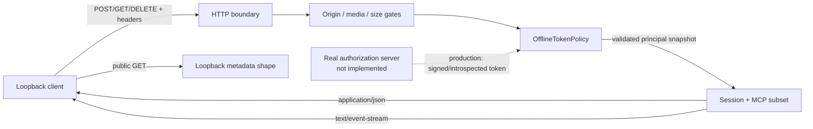
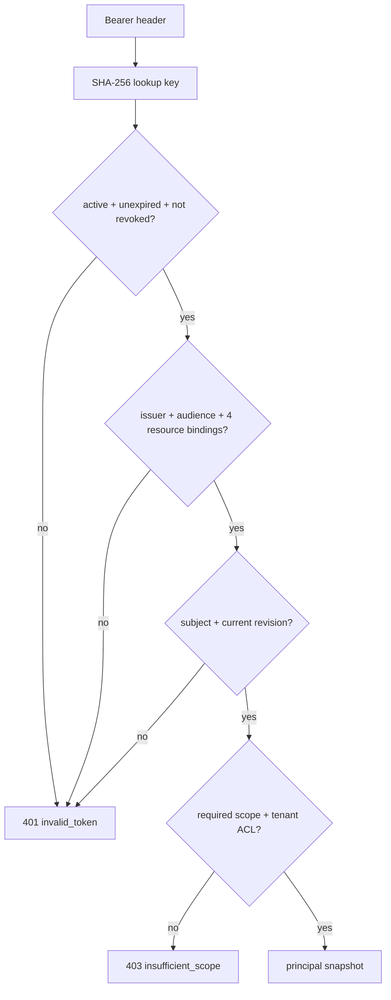

# Project: Loopback Streamable HTTP and OAuth Resource Boundaries

## Project goal

Start a real HTTP server and client on `127.0.0.1`. Use repeatable local round trips to validate the key boundaries of MCP `2025-11-25` Streamable HTTP and a protected resource server:

- POST, GET, and DELETE on one MCP endpoint.
- `Accept`, request/response `Content-Type`, `MCP-Protocol-Version`, and `Mcp-Session-Id`.
- JSON responses, POST SSE responses, GET SSE streams, and `Last-Event-ID` recovery.
- An `Origin` allowlist, loopback-only listening, and request/response size limits.
- 401, 403, `WWW-Authenticate`, and the shape of loopback Protected Resource Metadata.
- Token audience/resource, RFC 8707 `resource` in two requests, scope, tenant, authorization revision, expiration, and revocation.
- Session creation, identity binding, TTL, capacity, explicit termination, and concurrent access.
- Error responses that do not echo a bearer token or session ID.

> [!warning] Stable and Draft must stay separate
> This project implements only the stateful `2025-11-25` stable initialization model. On 2026-07-21, `2026-07-28` was still a Draft release candidate. Its no-initialize design, removal of `Mcp-Session-Id`, server discovery, and per-request capability model do not enter this project's wire contract. See [[mcp/learning-path/07-frontier-extensions-apps-and-version-compatibility|Frontier Topic: Extensions, Apps, and Version Compatibility]] for migration observations.

> [!important] Real HTTP, not real OAuth
> HTTP round trips, headers, statuses, JSON/SSE framing, and sessions are real. Tokens are looked up by an in-process `OfflineTokenPolicy` against preset invalid/valid claims. The project has no authorization server, authorization code, PKCE, signature/JWKS, issuer discovery, introspection, refresh token, or TLS, and cannot prove an OAuth deployment is correct.

> [!warning] PRM shape is not RFC 9728 conformance
> To remain offline, dependency-free, and on a random port, the project's resource identifier is `http://127.0.0.1:<port>/mcp`. RFC 9728 requires an `https` resource identifier. The project therefore validates only metadata path, document fields, and challenge linkage; it **does not claim to implement RFC 9728**. Production interoperability must redo discovery and black-box testing at an HTTPS endpoint.

## Relationship to the offline message validator

The projects are complementary testing layers; neither pretends to be the other:

| Project | Real boundary | Main coverage | Explicitly does not cover |
| --- | --- | --- | --- |
| [[mcp/learning-path/06-project-offline-mcp-message-validation\|Offline MCP Message Validation]] | No network; directly drives a Python state machine | 54 multi-primitive message cases, capabilities, Resources, Tasks; represents validated identity with out-of-wire `transport_context` | HTTP framing, SSE, 401/403, PRM shape, real session header |
| This project | Real HTTP/1.1 round trips on `127.0.0.1` | Streamable HTTP, header/status, JSON/SSE, session, and offline resource policy | Complete MCP methods/schema, real OAuth/signature validation, SDK interoperability |

This project does not import `validate_mcp_messages.py` and never puts `transport_context` into JSON-RPC. In production, an HTTP/OAuth adapter should pass a **trusted, typed authorization decision** to the message/business layer after validating a token; it must not let a request body self-report `subject`, `tenant`, or `authorization_revision`.



*Figure 1. Project boundary. Solid lines are real local data flows executed by this project; the dashed line represents OAuth functionality that production systems must add, but this project does not imitate.*

## Establish the specification contract first

### Stable Streamable HTTP contract

The table separates `2025-11-25` stable requirements from the deliberate teaching hardening in this project.

| Boundary | `2025-11-25` stable | This project |
| --- | --- | --- |
| endpoint | The server exposes one MCP endpoint supporting both POST and GET | Fixed `/mcp`; PUT/PATCH/HEAD/OPTIONS return a safe 405 |
| POST | A new POST carries every JSON-RPC message; `Accept` lists both `application/json` and `text/event-stream` | Body must be one strict UTF-8 JSON object; duplicate keys, NaN, and transfer encoding are rejected |
| POST request response | Server returns one `application/json` object or `text/event-stream` | `ping` uses JSON; `resources/list` uses SSE, forcing the client to validate both paths |
| notification/response | When accepted, the server can return an empty 202 body; otherwise an HTTP error | Accepts the single initialized notification; because there is no outstanding server request, rejects an unsolicited response |
| initialize version negotiation | Client proposes a version in `InitializeRequest`; when unsupported, server must return its supported alternative in `InitializeResult` and client decides whether to disconnect | A Draft proposal in the body returns 200 plus stable `2025-11-25`; it never treats Draft as negotiated. A teaching client that does not accept it must stop the handshake |
| GET | Client may open a stream with GET + `Accept: text/event-stream`; server returns SSE or 405 | Sends one server notification then closes; supports limited recovery only for the same GET notification stream's `Last-Event-ID` |
| session | Initialize response may assign a secure visible-ASCII session ID; subsequent requests must carry it; absence is normally 400 and termination is 404 | Binds a session to subject, tenant, and authorization revision, with fixed TTL and capacity |
| DELETE | Client should send DELETE when it no longer uses a session; server may return 405 when unsupported | Implements DELETE; success is 204 and the same session is 404 afterward |
| protocol header | After initialization, HTTP requests must carry the negotiated version; invalid/unsupported version is 400 | Accepts only `2025-11-25`; an extra conflicting header on initialize is rejected as local hardening rather than confused with body negotiation |
| Origin | Server must validate a present Origin; invalid value is 403; local deployment should bind only `127.0.0.1` | Exact allowlist; non-browser clients with no Origin may proceed; server never binds `0.0.0.0` |

> [!note] Evidence boundary for `Content-Type`
> The stable transport page explicitly says that a POST body is one JSON-RPC message and specifies `application/json`/`text/event-stream` response types for a request. It does not separately make POST request `Content-Type: application/json` a same-level MUST. This project nevertheless makes it a **teaching-profile hardening requirement** to resist type confusion; do not miscite this local hardening as stable normative wording.

### OAuth resource-server contract

For a protected HTTP MCP endpoint:

1. The client sends `Authorization: Bearer ...` again on every HTTP request; never put an access token in a URI query.
2. A missing, invalid, expired token or wrong issuer/audience receives 401.
3. A valid token with insufficient scope/permission receives 403. A runtime scope challenge provides `error="insufficient_scope"`, the required `scope`, and `resource_metadata`.
4. In production, an MCP server implements RFC 9728 Protected Resource Metadata through HTTPS. A 401 challenge can point to it with `resource_metadata`, and a client must also support well-known fallback.
5. In both authorization request and token request, the client sends RFC 8707 `resource` using the target MCP server's canonical URI.
6. A resource server accepts only tokens specifically issued for itself; it does not accept or pass through tokens for another resource.

This project simulates two equivalent metadata paths on loopback HTTP:

```text
/.well-known/oauth-protected-resource/mcp
/.well-known/oauth-protected-resource
```

They return a minimal teaching document with `resource`, at least one `authorization_servers` value, and `scopes_supported`. The metadata endpoint accepts no bearer credential, preventing a client from sending a token to discovery by mistake. The paths and fields can validate client/server control flow, but an HTTP resource identifier cannot be RFC 9728 conformance evidence.

## Project files

| File | Purpose |
| --- | --- |
| [loopback_mcp_http.py](mcp/examples/streamable_http/loopback_mcp_http.py) | Standard-library HTTP server/client, offline token policy, session/SSE state, and CLI |
| [test_loopback_mcp_http.py](mcp/examples/streamable_http/test_loopback_mcp_http.py) | 80 codec, policy, HTTP/server-state, Unicode-identity, and CLI regression tests |

There are no third-party dependencies, external network calls, API keys, databases, or generated fixtures. The server binds a random loopback port in tests and shuts down after each case.

## Run it

From the repository root, enter the English MCP course:

```powershell
Set-Location ".\docs-EN\mcp" # Enter the MCP course so that relative paths for the loopback examples work.
```

Run the normal path first:

```powershell
python -B .\examples\streamable_http\loopback_mcp_http.py demo # Run the normal HTTP/SSE/session path; expected verdict is PASS.
```

Expected summary:

```json
{"http_round_trips": 8, "profile": "loopback-streamable-http-teaching-profile-v1", "protocol_version": "2025-11-25", "verdict": "PASS"}
```

Then run the attack/failure path:

```powershell
python -B .\examples\streamable_http\loopback_mcp_http.py attack # Run four negative attack paths; BLOCK means each attack was rejected.
```

Expected summary:

```json
{"blocked_attacks": 4, "profile": "loopback-streamable-http-teaching-profile-v1", "protocol_version": "2025-11-25", "verdict": "BLOCK"}
```

Here `BLOCK` is a negative acceptance verdict: when all four attacks are rejected, the CLI exits 0; it exits nonzero only if any attack penetrates. It does not mean “the program failed.”

Run all four interpreter/warning-mode combinations:

```powershell
python -B .\examples\streamable_http\test_loopback_mcp_http.py # Run HTTP-boundary regression tests normally.
python -B -O .\examples\streamable_http\test_loopback_mcp_http.py # Verify that critical security checks do not rely on bare assert.
python -B -W error .\examples\streamable_http\test_loopback_mcp_http.py # Treat HTTP/resource warnings as failures.
python -B -O -W error .\examples\streamable_http\test_loopback_mcp_http.py # Rerun under combined strict modes.
```

`-O` proves that security decisions do not depend on production `assert` statements that optimization can remove. `-W error` avoids ignoring resource, thread, or HTTP-use warnings. `unittest` assertions in tests are acceptance assertions, not production security logic.

## Implementation walk-through

### 1. Strict receive order

The HTTP handler proceeds in this order:

```text
path/header count and size
→ Origin
→ method/Accept/Content-Type
→ bounded body + strict JSON
→ bearer-token policy
→ protocol/session/lifecycle
→ method scope and tenant data
→ JSON/SSE response
```

An early failure closes the current HTTP connection so unread body data cannot be interpreted as the next request. Every error returns only a stable public code; it never returns a token, claims, session ID, or internal exception.

### 2. Bounded input and state

| Object | Limit/policy | Prevents |
| --- | --- | --- |
| Request body | 16 KiB; JSON nesting at most 64 | Oversized body and recursive parsing exhaustion |
| One header value | 2 KiB | Oversized credential/header |
| Total headers | 32 fields, 12 KiB | Many-header or duplicate-field abuse |
| Path | 2 KiB and query is forbidden | URI token leakage and parsing divergence |
| Response | 64 KiB | Unbounded client/server read or write |
| Active sessions | Default 8 | Session memory exhaustion |
| Session TTL | Default 60 seconds | Permanent session replay |
| One SSE event set | At most 16 | Growing recovery/delivery queues |
| Concurrent HTTP requests in processing | Default 64 | Unbounded thread/connection concurrency; overload returns 503 directly |
| Socket read | Default 2 seconds | A slow loopback request holding a slot indefinitely |

These values are resource budgets for a small teaching fixture, not universal production defaults. A production limit should be based on traffic, message-size distribution, proxy limits, and load-test evidence.

### 3. Offline token policy

`TokenRecord` explicitly stores:

- `issuer`, `audience`, and the target resource recorded by the offline policy.
- The RFC 8707 resource used separately by the authorization request and token request.
- `subject`, `tenant`, scope set, and `authorization_revision`.
- Token ID, active state, and expiration.

The policy rechecks every HTTP request:



*Figure 2. Decision order of the offline resource policy. SHA-256 only avoids keeping a raw fixture token as a dictionary key; it is not password hashing, token signing, or a production secret-storage strategy.*

`authorization_resource` and `token_resource` are control-plane evidence of the issuance flow held by the test; they are not MCP headers, nor are they fields a client can self-report in a business request. A production system must derive these conclusions from a real authorization-server flow, signature, or introspection evidence.

At endpoint creation, the fixture generates one normalized loopback URI and then compares it exactly. The stable specification recommends accepting scheme/host case differences for interoperability. A production implementation must use tested URI canonicalization and compare a semantically clear resource identifier; it must not copy this project's string comparison for arbitrary public URIs.

### 4. A session is not an identity credential

After successful initialization, the server generates a high-entropy, visible-ASCII `Mcp-Session-Id` and binds it to:

```text
(subject, tenant, authorization_revision, expires_at)
```

Every subsequent request requires both bearer token and session ID. A session ID alone is insufficient; combining another person's session with a different valid token also produces 404, preventing disclosure of whether that session belongs to someone else. If a token is revoked or an authorization revision changes, the next access fails closed even before the session's TTL expires.

### 5. Two successful paths: JSON and SSE

- `ping` returns one JSON-RPC response with `Content-Type: application/json`.
- `resources/list` returns `Content-Type: text/event-stream`; SSE `data` holds a JSON-RPC response with the same request ID.
- A resource `uri` must follow RFC 3986. The fixed example uses ASCII authority `kb://tenant/` and places a tenant in a UTF-8 percent-encoded path segment; it never interpolates the raw tenant—especially Unicode or `/ ? #`—straight into authority/path syntax.
- GET SSE sends only a server notification and never mixes in a JSON-RPC response with no originating request.
- `Last-Event-ID` may refer only to an event already delivered in the same session from the **same original GET notification stream**. This profile has one recoverable GET notification stream per session; POST SSE event IDs do not enter the recovery queue. An explicit cursor returns only later GET notifications. A GET without a cursor is an at-most-once teaching poll: the second call does not replay an event already selected from the in-memory queue.
- After explicit DELETE succeeds, every request with that same session returns 404. The client must initialize again rather than blindly retry the old session.

The project closes a GET SSE stream after one event. Stable MCP allows a server to close and the client to recover. This project does not implement long-connection backpressure, a `retry` field, multiple concurrent streams, delivery acknowledgements, or a durable event store. In particular, do not treat cursorless at-most-once polling as production-grade reliable delivery: a network write failure or process restart can still lose an event. Production systems need a durable cursor/lease and idempotent consumption.

### 6. Do not conflate 401 and 403

| Condition | HTTP | Challenge |
| --- | --- | --- |
| Bearer missing | 401 | `resource_metadata` plus the current request's minimum `scope`; does not fabricate `invalid_token` |
| Bearer unknown, inactive, expired, or revoked | 401 | `invalid_token` + `resource_metadata` + current request's minimum `scope` |
| Issuer/audience/resource/revision binding invalid | 401 | Same as above; does not reveal a specific claim, reducing oracle behavior |
| Token valid but method scope insufficient | 403 | `insufficient_scope` + required `scope` + `resource_metadata` |
| Token valid but tenant ACL insufficient | 403 | Generic `forbidden`; does not wrongly lead the client through a useless scope step-up or leak another tenant |
| Origin outside allowlist | 403 | No OAuth challenge |
| Session missing or malformed | 400 | No challenge |
| Session absent, expired, terminated, or owned by another principal | 404 | No challenge |
| Initialize body proposes unsupported version | 200 + server-supported alternative version | Client compares the result, then continues or disconnects; it does not send `initialized` to pretend compatibility |
| Later protocol header missing/unsupported, or initialize has an extra conflicting header | 400 | No challenge; the latter is local hardening |

## Test matrix

The 80 tests are divided into:

| Layer | Count | Representative evidence |
| --- | ---: | --- |
| Strict codec/SSE parser | 11 | Duplicate key, NaN, UTF-8, JSON-depth budget, unknown SSE field |
| Offline token policy | 16 | Issuer/audience/resource, RFC 8707 resource in two requests, tenant/revision, expiration/revocation/scope, Unicode/malformed claim |
| HTTP boundary/server state | 50 | Real POST/GET/DELETE, initialize alternative version, header/status, JSON/SSE, Unicode principal/session, Origin, capacity, 32-way concurrency, explicit recovery and no cursorless replay, no secret leakage |
| CLI | 3 | Subprocess `PASS`/`BLOCK` and entry function |

Pay particular attention to these counterexamples:

1. A valid token sent to another audience/resource must get 401.
2. If either authorization-request or token-request `resource` belongs to another server, the result must be 401.
3. A session ID alone, a session combined with a different subject, an expired session, or reuse after DELETE must all fail to continue a request.
4. Insufficient scope must be 403 and provide the minimum step-up clue.
5. An invalid Origin is 403 but must not lead a client into OAuth step-up.
6. All 32 concurrent pings return independently; when session capacity is full, the system fails closed.
7. A GET with the correct `Last-Event-ID` from the same original GET notification stream does not repeat events before the cursor. A POST SSE or another session's event ID cannot be used, and a second cursorless poll in the same session also does not replay.
8. After token revocation or a revision change, the next access with an existing session immediately fails.
9. An error body/header contains neither the fixture token nor session ID.

## Step-by-step experiments

Change only one thing at a time, predict the status/header, then run the tests:

1. Change `Accept` to only `application/json` and observe POST 406.
2. Change `Content-Type` to `text/plain` and explain that this 415 is a teaching-profile hardening rule.
3. Remove `MCP-Protocol-Version` or the session header from a subsequent request.
4. Change the initialize body version to the Draft date. Confirm that the server returns the stable alternative; a client that does not accept it must stop the handshake. Then change a subsequent protocol header to Draft and confirm 400.
5. Put `access_token` in a URI query and verify that the body does not echo it.
6. Use the correct token with a session owned by another subject and confirm 404 rather than an owner disclosure.
7. Remove `resources:read` and compare the 403 challenge with an invalid token's 401 challenge.
8. Change either authorization-request or token-request resource to another server.
9. After initialization, call `set_revision` or `revoke`, then reuse the old session.
10. Obtain the GET notification stream's event ID and recover with `Last-Event-ID`; then try a POST SSE ID or an ID from another session.

## Production extension order

Do not deploy this teaching server directly. Replace it layer by layer according to risk:

1. **Transport implementation:** move to an official SDK Streamable HTTP transport while retaining the same black-box contract tests.
2. **TLS/proxy:** use HTTPS remotely; verify body/header/timeout/buffering behavior of reverse proxies and trusted-proxy headers.
3. **Real OAuth:** implement PRM and authorization-server metadata discovery, authorization code + PKCE, exact redirect URI, RFC 8707 resource, and signature/JWKS or introspection.
4. **Token policy:** validate issuer, audience, clock skew, scope, tenant/subject ACL, and revocation; never do token passthrough.
5. **Durable sessions/events:** use shared storage with TTL, owner binding, capacity limits, and atomic state transitions; design SSE resume, deduplication, and backpressure.
6. **Business idempotency:** SSE recovery solves only message redelivery, not write idempotency. Give side-effecting tools their own idempotency key, state query, and `OUTCOME_UNKNOWN` design.
7. **Observability:** log only an irreversible correlation identifier or audit ID for token/session; never log bearer tokens, authorization codes, refresh tokens, or sensitive resource content.
8. **Interoperability and fault injection:** validate JSON/SSE, disconnects, 401/403 step-up, proxy timeouts, concurrency, revocation, and cross-node sessions with at least two official SDKs/hosts.

## Project acceptance

- [ ] `demo` completes 8 real loopback HTTP round trips and outputs `PASS`.
- [ ] `attack` rejects invalid Origin, unknown token, insufficient scope, and revoked token, and outputs `BLOCK`.
- [ ] All 80 tests pass in normal, `-O`, `-W error`, and combined `-O -W error` modes.
- [ ] I can state that request `Content-Type` is a project hardening rule rather than falsely calling it a stable normative MUST.
- [ ] I can explain why bearer token, session, capability, and tenant ACL are four different control layers.
- [ ] I can explain the boundary between 401, 403, 400, 404, and Origin 403.
- [ ] I can find the loopback metadata shape from a 401 challenge and explain why it is not RFC 9728 conformance evidence, and why both authorization and token requests need RFC 8707 `resource`.
- [ ] I can state that `OfflineTokenPolicy` does not prove signing, issuer discovery, PKCE, or introspection.
- [ ] I can explain why SSE resume/redelivery does not make a business write idempotent.
- [ ] The server did not listen on `0.0.0.0`, access the external network, generate a real credential, or output one.

## Boundaries not yet verified

- The complete official TypeScript/JSON Schema and conformance corpus.
- Multiple well-known orders for authorization-server discovery, Client ID Metadata Document, dynamic registration, authorization code/PKCE, and step-up UI.
- JWT/JWS, JWKS rotation, opaque-token introspection, refresh-token rotation, clock skew, and real revocation latency.
- TLS, HTTP/2, reverse proxies, load balancing, cross-process sessions, long-connection backpressure, and network partitions.
- Global event IDs across multiple streams, durable redelivery, `retry`, disconnect races, and business idempotency.
- Complete MCP primitives, capabilities, Tasks, SDK/host interoperability, and performance capacity.

The project is therefore named `teaching-profile-v1`, not OAuth server, production middleware, or official MCP conformance suite.

## References

The following are first-party specifications or original standards, retrieved or checked on 2026-07-21.

- [MCP 2025-11-25 Transports](https://modelcontextprotocol.io/specification/2025-11-25/basic/transports)
- [MCP 2025-11-25 Authorization](https://modelcontextprotocol.io/specification/2025-11-25/basic/authorization)
- [MCP 2025-11-25 Lifecycle](https://modelcontextprotocol.io/specification/2025-11-25/basic/lifecycle)
- [MCP 2025-11-25 Schema Reference](https://modelcontextprotocol.io/specification/2025-11-25/schema)
- [2026-07-28 MCP Specification Release Candidate](https://blog.modelcontextprotocol.io/posts/2026-07-28-release-candidate/)
- [RFC 8707: Resource Indicators for OAuth 2.0](https://www.rfc-editor.org/rfc/rfc8707.html)
- [RFC 9728: OAuth 2.0 Protected Resource Metadata](https://www.rfc-editor.org/rfc/rfc9728.html)
- [RFC 6750: OAuth 2.0 Bearer Token Usage](https://www.rfc-editor.org/rfc/rfc6750.html)
- [RFC 9110: HTTP Semantics](https://www.rfc-editor.org/rfc/rfc9110.html)
- [JSON-RPC 2.0 Specification](https://www.jsonrpc.org/specification)
