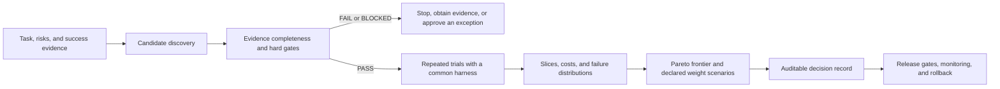

# Modern LLM Capabilities and Model Selection

## Course positioning

Model selection is neither copying a leaderboard nor buying the “largest model” by default. It is a constrained engineering decision: first express the task, risks, and deployment boundary as a **capability contract and hard gates**; then run repeated trials for every candidate with the same harness, data, and configuration; finally, analyze the Pareto trade-offs among quality, cost, latency, and risk.

This course does not maintain model rankings. Model catalogs, prices, context limits, regional availability, and preview status are all volatile facts; it teaches a selection method that transfers across them.

> [!info] Boundary for dynamic facts
> Sources were checked on 2026-07-22. On the day of a decision, vendor model IDs, capabilities, quotas, prices, data policies, and retirement dates must be reverified from official catalogs, model cards, contracts, and actual probes, with the evidence URI, time, and configuration retained. An advertised context window is an integration limit, not proof of effective task-level context capability; public benchmarks are evidence for candidate discovery, not a production conclusion.
>
> `latest`, preview aliases, and pinned versions do not have the same change semantics. Even if a model ID identifies fixed weights, routing, safety layers, or service infrastructure can still change observable behavior. Record the requested identifier; the model/version actually returned in the response when the API provides it; the endpoint/region; and the adapter version. Treat vendor lifecycle changes or runtime changes as triggers for new probes and regression tests.

## Learning objectives

- Translate a business task into contracts for input/output, reasoning, context, structured output, tools, and modalities.
- Distinguish an API’s claimed support from reliable behavior on this task and target configuration.
- Select matching evaluation objects and metrics for embeddings, generative models, and multimodal models.
- Build hard gates from data residency, retention, training use, deployable environments, licenses, budget, and latency.
- Run repeated trials on the same case with globally unique `trial_id` values, reporting failure distributions, cost, and finite-sample statistics instead of treating different cases as repetitions.
- Eliminate ineligible candidates before computing interpretable scores, a Pareto frontier, and weight sensitivity within the eligible set.
- Produce a reviewable model-decision record and define regression and rollback conditions for version upgrades.

## Prerequisites

- Read and write JSON, and run Python-standard-library scripts and unittest in PowerShell 7.
- Understand HTTP APIs, timeouts, JSON Schema, and basic statistics; prior integration with a particular vendor is not required.
- This course is an entry point in LLM application foundations and can be studied alongside [[prompt-engineering/00-index|Prompt Engineering]], [[context-engineering/00-index|Context Engineering]], and [[llm-api-integration/00-index|LLM API Integration]]. When you begin probing real candidates, add provider adapters, usage accounting, and retries.
- If you select an embedding model, continue to [[embeddings/00-index|Embeddings]] as needed. If you select an Agent model, use [[tool-calling-function-calling/00-index|Tool Calling]] to verify the complete action contract.

## Recommended order

| Order | Lesson | Key artifact |
| --- | --- | --- |
| 1 | [[modern-llm-capabilities-and-model-selection/01-capability-contract-and-selection-object\|Capability contracts and the selection object]] | One-page task-to-capability contract |
| 2 | [[modern-llm-capabilities-and-model-selection/02-reasoning-effective-context-and-structured-output\|Reasoning, effective context, and structured output]] | Three executable acceptance cases |
| 3 | [[modern-llm-capabilities-and-model-selection/03-tool-support-and-agent-runtime-compatibility\|Tool support and Agent runtime compatibility]] | Tool/runtime compatibility matrix |
| 4 | [[modern-llm-capabilities-and-model-selection/04-multimodal-embedding-and-specialized-models\|Multimodal, embedding, and specialized models]] | Modality pipeline and embedding evaluation set |
| 5 | [[modern-llm-capabilities-and-model-selection/05-hard-gates-privacy-and-deployment-boundaries\|Hard gates, privacy, and deployment boundaries]] | Auditable gate table |
| 6 | [[modern-llm-capabilities-and-model-selection/06-task-level-multi-trial-evaluation\|Task-level multi-trial evaluation]] | Frozen case, trial, and metric protocol |
| 7 | [[modern-llm-capabilities-and-model-selection/07-pareto-trade-offs-and-sensitivity-analysis\|Pareto trade-offs and sensitivity analysis]] | Frontier, weight perturbations, and decision record |
| 8 | [[modern-llm-capabilities-and-model-selection/08-project-auditable-model-selection-scorecard\|Project: an auditable model-selection scorecard]] | Offline scorecard, failure cases, and test evidence |

Plan for 12–16 hours: 60–90 minutes for each of the first seven lessons, plus 3–5 hours for the project and review.

## Evidence flow from candidates to release

The sequence in the diagram represents evidence dependencies, not a waterfall process: when the task, policy, candidate, or runtime changes, rerun the affected upstream steps. `BLOCKED` means evidence is missing and cannot be offset by a total score.

## Learning artifacts

After finishing the course, retain five versioned artifacts:

1. `task contract`: task distribution, inputs and outputs, risks, and success evidence;
2. `candidate evidence`: model IDs, API capabilities, model cards, policies, and prices, together with parseable verified/blocked status, owner, expiry, and missing items;
3. `eval protocol`: frozen cases, trial count, grader, configuration, and stopping rules;
4. `decision report`: gate results, metric distributions, Pareto frontier, sensitivity, and approved exceptions;
5. `release guard`: selected version, regression thresholds, canary, monitoring, and rollback conditions.

## Mastery criteria

- [ ] I can explain why “supports 1M context” does not prove reliability on a long-document task.
- [ ] I can express JSON Schema, tool, and multimodal support as runnable contract tests.
- [ ] I can select queries, corpus, relevance, and latency metrics for an embedding that match the retrieval task.
- [ ] I can run hard gates for privacy, deployment, capability, cost, and latency before comparing scores.
- [ ] I can distinguish `case_id` from a globally unique `trial_id` and verify that every candidate reaches the preregistered repetition count for every case.
- [ ] I can explain that nearest-rank p95 from a small sample describes only recorded samples and does not prove stable tail latency.
- [ ] I can distinguish the questions answered by a total score, a Pareto frontier, and sensitivity analysis.
- [ ] I can reject the argument “it ranks first on a public leaderboard, so deploy it directly.”
- [ ] I can run the project tests and explain which fixture candidates should be eliminated by gates and which are Pareto dominated.

## Connections to other courses

- [[evaluation-framework/00-index|Evaluation Framework]] provides the full method for tasks, trials, graders, traces, and outcomes; this course narrows it to model-candidate decisions. After the scorecard passes, use [[evaluation-framework/methods-and-quality/08-offline-to-online-evidence-handoff-and-regression-loop|Offline-to-Online Evidence Handoff and Regression Loop]] to connect the summary, release gate, operational evidence, and human triage.
- [[benchmark-design/00-index|Benchmark Design]] explains public comparison protocols; this course prioritizes private task distributions and deployment constraints.
- [[llmops/00-index|LLMOps]] owns model-version release, canaries, monitoring, and rollback.
- [[rag/00-index|Retrieval-Augmented Generation (RAG)]] and [[agent-core/00-index|Agent Core]] provide end-to-end acceptance objects for generative, retrieval, and tool environments.
- [[privacy-computing/00-index|Privacy Computing]] and [[ai-safety/00-index|AI Safety]] deepen data, identity, supply-chain, and misuse risks.

## Primary sources

The following sources establish the method; this course does not copy volatile leaderboard values from them as conclusions:

- Stanford CRFM, [HELM: a reproducible, transparent framework for foundation-model evaluation](https://crfm.stanford.edu/helm/index.html) and [HELM Long Context](https://crfm.stanford.edu/helm/long-context/latest/)
- Liang et al., [Holistic Evaluation of Language Models](https://arxiv.org/abs/2211.09110)
- NIST, [AI 600-1: Generative Artificial Intelligence Profile](https://doi.org/10.6028/NIST.AI.600-1)
- Mitchell et al., [Model Cards for Model Reporting](https://doi.org/10.1145/3287560.3287596)
- Muennighoff et al., [MTEB: Massive Text Embedding Benchmark](https://aclanthology.org/2023.eacl-main.148/)
- [JSON Schema 2020-12 specification](https://json-schema.org/specification)
- Examples of entry points for dynamic verification: [OpenAI model catalog](https://developers.openai.com/api/docs/models/all), [Gemini API model catalog and version naming](https://ai.google.dev/gemini-api/docs/models), [Claude model catalog](https://platform.claude.com/docs/en/about-claude/models/overview), and [Claude model IDs and version semantics](https://platform.claude.com/docs/en/about-claude/models/model-ids-and-versions). These pages are for evidence collection on the integration date, not vendor recommendations.
