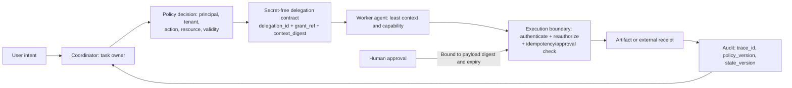
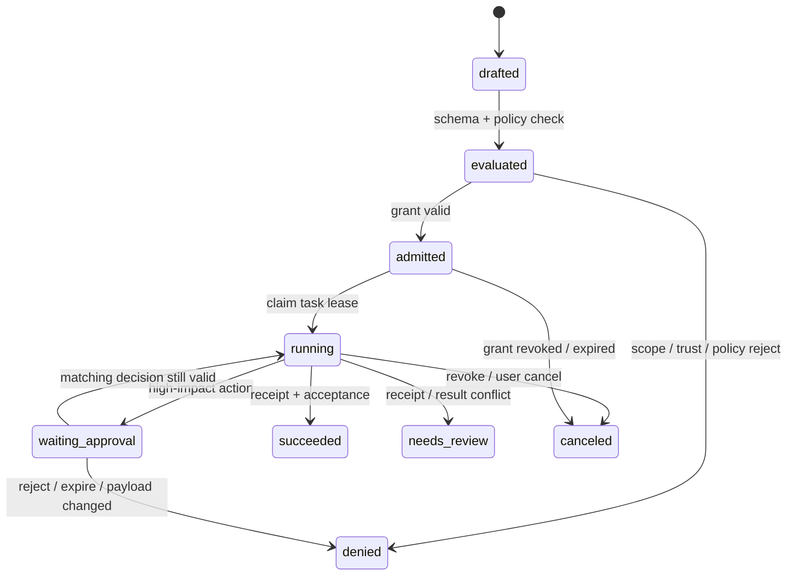

# Identity, Authorization, and Cross-Boundary Trust

## Goal

Separate role, discovery, identity, authorization, approval, and audit into independently verifiable contracts. Explain why “Agent A gives a task to B” must not automatically give B all of A's, the user's, or the coordinator's permissions.

## Six concepts that are easy to confuse

| Concept | Question answered | What it cannot prove |
| --- | --- | --- |
| Role or agent name | Who owns which class of artifact? | Which runtime process it is or what it can access |
| Agent Card or capability description | Which interface and skills does the remote side claim to offer? | That the description is trusted or the caller may use it |
| Runtime principal | Under whose identity does this request reach an execution boundary? | That the principal can delegate without limit |
| Authorization grant | Which action, resource, tenant, and time window are allowed? | That downstream side effects happened correctly |
| Approval decision | Who agreed to which input after which risk explanation? | That the same decision can be reused after the request changes |
| Evidence or receipt | Which external system confirmed which fact? | That another resource or a later attempt is also allowed |

A display name, model prompt, and natural-language “approved” are not access-control inputs. Letting a model choose a tool or specialist can be an orchestration decision. Effective authorization must be rechecked from an authenticated principal, resource, and policy at the execution boundary of a tool, data service, or remote agent.

## An auditable delegation chain



*Figure 1. Delegation is not credential transfer. Text alternative: after a policy decision, the coordinator gives the worker a secret-free, time-limited delegation contract. The execution boundary independently revalidates identity, authorization, approval, and idempotency; the artifact and receipt return to auditable state. This original diagram abstracts the contracts in this section rather than presenting any protocol's standard sequence.*

### Minimal delegation contract

The following is an application-internal teaching structure, not the wire format of A2A, MCP, or any SDK:

```json
{
  "delegation_id": "D-20260722-001",
  "parent_task_id": "T-100",
  "issuer": {"principal_id": "orchestrator-service", "tenant_id": "demo"},
  "delegatee": {"agent_id": "research-agent", "principal_id": "research-worker"},
  "grant_ref": "grant:demo-read-001",
  "scope": {"actions": ["evidence.search"], "resources": ["catalog:public"]},
  "validity": {"issued_at": "2026-07-22T08:00:00Z", "expires_at": "2026-07-22T08:10:00Z"},
  "context_digest": "sha256:...",
  "acceptance_ref": "evidence-list-v1",
  "audit": {"trace_id": "trace-demo-001", "policy_version": "policy-v3"}
}
```

It passes **verifiable references and bounded scope**, not a bearer token, password, full conversation, or a generalized permission to act for the user forever. A real system must resolve `grant_ref` in its IAM or policy system and confirm that the issuer can only attenuate permissions within its own authorized range, not amplify them.

## Re-evaluate every execution

Even after a scheduler accepts a delegation contract, the execution boundary checks:

1. Is the current request authenticated as the expected principal in the correct tenant or workspace?
2. Are action, resource, data classification, and network destination still within least scope?
3. Are grant, policy version, lease, and approval still valid, and is the approval-bound payload or revision unchanged?
4. Does current task and state permit the action, and are the idempotency key and receipt conflict-free?
5. Are output and audit events redacted and correlatable to `trace_id`, `delegation_id`, and the policy decision?

The third check matters especially: approval applies only to the action, resource, and summary it reviewed. If the draft or payee changes, decide again; never attach an old “allow” to a new payload. Together with [[multi-agent-collaboration/engineering-and-quality/06-budgets-stopping-and-human-intervention|human approval]] and [[multi-agent-collaboration/engineering-and-quality/05-conflicts-synchronization-and-failure-recovery|idempotency-conflict freezing]], this prevents overreach and incorrect replay.

## Additional controls across processes and organizations

An A2A Agent Card is for capability, endpoint, and authentication-scheme discovery; it does not replace the business authorization model. A2A requires servers to make authorization checks on every operation and limits tasks and resource results to the authenticated caller's authorization boundary. That boundary can be defined by user, role, project, or tenant, while concrete policy belongs to the agent implementer. A client must not treat the Card's skill list as an “everyone may call this” permission list. See [A2A Protocol Specification](https://a2a-protocol.org/latest/specification/) (accessed 2026-07-22).

For sensitive capabilities:

- Publish only the smallest Agent Card; reveal detailed skills through an authenticated extended card or private registry by identity.
- When caching a Card, retain its version or ETag and invalidate on authentication-method, capability, or revocation changes.
- Keep remote endpoint, trust root, authentication scheme, protocol/extension version, and tenant routing in controlled configuration. Do not let a model select them from a web page or tool output.
- For a signed Card, verify signature, key source, expiry or revocation, and expected provider. Signature integrity does not grant call permission.

The A2A discovery guidance recommends authentication and authorization for sensitive Cards, says dynamic credentials should be obtained out of band rather than embedded in a Card, and says a client should validate at least one signature when one exists. See [A2A Agent Discovery](https://a2a-protocol.org/latest/topics/agent-discovery/) (accessed 2026-07-22).

## Boundary with MCP

MCP is a capability-integration protocol from agents to tools and data, not a multi-agent task-ownership system. The HTTP MCP authorization specification requires a resource server to validate token audience and forbids accepting or forwarding a token not issued for itself; a token needed for an upstream API must be obtained by the MCP server as an independent OAuth client. Placing a user or coordinator bearer token in agent messages, `metadata`, a long-lived checkpoint, or a remote Agent Card both enlarges the leak surface and creates a token-passthrough anti-pattern. See [MCP Authorization](https://modelcontextprotocol.io/specification/2025-11-25/basic/authorization) and [MCP Security Best Practices](https://modelcontextprotocol.io/docs/tutorials/security/security_best_practices) (accessed 2026-07-22).

This course's contract therefore retains only `grant_ref`, redacted scope, and audit references. Credentials are held and rotated by the relevant execution boundary and bound to their audience. STDIO, local-process, and HTTP credential handling differ; do not mechanically copy an HTTP example into a local tool.

## Lifecycle and revocation



*Figure 2. Authorization-related states in the teaching runtime. Text alternative: a contract is validated and evaluated by policy before acquiring an execution lease. A high-impact action waits for payload-bound approval; revocation, expiry, and conflict are not retried automatically. `needs_review` is internal to this course and is not an A2A standard state.*

Revocation affects work not yet started and pending approval. An irreversible effect already sent needs its receipt and compensation workflow; do not assume revoking a token recalls an email. On recovery, reread authorization and lease state rather than continuing only from an old checkpoint.

## Common failure modes

| Failure | Mistaken assumption | How to constrain it |
| --- | --- | --- |
| Role name is identity | Any process can claim to be “reviewer” | Authenticate the runtime principal; use role only as a policy attribute |
| Delegation inherits all permission | Coordinator gives worker the user's full token | Reference-based, short-lived, scope-attenuated grant; revalidate at execution |
| Card equals trust | Call a write tool straight from a web or registry entry | Pinned trust configuration, authentication, signature/version verification, and minimum disclosure |
| Approval can be replayed | Use an old approval after input or target changes | Bind payload digest, revision, action, expiry, and decision ID |
| Permission checked only at entry | Late or recovered work continues to write | Check current principal, scope, state, and lease on every tool or remote operation |
| Token appears in a message or trace | Preserve full credentials for easy debugging | Record only references or hashes; manage credentials in a dedicated secret system |

## Exercises and self-check

1. Write one scope for a researcher querying public material and one for a publisher sending external email. Why does the latter require payload-bound approval?
2. A remote Agent Card claims a `publish` skill. Which additional evidence is required before a local system may actually call it?
3. At task recovery, a grant has expired but the checkpoint says `running`. What should happen?
4. Write three denial paths for your runtime: an unverifiable policy decision across a trust boundary, a resource scope expanding from one object to a wildcard, and an expired approval or changed bound payload digest. Each assertion must prove no adapter call or external side effect occurred.

## Next step

Continue with [[multi-agent-collaboration/engineering-and-quality/04-message-protocols-and-shared-state|Message Protocols and Shared State]], carrying `delegation_id`, `trace_id`, state version, and secret-free evidence references into a replayable message and state model.

## References

- [A2A Protocol Specification](https://a2a-protocol.org/latest/specification/) — accessed 2026-07-22.
- [A2A Agent Discovery](https://a2a-protocol.org/latest/topics/agent-discovery/) — accessed 2026-07-22.
- [MCP Authorization](https://modelcontextprotocol.io/specification/2025-11-25/basic/authorization) — accessed 2026-07-22.
- [MCP Security Best Practices](https://modelcontextprotocol.io/docs/tutorials/security/security_best_practices) — accessed 2026-07-22.
- [OpenAI Agents SDK: Handoffs](https://openai.github.io/openai-agents-python/handoffs/) — accessed 2026-07-22.
