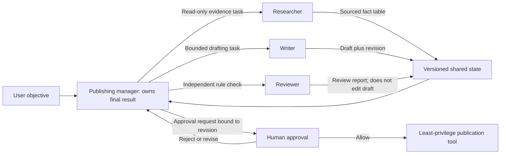

# Roles, Topologies, and Responsibility Boundaries

## Goal

Understand topology as the structure of control authority and message connections between agents. Write a role with one responsibility, capabilities, permissions, and exit conditions.

## Define a role contract first

Every role answers at least seven questions:

1. Which result does it own?
2. Which inputs does it accept, and which structure does it produce?
3. Which tools and data can it use?
4. What is it prohibited from doing?
5. Who accepts its output, and who receives a failure?
6. When must it stop or request a human decision?
7. Which runtime principal accesses which tenant or trust domain, and who rechecks permission at the execution boundary?

If two roles both claim responsibility for “final correctness,” the boundary is usually unclear. A researcher can own an evidence list, a writer a draft, and a reviewer rule checks, but final publication authority belongs only to a manager or a human.

## Common topologies

### Manager and specialists

A manager retains the user conversation and final answer, calling bounded subtasks as “specialist tools.” The OpenAI Agents SDK calls this pattern agents as tools. It centralizes control and shared guardrails, but the manager can become a context and latency bottleneck.

### Handoff

A classifier or triage agent transfers control to a specialist, who continues the conversation. In an SDK, a handoff differs from calling a specialist tool: the received context and ownership of the subsequent conversation both change. It is useful for domain routing, not when the manager must retain one final answer.

For the OpenAI Agents SDK, `input_type` constrains only handoff-tool metadata; it does not replace the recipient's primary input or perform authorization routing among destinations. Trim the recipient's history with `input_filter` or an explicit context policy. The SDK also states that input guardrails for a handoff chain apply only to the first agent and output guardrails only to the final output. If every tool or write needs a check, add guardrails and authorization revalidation at the tool or execution boundary instead of treating one routing action as continuing permission. See [Handoffs](https://openai.github.io/openai-agents-python/handoffs/) (accessed 2026-07-22).

### Pipeline

Research → draft → review → publish, with stable input and output at each step. This is fundamentally closer to a workflow; use an agent only where one stage needs open-ended judgment.

### Fan-out and aggregation

Independent specialists work in parallel and an aggregator merges their outputs. Parallelism only shortens noncritical dependencies; the aggregator must also address duplication, conflicts, and source strength.

### Peer or network

Agents discover one another's capabilities and exchange tasks. It suits cross-organization or heterogeneous systems, but makes identity, authentication, protocol version, timeout, and accountability harder. A2A seeks to provide shared task and message models without revealing an agent's internal state.

### Hierarchy and swarm

Several manager layers can control a large task, but each summary layer can lose evidence. A decentralized “swarm” is common in research; in production it is hardest to validate without deterministic stopping, arbitration, and a source of truth.

## Topology-selection checklist

- Must one principal own the final answer?
- Does a specialist need the full conversation or only a minimal task package?
- Can subtasks really run in parallel?
- Do data and tools need permission isolation?
- Who arbitrates conflicts?
- Does the system cross a process, vendor, or organizational boundary?
- From which layer does recovery resume after failure?

Prefer a topology with fewer edges and clearer control. A fully connected set of `n` agents can have up to `n(n-1)` directed communication relationships, so the testing surface grows rapidly as roles are added.

## Example: a publishing assistant

*Figure 1. Task and state ownership in manager-led collaboration. Text alternative: the publishing manager owns the final result; researcher, writer, and reviewer own bounded artifacts; every artifact enters versioned shared state; the reviewer cannot edit the object under review; publication requires human approval bound to a state revision and a least-privilege tool. The diagram abstracts the role contract in this section, A2A task/message/artifact boundaries, and the cited orchestration sources; the Mermaid source is the regeneration method.*

| Role | Owned result | Permission | Prohibited action |
| --- | --- | --- | --- |
| Researcher | Sourced fact table | Read-only retrieval | Write files or publish |
| Writer | Draft based on fact table | Write to draft area | Add unsupported facts |
| Reviewer | Rule-check report | Read draft | Modify the draft |
| Publishing manager | Final version | Publish after approval | Skip review |

This is not four agents freely chatting. It is a directed process with separation of duties.

## Exercise and self-check

Draw two topologies for “automatically repair code and commit it”: manager-and-specialist and pipeline. Mark the permissions for testing, code writing, and Git commit. Self-check: may the reviewer edit the code directly? If it may, how will you prevent self-review?

## Next step

Continue with [[multi-agent-collaboration/fundamentals-and-architecture/03-task-decomposition-and-delegation-contracts|Task Decomposition and Delegation Contracts]].

## References

- [OpenAI Agents SDK: Agent orchestration](https://openai.github.io/openai-agents-python/multi_agent/) — accessed 2026-07-22.
- [OpenAI Agents SDK: Handoffs](https://openai.github.io/openai-agents-python/handoffs/) — accessed 2026-07-22.
- [A2A Protocol Specification](https://a2a-protocol.org/latest/specification/) — accessed 2026-07-22.
