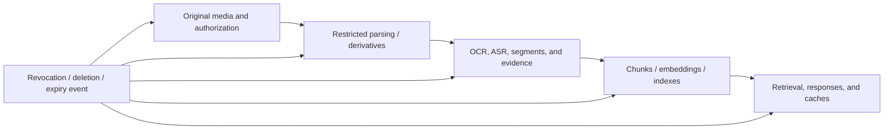

# Latency, Cost, Privacy, and Safety

## Goal of this lesson

Complete budgeting, routing, authorization, and minimization before media reaches a model. Understand that media metadata, content, derived text, and traces can all leak information.

## Where cost and latency come from

End-to-end latency can be roughly decomposed as:

~~~text
upload + decode/transcode + OCR/ASR/frame sampling + model queue/inference + post-processing
~~~

Media billing may be based on tokens, duration, image count or resolution, or model calls; rules change by provider. Do not hard-code a day's token conversion as a business formula. Internally, define provider-neutral “processing units” for pre-routing, then let an adapter estimate actual cost.

## Tiered routing

1. Check metadata and format without calling a model.
2. Run lightweight local preprocessing to extract candidate pages or segments.
3. Use a unimodal model for a well-defined task.
4. Call a multimodal model only when cross-modal reasoning is needed.
5. Use high resolution or long context only for critical evidence.

Key caches by asset hash, processor version, and parameters, and remove them when permission is withdrawn or retention expires. Do not reuse caches containing personal data across users.

## Data classification and minimization

The privacy surface of multimodal data is broader than text:

- Images can contain faces, identity documents, screens, locations, and EXIF.
- Audio can contain voice biometrics, background conversations, and location clues.
- Video combines identity, behavior, time, and scene.
- OCR and ASR derived text remains personal data.
- Debug traces can retain media or base64.

For every asset, record purpose, authorization, permitted processing location, retention period, and deletion status. If a local crop can answer the question, do not send an entire identity document; if a redacted transcript can answer it, do not upload original audio.

## Deletion, permission withdrawal, and retrieval propagation

Deletion or revocation is not deletion of only the original file. First create an auditable event from the source revision and make online reads fail closed immediately. Then separately confirm propagation status for derived images, OCR/ASR text, chunks, embeddings, vector or keyword indexes, caches, evaluation-set copies, and controlled traces. Backups and legal retention can have different purge cycles, so do not claim “all media have been physically erased” merely because online retrieval is disabled. This is the same data-lifecycle problem as [[knowledge-base-construction/03-versioning-deletion-and-authorization|Versioning, Deletion, and Permissions in Knowledge-Base Construction]].

The arrows show propagation relationships that each need a confirmation record; they do not imply that one deletion API automatically completes every layer.

## Threat model

- Disguised formats or parser vulnerabilities;
- prompt injection in images, captions, or audio;
- steganographic or hidden-layer content;
- malicious remote URLs, redirects, and internal-network probing;
- model output triggering high-privilege tools;
- leakage through logs, caches, and temporary files; and
- generated or edited media impersonating authentic sources.

Defenses include MIME detection, sandboxed parsing, resource limits, URL allowlists, separation of content and instructions, output schema, tool-side authorization, temporary-file cleanup, and audit.

## Provenance and authenticity

As of 2026-07-22, the C2PA specification site lists version 2.4 (April 2026) and provides Content Credentials, AI/ML guidance, and security considerations. C2PA can tamper-evidently associate provenance and edit claims with an asset, but does not decide whether content is “true” or “good.” A successful verification is only a trust signal. Also verify asset hashes, claims, signatures, timestamps, revocation information, and certificate chain, then decide whether to use the asset according to the product or business's own trust anchors and signing subjects.

An asset without Content Credentials is not thereby fake; an asset with credentials does not let you skip content validation.

## Safe output

- Cite `asset_id` and evidence intervals.
- State processing or generation steps and model version.
- Do not output unnecessary identity inferences.
- Require human review for high-impact judgments in medicine, law enforcement, hiring, and similar contexts.
- Label generated media as required by the product, and retain license and prompt/input records.
- Provide captions, alternative text, and accessible results for disabled users.

W3C WebVTT is one standardized format for time-aligned text tracks in audio and video. The public page as of 2026-07-22 is still a Candidate Recommendation Draft dated 2026-05-20, so treat it according to its status at the time rather than calling it a final Recommendation.

## Release checklist

- [ ] Checked the provider's current media types, limits, data retention, and regions.
- [ ] File decoding runs in a restricted environment with size, duration, and pixel limits.
- [ ] Personal data have explicit authorization, minimization, and a deletion path.
- [ ] Traces do not retain raw sensitive media by default.
- [ ] Media content cannot change system instructions or tool permissions.
- [ ] High-risk output has evidence and human review.
- [ ] Caches and derived data inherit the original asset's classification.
- [ ] Revocation or deletion fails closed for online retrieval, derived indexes, and caches, with per-layer propagation confirmation; backup purge status is tracked separately.

## Exercise and self-check

Draw the data flow for “analyze customer-service call recordings in the cloud,” marking storage for original audio, transcription, embeddings, prompt, response, trace, and cache. Self-check: does deleting only the original audio fulfill a deletion request? Does a successful C2PA verification prove a news item's content is true?

## Next step

Proceed to [[multimodal-ai/03-project-and-self-assessment/08-offline-multimodal-evidence-routing-project|Offline Multimodal Evidence Routing Project]].

## References

- [C2PA Specifications 2.4](https://spec.c2pa.org/specifications/specifications/2.4/index.html) (accessed 2026-07-22)
- [C2PA Conformance / Trust List](https://c2pa.org/conformance/) (accessed 2026-07-22)
- [C2PA Guiding Principles](https://c2pa.org/principles/) (accessed 2026-07-22)
- [W3C WebVTT](https://www.w3.org/TR/webvtt1/) (accessed 2026-07-22)
