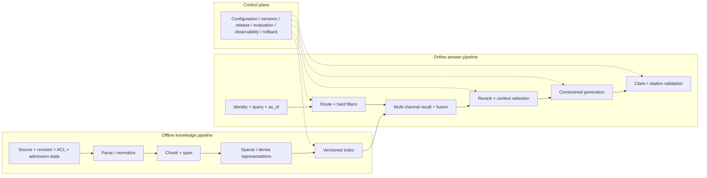

# System Boundaries and the Complete Pipeline

## Learning objectives

- Understand why RAG is a systems problem rather than a single model call.
- Distinguish the offline knowledge pipeline, online answer pipeline, and control plane.
- Define stable IDs, versions, inputs, outputs, and failure behavior for each layer.
- Upgrade from a minimal, testable baseline one layer at a time instead of piling on components at once.

## Build intuition first

An ordinary LLM mainly relies on knowledge fixed in its parameters after training. RAG adds an external, updateable, non-parametric knowledge source: given a question `x`, retrieve evidence `z` and then generate an answer `y`. A rough formulation is:

$$
p(y\mid x)=\sum_z p(z\mid x)\,p(y\mid x,z)
$$

This expression describes two opportunities and two failure points:

1. `p(z\mid x)`: did the system retrieve the right evidence?
2. `p(y\mid x,z)`: did the generator use that evidence correctly?

Real systems add parsing, authorization, freshness, budgets, citations, and dependency failures. Looking only at the final answer cannot tell you which layer was wrong.

## Three planes



*Figure 1. RAG's offline knowledge, online answering, and control planes. Text alternative: sources with versions and permissions are parsed, split, and represented before entering an index; online requests first apply identity and hard filters, then recall, reranking, assembly, generation, and citation validation; the control plane supplies configuration, release, evaluation, observation, and rollback for critical stages. The diagram reorganizes this lesson's end-to-end contract and the retrieval-generation boundary in the original RAG paper by Lewis et al.; the Mermaid source is the reproduction method.*

### 1. Offline knowledge pipeline

```text
Source registration → download/connect → canonical revision → parse/element → chunk
                    → sparse/dense representations → staged generation → integrity/authorization/tombstone checks → atomic publication
```

It answers, “Which knowledge may be retrieved?” Its key outputs are not only vectors but traceable records:

| Field | Purpose |
| --- | --- |
| source_id / document_id | Stably locate the original material; do not use only mutable titles or URLs. |
| source owner / trust tier / admission record | State who admitted a revision under which rules; a derivation chain does not automatically prove that material is authentic or suitable for the current use. |
| source_revision | Identify the version being cited. |
| canonical/parse revision | Distinguish raw content, normalized text, and parser/config outputs. |
| element/chunk ID / exact span | Locate the evidence range and return to the declared coordinate space. |
| tenant / ACL / lifecycle | Restrict who may see it and when; access metadata must propagate with every retrievable chunk or entry. |
| parser/chunker revision | Reproduce how the text was produced. |
| retrieval hash / embedding/index revision | Prevent retrieval representations and indexes from being mixed. |
| snapshot/tombstone/auth revision | Prevent old snapshots from being republished after revocation or deletion. |
| index generation / entry-set manifest | Establish which complete batch of derived artifacts served this query. |

There is also a security decision before a source enters the index: a **discovered** file is not necessarily **admitted** knowledge. Connectors, source ownership, licenses/classification, content validation, malicious-content quarantine, and approval records determine whether a revision may be published; the later `raw → canonical → parse → chunk → index` chain only describes how it was derived. Hashes and derivation chains help detect bytes that differ from expectation, but cannot by themselves prove authorship, content correctness, or the current user's right to read them.

### 2. Online answer pipeline

```text
Authentication and query → routing → hard filters → multi-channel recall → fusion/reranking
                         → context selection → constrained generation → claim/citation validation → output
```

The order matters: tenant, ACL, status, and validity period should be applied before relevance scoring. Otherwise candidate scores, caches, or error logs can touch unauthorized material.

### 2.1 Access decisions must take effect in at least two places

“Filter first” does not mean retrieving the whole corpus's top-k and deleting a few results afterwards. Trusted identity, server-side policy, and a trusted clock should limit the searchable set **at query time**—for example, through index-layer filters, isolated namespaces, or physical partitions—and current policy or an explicit request snapshot should be checked again before evidence enters context and before a citation is rendered. If a vector service cannot enforce this restriction at the search boundary, searching the whole corpus before filtering harms recall and turns scores, logs, and error paths into disclosure surfaces; use a retrieval design that enforces the boundary or abstain conservatively.

A cache is also a knowledge copy, not merely a performance detail. When caching candidates, context, or final answers, the cache-hit scope must at least bind the identity/tenant, authorization or policy revision, knowledge snapshot or generation, route, and output mode on which its meaning depends; it must be invalidated when revocations, tombstones, or high-risk sources change. A cross-user answer cache keyed only by a normalized query can disclose material and bypass tightened permissions.

### 3. Control plane

The control plane stores configuration, versions, releases, evaluation, observability, and rollback policies, for example:

- which index alias points to which generation and the source snapshot, tombstone state, and authorization revision it binds;
- release versions for the retriever, reranker, prompt, and model;
- timeouts, retries, candidate counts, and context budgets for each layer;
- which query slices may receive automatic answers;
- which component to roll back after a regression.

Without a control plane, reproducing one incorrect online answer is difficult.

## End-to-end contract

Give every request at least a `trace_id`, and record the following at each layer:

| Stage | Required fields | Must not be exposed directly to users |
| --- | --- | --- |
| Routing | original query, route, route revision | System instructions and internal rule details. |
| Filtering | trusted tenant/groups, `authorization_revision`, as_of, internal filter decisions | Counts, reasons, titles, IDs, and text of denied documents. |
| Retrieval | generation/entry/chunk, channel, rank, score, index revision | Unauthorized candidates. |
| Reranking | Input window, before/after rank, model revision, fallback | Sensitive third-party source text. |
| Context | selected/dropped reason, order, character/token count | Unnecessary private full text. |
| Generation | prompt revision, model revision, structured-output state | Keys and hidden instructions. |
| Citation | claim → source locator/span/canonical/parse/chunk/entry; protected trace additionally binds the generation | Sources the user cannot open and global private-corpus counts. |

These must be two contracts: a production public response returns only stable status, the answer, authorized citations, and an opaque `trace_id` that carries no identity or permission semantics; a protected audit trace records global generation, filter counts, candidates, versions, and fallbacks. Even without titles or IDs, `acl_denied=2` or a global generation ID that changes with private documents can become an existence side channel. Redact log text to the minimum necessary, restrict access, and set retention periods; “for debugging” is not a reason to preserve data forever. This knowledge base's offline project uses a reproducible teaching `trace_id` for snapshot tests, not a random opaque production ID.

A `trace_id` correlates one execution; it does not replace provenance evidence or an access decision. When traces, citations, or artifacts are passed to another service, define its schema, protected transport, consumer identity, and verifiable trust binding separately. “A field contains SHA-256” detects tampering only when the consumer holds a trusted expected value and actually compares it.

## What RAG can and cannot do

| Can improve | Cannot automatically guarantee |
| --- | --- |
| Use knowledge added or changed after training. | That the source itself is authentic, unbiased, and unpoisoned. |
| Attach sources that can be checked to an answer. | That a citation supports the adjacent claim. |
| Update internal knowledge by version. | That deletion and permission changes propagated to every copy. |
| Reduce some generation detached from the evidence. | That the model never uses parametric memory. |
| Use retrieval traces for diagnosis. | That high recall necessarily yields high answer quality. |

For high-risk decisions, RAG is usually only an evidence-preparation layer; deterministic rules, controlled tools, or human approval are still required.

## Start with a minimal baseline

Build in the following order, changing only one major factor at a time and retaining a regression set:

1. Keyword/BM25 → top passages → extractive or strictly evidence-grounded answers → source IDs.
2. Add qrels; first measure Recall@k, MRR/nDCG, and authorization correctness.
3. Add dense retrieval and record it separately from sparse retrieval.
4. Add fusion, then a reranker with a limited window.
5. Add a context budget, canonical deduplication, and adjacent passages.
6. Add a real LLM, structured claims, and citation validation.
7. Add query rewriting, routing, caching, and failure fallback.
8. Only then evaluate adaptive retrieval, multi-hop retrieval, or Agentic RAG.

The value of this sequence is not “being conservative”; it lets you attribute gains, costs, and failures.

## A verifiable design exercise

Draw the two pipelines for “company-policy Q&A,” then write down:

1. After an original PDF changes, which versions must change?
2. After an employee leaves, which caches, indexes, and logs must be invalidated or access-restricted?
3. If the dense service times out, does the keyword fallback still use the same ACL set?
4. If an answer cites an old policy, which trace fields must you inspect?
5. When the model is unavailable, should the system abstain, return original excerpts, or hand off to a person? Why?

When finished, compare your design with the trace fields in the [[rag/examples/offline_cited_qa.py|offline project]].

## Common mistakes

- **Saving only the final top-3**: loses evidence before recall, reranking, and trimming, so you cannot locate the layer that missed gold.
- **Writing only “latest” for versions**: prevents replay after data, index, or model changes.
- **Letting the LLM judge permissions**: a relevance model is not an access-control system.
- **Falling back to free generation for every error**: dependency failures are when fluent answers without evidence are most likely.
- **Adding multi-query, multi-model, and agents from the start**: components change together and experiments cannot be explained.

## Self-check

1. What does the offline pipeline decide, and what does the online pipeline decide?
2. Why must chunk ID, source revision, and index revision all be retained?
3. What experimental results did the original RAG paper establish, and why can they not prove that your business answers are necessarily more reliable?
4. If a gold chunk entered the candidates but not the prompt, which layer should you inspect?
5. How does a missing control plane affect rollback and incident reproduction?
6. Why cannot an answer cache be keyed only by a normalized query? Which authorization and knowledge states must it also bind?

## Summary and next step

The basic unit of RAG is not one model call, but a pipeline with versions, permissions, evidence, and failure semantics. The next lesson first decides whether a question should enter that pipeline: [[rag/02-query-understanding-routing-and-rewriting|Query Understanding, Routing, and Rewriting]].

## References

- Lewis et al., [Retrieval-Augmented Generation for Knowledge-Intensive NLP Tasks](https://arxiv.org/abs/2005.11401)
- Karpukhin et al., [Dense Passage Retrieval for Open-Domain Question Answering](https://arxiv.org/abs/2004.04906)
- [W3C PROV Overview](https://www.w3.org/TR/prov-overview/) and [PROV-O](https://www.w3.org/TR/prov-o/): a general vocabulary for entities, activities, agents, and derivation relationships.
- [OWASP LLM08:2025 Vector and Embedding Weaknesses](https://genai.owasp.org/llmrisk/llm082025-vector-and-embedding-weaknesses/): permission-aware stores, multi-tenant isolation, and poisoning boundaries.
- [OWASP RAG Security Cheat Sheet](https://cheatsheetseries.owasp.org/cheatsheets/RAG_Security_Cheat_Sheet.html): production controls for chunk-level access metadata, source admission, caching, and output validation; it is implementation guidance, not a compliance certification for a particular system.
- [SLSA Build Provenance v1.2](https://slsa.dev/spec/v1.2/build-provenance/): an analogy for derived artifacts binding inputs and build definitions; RAG provenance is not software-supply-chain attestation.

Sources accessed: 2026-07-22. The formula is a simplified way to understand the pipeline; it does not replace a concrete implementation or business acceptance criteria.
