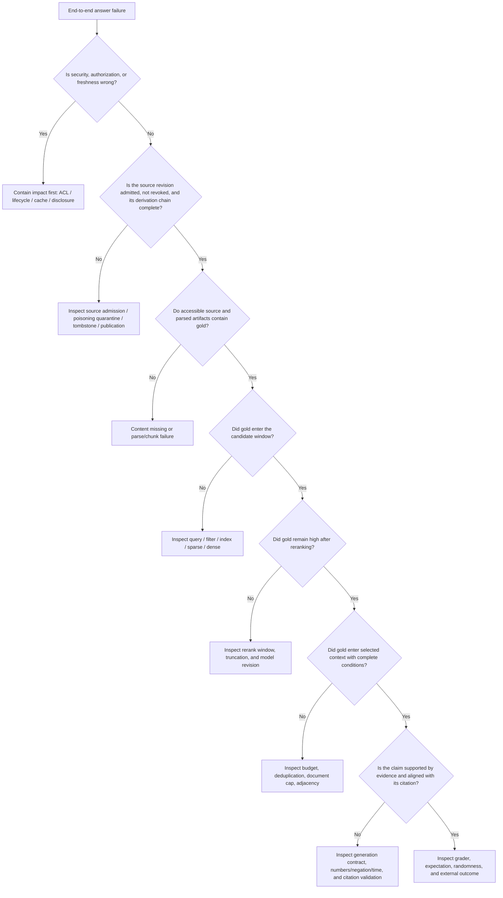

# Failure Taxonomy and System Debugging

## Learning objectives

- Decompose “the answer was wrong” into verifiable upstream and downstream failures.
- Replay the same request with pinned versions.
- Locate root causes from candidate, selected-context, claim, and citation traces.
- Turn incident samples into minimal regression tests.

## Failure map



*Figure 1. RAG failure backtracking tree. Text alternative: first eliminate authorization and freshness risk; then confirm the source revision was admitted and not revoked; next confirm whether gold exists in the corpus, candidates, rerank results, and final context; finally inspect generated claims, citations, and external outcome. Each “no” points to a different responsible layer. The diagram is drawn from this lesson's failure taxonomy and the retrieval–generation layered abstraction in BEIR/RAG; the Mermaid source is the reproduction method.*

| Layer | Typical failure | Required evidence | Repair direction |
| --- | --- | --- | --- |
| Source admission/publication | Unreviewed source, poisoned revision, tombstone resurrection, incomplete publication of derived artifacts. | admission/owner/license record, source hash, tombstone, release manifest | Quarantine, revoke, rebuild, and republish. |
| Source content | Original content is missing, wrong, or conflicting. | source snapshot, owner, revision | Content governance. |
| Parsing | Table row/column loss, OCR typo. | Original file and parsed artifact. | parser/OCR |
| Chunking | Answer and condition are split apart. | chunk/span/adjacency | boundaries, overlap |
| Index | New document absent or deletion not propagated. | sync watermark, index revision | incremental/deletion chain |
| Authorization | Unauthorized candidate or excessive refusal. | trusted identity, filter decision | ACL/tenant |
| Query | Coreference, negation, or time rewritten incorrectly. | original/rewrite/router revision | routing/clarification |
| Recall | Gold did not enter candidates. | all candidates, channel, qrels | representation/retrieval |
| Reranking | Gold entered but was pushed down. | before/after rank | reranker/window |
| Context | Gold was high but trimmed or deduplicated wrongly. | selected/dropped reason, budget | selection |
| Generation | Evidence is ignored or combined into new facts. | exact prompt, model output | contract/model |
| Citation | Wrong source or unsupported span cited. | claim–source alignment | validator |
| Service | Timeout, 429, 5xx, partial-shard failure. | stage latency, attempt, fallback | capacity/dependency |

The key to this table is “corresponding evidence.” Without intermediate state, you can only guess.

## Standard diagnostic sequence

### 1. Freeze reproduction conditions

Collect `trace_id`, time, trusted identity scope, original query, route, source/index/retrieval/reranker/prompt/model revisions, and feature flags. Do not replay an old incident using the current “latest.”

### 2. Check security and freshness first

Confirm:

- whether the user should see this source;
- whether the source is effective, published, and not deleted;
- whether expired copies and caches remain visible;
- whether a cache hit still binds the current principal, authorization revision, and knowledge generation;
- whether the trace discloses filtered material to the user.

Security issues take priority over relevance tuning.

### 2.1 Then inspect source admission and the derivation chain

Confirm whether the hit source revision was actually published after the current connector/owner/license and content checks, and whether it was revoked, replaced, or tombstoned. Then confirm that raw, canonical, parse, chunk, and index entries belong to the same published chain. Provenance records where it came from and through which activities; it does not automatically prove that the body is authentic, unpoisoned, or appropriate for the business. Source trust and conflict still need content governance and accountable-owner judgment.

### 3. Inspect the corpus directly

Search whether the gold fact exists in source and parsed/chunk artifacts. If the corpus has no answer at all, a retrieval model cannot repair missing content.

### 4. Inspect the candidate window

- Gold is in no channel: inspect query, chunks, representations, index, and filters.
- Gold is sparse but not dense: inspect embeddings/semantics.
- Gold is dense but not sparse: it may be vocabulary mismatch, not necessarily a failure.
- Gold was filtered: inspect authorization, validity period, or user expectation.

### 5. Inspect reranking and selected context

- Gold is a candidate but drops in reranking: inspect input truncation, hard negatives, and model version.
- Gold ranks high after reranking but is not selected: inspect budget, canonical deduplication, and document cap.
- Gold is selected but a conditional passage is absent: inspect adjacency and chunks.

### 6. Inspect generation and citation last

When complete evidence entered context:

- Does a claim go beyond the original text?
- Did numbers, negation, time, or the object change?
- Did the model combine two sources into a third conclusion?
- Does a citation point to a span that supports the claim?
- Did a schema retry inadvertently change the answer?

Do not tune prompts first when gold never entered context.

## Symptoms to checkpoints

| Symptom | First checkpoint | Then |
| --- | --- | --- |
| Answer uses an old policy | filter effective window | deletion propagation, cache, source revision |
| Correct document cited but conclusion wrong | claim/span | adjacency, generation, lost conditions |
| Intermittent no-answer | stage timeout/fallback | shards, queue, p99 |
| Fails only in multi-turn conversation | original/rewrite/session | coreference and state scope |
| Administrators can answer; ordinary users get empty results | whether ACL is expected | qrels by role slice |
| Same query drifts | every revision/random parameter | index increments, model service |
| Many relevant candidates but poor answer | selected context | duplication, order, long-context use |

## Two kinds of no-answer

1. **Corpus no-answer**: the currently accessible corpus genuinely has no supporting evidence.
2. **Retrieval miss**: the corpus has an answer, but the candidate chain did not find it.

The test set needs source-level gold to distinguish them. If you look only at final abstention, they look the same while requiring completely different repairs.

## Incident closed loop

Every confirmed incident should produce at least:

- an anonymized or synthetic minimal query;
- pinned source and system revisions;
- expected route, candidates, evidence, status, and forbidden sources;
- a regression test runnable in normal and `-O` modes;
- metrics and risk notes before and after the repair;
- owner, release date, and required rollback.

Do not turn user feedback into gold without review; it may be wrong, malicious, or sensitive.

## Hands-on debugging

Case: “An ordinary employee asks when a refund arrives; the answer cites an expired policy saying it arrives the same day.”

Verify at least these five hypotheses:

1. The old source's `effective_to` is missing or failed to parse.
2. The filter uses client time or the wrong time zone.
3. The old chunk was deleted from the primary store but not the vector index.
4. The cache key lacks source/index revision.
5. The generator says “same day” from parametric memory while attaching a citation to the new document.

For each hypothesis, write the required trace/file evidence, not just a repair proposal.

Then run failure simulation:

```powershell
$env:PYTHONDONTWRITEBYTECODE = '1'  # Prevent the debugging exercise from producing __pycache__ and keep the directory clean.
$script = '.\docs-EN\rag\examples\offline_cited_qa.py'  # Store a reusable offline RAG script path.
$fixture = '.\docs-EN\rag\examples\rag-fixture.json'  # Keep the same auditable fixture so changed inputs do not hide failure differences.

python -B $script --fixture $fixture inspect --query-id Q-refund --failure retrieval_error --operator-view  # Simulate a recall dependency failure; inspect abstention and the diagnostic reason.
python -B $script --fixture $fixture inspect --query-id Q-refund --failure reranker_error --operator-view  # Simulate reranker failure; inspect fallback to the same safe candidate window.
python -B $script --fixture $fixture inspect --query-id Q-refund --failure generation_error --operator-view  # Simulate generation failure; inspect the absence of an unvalidated draft.
```

Explain why the three results differ at the public `response` and protected `audit_trace` layers. `--operator-view` is only a local teaching confirmation, not identity authentication; a production diagnostic entry point must complete operator authorization first.

## Common mistakes

- Record only the final answer, not candidates or versions.
- Replay historical incidents with the current index.
- Attribute every no-answer to retrieval.
- Change several components and claim one caused an improvement.
- Repair only the happy path and omit fallback tests.
- Store complete private body text and credentials in diagnostic logs.

## Self-check

1. How do you distinguish gold absent from candidates from gold trimmed by context?
2. Why inspect source and authorization before prompts?
3. If the same query was correct yesterday and wrong today, which revisions must you compare at minimum?
4. What should be repaired for corpus no-answer and for retrieval miss respectively?
5. Why can one negative user rating not become a training label directly?
6. How should “source was not admitted/was revoked” and “admitted sources contain no gold” be treated differently?

## Summary and next step

RAG debugging starts from reproducible versions and upstream evidence, then narrows layer by layer to generation and citations. The next lesson turns these observation points into offline, online, and release metrics: [[rag/07-end-to-end-evaluation-and-monitoring|End-to-End Evaluation and Monitoring]].

## References

- Lewis et al., [Retrieval-Augmented Generation for Knowledge-Intensive NLP Tasks](https://arxiv.org/abs/2005.11401)
- Thakur et al., [BEIR](https://arxiv.org/abs/2104.08663)
- [OWASP RAG Security Cheat Sheet](https://cheatsheetseries.owasp.org/cheatsheets/RAG_Security_Cheat_Sheet.html): a debugging/control plane for source poisoning, chunk-level ACLs, caching, and source attribution.

Sources accessed: 2026-07-22.
