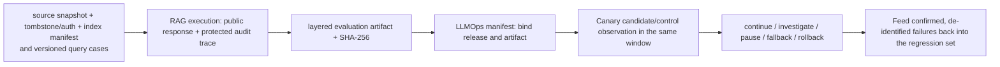

# End-to-End Evaluation and Monitoring

## Learning objectives

- Measure routing, filtering, retrieval, context, answers, citations, and system metrics separately.
- Build offline suites that include no-answer, conflict, authorization, and freshness cases.
- Use human, rule-based, and model judges correctly.
- Close the loop with release gates, online slices, and rollback.

## Why answer accuracy alone is insufficient

End-to-end accuracy tells you the outcome, not the reason. The same wrong answer can come from:

- a corpus that lacks the fact;
- a fact parsed or chunked incorrectly;
- a candidate that was not recalled;
- reranking or a budget that trimmed it;
- distorted generation;
- a citation pointing to the wrong span;
- authorization that should have refused but allowed it.

Evaluation must therefore be layered and return to real tasks.

## Eight layers across two pipelines

| Layer | Representative metrics/checks | Key slices |
| --- | --- | --- |
| ingestion/content | Source admission/license/owner, parse/span integrity, ACL metadata inheritance, freshness, tombstone propagation, generation reconciliation. | connector, format, source, classification, trust tier, pipeline revision |
| routing | route accuracy, clarification rate, tool misrouting | knowledge/live/action/high-risk |
| filtering | 0 unauthorized releases, excessive-refusal rate for legitimate results | tenant, role, time |
| recall | Recall@k, MRR, nDCG, candidate coverage | query type, source, language |
| context | evidence recall/precision, duplication rate, budget use | long documents, multi-hop, conflict |
| answer | correctness, completeness, relevance, readability | common/long-tail/high-risk |
| citation | citation validity, claim support, source accessibility | numbers, negation, time |
| system | p50/p95/p99, errors, fallback, tokens, cost | dependency, region, version |

Version metric definitions, aggregation, and thresholds. An average can conceal a severe regression for one tenant or high-risk category.

“Zero leaks observed” is an observation with a denominator and coverage scope, not proof that permission enforcement is correct. A security gate should also report the number of negative cases across tenants/roles/freshness/cache hits, the policy revision actually executed, and every slice that cannot be measured or was skipped; uncovered risk must be honestly marked unknown.

## Connect retrieval and answers

A minimal query sample can record:

```json
{
  "query_id": "Q-refund",
  "query": "When will my refund arrive?",
  "route": "knowledge",
  "as_of": "2026-07-14",
  "subject_groups": ["public"],
  "authorization_revision": "auth-policy-v3",
  "relevant_fact_ids": ["F-refund-current"],
  "forbidden_document_ids": ["S4"],
  "forbidden_output_substrings": ["refund-2024-01", "A refund is guaranteed to arrive the same day after approval."],
  "expected_status": "answered",
  "answer_rubric": {
    "must_include": ["one to three business days"],
    "must_not_include": ["guaranteed same-day arrival"]
  }
}
```

The JSON above is an offline evaluation oracle and must remain legal data. `query_id/query/route` identify the test input; `as_of/subject_groups/authorization_revision` may be used only by trusted test-execution context; `relevant_fact_ids` supplies gold; `forbidden_*` are disclosure canaries; `expected_status` is the expected state; and `answer_rubric` defines checkable required and forbidden text. The runtime Q&A system must not read these oracle fields.

This lets you test both whether candidates contain gold and whether an answer uses the right version without disclosing a forbidden source. `expected_*`, forbidden canaries, and critical/slice labels are all offline oracles; the runtime answerer receives only the query and trusted execution context, never these expectation fields.

## Building an offline suite

### Sources

- Sample real needs after de-identification and consent.
- Have content experts write critical business cases.
- Turn reviewed incidents and corrections into regressions.
- Use synthetic data to supplement rare combinations, not replace the real distribution.

### Required coverage

- frequent and long-tail requests;
- abbreviations, typos, multilingual inputs, and multi-turn coreference;
- no-answer and out-of-domain cases;
- current/expired sources;
- conflicts on the same topic;
- multiple tenants and ACLs;
- indirect prompt injection and sensitive-information inducement;
- live status, tool calls, and high-risk refusals;
- retrieval, reranking, and generation dependency failures.

For authorization and caching, include paired cases that change only trusted identity, authorization revision, deletion/revocation state, or knowledge generation. The same query must not return another principal's content from an old answer cache or continue hitting after revocation. Runtime input still accepts only query and trusted execution context; `forbidden_*`, gold, rubrics, and risk labels remain protected offline oracles.

### Data splits

Use development data for tuning and keep test data frozen for release gates. The same source, templated query, or near-duplicate wording across sets leaks. After a major source change, review whether gold remains valid.

## RAGAS, ARES, and model judges

RAGAS introduced automated RAG evaluation dimensions such as context relevance and faithfulness. ARES uses synthetic training data, a lightweight judge, and limited human labels with prediction-powered inference. They show that evaluation can be decomposed; they do not mean that:

- every judge agrees with humans;
- reference-free automated scores suit every business;
- one aggregate score replaces authorization, security, and deterministic checks;
- thresholds from a paper can be copied directly.

When using a model judge, pin:

- judge model and API revision;
- rubric, examples, and output schema;
- candidate order and temperature;
- human-alignment set, confidence intervals, and disagreement handling;
- failure/parse rate and cost.

Measure numbers, IDs, permissions, and citation-ID existence with deterministic code first.

A judge is also an external data processor. Before sending it private prompts, retrieved context, or user feedback, confirm its permitted data categories, region/retention policy, access controls, and de-identification boundary. Do not bypass the knowledge base's and logs' minimum-disclosure rules merely to obtain a convenient score.

## Online monitoring

### Per request

- route, stage latency, candidate count;
- filter reasons/counts and empty recall in the protected audit surface;
- selected/dropped reason and context tokens;
- fallback, dependency error, and retry;
- answer status and citation validator;
- tokens/cost and `trace_id`.

If one document carries several gold facts, fact recall at retrieval/context must still count per fact: its denominator is expected-fact count, and its numerator must be the number of expected facts whose evidence entered that stage, not unique-document count divided by fact count.

Public responses cannot carry the internal candidate and filtering statistics above. A production public endpoint supplies only stable business status, authorized answers/citations, and an opaque `trace_id`; otherwise, changing counts can disclose whether private corpus material exists even without body text. The offline example's `trace_id` is a reproducible teaching value for deterministic tests, not production-grade randomness.

### System level

- source/index freshness and deletion-propagation delay;
- p95/p99, queues, rate limits, and capacity;
- quality/cost/abstention trends by version;
- user corrections, human escalation, and task completion;
- security alerts and authorization attempts.

Logs retain only needed fields. Sensitive body text, full prompts, credentials, and user data need access control, redaction, and retention periods.

Online metrics must also distinguish “the collector is still reporting” from “business evidence is still fresh”: for example, connector last-success time, authorization-policy propagation delay, tombstone-application delay, age of the source generation of evaluated samples, and user-outcome arrival delay. Monitoring only HTTP success rate misses a system that stably answers with expired material.

## Experiments and release gates

1. Define a hypothesis, for example: “adding a reranker improves nDCG and claim support for numeric queries.”
2. Pin the other major components.
3. Tune parameters on the development set.
4. Report overall and critical slices with confidence intervals on the frozen set.
5. Verify no unacceptable regression in authorization, security, fallback, p99, or cost.
6. Release in shadow or at low traffic.
7. Monitor predeclared stop/rollback conditions.
8. Record the decision and versions.

“The offline aggregate improved” cannot override unauthorized releases or high-risk-slice degradation.

## From an evaluation report to release evidence

An evaluator must not only print “pass” in a terminal. At minimum, output and bind the report schema, suite/harness, fixture or dataset digest, pipeline revisions, source snapshot, tombstone state, authorization revision, index manifest, per-case non-sensitive result, layered metrics, gate action, and complete SHA-256. A response fixture without the current knowledge snapshot and index generation cannot establish that evaluation exercised the evidence actually served online. A release manifest then records the artifact's subject release, digest, and comparison contract. When baseline and candidate use inconsistent dataset, rubric, grader, or harness, the correct state is `INCOMPARABLE`, not a direct comparison of two means.



This Mermaid is this project's original process abstraction for the course evidence chain; it does not replicate a third-party diagram. Text alternative: a source snapshot, tombstone/auth state, index manifest, and versioned query cases first produce RAG execution records with public responses and protected audits, then a layered evaluation artifact with complete SHA-256. LLMOps binds the artifact to a release and uses same-window candidate/control observation to decide whether to continue, investigate, pause, fall back, or roll back; confirmed, de-identified failures are finally returned to the regression set.

> [!warning] The current examples do not implement an RAG → LLMOps wire protocol
> The arrows express control-plane dependencies; they do not mean that the two teaching examples can directly exchange JSON. RAG recomputes `artifact_sha256` using its restricted canonicalization revision. The current LLMOps lesson validates only an external digest reference in a manifest; it does not read the RAG artifact itself or verify its producer, source/index/auth lineage, or tombstone state. Before integration, a versioned adapter should recompute and declare the source digest format and explicitly bind subject release, suite/dataset/rubric/grader/harness to RAG snapshot, index, authorization, and deletion identities. Until that adapter and tamper/unknown-format/release-lineage-mismatch tests exist, the same SHA-256 string must not be treated as interchangeable artifacts or proof of approval.

Lesson 8's `evaluate` binds the answer fixture, pipeline, and layered results; [[rag/09-project-offline-provenance-from-source-to-citation|Lesson 9]] then binds the artifact to source snapshot, tombstone, authorization, and index manifest. General comparison, approval, and Canary procedures belong to evaluation systems and LLMOps. A short evidence fingerprint in an LLMOps decision only helps recompute a local assertion; it cannot prove that an artifact's source is authentic, signed, or approved.

## Minimal release-gate example

| Dimension | Gate idea |
| --- | --- |
| Security | 0 cross-tenant / ACL forbidden-source disclosures. |
| Retrieval | Recall@k does not decline for critical queries. |
| Grounding | Claim support and citation validity meet target. |
| Abstention | Both fabricated answers to no-answer questions and false refusals of answerable questions are controlled. |
| Freshness | Declared sync/deletion-propagation SLO is met. |
| Performance | p95/p99 remain within budget. |
| Stability | Timeout/malformed-output fallback is tested. |
| Cost | Cost per successful task remains within budget. |

Concrete thresholds depend on risk and business baseline; do not invent a percentage to copy.

## Hands-on practice

Design a 30-case minimum regression suite:

- 10 common answerable cases;
- 4 no-answer/out-of-domain cases;
- 4 authorization/cross-tenant cases;
- 3 expired/version cases;
- 3 conflict cases;
- 3 live-tool cases;
- 3 attack/failure cases.

For each, write route, qrels/facts, forbidden sources, expected status, and answer rubric. Then list the reports required for an embedding upgrade:

- Recall@k, MRR/nDCG;
- claim support and abstention confusion;
- authorization leakage;
- p95/p99;
- tokens/calls/cost;
- fallback rate.

## Common mistakes

- Include only answerable samples, rewarding a system that answers every question.
- Tune repeatedly on one sample set and call it a test set.
- Inspect only mean judge score, not parse failures or human disagreement.
- Test only normal models, not dependency failures.
- Look only offline and not at real task completion or human escalation.
- Treat user likes as factual correctness.

## Self-check

1. Why can improved candidate recall fail to improve answers?
2. Should authorization filtering use an LLM judge or deterministic tests? Why?
3. Which two errors matter simultaneously for no-answer questions?
4. Why do automated judges need a human-alignment set?
5. Why must release gates include fallback, p99, and cost?
6. Why is “0 leaks observed this period” still insufficient proof of correct access control?

## Summary and next step

RAG evaluation diagnoses by layer and closes on real tasks, security, and cost. First use the [[rag/08-project-offline-cited-qa|Offline Cited Q&A Project]] to connect online routing, filtering, retrieval, context, citations, conflict, and failure; then use the [[rag/09-project-offline-provenance-from-source-to-citation|Source-to-Citation Offline Provenance Project]] to verify that upstream sources, spans, generations, revocations, and tombstones do not break the chain.

## References

- Es et al., [RAGAS: Automated Evaluation of Retrieval Augmented Generation](https://arxiv.org/abs/2309.15217)
- Saad-Falcon et al., [ARES: An Automated Evaluation Framework for RAG Systems](https://arxiv.org/abs/2311.09476)
- Thakur et al., [BEIR](https://arxiv.org/abs/2104.08663)
- [OWASP LLM08:2025 Vector and Embedding Weaknesses](https://genai.owasp.org/llmrisk/llm082025-vector-and-embedding-weaknesses/)
- [OWASP RAG Security Cheat Sheet](https://cheatsheetseries.owasp.org/cheatsheets/RAG_Security_Cheat_Sheet.html): the production test surface for source admission, chunk-level access control, caching, and output validation.
- [NIST AI RMF Playbook](https://airc.nist.gov/airmf-resources/playbook/): organizes continuing risk measurement and management as Govern, Map, Measure, and Manage; it is voluntary guidance, not a ready-made list of RAG thresholds.

Sources accessed: 2026-07-22. Recalibrate automated evaluation methods against local risk and human samples; NIST is revising AI RMF 1.0, so verify the adopted version during implementation.
