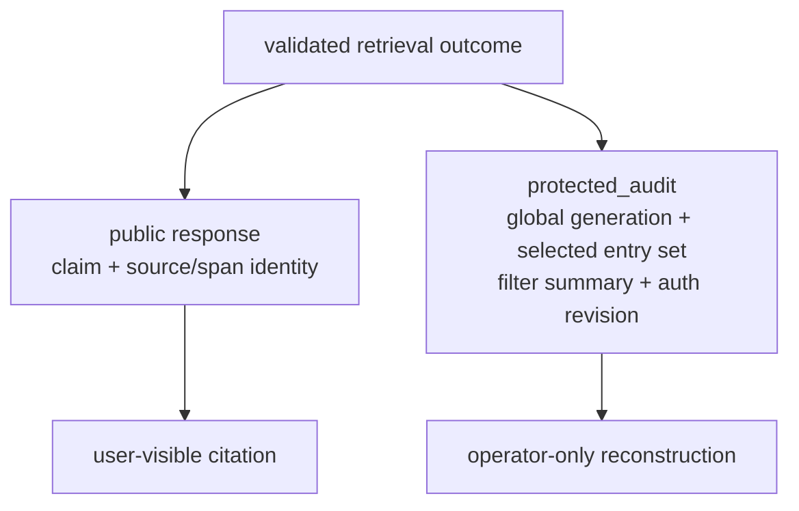
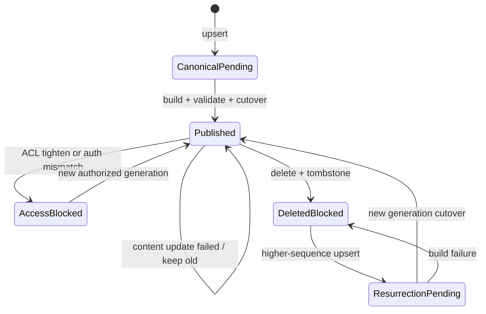

# Project: Offline Source-to-Citation Provenance

## Project goal

Lesson 8 verifies whether online-answering stages honor their contracts. This lesson continues upstream: can a claim be recomputed, layer by layer, from the index generation published for this request to an exact original-text span? After source updates, revocations, deletion, rebuilds, or projection tampering, can old citations be reused incorrectly?

The project uses only the Python 3 standard library to implement a narrow but complete Layer B teaching chain:

```mermaid
flowchart LR
    E["source event<br/>sequence + raw SHA-256"] --> C["canonical revision<br/>LF + NFC"]
    C --> P["parse revision<br/>parser + config"]
    P --> L["element<br/>exact character span"]
    L --> K["chunk<br/>content / retrieval dual representations"]
    K --> I["index entry<br/>retrieval hash + ACL"]
    I --> G["staged generation<br/>snapshot + tombstone + auth"]
    G -->|validation gate| U["published generation"]
    U --> R["ACL before score → lexical retrieval"]
    R --> Q["extractive claim + public citation"]
    Q --> V["protected generation binding<br/>and span reconstruction"]
```



It addresses lineage, integrity, and lifecycle contracts rather than a search-quality competition. Lexical scoring is only a deterministic candidate baseline; the project has no embeddings, ANN, LLM, network, or API key.

> [!important] What can be proved
> The fixture connector represents sources as exact UTF-8 strings. `raw_sha256` binds the UTF-8 bytes of the `content` field, not a PDF/Office container or raw HTTP response. Only UTF-8 Markdown, LF + NFC normalized text, and line-by-line exactly mappable headings/paragraphs declare `canonical-text-lf-nfc-char-v1` character spans. The project does not invent raw-byte spans for HTML cleaning, PDFs, OCR, table reflow, or visual extraction.
>
> Query tenant and `subject_groups` are still treated as inputs already resolved as trusted by the host. The project verifies only the match between a known `authorization_revision` and generation, ACL-before-score, and fail-closed behavior after revocation; it does not implement AuthN, tokens, a policy resolver, or proof of group membership.

## Why the four existing projects are not yet an end-to-end evidence chain

[[document-parsing/00-index|Document Parsing]], [[knowledge-base-construction/00-index|Knowledge Base Construction]], [[chunking-strategies/00-index|Chunking Strategies]], and [[rag/08-project-offline-cited-qa|Offline Cited Q&A]] each verify local contracts, but local green lights do not automatically establish cross-layer conclusions:

| Local capability | Still needs to be connected |
| --- | --- |
| raw hash and parser manifest | Whether element identity binds parser/config and exact span. |
| canonical revision, outbox, publication pointer | Whether chunk, index generation, and citations inherit one revision. |
| content/retrieval dual hashes | Whether old index records necessarily become invalid after title-context change. |
| claim-level fixture citations | Whether a citation can return to a real source location rather than a hand-authored fact label. |
| ACL, tombstones, and failed publication | Whether an old generation can resurrect after revocation, deletion, or a stale rebuild. |

This lesson does not replace those specialized projects. It uses an independent reference model to express their core invariants in one executable chain.

> [!warning] Conceptual reference model, not wire integration of four scripts
> This lesson is an independent end-to-end reference model. It does not directly import the Python modules from Document Parsing, Knowledge Base Construction, Chunking, or Lesson 8. The prerequisite projects verify the same classes of invariants, but their ID prefixes, revision types, coordinate spaces, and JSON schemas are not wire-compatible. Do not concatenate their outputs and claim that an evidence chain now exists.

| Prerequisite project | Current executable contract | Mapping boundary with this lesson |
| --- | --- | --- |
| Document Parsing | `parse_revision_sha256`, `elm_...`, `normalized-text-lines-1-based-inclusive-v1` | This lesson uses `par_...`, `el_...`, and half-open canonical character spans; a production adapter must convert explicitly and retain the original coordinate system. |
| Knowledge Base Construction | SQLite integer `revision_id`, current/published pointer, and search projection | This lesson uses content-derived `can_...` and a generation manifest; do not treat a database primary key as content identity. |
| Chunking | Fixture-provided element ID, lexical-unit interval span, separately derived `index_entry_id` | This lesson derives character spans from its own canonical elements; interoperability requires explicit element/coordinate mapping. |
| RAG Lesson 8 | Fixture fact/revision citations and `privileged_audit` | This lesson uses source-span citations and `protected_audit`; the enums belong to different schemas and must not be mixed. |

For production integration, define a versioned adapter schema and migration tests before connecting each layer's artifacts to one manifest. This lesson provides target invariants and counterexamples, not a completed cross-module adapter. The next lesson, [[rag/10-project-cross-layer-provenance-adaptation-and-atomic-publication|Cross-Layer Provenance Adaptation and Atomic Publication]], freshly calls the three existing modules and implements the first bridge. [[rag/11-project-external-provenance-artifact-v2|External Provenance Artifact v2]] then adds a complete protected bundle and independent consumer. Lesson 11 is not an automatic v1-artifact migrator for this reference engine, so the capability boundary “no external chunks imported into this lesson's provenance engine yet” remains.

## Identity and derivation contract

Every `H(...)` in this project is canonical JSON plus complete SHA-256 over a restricted JSON domain. To avoid float-representation differences between runtimes, the hashing domain accepts only `null`, booleans, integers, strings, arrays, and objects with string keys; it is not a general RFC 8785 implementation.

```text
canonical_revision_id
  = H(document identity + source version + raw/normalized hash
      + normalizer revision + ACL snapshot hash)

parse_revision_id
  = H(canonical revision + parser revision + parser config hash)

element_id
  = H(parse revision + kind + coordinate space
      + [char_start, char_end) + element text hash)

chunk_id
  = H(canonical/parse revision + chunker revision
      + element ID + content hash + ACL snapshot hash)

index_entry_id
  = H(chunk ID + retrieval hash + index revision + ACL snapshot hash)

index_generation_id
  = H(source snapshot + tombstone state + authorization revision
      + pipeline fingerprint + sorted entry-set hash)
```

Both `content_text/content_sha256` and `retrieval_text/retrieval_sha256` are retained. A title path may help retrieval, but a citation may cite only the normalized original-text span. Even if a chunk's business-identity policy chooses stability, a changed retrieval representation gets a new `index_entry_id`; old vector or lexical records must not be silently reused.

W3C PROV provides general vocabulary for entities, activities, agents, and derivation. This project can view source/canonical/element/chunk/index/claim as entities and normalize/parse/chunk/index/retrieve as activities. That is a modeling correspondence, not a claim that one SHA-256 field automatically fulfills governance, signing, or cross-organization trust requirements.

## Public citations and protected audit are two projections

Public citations retain the source URI/version, raw hash, canonical/parse/element/chunk/entry identities, and half-open character span needed for user verification. Global `index_generation_id`, `selected_entry_ids`, and aggregate `filter_summary` appear only in `protected_audit`; the project does not persist complete visible/retrieved/ranked candidate sets:



Therefore, after adding and publishing a document the current principal cannot read, the public response remains byte-identical so long as the original evidence did not change; the changed global generation is visible only in protected audit. If a product chooses to publish global snapshot versions, write the ability to infer update times or corpus changes into its threat model instead of treating an opaque ID as proof of no disclosure.

Before returning every claim, recompute:

1. Its citation's `index_entry_id` must be in the audit's selected entry set for this request.
2. The generation named by audit must still be the current published pointer; after a new-generation cutover, the old generation is explicitly `superseded` and an old citation cannot authenticate itself.
3. The entry must bind canonical/parse/element/chunk and ACL snapshot.
4. `[char_start, char_end)` must be inside the declared canonical coordinate space.
5. The validator recomputes visible candidates, filter summary, and top-k from the trusted query, current ACL, and lexical rules; it cannot trust an audit's self-reported selected set.
6. Original text sliced from canonical text must exactly equal the claim, and the span SHA-256 must agree.
7. `trace_id` must be recomputed from trusted runtime query, status, and claims.

This project's deterministic `trace_id` hashes the full teaching runtime query and therefore indirectly binds tenant, groups, and authorization revision. It serves only offline tamper recomputation and cannot be a public production request ID. A production system should generate a random opaque ID that cannot derive authorization context, keep principal/authorization bindings only in protected audit, and apply access control, redaction, and retention to audit storage.

SHA-256 establishes consistency inside one trusted pipeline; it does not provide cross-service authentication. Persisting a manifest across a trust boundary also needs a MAC, digital signature, or equivalent attestation and protection for keys and verifiers.

## Publication, update, revocation, and deletion

`current canonical revision` and `published generation` are two states. A failed content build and tightened authorization cannot use the same availability policy:

| Event | Query behavior before cutover | Publication gate |
| --- | --- | --- |
| First upsert | Not retrievable. | Visible only after a complete staged generation passes. |
| Replay of the same event | no-op | Does not create a new revision. |
| Higher sequence, same state | Advance checkpoint only. | Does not fabricate a new content version. |
| Content update, ACL unchanged | Old published revision can continue serving. | Atomically cut over after the new generation is complete. |
| ACL tightening | Old generation immediately fails closed. | Restore by new groups only after the new ACL projection publishes. |
| delete | Old entry immediately becomes invisible. | Tombstone must enter the new generation state. |
| Resurrection after delete | Remains blocked before new publication. | Must use a higher sequence. |
| Authorization-revision rotation | Generation/auth mismatch fails closed. | Rebuild and publish with the new authorization revision. |
| Stale-snapshot rebuild | Must not cut over. | Snapshot/tombstone-hash mismatch is `BLOCK`. |

`event_id` is also non-rebindable delivery identity: replaying the same ID with the same typed event is `noop`; binding that ID to a different tenant/document/sequence/content/ACL fails. Once the in-memory deduplication window reaches 10,000 IDs, it stops accepting new events rather than silently forgetting old identity. A production implementation should persist event fingerprints, retention, archival, and rotation policy, and make window exhaustion an observable operations event.



## Project files

| File | Purpose |
| --- | --- |
| [[rag/examples/provenance/offline_provenance_pipeline.py\|offline_provenance_pipeline.py]] | Strict fixture, identity derivation, generation-publication gates, retrieval, citation recomputation, reconciliation, and CLI. |
| [[rag/examples/provenance/provenance-fixture.json\|provenance-fixture.json]] | Two tenants, public/private ACLs, malicious strings, runtime queries, and independent oracles. |
| [[rag/examples/provenance/provenance-artifact.schema.json\|provenance-artifact.schema.json]] | JSON Schema 2020-12 structural contract for evaluation artifact v2; it does not verify authenticity. |
| [[rag/examples/provenance/test_offline_provenance_pipeline.py\|test_offline_provenance_pipeline.py]] | 72 tests for input resource limits, Unicode/identity, spans, lifecycle, integrity, external type/route/failure/artifact tampering, non-disclosure, reports, and CLI. |

## Run the project

Run from this project root:

```powershell
$env:PYTHONDONTWRITEBYTECODE = '1'  # Prevent provenance-chain experiments from creating __pycache__.
$env:PYTHONIOENCODING = 'utf-8'  # Pin CLI encoding so output and JSON can be reread reproducibly.
$script = '.\docs-EN\rag\examples\provenance\offline_provenance_pipeline.py'  # Store the Lesson 9 provenance-pipeline script path.
$fixture = '.\docs-EN\rag\examples\provenance\provenance-fixture.json'  # Store this project's independent strict provenance fixture.

python -B -W error $script --fixture $fixture demo  # Run every built-in source/citation/publication scenario.
python -B -W error $script --fixture $fixture ask --query-id Q-refund  # View the public citation projection.
python -B -W error $script --fixture $fixture inspect --query-id Q-refund --operator-view  # View the refund case's protected trace.
python -B -W error $script --fixture $fixture manifest --operator-view  # View generation, authorization, and publication diagnostics.
python -B -W error $script --fixture $fixture evaluate  # Run normal trusted recomputation and generate a PASS artifact.
python -B -W error $script --fixture $fixture evaluate --failure retrieval_unavailable  # Inject a fault and verify BLOCK prevents publication.
```

Normal `evaluate` outputs `PASS` and returns `0`; injected retrieval failure outputs `BLOCK` and returns `1`. `ask/demo` output only public projections; `inspect --operator-view` shows the protected teaching trace and `manifest --operator-view` shows generation, authorization, and publication diagnostics. Both flags are safeguards against teaching misuse, not authentication.

## Run regression in four interpreter modes

```powershell
$tests = '.\docs-EN\rag\examples\provenance'  # Point to the provenance project's adjacent unit-test directory.

python -B -m unittest discover -s $tests -p 'test_offline_provenance_pipeline.py' -v  # Run all 72 provenance-chain tests verbosely in normal mode.
python -O -B -m unittest discover -s $tests -p 'test_offline_provenance_pipeline.py'  # Verify checks do not depend on assert in optimized mode.
python -B -W error -m unittest discover -s $tests -p 'test_offline_provenance_pipeline.py'  # Surface runtime warnings in warnings-as-errors mode.
python -O -B -W error -m unittest discover -s $tests -p 'test_offline_provenance_pipeline.py'  # Run optimized + strict-warning together.
```

Tests cover:

- JSON duplicate keys, non-finite values, escaped lone surrogates, bool-as-int, unknown fields, file/depth/source/query/top-k/list limits, ACL order, and raw hashes;
- parser configuration, source spans, duplicate-sentence disambiguation, content/retrieval/index/generation identities;
- no-op, non-rebindable event IDs, deduplication-window exhaustion, checkpoints, sequence conflict, stale events, failure survival, and atomic cutover;
- immediate ACL blocking, deletion tombstones, resurrection waiting, stale snapshots, and authorization revision;
- canonical, projection, claim, span, source hash, selected-entry, and trace tampering;
- pairwise exchanges of two tenants' entries whose self-reported tenant/document routing fields must also fail; an entry must rebind the canonical revision's logical document and ACL rather than merely validate a self-reported hash;
- `retrieval_unavailable` and `authorization_snapshot_mismatch` must each match fixed status, empty claim/selected set, and filter summary; failure branches cannot insert old answers or low-relevance citations to bypass trusted recomputation;
- runtime/oracle isolation, unauthorized-corpus noninterference, and public/audit field separation;
- dual binding to raw-fixture SHA-256 and typed-fixture-model SHA-256; a loaded in-memory object that changes must be revalidated;
- evaluation artifact v2 binds both raw and typed fixture models and exactly validates case fields, types, unique queries, failure codes, and counts; CLI exit codes are in regression.

> [!warning] Schema, self-checks, and trusted evaluation are not the same
> JSON Schema and `validate_artifact()` check only structure and internal consistency. If an attacker can rewrite cases and recompute a keyless `artifact_sha256`, the self-hash does not establish the oracle, current evidence, or producer identity. A release gate must rerun `evaluate_fixture()` in a trusted environment; crossing a trust boundary additionally needs a MAC, signature, or equivalent attestation.

Passing under `-O` proves only that critical validation does not depend on bare `assert` statements that optimization removes. Passing under `-W error` proves only that current paths have no unhandled warnings. Neither is a formal proof or production load test.

## Do not overclaim from experiment results

### Verified

- Within the declared input domain, claims can be recomputed to exact canonical spans.
- Parser/configuration, chunk representation, ACL, index revision, and generation state each enter the identity chain.
- Failed content updates can retain the old version; revocation and deletion block old projections immediately.
- Stale snapshots, expired authorization revisions, and projection/source tampering fail closed.
- Tenant/ACL executes before relevance scoring; changes to unauthorized corpus material do not change public response.
- Fixture oracles do not enter runtime queries.

### Not verified

- Exact mapping from PDF/OCR/HTML/Office to raw bytes, pages, bounding boxes, or DOM selectors.
- Real vector indexes, embedding drift, distributed outbox, concurrent cutover, and cache invalidation.
- IdP, hierarchical roles, deny, ABAC, token audience, policy decision points, and object-level authorization.
- LLM claim splitting, semantic entailment, conflicting-fact synthesis, or prompt-injection robustness.
- Physical erasure in object storage, backups, logs, and third-party indexes.
- Cross-service signatures, key rotation, transparency logs, or hardware attestation.

> [!warning] A malicious string is not proof of injection defense
> The fixture's “ignore system instructions” is extracted only as untrusted document data. Because this project never calls an LLM, it proves only that the string does not enter control fields; it cannot prove a real model will ignore indirect prompt injection. Before entering a model, sources still need trust assessment, content isolation, least privilege, output validation, and reauthorization of the next action.

## Production extension order

1. Extend `source_uri + char span` to a media-specific locator union: page/text layer, DOM selector, JSON Pointer, CSV row/column, or bbox; every adapter declares its coordinate space separately.
2. Put canonical, parse, chunk, and generation manifests into immutable object storage; databases retain only state and publication pointers.
3. Put generation builds in isolated workers using transactional outbox, idempotent jobs, and compare-and-swap publication.
4. Bind authorization snapshots to real policy decision points, principal, resource, tenant, and token audience; permission changes trigger immediate blocking and rebuilds.
5. Establish entry manifests, deletion confirmation, and sampled reconciliation separately for keyword, vector, graph indexes, and caches.
6. Connect traces, metrics, and logs to one pipeline/generation/evidence identity; external logs still apply data minimization.
7. Establish independent control planes for signed manifests, key management, retention, legal hold, and physical erasure.

## Relationship to other knowledge bases

| Knowledge base | How this lesson connects |
| --- | --- |
| [[document-parsing/00-index\|Document Parsing]] | raw hash, parse revision, element identity, and location contract |
| [[knowledge-base-construction/00-index\|Knowledge Base Construction]] | source sequence, canonical revision, publication pointer, ACL, and tombstones |
| [[chunking-strategies/00-index\|Chunking Strategies]] | original/retrieval dual representation, element span, and index-entry invalidation identity |
| [[rag/05-citations-generation-and-abstention\|Citations, Generation, and Abstention]] | upgrades claim-level citations from labels to recomputable source spans |
| [[rag/07-end-to-end-evaluation-and-monitoring\|End-to-End Evaluation and Monitoring]] | evaluation artifact binds snapshot, tombstone, auth, and index manifest |
| [[ai-safety/00-index\|AI Safety]] | untrusted sources, unauthorized retrieval, poisoning, revocation, and deletion propagation |
| Observability | correlates traces, metrics, and logs through generation/evidence identity |

## Main references

- [W3C PROV Overview](https://www.w3.org/TR/prov-overview/) and [PROV-O](https://www.w3.org/TR/prov-o/): provenance entities, activities, agents, and derivation relationships.
- [OWASP LLM08:2025 Vector and Embedding Weaknesses](https://genai.owasp.org/llmrisk/llm082025-vector-and-embedding-weaknesses/): trusted sources, permission-aware stores, multi-tenant disclosure, and poisoning boundaries.
- [OWASP LLM01:2025 Prompt Injection](https://genai.owasp.org/llmrisk/llm01-prompt-injection/): external documents as carriers of indirect injection.
- [OpenTelemetry Signals](https://opentelemetry.io/docs/concepts/signals/): boundaries among traces, metrics, logs, and baggage.
- [SLSA Build Provenance v1.2](https://slsa.dev/spec/v1.2/build-provenance/): the software-supply-chain model of subject, build definition, and run details. This lesson borrows only the analogy that derived artifacts bind build inputs; it does not equate document citations with software-build provenance.
- [JSON Schema Draft 2020-12](https://json-schema.org/draft/2020-12): a machine-readable structural contract for evaluation artifacts.

Sources accessed: 2026-07-22. This page is an original teaching implementation and synthesis; it does not reproduce third-party tutorials, code, or diagrams. External specifications define terminology and boundaries, and dynamic pages/versions must be reverified in production implementation.
