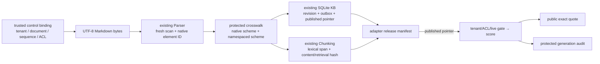
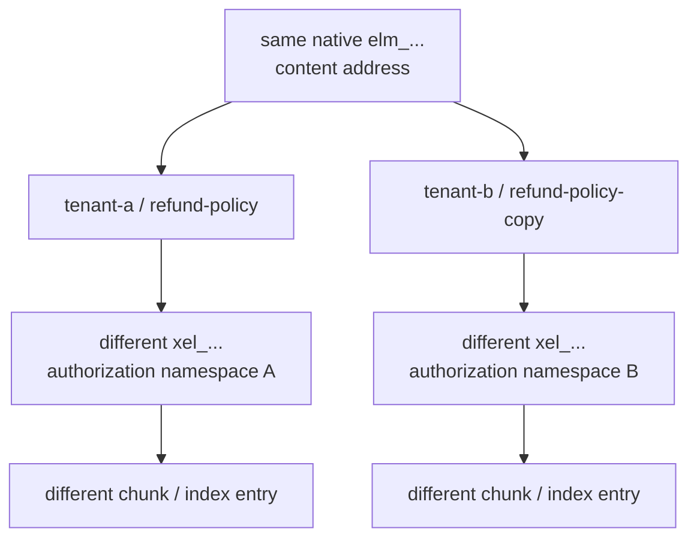
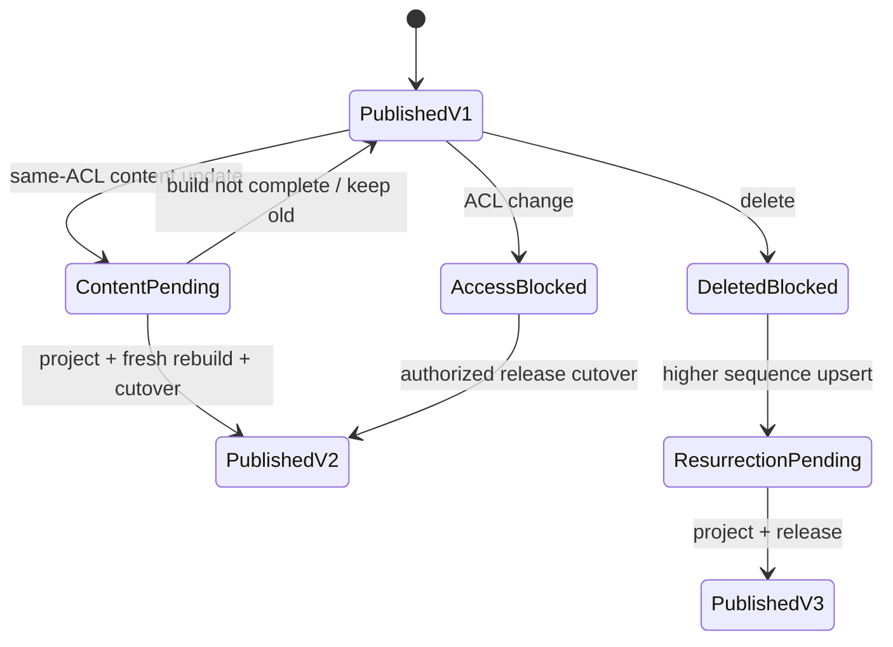

# Project: Cross-Layer Provenance Adaptation and Atomic Publication

## Project goal

Lesson 9 uses an independent reference model to establish invariants for source-to-citation provenance, but explicitly does not concatenate the four existing projects. This lesson takes the next step: freshly call the existing [[document-parsing/00-index|Document Parsing]], [[knowledge-base-construction/00-index|Knowledge Base Construction]], and [[chunking-strategies/00-index|Chunking Strategies]] modules; use a versioned adapter to supply logical identity, coordinate crosswalk, release generation, and query gates; and then generate an honest extractive citation.



> [!important] This is not a “field renamer”
> The three native modules define identity, coordinates, and publication differently. The adapter rereads, reparses, rechunks, and recomputes IDs; no artifact earns trust merely because it carries its own hash. The fixture is a teaching stand-in for an offline connector and control-plane binding, not a production message protocol.

## Audit the real contracts first

Before implementing this lesson, the four existing projects received a read-only audit and their `26 + 31 + 32 + 62 = 151/151` tests were run separately. Each project is locally coherent, but no safe wire contract exists:

| Layer | Native contract | Why it cannot connect directly |
| --- | --- | --- |
| Parser | raw-bytes SHA-256; `normalized-text-lines-1-based-inclusive-v1`; `elm_...` | Its manifest has no tenant, logical document, sequence, ACL, or full canonical text; identical bytes yield the same element ID. |
| Knowledge Store | `SourceRecord`, SQLite integer revision, outbox, published pointer | A revision primary key is not a cross-database content identity; records lose raw/parser lineage. |
| Chunking | Lexical-unit `[start, end)` inside a parser element; content/retrieval dual representation | It has no output schema or corpus-wide generation; headings are not body kind; element IDs are used as global keys. |
| Lesson 9 provenance | LF+NFC full-text Python-char `[start, end)`; independent generation | It reparses and rechunks by itself; its `chk_/idx_` preimage differs from the Chunking project. |

Therefore this lesson does not infer identity from an `elm_`, `chk_`, or `idx_` prefix. Object references interpretable across modules in citations and crosswalks retain `{scheme, value}`. Local SQLite locators, old capture rows, and this lesson's v1 audit still contain bare values meaningful only in their own schemas. Same prefix with a different scheme or preimage means a different object; v1-local fields must not be written as though they were already unified global wire identity.

## Control plane and data plane roles

A parser's content address cannot answer “whose document is this, and who may read it?” Every fixture source explicitly supplies:

- `tenant_id + document_id + source_sequence`;
- `source_uri + source_version`;
- `connector + upstream_event_id + run_id`;
- `media_type + relative_path + root_section_path`;
- sorted, unique, non-empty `allowed_groups`;
- inline UTF-8 Markdown `content` solely for offline demonstration.

These control fields are not inferred from document body, filename, or parser manifest. Adapter v1 accepts only strict UTF-8 Markdown without a BOM. It preserves the caller-provided absolute source root; before every `resolve()`, it rejects existing symlinks in root/source/parent components, then checks containment after resolution. It also does not fan one file out to multiple logical objects by default. This Python 3.11 gate covers symlinks only; it does not claim to validate NTFS junction/reparse points or hard links.

> [!warning] The fixture is not a general source-event schema
> To permit one-file offline execution, the fixture carries both control binding and body text. A production connector should separate immutable blobs, event envelopes, authorization snapshots, and run audit, and establish independent controls for message authenticity, replay, retention, and keys.

Before semantic validation, the adapter's fixture boundary limits input to 2,000,000 UTF-8 bytes and JSON nesting depth 64; it rejects duplicate keys, non-finite values, floats, and JSON-escaped lone surrogates. `content` is separately limited to 100,000 UTF-8 bytes, and read errors report only error type, not a local path. These values serve fail-closed offline teaching behavior, not production throughput, queue, or decompression budgets.

## Native-ID collision and namespaced crosswalk

A parser element ID's preimage includes content, location, and parse revision but not tenant or logical document. The fixture intentionally gives tenant A and tenant B byte-identical documents: their native parser element IDs are the same, which is reasonable for content addressing but cannot be authorization-object identity.

The adapter additionally derives:

```text
xsrc = H(id_scheme + tenant_id + document_id)

xel = H(id_scheme + tenant_id + document_id
        + knowledge_revision_fingerprint + native_parser_element_id)
```

Headings remain in the crosswalk with relationship `context_only`; paragraphs, list items, and code blocks are projected as `projected_as_body`. Only when a body lacks parser `section_path` does the adapter use `root_section_path` from trusted control binding; it never silently invents a section. The release manifest stores both a local SQLite revision locator and a KB revision fingerprint recomputable across databases, and binds control/crosswalk hash, raw/parser records, chunk/index-entry set, and pipeline fingerprint. An autoincrement key must not be mistaken for content identity.



## Coordinate conversion must be honest

The three coordinate systems cannot be converted losslessly by default:

- Parser: normalized-text line numbers, 1-based and inclusive at both ends.
- Chunking: lexical units inside a parser element, 0-based and right-open.
- Lesson 9 provenance: LF+NFC full-text Python characters, 0-based and right-open.

The Markdown parser removes heading/list/fence markers and collapses whitespace in multi-line paragraphs, so “line number → full-text character offset” is usually not a function. This lesson's citation retains:

- native parser line locator;
- lexical-unit `[unit_start, unit_end)` inside the namespaced element;
- `exact + prefix + suffix` and a hash reconstructable from the immutable parser element;
- `canonical_char_mapping.mapping_status = unavailable`;
- reason `parser_projection_is_not_one_exact_canonical_span`.

The `exact/prefix/suffix` design draws on W3C `TextQuoteSelector`. W3C also defines a 0-based, right-open `TextPositionSelector` and cautions that position selectors are fragile when documents change. This lesson emits no W3C JSON-LD and claims no conformance. Only after a parser projection is verified as an exact slice of the canonical source may a future version upgrade mapping to `verified`.

## Release generations, not layered immediate visibility

The KB has a per-document published pointer; Chunking itself has no generation. The adapter therefore establishes a corpus-wide release manifest and one published pointer:



Every query starts from the published release pointer and rechecks KB live state before scoring:

| Change | Adapter query behavior |
| --- | --- |
| Same-ACL content update is not yet projected. | Continue serving the old release. |
| KB switched to a new revision but adapter has not published. | The old release cannot see that document, preventing split brain. |
| ACL change | KB `access_blocked` immediately makes the old release fail closed. |
| delete | `deleted + access_blocked` immediately makes the old release fail closed. |
| Resurrection is not completely published. | Remains invisible. |
| stale capture | Release pointer cannot switch. |

This remains an `offline-single-process-no-concurrent-readers` teaching implementation. Production cutover needs transactions, CAS, or equivalent synchronization primitives; Python in-memory assignment is not distributed atomic publication.

## Public response and protected audit

A public response contains only `query_id/status/claims/trace_id`. Every extractive claim has a citation containing document version; raw/parser/KB/chunk/index identities; native line locator; element lexical span; and quote selector. Global generation, selected entry IDs, authorization version, layer-by-layer filter counts, and failures appear only in `protected audit`. The v1 fixture's `source_uri` is an approved teaching locator. Real URI/connector locators may contain private paths, query parameters, or upstream identity and must first be classified, minimized, and redacted; never place them verbatim into a public citation without approval. Lesson 11 puts such raw locators in host-owned protected audit as a migration direction.

Unauthorized documents are removed before scoring; changing a source that another tenant or principal cannot access must not change the same authorized query's public response. `retrieval_unavailable` produces `dependency_unavailable`; it is not disguised as “no answer.” The evaluator reruns retrieval from trusted runtime query and current publication state; it cannot trust audit's self-reported selected set or failure.

> [!important] Capability label
> The release manifest always declares `evidence_level: document-revision-bridge` and `external_chunk_to_citation_verified: false`. This lesson's extractive citation can return to a protected parser element, line locator, and lexical quote, but Lesson 9's provenance engine is still an independent reparse branch and cannot import this lesson's external chunk artifact. The two must not be described as the same evidence object because both use `chk_/idx_` prefixes.

After fresh generation validation, `export_external_provenance_bundle()` exports a complete protected payload for the next lesson, [[rag/11-project-external-provenance-artifact-v2|External Provenance Artifact v2]], to import across a strict JSON boundary. The consumer recomputes this lesson's producer document snapshot from transported evidence. Because the bundle lacks a complete producer release manifest containing local KB locators, its digest can only be labeled `opaque-producer-reference-only`; it must not pose as closure verified by the consumer. This new consumer establishes bundle round-trip, route closure, and local publication state machine, not an importer for Lesson 9's reference engine. Therefore the v1 manifest capability labels remain unchanged and no `unavailable` canonical mapping is silently upgraded.

## Project files

| File | Purpose |
| --- | --- |
| [[rag/examples/integration/cross_layer_adapter.py\|cross_layer_adapter.py]] | Imports real Parser/KB/Chunking; fresh rebuild; crosswalk; release; retrieval; citation; audit; evaluation CLI; and protected v2 exporter. |
| [[rag/examples/integration/cross-layer-fixture.json\|cross-layer-fixture.json]] | Two tenants, byte-identical sources, public/restricted ACLs, and independent oracles. |
| [[rag/examples/integration/cross-layer-eval-artifact.schema.json\|cross-layer-eval-artifact.schema.json]] | Structural contract for this lesson's local evaluation artifact; it is not the current LLMOps example's wire input and does not verify authenticity. |
| [[rag/examples/integration/test_cross_layer_adapter.py\|test_cross_layer_adapter.py]] | 37 regressions for strict JSON/resource limits, paths/symlinks, cross-layer rebuild, authorization, sidecar replay/checkpoint, tampering, lifecycle, failures, and CLI. |

## Run the project

Run from the project root:

```powershell
$env:PYTHONDONTWRITEBYTECODE = '1'  # Prevent cross-layer adapter runs from leaving __pycache__.
$env:PYTHONIOENCODING = 'utf-8'  # Pin CLI UTF-8 output for inspection.
$script = '.\docs-EN\rag\examples\integration\cross_layer_adapter.py'  # Store the real three-module adapter script path.

python -B -W error $script demo  # Run built-in cross-layer cases and output a public aggregate summary.
python -B -W error $script ask --query-id q-tenant-a-refund  # Execute tenant-a's public answering path.
python -B -W error $script inspect --query-id q-tenant-a-refund --operator-view  # View protected crosswalk/trace in local teaching.
python -B -W error $script manifest --operator-view  # View protected manifests for pending and published generations.
python -B -W error $script evaluate --operator-view  # Run fresh rebuild and trusted pre-publication evaluation.
python -B -W error $script evaluate --operator-view --failure retrieval_unavailable  # Simulate unavailable retrieval and confirm the release gate returns BLOCK.
```

Normal `evaluate` outputs `PASS` and returns `0`. Fault injection outputs `BLOCK` and returns `1`; that is expected release blocking, not a script crash. `ask` and `demo` output only a public projection/aggregate summary. `inspect`, `manifest`, and `evaluate` must explicitly receive `--operator-view` because the latter two contain release or offline-oracle diagnostics. The flag only prevents teaching misuse; it is not AuthN/AuthZ.

Run regression in four interpreter modes:

```powershell
$tests = '.\docs-EN\rag\examples\integration'  # Point to the adapter's adjacent unittest directory.

python -B -m unittest discover -s $tests -p 'test_cross_layer_adapter.py' -v  # Run all 37 cross-layer-adapter regressions verbosely in normal mode.
python -O -B -m unittest discover -s $tests -p 'test_cross_layer_adapter.py'  # Check optimized mode does not rely on bare assert.
python -B -W error -m unittest discover -s $tests -p 'test_cross_layer_adapter.py'  # Find hidden runtime problems under strict warnings.
python -O -B -W error -m unittest discover -s $tests -p 'test_cross_layer_adapter.py'  # Cover the strictest interpreter combination.
```

The acceptance baseline is 37/37. A forged but internally self-consistent parser record must be rejected by fresh reparse, and the old pointer, old generation state, and generation set must remain unchanged. `revision_inputs` locates a KB revision by sequence/URI/version/content/ACL/run binding; checkpoint/noop/stale candidates must not overwrite or delete a protected sidecar of the old published revision.

## How to read evaluation results

A normal artifact binds raw-fixture SHA-256, typed-fixture-model SHA-256, pipeline fingerprint, KB capture, index generation, release manifest, and harness revision together. It is this lesson's protected evaluation output and must not become a requester API response; its expected/forbidden oracle fields aid review but could disclose evaluation slices. It is also not a wire input for the current LLMOps release gate: their digest profile, fields, and trusted-recomputation boundary have not been aligned through a versioned adapter. JSON Schema performs only cross-language structural checks. Trusted `evaluate()` reruns the current pipeline, freshly rebuilds native parser/chunk IDs, database body/ACL/search projection, citation quote, and trace, then generates the artifact. `validate_artifact()` validates only an existing artifact's shape, counts, duplicate queries, and self-hash consistency; an attacker who rewrites results together with a keyless hash still cannot independently recover fixture oracles. The three are not substitutes, and a self-hash is not proof of MAC, signature, or provenance authenticity.

Key acceptance questions include:

- Byte-identical cross-tenant documents share a native element ID but have different adapter element/chunk/index IDs.
- A heading is retained as `context_only` and cannot disappear during transformation.
- Line, lexical-unit, and canonical-character coordinate schemes are not mixed.
- Tenant, live state, and ACL execute before relevance scoring.
- Unauthorized-corpus changes do not affect a public projection.
- Tampering with content/retrieval/chunk/index/crosswalk/KB/search/generation cannot pass merely by synchronizing a self-reported hash.
- A same-ACL pending update keeps the old release alive; ACL/delete deny immediately; resurrection waits for a new release.
- Fixture oracle does not enter runtime query, and a failure gate must `BLOCK`.

## What is not currently verified

- page/bbox/DOM/byte locators for PDF, Office, HTML, OCR, tables, or visual regions;
- an external parsed/chunk-artifact importer for Lesson 9's provenance engine;
- embedding, ANN, reranker, or LLM claim entailment;
- distributed outbox, concurrent readers, cross-process cutover, cache invalidation, and rebuild rollback;
- TOCTOU defense against adversarial concurrent path replacement; production needs handle-relative no-follow/openat-class primitives rather than “check then open”;
- Windows NTFS junction/reparse points, mount redirects, and hard-link boundaries. Python 3.11 lacks `Path.is_junction()`; production should upgrade and explicitly reject reparse/junction points, or use an exclusive temporary root that low-trust principals cannot modify;
- real IdP, token audience, deny/ABAC, policy decision points, and authorization proof;
- manifest MACs, digital signatures, transparency logs, key rotation, or hardware attestation;
- detection of malicious rewrite after leaving the trusted fixture/pipeline using artifact self-hash alone;
- physical deletion in backups, object storage, logs, and third-party indexes.

## Production extension order

1. Split fixture control binding into signed source event, immutable blob, and authorization snapshot, and define a delete union.
2. Serialize protected revision input, parser crosswalk, chunk artifact, and release manifest into immutable storage; retain schemes for every ID.
3. Define a locator union and validator for each media type; publish verified character/page/bbox mappings only when an exact source slice passes.
4. Add an external artifact importer to the provenance engine and raise capability labels only after parser/chunk/citation round-trip validates.
5. Use transactional outbox + isolated builder + CAS pointer for concurrency-safe cutover; ACL/delete use an independent live-deny plane.
6. Put entry set, deletion confirmation, rollback, and sampled reconciliation for sparse/dense/graph/cache into the release gate separately.
7. Sign manifests across trust boundaries and manage keys; pin canonicalization protocol versions and test vectors.

## Main references

- [W3C Web Annotation Data Model](https://www.w3.org/TR/annotation-model/): `TextQuoteSelector`'s `exact/prefix/suffix`, and `TextPositionSelector`'s 0-based right-open semantics. This lesson borrows selector ideas only and claims no JSON-LD conformance.
- [W3C PROV-O](https://www.w3.org/TR/prov-o/): vocabulary for source modeling through entity, activity, generation, and derivation. This lesson uses hash-derived chains for local consistency and does not claim full PROV-O serialization.
- [RFC 8785: JSON Canonicalization Scheme](https://www.rfc-editor.org/rfc/rfc8785.html): an Informational RFC that explains why hashes/signatures need stable representations. This project implements only a restricted JSON domain and is **not** a full JCS implementation.
- [JSON Schema Draft 2020-12](https://json-schema.org/draft/2020-12): an exchangeable structural contract for evaluation artifacts.

Sources checked: 2026-07-22. The W3C Web Annotation Data Model remains a stable Recommendation; implementation must still pin this project's schema, normalizer, parser, chunker, and canonicalization revisions and run local migration/tamper tests.
