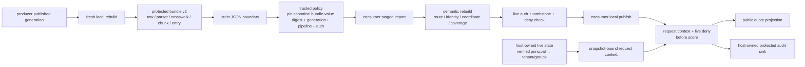
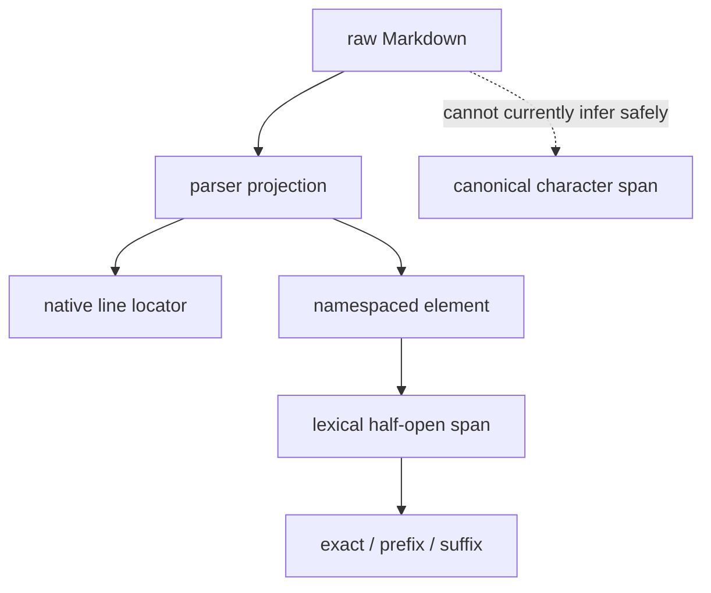
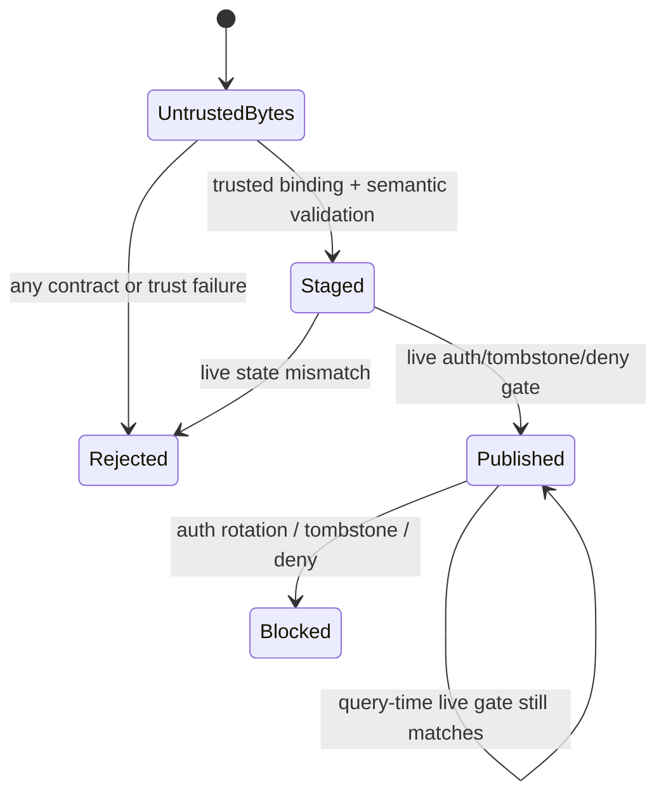

# Project: External Provenance Artifact v2

## Project goal

Lesson 9 establishes an independent source-to-citation reference model, and Lesson 10 freshly calls the real Parser, Knowledge Store, and Chunking modules. Their CLI manifests, however, are only digests and cannot let another process independently rebuild evidence relationships. This lesson adds an explicit cross-boundary contract: a producer exports a complete protected bundle; only after strict JSON, out-of-band trusted binding, semantic rebuild, and live deny checks may a consumer switch its own local publication pointer.



The important conclusion is not “add another SHA-256,” but separating four different questions:

1. Does wire text/bytes conform to a parseable versioned structure?
2. Can internal artifact relationships be rebuilt from bodies and versioned algorithms?
3. Is the parsed canonical JSON value exactly the object approved by a trusted control plane?
4. Even if approved in the past, do current authorization, revocation, and deletion still permit local publication and querying?

Passing any one layer cannot replace the other three.

## Why a v1 manifest cannot be imported directly

| Existing artifact | What it binds | Missing cross-process payload |
| --- | --- | --- |
| Lesson 9 generation manifest | snapshot, tombstone, auth, pipeline, entry-set digest | complete source/canonical/element/chunk/index rows |
| Lesson 9 evaluation artifact v2 | fixture, harness, case verdict, self-hash | not a publication artifact and carries no rebuildable body |
| Lesson 10 release manifest | digest hashes for document, crosswalk, parser, KB, entry set | raw/canonical text, parser record, crosswalk rows, chunk and entry payload |
| Lesson 10 capture | KB document/outbox/tombstone state | parser sidecar, cross-coordinate mapping, chunk body, and retrieval representation |

Do not “guess back” missing fields from these digests, or call a JSON array of existing `chk_` and `idx_` values a wire contract. A prefix is not an identity scheme; the same prefix with a different preimage is a different object.

## Three validation layers and one live gate

| Layer | How this project validates | What it can establish | What it cannot establish |
| --- | --- | --- | --- |
| Structure and self-consistency | strict JSON, exact fields, types/limits, payload self-hash | Parsed value is internally consistent under this schema and restricted canonical JSON domain. | Producer identity, source authenticity, approval state. |
| Trusted external binding | `TrustedImportPolicy` pins canonical bundle-value digest, generation, pipeline, and auth out of band. | Current semantic object matches the object approved by trusted control plane. | Original wire-byte representation or signer identity without an additional transport digest/signature/CAS/transparency log. |
| Semantic rebuild | Recompute raw/canonical/parser/KB/element/chunk/index identities and complete coverage. | Artifact derivation relationships honor the currently accepted algorithm contract. | Real connector, IdP, physical deletion, or correctness of human oracle. |
| live gate | Recheck auth revision, tombstone, and blocked documents at local publication and every query. | Old artifacts cannot bypass current revocation/deletion. | Distributed consistency without real transactions/CAS. |

> [!warning] A self-hash is not an attestation
> The bundle fixes `attestation.mode: none` and `trust_scope: self-consistency-only`. An attacker who can change an artifact can recompute its keyless hash. This project demonstrates an “out-of-band binding” interface with a trusted canonical bundle-value digest supplied by tests. Pretty and compact JSON that parse to the same value produce the same digest, so this is not exact wire-byte pinning. The project implements no signature, MAC, DSSE, certificate, key rotation, or transparency log; constructing a policy inside a test process is not real cross-organization trust.

## Bundle root contract

`external-provenance-bundle-v2` is a protected artifact, not a user-visible citation or evaluation report. Its root object strictly contains:

| Field | Purpose |
| --- | --- |
| `schema_version` | Pins the major wire contract; unknown versions and downgrade are rejected by default. |
| `canonicalization_revision` | Pins this project's restricted canonical JSON domain; it is not a complete RFC 8785 implementation. |
| `producer_contract` | Parser, normalizer, mapping, chunk, index, ID, and coordinate schemes. |
| `authorization_contract` | Auth revision, ACL-before-score, and consumer live-check requirements. |
| `documents[]` | Source event, inline raw/canonical text, ACL snapshot, parser record, KB revision, adapter elements, and crosswalk. |
| `chunks[]` | Complete chunk representation, dual hashes, overlap, section, ACL, and element spans. |
| `index_entries[]` | Explicit tenant/document/source/revision/chunk/index/retrieval/access routing. |
| `release` | Generation, capture/tombstone/auth/pipeline, document/entry closure, and publication mode. A producer manifest without body text remains only an explicit `opaque-producer-reference-only` reference. |
| `integrity` | Payload self-hash and an honest no-attestation declaration. |

JSON Schema 2020-12 supplies a structural contract for cross-language consumers. The Python importer then performs semantic checks that JSON Schema expresses poorly—ordering, relationships, hash preimages, fresh parser/chunk rebuild, and state machine. Both must pass.

`strict_json_loads()` reads wire text first as strict UTF-8 bytes with 32 MB and 64-container-depth limits, then rejects duplicate keys, nonstandard/non-finite values, floats, and JSON-escaped lone surrogates (including object keys). Only then does it calculate the trusted canonical bundle-value digest, so malformed text cannot become bare `UnicodeEncodeError` during hashing, sorting, or logging. These boundaries constrain the teaching consumer only; they do not replace production connection size, streaming parse, decompression, or queue budgets.

## Documents, elements, and crosswalks

Every document stores three identities at once:

```text
logical_source_id = {scheme: ai-agent-engineer/logical-source/v1, value: xsrc_...}
parser element    = {scheme: document-inspector/element/v2, value: elm_...}
adapter element   = {scheme: ai-agent-engineer/namespaced-parser-element/v1,
                     value: xel_...}
```

Byte-identical documents can share a native `elm_...`, but with distinct tenant/document/KB revision, their namespaced `xel_...`, chunks, and entries must also differ. A consumer does not infer scheme from a prefix and validates the unique path:

```text
entry → chunk → adapter element → crosswalk → parser element → document
```

Any mismatch in tenant, document, logical source, KB revision, ACL snapshot, or retrieval hash rejects the complete staged artifact. Parser records, crosswalks, and adapter elements must also agree in item-by-item order; comparing only sets is insufficient. Thus, even if an attacker swaps routing fields on two entries while retaining body and native IDs, or reorders elements and rebuilds all downstream hashes, it cannot change current-query route or semantic order.

`source_event` and inline raw text remain teaching connector representations. The consumer fresh-parses in an isolated temporary directory using `relative_path` and compares the complete parser record. Paths must meet a restricted portable `.md` contract that rejects absolute/drive/stream paths, backslashes, traversal, Windows device names, dangerous endings, and long segments. It checks that the parse path remains inside the temporary root before and after writing, and materializes via exclusive create; I/O failures become structured refusal. JSON Schema is only the first syntax filter; every implementation must still check containment. This also does not replace production signed events, immutable blob resolution, or full TOCTOU defense.

## Coordinates cannot be upgraded merely by successful transport

Because the Lesson 10 Markdown parser removes syntax markers and collapses some whitespace, the current artifact owns only:

- `normalized-text-lines-1-based-inclusive-v1` native line locator;
- `element-lexical-unit-0-based-half-open-v1` lexical span within an element;
- `exact + prefix + suffix` quote selector recomputable from an immutable parser element;
- `canonical_mapping.status: unavailable`.

The consumer validates lexical bounds, exact hash, and quote context but does not fabricate a canonical character span. `release.evidence_level` remains `document-revision-bridge`; only a future importer that proves a parser projection is an exact slice of canonical source may publish another explicitly named capability level.



Quote-selector fields draw on W3C Web Annotation; this project emits no JSON-LD and claims no W3C conformance.

## Producer published is not consumer published

The consumer state machine has only three usable states:



The artifact's `publication_mode: producer-published-consumer-must-stage` is a state boundary, not decoration. Without `TrustedImportPolicy`, a staged generation cannot be constructed. Public constructors for `StagedExternalBundle` and `PublishedExternalBundle` reject manual forgery, and the publish function checks an importer-private marker. Publication cannot happen without consumer live state; querying before publication must fail. The marker only blocks bypassing the normal API inside one trusted Python process, not an attacker who can read process memory or execute arbitrary code. A production system also needs transactions or CAS to switch its local pointer and should retain failed artifacts for protected audit rather than overwrite the last working version.

### Query identity cannot come from the query body

`query_id/query/top_k` can come from a request, but tenant, groups, and authorization revision cannot. The teaching consumer stores principal grants in host-owned `ConsumerLiveState`; after authentication, the host issues a `TrustedRequestContext` bound to that live-state snapshot. Each issuance generates a 128-bit random request nonce, binding trace/audit to one request without putting the principal into an enumerable public trace preimage. A query body containing `tenant_id` or `subject_groups` is rejected as unknown fields, and reusing context from another live-state snapshot also fails. Thus declaring oneself `oncall` cannot escalate permission, and two legitimate principals receiving the same result do not contend for a trace ID.

This is still not an AuthN implementation: the example validates no bearer token, session, mTLS, audience, or IdP group membership. A real service must let authentication middleware own live-state/context issuance and must not expose `issue_request_context(principal_id)` to unauthenticated clients; arbitrary code execution inside the process is outside the teaching marker's defense boundary.

## Public projection and protected audit

Imported queries still apply tenant, live deny, and ACL filtering before lexical scoring. A public API returns only the answer's claim, quote, typed logical source/element/chunk/entry/KB identity, and honest coordinates. Raw `source_uri` and `source_version` are written only to a host-owned protected audit sink. The audit also stores consumer bundle, global generation, selected entry set, authorization revision, principal, evidence level, and filter counts. An ordinary requester never receives a second audit value, and answers do not return if audit write fails.

The following must not enter public projection:

- unauthorized document or entry IDs;
- global document/entry manifests;
- `allowed_groups`, subject-group membership, or tombstone sets;
- producer capture, pipeline manifest, or full-bundle digest;
- raw source URI, connector locator, or possible private query parameters therein;
- details of candidates removed by ACL or live deny when those counts disclose corpus existence.

Public projection and protected audit use different schemas and delivery channels. “Return two dicts in the same Python tuple” or “generate all information then delete sensitive keys” is not a reliable interface boundary. `InMemoryProtectedAuditSink.read()` exists only for trusted-host tests and diagnosis and must not be exposed as a user endpoint.

## Why negative tests matter more than the happy path

| Tamper or error | Expected result |
| --- | --- |
| duplicate JSON key, NaN, float, escaped lone surrogate, unknown field, array masquerading as ID, overlong text | strict contract refusal, not bare `TypeError` / `UnicodeEncodeError` |
| overly deep JSON, unmaterializable path, drive/stream path escape | structured refusal before recursive decoder or file write |
| Change body, parser, chunk, or entry and recompute only payload self-hash. | trusted canonical bundle-value digest mismatch |
| Recompute complete artifact value but bind wrong generation/pipeline/auth policy. | trusted policy rejects |
| Same `chk_` prefix but wrong scheme. | identity scheme mismatch |
| Swap tenant/document/source route. | document binding mismatch |
| Silently change `unavailable` to `verified`. | evidence-level overclaim |
| crosswalk orphan, duplicate element/span, coverage gap | crosswalk/coverage mismatch |
| Reorder parser crosswalk or adapter elements and rebuild downstream artifacts. | order mismatch; same set still rejects |
| Chunk crosses source/revision/ACL. | chunk binding mismatch |
| Entry retrieval/index/ACL conflicts with chunk. | entry binding mismatch |
| Release omits document/entry, repeats a reference, or lets entry-set hash drift. | generation closure mismatch |
| Producer marks published then queries directly. | Consumer is not published; reject. |
| Manually construct staged/published/context, or query body declares oncall group. | factory/marker/host-context gate rejects |
| Two legitimate principals ask the same question and get the same claims. | Host-issued nonce derives distinct traces; protected audit neither collides nor misattributes. |
| A legal but locator-private long `source_uri`. | Schema/importer accept protected field; public projection omits it. |
| auth/tombstone/live-blocked-document changes | publication or query fails closed |

Tests also run under normal, `-O`, warnings-as-errors, and combined modes, ensuring critical gates do not rely on `assert` and warnings cannot hide contract drift.

## Migrating from v1 to v2

The current implementation provides only the executable path “Lesson 10 adapter → v2 consumer”; Lesson 9's reference model has no v2 exporter yet. The migration order should be:

1. Freeze the v1 reader and published citation verifier; do not rewrite old IDs in place.
2. Freshly export v2 from trusted raw/KB/parser state; do not guess payload from old digests.
3. Wrap old IDs in explicit schemes. If an old preimage lacks tenant/document binding, derive a new v2 binding ID rather than merely adding a scheme.
4. Dual-write v1/v2 and compare public claims in shadow; compare locators only when evidence level matches.
5. After the consumer succeeds through staged import, live gate, and regression evaluation, CAS-switch the v2 pointer.
6. Roll back only the pointer, not immutable bundles; retire the v1 reader after its retention period.
7. Once an object migrated to v2, reject unknown canonicalization, unknown schemes, and silent downgrade to v1.

Lesson 9 can migrate as `canonical-span-verified` because it derives character spans directly from LF+NFC canonical text. Lesson 10 must currently remain `document-revision-bridge`. A migration script cannot merge those capability levels.

## Project files

| File | Purpose |
| --- | --- |
| [[rag/examples/integration/cross_layer_adapter.py\|cross_layer_adapter.py]] | Freshly validates the current producer generation and exports a complete protected v2 bundle. |
| [[rag/examples/provenance/external_provenance_v2.py\|external_provenance_v2.py]] | Strict JSON importer, trusted policy, semantic rebuild, staged/published state machine, and query dual projections. |
| [[rag/examples/provenance/external-provenance-bundle-v2.schema.json\|external-provenance-bundle-v2.schema.json]] | JSON Schema 2020-12 structural contract; it does not replace Python semantic validation or proof of authenticity. |
| [[rag/examples/provenance/test_external_provenance_v2.py\|test_external_provenance_v2.py]] | 42 trust/identity/route/path/order/coordinate/coverage/authorization/trace/publication/audit-delivery/non-disclosure red-team regressions. |

## Run the project

Run from the project root that contains `docs-EN/` and `.website/`:

```powershell
$env:PYTHONDONTWRITEBYTECODE = '1'  # Do not leave bytecode caches during cross-JSON-boundary tests.
$env:PYTHONIOENCODING = 'utf-8'  # Preserve UTF-8 diagnostic text for consumer and producer on Windows.
$tests = '.\docs-EN\rag\examples\provenance'  # The external-bundle consumer and tests live in provenance.

python -B -m unittest discover -s $tests -p 'test_external_provenance_v2.py' -v  # Run all 42 producer/consumer-boundary tests verbosely in normal mode.
python -O -B -m unittest discover -s $tests -p 'test_external_provenance_v2.py'  # Verify the validator does not depend on bare assert under optimization.
python -B -W error -m unittest discover -s $tests -p 'test_external_provenance_v2.py'  # Escalate warnings to errors so resources/compatibility issues are not ignored.
python -O -B -W error -m unittest discover -s $tests -p 'test_external_provenance_v2.py'  # Cover optimized + warnings-as-errors together.
```

The project has no network, credentials, embeddings, ANN, or LLM dependencies. Its 42 tests first make the real Lesson 10 engine generate a bundle, serialize it to JSON text, and have a consumer without the engine object rebuild it; shared Python object identity cannot masquerade as cross-process transport. Tests cover normal, `-O`, warnings-as-errors, and the combined mode.

## What is not currently verified

- Automatic migration, old-ID crosswalk, or downgrade reader for Lesson 9 v1 artifacts.
- Real connector event signatures, immutable object store, blob resolver, or source authenticity.
- Complete JCS/RFC 8785 canonicalization, DSSE/in-toto envelope, or SLSA provenance conformance.
- MACs, digital signatures, PKI, KMS/HSM, key rotation, transparency logs, or hardware attestation.
- Real IdP, token audience, subject/group membership, PDP/PEP, or ABAC policy proof.
- Multi-process builders, transactional outbox, concurrent readers, CAS cutover, cache invalidation, or disaster recovery.
- Byte/page/bbox/DOM locators for PDF/Office/HTML/OCR.
- Deletion propagation and physical-deletion proof in sparse/dense/vector/graph external indexes.
- Retrieval quality, reranking, LLM entailment, answer completeness, or business correctness.

This project therefore proves only: “under explicit algorithms and trusted policy, a complete artifact can preserve rebuildable relationships across a JSON boundary and fail closed.” It does not prove that a source is third-party authenticated or that production RAG is secure.

## Production extension order

1. Replace inline raw with immutable blob reference + digest + constrained resolver; download and decompression run in isolated processes.
2. Define a formal attestation predicate for the artifact using DSSE or an equivalent envelope; manage signature-verification policy independently from business authorization policy.
3. Store trusted digest, generation pointer, and policy revision in a protected control plane and publish with CAS/transactions.
4. Connect a live deny plane; authorization rotation, deletion, legal hold, and recovery all leave replayable events and confirmation signals.
5. Add cross-implementation test vectors for parser/chunker/index; use dual-read/dual-write and shadow comparison for version upgrades.
6. Define a locator union and evidence level for every medium; do not collapse proof strengths into one Boolean `verified`.
7. Connect bundle, evaluation artifact, trace, release verdict, and rollback pointer to one operation/release identity while retaining public/protected projection separation.

## Main references

- [in-toto Attestation Framework: Statement v1](https://github.com/in-toto/attestation/blob/main/spec/v1/statement.md): binds immutable subjects with digests and distinguishes statement semantics by predicate type. This project borrows only the subject/predicate layering and claims no in-toto conformance.
- [SLSA v1.2 Provenance](https://slsa.dev/spec/v1.2/provenance) and [Verifying artifacts](https://slsa.dev/spec/v1.2/verifying-artifacts): distinguish producer claims, builder identity, input dependencies, and verifier policy. This is a RAG teaching artifact, not build provenance, and has no SLSA level.
- [DSSE protocol](https://github.com/secure-systems-lab/dsse/blob/master/protocol.md): explains why a signed envelope needs explicit payload type and unambiguous encoding. This project does not implement DSSE.
- [W3C Web Annotation Data Model: Selectors](https://www.w3.org/TR/annotation-model/#selectors): the modeling source for `TextQuoteSelector` and position selectors; this project emits no JSON-LD.
- [RFC 8785: JSON Canonicalization Scheme](https://www.rfc-editor.org/rfc/rfc8785.html): signature input needs stable representation. This project implements only a restricted domain of integers/strings/booleans/null/arrays/string-keyed objects, not complete JCS.
- [JSON Schema Draft 2020-12](https://json-schema.org/draft/2020-12): a cross-language structural contract; ordering, hash preimages, route closure, and live state remain semantic-verifier responsibilities.

Sources checked: 2026-07-22. Standards, SDKs, and signing ecosystems change; before adoption, pin versions, threat model, algorithms, key policy, and test vectors.
