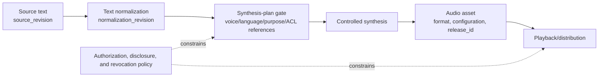

# Text to Speech

## Course overview

Text to Speech (TTS) turns text into audible speech. In engineering terms, it is not merely “choosing a voice for a sentence”: input needs normalization, pronunciation and prosody must be controllable, streaming playback must manage latency, voices need authorization, and output must be associated with `source_revision`, voice-catalog/policy version, purpose, access scope, generation configuration, and release status.

This course introduces text normalization, phonemes, prosody, acoustic representations, vocoders, and end-to-end models before moving to SSML, service engineering, evaluation, and voice-cloning risk. Dynamic material was checked on **2026-07-22**. Vendors support different SSML subsets, so confirm a target version's official documentation and contract for its voices, parameters, upload/streaming behavior, and permissions.

## Where this fits in the overall path

Text to speech is in the Extended applications and complex collaboration stage. It is the output channel for a voice agent, usually after [[agent-core/00-index|Agent Core]] or [[workflow-automation/00-index|Workflow Automation]]. Together with [[speech-recognition/00-index|Speech Recognition]], it forms the input/output modules; [[real-time-multimodal-interaction/00-index|Real-Time Multimodal Interaction]] then handles turns, barge-in, low-latency transport, and session recovery.

“Plan valid,” “generated,” “playable,” “released,” and “revoked” are distinct states. An offline plan's `acl_reference` stores only a reference to the object awaiting authorization; the external identity/authorization system must decide object-level ACL again before generation, reading, and release. In particular, a voice that has already played cannot be “recalled”: cancellation can only stop later generation or transport. See [[real-time-multimodal-interaction/00-index|Real-Time Multimodal Interaction]] for real-time turns, interruption, and tool gates.

## Learning objectives

- Explain the roles of text normalization, phonemes, prosody, acoustic representation, and a vocoder.
- Use stable SSML concepts to control language, phrasing, pauses, emphasis, and pronunciation, while handling dialect differences.
- Design contracts for voice selection, batch work, streaming, and caching that state container, codec, sample rate, channels, and player compatibility.
- Organize naturalness, intelligibility, content-correctness, stability, and preference evaluations.
- Establish voice authorization, cloning limits, disclosure, provenance records, revocation, and abuse-response processes.
- Complete an offline project that only creates and validates synthesis plans and SSML; it never produces audio.

## Prerequisites

- [[python-fundamentals/00-index|Python Fundamentals]], [[json/00-index|JSON]], and [[api/00-index|API]] are recommended.
- No linguistics or signal-processing background is required; new terms receive an intuitive introduction.

## Recommended order

1. [[text-to-speech/foundations-and-data/01-tts-pipeline-and-text-normalization|The TTS pipeline and text normalization]]: turn source text into a speakable form.
2. [[text-to-speech/foundations-and-data/02-phonemes-prosody-and-vocoder-intuition|Phonemes, prosody, and vocoder intuition]]: understand the responsibilities inside a synthesis system.
3. [[text-to-speech/foundations-and-data/03-data-and-voice-authorization|Data and voice authorization]]: establish rights boundaries before collecting data or selecting a voice.
4. [[text-to-speech/engineering-and-quality/04-ssml-and-pronunciation-control|SSML and pronunciation control]]: express pauses, emphasis, and readings safely.
5. [[text-to-speech/engineering-and-quality/05-voice-selection-batch-processing-and-streaming|Voice selection, batch processing, and streaming]]: build a reliable output service.
6. [[text-to-speech/engineering-and-quality/06-quality-intelligibility-latency-and-evaluation|Quality, intelligibility, latency, and evaluation]]: validate experience with subjective and objective measures.
7. [[text-to-speech/engineering-and-quality/07-cloning-risk-disclosure-and-traceability|Cloning risk, disclosure, and traceability]]: establish authorization and incident response.
8. [[text-to-speech/project-and-self-check/08-project-offline-synthesis-plan-and-ssml|Project: an offline synthesis plan and SSML]]: create and validate a plan without audio.

## Hands-on entry point

- Main project: [[text-to-speech/project-and-self-check/08-project-offline-synthesis-plan-and-ssml|Offline synthesis plan and SSML]].
- Project assets: [[text-to-speech/project-and-self-check/examples/build_tts_plan.py|plan builder]], [[text-to-speech/project-and-self-check/examples/tts_requests.json|synthesis-request fixture]], and [[text-to-speech/project-and-self-check/examples/test_contract_and_cli.py|contract and CLI regression tests]].
- The project uses only the Python 3 standard library. Its output explicitly uses `not_generated`; it calls no TTS service and by default does not echo source text or complete SSML to the terminal.

## Mastery criteria

- [ ] I can distinguish text normalization, pronunciation modeling, acoustic representation, and a vocoder.
- [ ] I can explain how phonemes, stress, intonation, rhythm, and pauses affect intelligibility.
- [ ] I can construct valid basic SSML and identify portability risks in vendor extensions.
- [ ] I can design time-to-first-audio, real-time factor, content-correctness, and human-listening tests.
- [ ] I can demonstrate that a voice and its training/reference data have explicit authorization, purpose limits, and a revocation process.
- [ ] I can run the offline project and verify its plan, SSML, provenance fields, and no-audio boundary.

## Connections to other knowledge bases

- Conversational input comes from [[speech-recognition/00-index|Speech Recognition]]; text and tone context come from [[context-engineering/00-index|Context Engineering]].
- For canceling old audio on interruption, associating tool results, and recovering a session, see [[real-time-multimodal-interaction/00-index|Real-Time Multimodal Interaction]].
- Multimedia composition and synchronization connect to [[multimodal-ai/00-index|Multimodal AI]] and [[video-generation/00-index|Video Generation]].
- Abuse, privacy, and organizational responsibility connect to [[ai-safety/00-index|AI Safety]], [[ai-governance/00-index|AI Governance]], and [[privacy-computing/00-index|Privacy Computing]].

## Primary references

The following sources were checked on **2026-07-22**:

- [W3C Speech Synthesis Markup Language 1.1 Recommendation](https://www.w3.org/TR/speech-synthesis11/) (W3C Recommendation, 2010-09-07; still the current entry point to the specification when checked)
- [W3C Pronunciation Lexicon Specification 1.0](https://www.w3.org/TR/pronunciation-lexicon/) (W3C Recommendation)
- [OpenAI Text to speech guide](https://developers.openai.com/api/docs/guides/text-to-speech) (current product snapshot of one vendor's streaming capabilities and AI-voice disclosure requirements; it does not establish a general API or rights conclusion for this course)
- [Natural TTS Synthesis by Conditioning WaveNet on Mel Spectrogram Predictions (Tacotron 2)](https://arxiv.org/abs/1712.05884)
- [FastSpeech 2: Fast and High-Quality End-to-End Text to Speech](https://arxiv.org/abs/2006.04558)
- [Conditional Variational Autoencoder with Adversarial Learning for End-to-End Text-to-Speech (VITS)](https://arxiv.org/abs/2106.06103)
- [ITU-T P.800: entry point for subjective quality-evaluation methods](https://www.itu.int/rec/T-REC-P.800)
- [NIST AI RMF Generative AI Profile (NIST AI 600-1)](https://www.nist.gov/publications/artificial-intelligence-risk-management-framework-generative-artificial-intelligence) (published 2024-07-26; page updated 2026-04-08)

> [!warning] Portability and authorization
> W3C specifications define semantics, but engines can implement only a subset or add private extensions. “Available” in a voice catalog does not mean usable for every scenario; technical availability, actual authorization, consent, portrait/voiceprint and related rights, and content disclosure must be checked separately. Voice similarity, catalog presence, or an authorization reference in a plan cannot independently prove permission.
