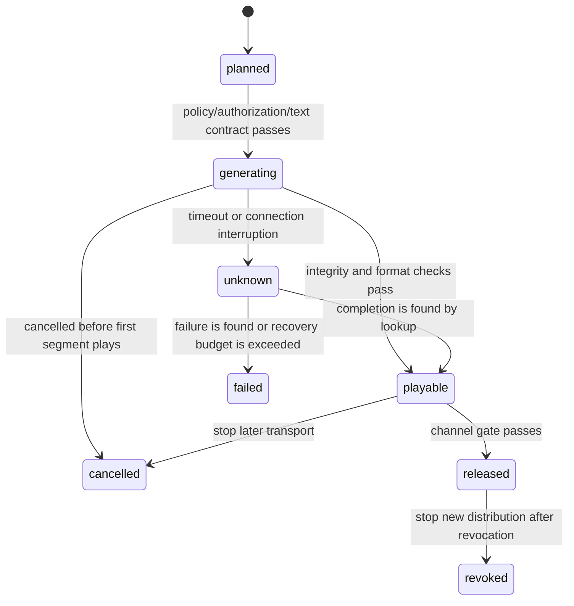

# Voice selection, batch processing, and streaming

## Goal of this lesson

Choose voices by language, authorization, and experience, then design batch processing, streaming, caching, cancellation, and reliable retries.

## A voice-selection contract

Do not select a voice only by display name; display names can be duplicated or changed. Internally record a stable `voice_id`, voice-catalog version, provider, explicitly supported language/locale, model or version, authorization reference, permitted purposes, access scope, quality status, and fallback voice. Labels such as “male voice” or “female voice” can be vendor metadata; do not infer a real identity or suitability from them.

An ordering can be: explicitly selected and authorized user voice > scenario default voice > safe same-language fallback > text display. If no suitable voice exists, do not silently cross languages or imitate a celebrity. A `voice_id` in the catalog or an authorization reference in a request can prove at most that local structural/policy checks passed; real rights, contract term, and user consent still require verification through catalog maintenance and approval workflows.

## Batch processing and streaming

Batch processing suits pre-generated courses, notifications, and accessibility material, enabling consistent quality checks and caching. Streaming suits real-time agents and needs attention to:

- **time to first audio**: time from request to the first playable audio segment;
- **real-time factor**: generation time divided by audio duration; below 1 means generation is faster than playback;
- playback buffering, network jitter, cancellation, and joins between segments;
- whether playback may begin before text is final.

Once streamed audio plays, it cannot be “taken back” from the listener. Confirm tool results, amounts, and safety warnings before synthesis; do not emit incomplete LLM tokens directly.

Define a clear terminal state for every `utterance_id` so a network failure is not mistaken for “definitely not generated”:

`cancelled` can only stop segments that have not yet played or been sent. Released or already played content needs channel notification, replacement, revocation records, and user support; do not claim it has been removed from a listener's memory. In a real service, “authorization passes” must include an externally determined authenticated subject, object-level ACL, purpose, and current policy. An offline plan's `acl_reference` is only an association, not a substitute for that decision.

Every playable response also needs an output contract: container, codec, sample rate, channels, bytes/duration, voice/model/configuration version, and `release_id` (if released). Clients must explicitly negotiate or validate playable formats. One API's default MP3, chunk event, or number of voices is not a cross-vendor guarantee.

## Caching, idempotency, and retries

A cache key should include a normalized-text digest, `source_revision`, voice-catalog version, language, SSML/pronunciation-rule version, audio format, and model version; personal data also needs retention/deletion policy and access scope. Use a stable `operation_id` for idempotency and deduplication of each local synthesis operation, with bounded retries. When generation state is unknown, query before retrying. Record a real vendor's `provider_request_id` separately with the provider and response/receipt: it cannot replace local `operation_id` or serve as cross-vendor idempotency. Do not log complete text or audio Base64. A text hash can still be guessed from a small dictionary, so it is not anonymization.

## Exercise and self-check

- Design a primary voice and fallback chain for a real-time weather briefing.
- Can an old cache be reused if the same text uses a new model version? Only if the product explicitly permits it; otherwise the version belongs in the cache key.
- Why can low time to first audio still stutter? Later generation speed or network throughput may be insufficient.

## Next step and references

Next, study [[text-to-speech/engineering-and-quality/06-quality-intelligibility-latency-and-evaluation|Quality, intelligibility, latency, and evaluation]]. Voice and streaming capabilities are dynamic product facts, so validate them only against the target provider's current official documentation before integration. For example, the [OpenAI Text to speech guide](https://developers.openai.com/api/docs/guides/text-to-speech) described that service's streaming and disclosure requirements on 2026-07-22; do not generalize them to other implementations. See [W3C SSML 1.1](https://www.w3.org/TR/speech-synthesis11/) for shared SSML semantics.
