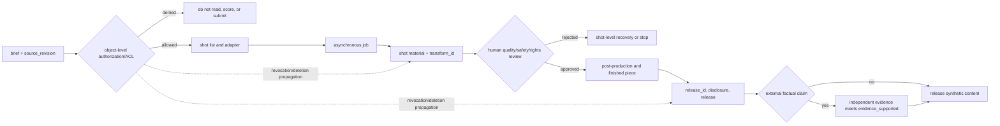

# Video Generation and Post-Production Assembly Workflow

## Learning objective

Treat a generation model as a supplier of shot material, then design the states, files, and failure boundaries from job submission through the editing handoff.

## An auditable production pipeline

1. **Lock the brief:** record purpose, audience, aspect ratio, duration, rights, safety, and budget, then freeze the `source_revision`.
2. **Preflight authorization:** object-level authorization/ACL, intended use, retention period, and consent all pass first. Material that fails does not enter preview, scoring, or model calls.
3. **Storyboard rehearsal:** confirm pacing with text boxes or lawful still frames before expensive generation.
4. **Submit one shot at a time:** each shot has a stable ID, request hash, reference-asset inventory, and `transform_id`.
5. **Manage asynchronously:** retain the vendor job ID; update status by polling or webhook.
6. **Ingest and review material:** inspect MIME type, duration, dimensions, frame rate, audio tracks, hash, and provenance metadata. Only accepted material enters the approved bin; retry only the failed shot.
7. **Post-production:** edit, transition, color-grade, caption, voice, add sound effects, mix, and lay out graphics; append provenance at every step.
8. **Review and release the finished piece:** assess audio/video synchronization, continuity, rights, safety, Content Credentials, and release specifications. Assign a `release_id` only after human approval; factual external claims also need `evidence_supported`.

Video APIs are normally long-running jobs. For example, the OpenAI official page accessed on 2026-07-22 describes creating a job, checking its status or receiving completion through a webhook, then downloading its content. That page announced that the Sora 2 Videos API was **scheduled to shut down on 2026-09-24**; this is a future plan, not an event that has already happened. The business layer therefore needs its own state model and adapter, rather than treating one vendor lifecycle as a permanent contract.

## File and version rules

A useful filename pattern is `project-shot-version-status.ext`, for example `demo-S03-v02-approved.mp4`. Also retain a machine-readable manifest: input `asset_id` / `source_revision` / hashes, request hash, vendor ID, generation time, technical-probe results, `transform_id`, selection rationale, post-production chain, and `release_id`. Separate raw candidates, proxy files, approved material, and finished pieces into distinct directories; do not use “final-final2.”

Before transcoding or assembly, normalize canvas, frame-rate strategy, pixel format, audio sample rate, and time base. Concatenating files with different technical specifications directly can cause audio/video drift or player-compatibility failures. FFmpeg is a common tool, but commands must be generated from actual probe results; this course does not run commands against media that do not exist.

## Idempotency and failure recovery

After a client timeout, query the retained job ID before creating another job. Download into a temporary file, validate it, then rename atomically. Each shot has a maximum retry count and a stop label; ACL denials, policy denials, and missing rights must not be retried automatically. Preserve the last approved version so a failed new edit or extension can roll back the material choice without destroying the original. On revocation or deletion, propagate invalidation through `asset_id → transform_id → release_id` to shot candidates, proxy files, finished derivatives, caches, and links, while retaining only the minimum audit record legally required.

## Common mistakes and troubleshooting

- **Saving only the final MP4:** the request, inputs, and approval evidence are lost, preventing meaningful review.
- **Duplicate webhook events:** event processing must be idempotent and deduplicated by event/job state.
- **Mixing generation and post-production responsibilities:** precise captions, logos, and legal copy usually belong in post-production.
- **Remaking everything after a full-piece failure:** recover from shot-level checkpoints.
- **Breaking provenance after transcoding:** record the derivation relationship and output hash in the manifest.

## Exercise and self-check

Draw the state diagram `planned → submitted → running → generated → reviewed → approved/rejected → edited → published`. Write a recovery action for each of: a duplicate webhook, interrupted download, incompatible technical specification, and human rejection.

Next: [[video-generation/02-engineering-and-quality/06-audio-captions-and-accessibility-interfaces|Audio, Captions, and Accessibility Interfaces]].

## References

- [OpenAI Video generation guide](https://developers.openai.com/api/docs/guides/video-generation) (asynchronous workflow and planned future shutdown; checked/accessed 2026-07-22)
- [FFmpeg Documentation](https://ffmpeg.org/ffmpeg.html) (checked 2026-07-22)

