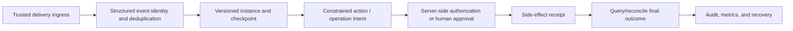

# Workflow Automation

> [!info] Source boundary
> Protocol and runtime boundaries in this course were checked on 2026-07-22. The Open Workflow Specification site labels its current version **1.0.3**; the CloudEvents repository still lists **1.0.2** as its stable release, with WIP work on the main line. OpenTelemetry Semantic Conventions is at **1.43.0**, and messaging semantics remain marked Development. The course does not turn a product default into a universal guarantee. Recheck the chosen product's versioned documentation before adoption.

## Course overview

Workflow automation turns “when work begins, what happens in which order, and how failure continues” into an inspectable execution contract. It fits processes whose paths can be constrained in advance, such as order fulfilment, document processing, data pipelines, approvals, and an Agent control shell.

A workflow is not merely a sequence of function calls. A reliable workflow must handle duplicate events, process crashes, competing claims, downstream timeouts, unknown execution results, version upgrades, and human waits. The learning focus is therefore **explicit state, finite retries, durable recovery, idempotent side effects, compensable actions, auditable approvals, and observable execution**.

> [!important] Boundary with Agents
> A deterministic workflow owns permitted nodes, state transitions, budgets, approvals, and commits. An Agent or LLM proposes a candidate result only inside a node with an input/output contract. Validate model output with a schema, business rules, and authorization before it can influence an allowed branch; it must not choose arbitrary next steps or perform unauthorized side effects.

> [!warning] Event identity is not authorization
> `source + event_id`, `trace_id`, and a model-provided tenant field can support correlation, deduplication, or diagnosis; none is a trusted identity. Verify the sender/signature and replay window at ingress, then authorize the current actor against server-side policy and the resource ACL immediately before execution. Fail closed when either check fails.

## Where this course fits

This course is the engineering convergence point in the “Single Agent and Tools” stage:

- [[tool-calling-function-calling/00-index|Tool Calling (including Function Calling)]] defines contracts for one action's parameters and result.
- [[agent-core/00-index|Agent Core]] explains dynamic decision loops, budgets, and stopping conditions.
- This course places actions and bounded decisions in a recoverable, approvable, auditable business process.
- [[mlops/00-index|MLOps]], [[llmops/00-index|LLMOps]], and [[runtime-monitoring/00-index|Runtime Monitoring]] cover continuous delivery, model operations, and production monitoring afterwards.

## Learning objectives

After completing the course, you should be able to:

- distinguish the appropriate boundaries for a simple script, deterministic workflow, and open-ended Agent;
- model a requirement as triggers, steps, conditions, parallel paths, joins, and terminal states;
- design versioned contracts for events and steps, distinguishing structural from business validation;
- design schedule time zones, timeout layers, finite retries, jitter, retry budgets, and backpressure;
- resume long processes from checkpoints and use idempotent records for duplicates and unknown outcomes;
- distinguish event identity, business `operation_id`, execution `attempt_id`, receipt, and final outcome without treating a diagnostic ID as authorization or proof of success;
- distinguish technical retry, business compensation, human approval, and manual repair;
- use events, logs, metrics, and traces to diagnose an individual failure and systemic degradation; and
- write runbooks, release a new workflow version safely, and deal with backlog and compensation failure.

## Prerequisites

- Read Python functions, exceptions, JSON files, and basic tests.
- Understand [[api/authentication-status-codes-and-credential-security|API authentication and credential security]], HTTP requests/responses, and status codes.
- Read [[json/05-json-schema-core-contracts|JSON Schema foundations and contracts]], and understand that structural validation is not business authorization.
- Know that Tool Calling is a structured protocol for requesting a tool, not reliable execution itself.
- Message queues, database transactions, and distributed systems are not prerequisites; the course introduces their terms first.

## Recommended sequence

1. [[workflow-automation/triggers-steps-and-dags|Triggers, steps, and DAGs]]: model a business process and set the workflow/Agent responsibility boundary.
2. [[workflow-automation/data-contracts-and-version-evolution|Data contracts and version evolution]]: let events and steps communicate through verifiable, upgradeable contracts.
3. [[workflow-automation/conditions-parallelism-and-joins|Conditions, parallelism, and joins]]: define branching, parallel safety, and partial-failure semantics.
4. [[workflow-automation/scheduling-timeouts-retries-and-backpressure|Scheduling, timeouts, retries, and backpressure]]: control when work runs, how long it waits, how often it retries, and what happens under overload.
5. [[workflow-automation/durable-state-recovery-and-idempotency|Durable state, recovery, and idempotency]]: continue after interruption or duplicate delivery without duplicating logical side effects.
6. [[workflow-automation/compensation-approvals-and-human-handling|Compensation, approvals, and human handling]]: handle cross-system side effects, informed approval, and instances that cannot recover automatically.
7. [[workflow-automation/observability-testing-and-release|Observability, testing, and release]]: accept production capability through traces, fault injection, release gates, and runbooks.
8. [[workflow-automation/project-offline-dag-workflow|Project: offline DAG workflow]]: implement and verify an offline order flow that pauses, resumes, retries, compensates, and deduplicates.

## Hands-on entry point

The project is [[workflow-automation/project-offline-dag-workflow|Project: offline DAG workflow]]:

- [workflow_engine.py](workflow-automation/examples/workflow_engine.py): a standard-library teaching orchestrator.
- [workflow.json](workflow-automation/examples/workflow.json): a versioned workflow definition.
- [test_workflow_engine.py](workflow-automation/examples/test_workflow_engine.py): 74 offline tests for definition, trigger, time profile, identity conflict, retry, approval, recovery, compensation, and security boundaries.

The project does not connect to cloud services, read secrets, or create persistent repository artifacts. Its demo uses a temporary directory. A production system still needs transactional state storage, a durable idempotency table, messaging, secret management, and real authorization controls.

## Mastery criteria

- [ ] Draw a real process as a DAG and mark triggers, branches, joins, waits, and terminal states.
- [ ] Explain why at-least-once processing needs business idempotency rather than an in-process dictionary claiming exactly-once.
- [ ] Design distinct paths for transient errors, permanent errors, unknown outcomes, and business rejection.
- [ ] Explain why retry cannot replace compensation and compensation cannot promise the original physical state.
- [ ] Verify that an approval binds instance, step, payload fingerprint, definition version, state version, and expiry.
- [ ] Resume a paused process from its checkpoint without recreating committed side effects.
- [ ] Write tests for duplicate triggers, crash windows, compensation failure, approval expiry, and incompatible versions.
- [ ] Execute deployment, pause, drain, definition rollback, and human handling safely from a runbook.

## Relationship to other courses

- [[tool-calling-function-calling/00-index|Tool Calling (including Function Calling)]] defines one tool's input, output, and execution boundary; this course puts those steps into a recoverable process.
- [[agent-core/00-index|Agent Core]] handles open-ended decision loops; workflows turn state, budgets, approval, and terminal conditions into auditable contracts.
- [[runtime-monitoring/00-index|Runtime Monitoring]], [[llmops/00-index|LLMOps]], and [[ai-safety/00-index|AI Safety]] take on production observations, model change, and accountability evidence.

## Facts, implementations, and recommendations

- **Specification facts** come from specifications such as CloudEvents, JSON Schema, and RFCs; this course names the version.
- **Product facts** describe a product implementation, such as Temporal recovering a workflow through event history and replay; they do not generalize to every orchestrator.
- **Engineering recommendations**—for example allowlisted log fields, two-phase release, and retry budgets—are strategies from this course that must be validated against business risk.

## Primary references

- [Open Workflow Specification](https://serverlessworkflow.io/) (site labelled 1.0.3 on 2026-07-22)
- [CloudEvents Specification](https://github.com/cloudevents/spec) (stable release 1.0.2; main branch contains next-version work, checked 2026-07-22)
- [JSON Schema Draft 2020-12](https://json-schema.org/draft/2020-12)
- [Temporal Platform Documentation](https://docs.temporal.io/) (product implementation reference)
- [OpenTelemetry Semantic Conventions 1.43.0](https://opentelemetry.io/docs/specs/semconv/)
- [RFC 3339: Date and Time on the Internet](https://www.rfc-editor.org/info/rfc3339/) (updated by RFC 9557)
- [RFC 9110: HTTP Semantics](https://www.rfc-editor.org/rfc/rfc9110.html)
- [Sagas, Garcia-Molina and Salem, 1987](https://doi.org/10.1145/38713.38742)
- [Microsoft Azure Architecture Center: Compensating Transaction](https://learn.microsoft.com/en-us/azure/architecture/patterns/compensating-transaction)
- [NIST SP 800-218: Secure Software Development Framework 1.1](https://csrc.nist.gov/pubs/sp/800/218/final)
- [RFC 9421: HTTP Message Signatures](https://www.rfc-editor.org/rfc/rfc9421)
