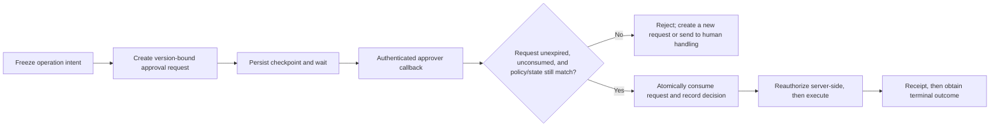

# Compensation, Approvals, and Human Handling

## Goal

Distinguish retry, compensation, business rejection, and manual repair. Design recoverable, authorized, auditable failure paths for cross-system side effects.

## Do not mix four different responses

| Situation | Action | Example |
| --- | --- | --- |
| Temporary technical fault | Finite retry | Payment service transient 503 |
| Successful side effect needs offsetting | Business compensation | Release reserved inventory |
| Input or business rule is not allowed | Reject/terminate | Inventory unavailable; approval rejected |
| Automation lacks information or compensation failed | Human handling | Downstream cannot confirm whether a charge occurred |

A retry repeats the original action. Compensation is a new business action. A refund does not “delete charge history,” and retracting a notification may not make a recipient forget it.

## Saga and compensation facts

The original 1987 Sagas paper by Garcia-Molina and Salem describes splitting a long transaction into interleavable subtransactions and running compensation when necessary. Modern workflows often use this idea for cross-service consistency.

Compensation is not a general replacement for database rollback:

- its logic depends on business semantics;
- it can fail and needs durable recovery itself;
- it might not restore the original physical state;
- its order need not be strict inverse order—high-risk resources might need repair first; and
- some compensation can run in parallel only when independence is proven.

The last two points are explicit in Microsoft's Compensating Transaction pattern. “Always pop a compensation stack in reverse order” is a common default, not a specification.

## What a compensation record needs

Persist immediately after the main action succeeds:

- original step and result reference;
- compensation handler and version;
- minimal parameters needed for compensation;
- independent idempotency key and intent hash;
- dependencies/priority; and
- attempt, error code, and human-escalation policy.

Do not register compensation for a pure read or an action not yet confirmed successful. If the main result is unknown, query/reconcile first; premature compensation can create a new error such as refunding a payment that never happened.

## Approval is not a Boolean

A reliable approval record binds at least:

- workflow instance and step;
- imminent `operation_id` plus minimal action/target-resource intent summary;
- structured summary of the impending action;
- parameter/payload fingerprint;
- workflow definition, policy, and state version;
- approver identity, role, and scope derived from a verified server-side session/token—not a `user_id` from callback body;
- `approve/reject` decision, reason, and time; and
- expiry and one-time request ID.

Persist checkpoint and release the worker before waiting. The approval callback verifies sender and raw-message integrity, derives actor from server-side session/token, checks that the request is unconsumed, unexpired, and still at current state version, then consumes the one-time request in the same conditional update. On resumption, revalidate resource, policy, parameters, and approval validity. Any critical parameter change creates a new request. Microsoft Durable Task's human-interaction sample also uses persistent waiting and a durable timer for timeout; that is a **product example**, not an approval-security standard.

Signature, timestamp, and nonce can identify replayed **delivery**, but do not prove an actor still has approval authority over the resource. Conversely, deduplicating an application `request_id` does not prove a callback came from a trusted sender. Both checks are required, and persistent compare-and-set/transaction must protect approval consumption and state transition.

## Approving high-risk Agent actions

The approval UI shows the actual structured action, not only a model's persuasive explanation:

- what will be written, sent, or deleted;
- target resources and impact scope;
- data sources, key differences, and irreversible portions;
- cost and permission; and
- how rejection terminates or rolls back the flow.

Approval authorizes this one fingerprint, not unlimited Agent permission for a period. Execution still performs server-side authorization; an `allowed-tools` list or prompt instruction is not a real permission boundary.

The model, approval UI, and webhook submit candidate actions only. The execution service rederives tenant, role, quota, and accessible objects from trusted identity and current resource state, and audits high-risk `operation_id`, decision, receipt, and final `outcome` separately. If downstream returns only “accepted,” the flow is awaiting reconciliation, not succeeded. Review [[tool-calling-function-calling/00-index|Tool Calling (including Function Calling)]] for one tool's input/output and server-side execution boundary.

## Human-handling queue

An operator needs failed step, successful side effects, unknown results, compensation progress, error classification, definition version, and safely redacted evidence. Permitted actions should be constrained commands:

- query/reconcile;
- retry one safe step;
- execute or retry compensation;
- correct bounded data fields;
- skip (with risk reason and higher permission); and
- terminate or migrate an instance.

Every operation still needs authorization, idempotency, and audit. Do not let an on-call operator directly set database state to `success` without business evidence.

## Security principles

- Workers hold least privilege per dependency; never share administrator credentials.
- Credentials come from secret management, never workflow definitions, logs, or checkpoints.
- High-risk actions separate duties; an approver cannot bypass server verification by forging a callback.
- External callbacks prevent replay and bind request ID, expiry, and payload fingerprint.
- Approver identity and resource authorization come from server verification; callback fields, trace context, and LLM output grant no authority.
- Supply chain, workflow definitions, and release artifacts receive provenance and integrity checks.
- Apply NIST SSDF 1.1 throughout development and release, not only after deployment.

## Exercise

Build a compensation table for “reserve inventory—charge—create shipping label—notify.”

1. What compensates each action, and is it really reversible?
2. If charge succeeds and label creation fails, which compensation order and why?
3. How should “notification already sent and cannot be revoked” appear?
4. Which evidence must be shown when compensation failure reaches human handling?
5. If amount changes after request creation, how does the old approval become invalid?

## Self-check

1. Why need compensation not run in strict inverse order?
2. Why not compensate immediately when the main outcome is unknown?
3. What do payload fingerprint and state version each protect in approval?
4. Why does a human step skip still need idempotency and audit?

## Next

Continue with [[workflow-automation/observability-testing-and-release|Observability, testing, and release]].

## References

- [Sagas, Garcia-Molina and Salem, 1987](https://doi.org/10.1145/38713.38742)
- [Microsoft: Compensating Transaction Pattern](https://learn.microsoft.com/en-us/azure/architecture/patterns/compensating-transaction)
- [Microsoft Durable Task: Human Interaction Pattern](https://learn.microsoft.com/en-us/azure/durable-task/common/durable-task-human-interaction)
- [NIST SP 800-218: SSDF 1.1](https://csrc.nist.gov/pubs/sp/800/218/final)
- [RFC 9421: HTTP Message Signatures](https://www.rfc-editor.org/rfc/rfc9421)
- [OWASP Business Logic Security Cheat Sheet](https://cheatsheetseries.owasp.org/cheatsheets/Business_Logic_Security_Cheat_Sheet.html)
