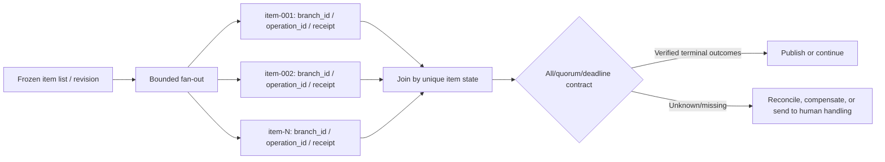

# Conditions, Parallelism, and Joins

## Goal

Design exhaustive, testable conditions, genuinely independent parallel branches, and explicit join policies; handle cancellation, late results, and partial failure correctly.

## Define a condition's input domain first

Branches should read validated fields, not search natural language for temporary keywords. For example, a risk node can emit:

```jsonc
{ // Structured decision used to select a DAG edge; text must not control the process implicitly.
  "decision": "manual_review", // Selects human review, never automatic approval or rejection.
  "reason_code": "AMOUNT_THRESHOLD", // Stable machine reason for metrics, audit, and rule-version comparison.
  "score": 0.82 // Decision evidence/threshold input only; an explicit rule still selects the branch.
}
```

> [!note] JSONC is a teaching notation
> This is a line-by-line annotated form. Remove `//` comments before sending it to a strict JSON workflow interface.

`decision` must be in an allowlisted enum. The workflow selects fixed edges for `approve / manual_review / reject`. If an LLM generates the object, a schema proves structure only; business rules and a risk fallback are still required.

Every switch must answer:

- Where do null, unknown enum, and future-version values go?
- If several conditions are true, is there priority or an error?
- Is there a safe default when no condition matches?
- Does the condition depend on data that stays consistent on replay?

## What can truly run in parallel?

Two nodes without a graph dependency are not automatically safe to parallelize. Check at least that they:

1. do not read data the other has not produced;
2. do not write the same resource without coordination;
3. each have independent timeout, idempotency key, and error classification;
4. have an explicit policy for a result already completed when the sibling fails; and
5. remain within tenant, dependency, and cost concurrency budgets.

Inventory and risk checks are usually parallelizable; a charge waits for both to succeed. Two nodes modifying one order state need a transaction, conditional update, or state version—“usually fast” does not prevent a race.

## A join is not only “wait for all”

| Join mode | Continue condition | Failure semantics to define |
| --- | --- | --- |
| `all` | Every required branch succeeds | Does one failure cancel, wait for, or compensate other branches? |
| First success | Any branch succeeds | How are others cancelled, and are late results ignored? |
| Quorum | Explicit number/weight reached | How are duplicates, timeouts, and an unmet threshold handled? |
| Best effort | Available results within deadline | Output must list missing and failed items explicitly |

Cancellation is normally a cooperation signal, not a guarantee that an in-flight external call stops immediately. A late committed result must pass state-version and idempotency rules; it cannot overwrite a final state established by the join.

## Fan-out / fan-in

Do not create 100,000 in-memory tasks for 100,000 files. A safe pattern is:

1. Produce items by page and record the total or cursor.
2. Apply bounded concurrency and per-dependency rate limits.
3. Give each item a stable ID, attempt, and result state.
4. Deduplicate at fan-in and reconcile counts for succeeded, failed, skipped, and still-running items.
5. At deadline, execute a predeclared all/quorum/best-effort policy.

Messaging can redeliver. Fan-in must not merely do `count += 1`; record state by unique item, or duplicate success can satisfy the join early.



Every branch needs a stable `branch_id`; every external side effect separately needs `operation_id`/idempotency key. A `receipt` proves only which intent downstream accepted. Count only verified `outcome` values in a controlled state table. This detects duplicate messages and prevents treating a sent request or Agent prose as success.

## Extra constraints for Agent parallelism

Parallel Agents introduce shared-context contamination, duplicate tool calls, competing file writes, and conflicting conclusions. Prefer each branch to produce immutable output, followed by deterministic validation and deduplication at join. If natural-language conclusions are merged, retain source, `branch_id`, retrieval/model version, and evidence boundary; do not let the last finisher overwrite all evidence. A cross-branch write still requires execution-time authorization and version/CAS choice of winner; trace and branch labels correlate only and never authorize a write.

## A verifiable partial-failure table

| Situation | Workflow state | Automatic action | Human-visible evidence |
| --- | --- | --- | --- |
| Risk check temporarily times out | `running/retrying` | Finite retry | Attempt and error code |
| Inventory permanently unavailable | `business_rejected` | Do not charge | Inventory-rejection reason |
| Risk passed, inventory unknown | `waiting/reconciliation` | Query idempotency record and external outcome | `operation_id`, last receipt, and state |
| One batch item fails | `failed/partial` | Retry by policy or route to human handling | Failed item IDs |
| Old result arrives after join | `unchanged` | Reject stale state version | Late-event audit record |

## Common mistakes and diagnosis

- **Parallel list order changes each run:** use stable definition order for execution and logs; do not depend on set iteration.
- **Duplicate commit after first success:** commit with compare-and-set; record late sibling results without applying them.
- **Best effort looks complete downstream:** include `missing_items`, `failed_items`, and `complete` in the contract.
- **Fan-in finishes early:** deduplicate by unique item ID and reconcile the expected set rather than summing messages.
- **Receipt counted as success:** retain separate `receipt` and `outcome`; only the latter advances the join contract.
- **Model branch has no safe default:** send unknown output to validation failure or human handling, not a high-risk action.

## Exercise

Design fan-out/fan-in for “check 100 files in parallel and publish only when all pass.”

1. Define each item's stable ID.
2. Set maximum concurrency, per-item timeout, and total deadline.
3. State behavior when item 99 times out and item 100 arrives late.
4. Simulate duplicate success for item 50 and prove publication cannot occur early.
5. Change policy to 95% quorum and explain which failures still block publication.

## Self-check

1. Why is graph independence insufficient proof of parallel safety?
2. Why cannot cancellation replace idempotency and late-result checks?
3. How do all, quorum, and best-effort output contracts differ?
4. Why retain evidence source when joining Agent branch results?

## Next

Continue with [[workflow-automation/scheduling-timeouts-retries-and-backpressure|Scheduling, timeouts, retries, and backpressure]].

## References

- [Open Workflow Specification 1.0.3](https://serverlessworkflow.io/)
- [OpenTelemetry: Messaging Spans](https://opentelemetry.io/docs/specs/semconv/messaging/messaging-spans/) (still marked Development, checked 2026-07-22)
- [Microsoft: Queue-Based Load Leveling Pattern](https://learn.microsoft.com/en-us/azure/architecture/patterns/queue-based-load-leveling)
