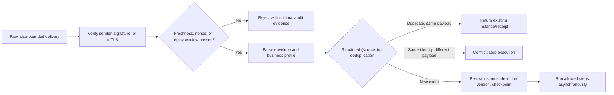
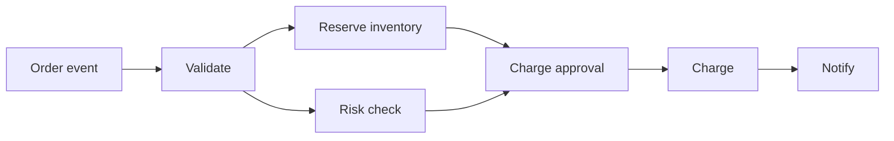

# Triggers, Steps, and DAGs

## Goal

Identify triggers, steps, dependencies, and terminal states from a business narrative, and decide whether a part belongs in deterministic code, a constrained LLM node, or a complete Agent subflow.

## Choose the right automation form first

| Form | Suitable problem | Control | Principal risk |
| --- | --- | --- | --- |
| Script | Single-machine, short-lived, fixed sequence, can rerun as a whole | Program code | No state after mid-run failure |
| Workflow | Long-lived, cross-system, with waits/recovery/approval | Predefined graph or state machine | Duplicate side effects and version migration |
| Agent | Next action depends on an open environment and dynamic exploration | Model chooses inside a boundary | Unpredictable path, budget, and authority |
| Hybrid | Overall process is fixed; local task needs semantic judgment | Workflow shell, Agent locally | Mixed failure semantics |

If the process can be stated as “charge only after approval; notify only after charge succeeds,” prefer a workflow. If a step must “find evidence in several sources and select the next retrieval strategy,” encapsulate it as an Agent node with a budget and output schema. **Using an LLM is not a reason to hand the entire process to an Agent.**

## Three basic objects

### Trigger

A trigger turns an external occurrence into a workflow instance. Common sources are HTTP requests, messages, file arrival, database changes, manual starts, and schedules.

CloudEvents 1.0 requires at least `id`, `source`, `specversion`, and `type`. Producers must make `source + id` unique for each distinct event, so consumers can treat the same pair as a duplicate. `source` is a nonempty URI-reference; `time` is optional and, when present, uses RFC 3339. Those are **specification facts**. CloudEvents does not prescribe a deduplication-retention period, sender authentication, or business handling for duplicates.

`source + id` is **event identity**, not trusted caller identity or an authorization result. Only after ingress verifies the sender, signature, or mutual TLS should those fields enter the deduplication ledger. An attacker who invents the same values receives no access to an existing instance, approval, or side effect. Store the deduplication key as a structured pair, or a canonical encoding of one: do not concatenate strings such as `source + "::" + id`, because field combinations can collide.

The offline project implements a **strict field and business profile**. It accepts only the order-event fields `id/source/specversion/type/data` and optional `time`, deliberately rejects optional CloudEvents attributes and extensions, and accepts only the RFC 3339 subset that the standard library can parse with an explicit UTC offset. It does not process leap seconds. To avoid presenting hand-written URI checks as a full specification implementation, the example requires only a nonempty `source`; it is not a general CloudEvents gateway. A real protocol ingress should use the selected binding/SDK's full validator and then narrow the result to its own business profile.

An ingress normally proceeds in this order:

1. Read raw bytes within a bounded length and verify caller identity, signature, or mTLS before parsing/formating the body.
2. Verify that a signature-covered timestamp/nonce is inside the permitted window. This prevents hostile replay; it does not replace business deduplication.
3. Bound size, type, and rate, then validate event envelope and business payload.
4. Deduplicate by a stable **structured** event key; same key with a different payload is a conflict, never a silent overwrite.
5. Bind an explicit workflow-definition version and persist instance creation. That transaction should record the deduplication result too.
6. Return a queryable instance ID or accepted receipt rather than waiting for a long workflow to finish.

### Step

A step is an independently observable work unit. A well-designed step has:

- clear input, output, and error codes;
- one business responsibility;
- an attempt timeout and overall deadline;
- a side-effect declaration and idempotency key;
- an explicit compensation action when needed;
- observable events that do not leak sensitive data; and
- handler, schema, prompt, or model-configuration version.

“Process order” is too broad: split validation, inventory reservation, risk check, charge, and notification. “Read the first character of order total” is too small: scheduling and state costs overwhelm its business value.

### DAG

A DAG is a Directed Acyclic Graph. An edge `A -> B` means B depends on A. Independent root nodes can run first; leaf nodes usually lead to completion or explicit termination.

A DAG cannot express an unbounded loop directly. Paginated batches and multi-round Agents need a bounded iteration state, subworkflow, or explicit loop construct with recorded termination condition and budget.

## Six steps from requirement to graph

1. Write the trigger event and final business outcome.
2. Mark every external side effect: database write, payment, message, publication.
3. Separate validation and approval before each side effect.
4. State each dependency before considering parallel optimization.
5. List terminal states: completion, rejection, failure, cancellation, timeout, and human handling.
6. Statistically validate duplicate nodes, unknown dependencies, self-dependencies, cycles, and missing valid endpoints.

## Where LLM/Agent nodes belong

An LLM call is an external activity that can time out, be rate-limited, return invalid structure, or produce unreliable content. Record its input reference, prompt version, model configuration, result fingerprint, and evaluation version. Treat model output as **untrusted candidate data**; only a schema and business rules may permit it to influence an allowed branch.

A local Agent with tool access needs further constraints: an allowlist, resource scope, maximum steps/cost/time, stopping condition, approval point, and completion validator. The workflow accepts only a validated final result, not an Agent's natural-language self-report.

## Common mistakes and diagnosis

- **Every message creates a new instance:** verify that a stable event key and deduplication storage persist across processes.
- **Treating `source/id` as authentication:** verify signature/caller on raw delivery first; envelope fields are forgeable.
- **Joining event keys with a delimiter:** use a canonical array/object or separate database columns and test delimiter-character combinations.
- **Allowing a model to generate arbitrary node names:** enumerate permitted branches and schema-validate output.
- **An acyclic graph stalls:** ensure every condition supplies a default path for all inputs.
- **One step contains multiple side effects:** failure cannot reveal how far it progressed; split it and record each side effect.
- **Treating workflow ID as a business idempotency key:** one business action can cross retries or migrations; bind step, resource, and intent version too.

## Exercise

Draw an “upload invoice then post to accounts” workflow containing parsing, field validation, duplicate detection, amount threshold, human approval, financial-system write, and notification. For each, state:

1. What is the trigger event key?
2. Which steps are pure computation and which have external side effects?
3. How are OCR/LLM outputs validated?
4. How many business instances result from duplicate upload of the same file?
5. Which terminal states handle approval rejection, expiry, and financial-system timeout?

## Self-check

1. Why does “acyclic” not mean a workflow will certainly finish?
2. When is a local Agent node more appropriate than a fixed step?
3. What does CloudEvents `source + id` solve, and what does it not solve?
4. Why should “send notification and write database” usually not occupy one indistinguishable-result step?

## Next

Continue with [[workflow-automation/data-contracts-and-version-evolution|Data contracts and version evolution]].

## References

- [CloudEvents Specification](https://github.com/cloudevents/spec) (stable 1.0.2; main line is WIP, checked 2026-07-22)
- [CloudEvents Core Specification](https://github.com/cloudevents/spec/blob/main/cloudevents/spec.md) (`source + id` uniqueness and `source` URI-reference)
- [Open Workflow Specification 1.0.3](https://serverlessworkflow.io/)
- [GitHub: Validating webhook deliveries](https://docs.github.com/en/webhooks/using-webhooks/validating-webhook-deliveries) (raw body, HMAC, and constant-time comparison)
- [RFC 9421: HTTP Message Signatures](https://www.rfc-editor.org/rfc/rfc9421) (coverage, nonce, created/expiry times, and replay boundary)
- [Anthropic: Building Effective Agents](https://www.anthropic.com/engineering/building-effective-agents) (workflow/Agent distinction, checked 2026-07-14)
