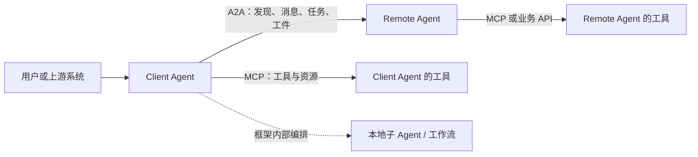

# A2A 协议学习目录

## 知识库简介

A2A（Agent2Agent Protocol）解决的是**彼此独立、实现可能不透明的 Agent 应用之间**如何发现能力、发送消息、管理长任务并交换结果。它不规定 Agent 内部怎样推理，也不代替 [[MCP/00-目录|MCP]]、[[Tool Calling（含 Function Calling）/00-目录|Tool Calling]] 或具体 Agent 框架。

本课程以 A2A Protocol `1.0.0` 为合同基线，围绕协议边界、Agent Card、Task 生命周期、三种标准 binding、异步交付、身份授权、多租户隔离、版本迁移和互操作测试建立可验证的工程认识。课程讲解与示例均为本项目原创；官方规范只作为事实依据，不复刻其正文或 SDK。

> [!important] 动态边界
> A2A 官方站在 2026-07-21 将 `1.0.0` 标为最新已发布版本。协议核心已经进入稳定版本，但 SDK、扩展、TCK 与各框架适配仍会变化。生产接入前必须重新核对官方规范、目标 SDK 版本和服务端 Agent Card；本课程的离线验证器只是教学合同，不是官方一致性认证。

## 为什么进入“前沿与参考”知识域

`frontier-reference` 只接收同时满足以下条件的主题：

1. 已有公开、可版本化的一手规范或原始论文，而不是只有营销概念；
2. 能产出可测试的工程工件，而不是只列新闻；
3. 与主线课程边界清楚，不复制既有知识库；
4. 明确记录观察日期、采用条件、退出条件和迁移风险；
5. 即使生态变化，核心学习方法仍可迁移。

A2A 1.0 已具备正式规范、版本协商、标准 binding、安全章节和互操作测试要求；学习者可以产出 Agent Card、任务状态契约、负向用例和采用决策记录，因此符合进入标准。它仍是两条角色路径的可选课程，不被包装成所有 Agent 项目的默认依赖。

## 在总路线中的位置

- Agent 应用开发：完成单 Agent、工作流或多 Agent 实践后，遇到跨框架或跨组织委派再学习；
- Agent 平台与可靠性：需要建设 Agent 目录、网关、身份、版本兼容和互操作测试时学习；
- 单进程内的子 Agent、同一框架内的 handoff 或普通工具调用，不需要为了“跟上趋势”引入 A2A。

推荐先具备以下能力，但它们不是完整课程级硬前置：

- 能读 JSON、HTTP、认证头和状态机；
- 理解 [[多Agent协作/00-目录|多 Agent 协作]] 中的委派、路由与失败隔离；
- 理解 [[AI安全/00-目录|AI 安全]] 中的信任边界与对象级授权。

## 学习目标

- 准确区分 A2A、MCP、Tool Calling、Agent 框架和普通业务 API；
- 设计可发现但不过度暴露内部能力的 Agent Card；
- 正确区分 Message、Task、TaskStatus、Part 与 Artifact；
- 为轮询、流式订阅和 webhook 选择合适的交付与恢复策略；
- 把认证、授权、租户路由、凭据获取和审批分成独立边界；
- 识别 A2A `0.3` 到 `1.0` 的破坏性结构变化，建立双版本迁移证据；
- 运行离线合同验证项目，并说明它没有证明哪些线上性质。

## 推荐学习顺序

1. [[A2A/01-协议边界与架构|协议边界与架构]]
2. [[A2A/02-Agent Card发现与信任|Agent Card、发现与信任]]
3. [[A2A/03-Task消息与工件生命周期|Task、消息与工件生命周期]]
4. [[A2A/04-传输流式异步与版本协商|传输、流式、异步与版本协商]]
5. [[A2A/05-认证授权与多租户安全|认证、授权与多租户安全]]
6. [[A2A/06-互操作测试迁移与采用决策|互操作测试、迁移与采用决策]]
7. [[A2A/07-离线A2A合同验证项目|离线 A2A 合同验证项目]]

## 一张图看清协议位置

图为本项目原创重绘。它表达职责边界，不表示每个系统必须同时采用 A2A 和 MCP。

## 掌握标准

- 能从需求判断“需要协议互操作”还是“同一应用内函数调用”；
- 能检查 Agent Card 的必需字段、binding、版本、能力与安全声明；
- 能解释 `INPUT_REQUIRED`、`AUTH_REQUIRED` 与终态的不同恢复路径；
- 能为 webhook 重放、SSRF、越权查询、跨租户 ID 和不可信 Artifact 写负向测试；
- 能说明 `0.3` 结构不能直接冒充 `1.0`，并给出灰度迁移与回滚证据；
- 能把离线 schema/状态检查与真实 SDK、TCK、TLS、身份提供方和线上可观测性验证分开报告。

## 主要参考资料

- [A2A Protocol 1.0.0 官方规范](https://a2a-protocol.org/latest/specification/)
- [A2A Protocol v1.0 变更说明](https://a2a-protocol.org/latest/whats-new-v1/)
- [A2A 与 MCP 的官方边界说明](https://a2a-protocol.org/latest/topics/a2a-and-mcp/)
- [A2A 官方路线图](https://a2a-protocol.org/latest/roadmap/)
- [RFC 8785：JSON Canonicalization Scheme](https://www.rfc-editor.org/rfc/rfc8785)
- [RFC 7515：JSON Web Signature](https://www.rfc-editor.org/rfc/rfc7515)
