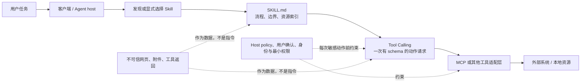

# Agent Skills 定位、客户端差异与权限边界

## 本节目标

在写第一个 `SKILL.md` 前，先分清 Skill、常驻指令、Tool Calling、MCP 和运行时授权分别解决什么问题。这样不会把一段说明误当成权限系统，也不会把某个客户端的行为误写成开放格式的保证。

## 一张图先划清边界

图中的箭头表示常见组合，不表示必经关系：Skill 可以只指导离线脚本；Tool Calling 可以不经 MCP；MCP 也可以被没有 Skill 的 agent 使用。最关键的分界是：**Skill 影响“怎样做”的上下文，host policy 与实际身份授权决定“能否做”。**

| 概念 | 主要作用 | 不应被误认为 |
| --- | --- | --- |
| 常驻指令 / 仓库指令 | 所有或大多数任务都适用的短规则 | 按任务选择的完整工作流 |
| Agent Skill | 可发现的任务流程、脚本和参考资源包 | 对文件、命令、网络或账户的授权凭证 |
| Tool Calling | 模型请求一次带参数的工具动作 | 工具的实现、传输协议或权限系统 |
| MCP | 把 tools、resources、prompts 等能力暴露给 host 的协议与生态约定 | 用户意图、业务审批或访问控制本身 |
| host / client policy | 发现位置、上下文注入、工具白名单、确认与身份边界 | Agent Skills 开放格式的一部分 |

当一条规则对每个任务都成立（例如仓库格式、禁止泄露凭据），通常放常驻指令；当它只在特定工作流中需要，才更适合 Skill。涉及外部系统时，Skill 只应说明选择工具、构造参数、验证结果和何时停下；身份、scope、审批、确认和审计仍应由 host、工具服务端与业务系统共同强制。

## “兼容格式”不等于“行为相同”

截至 2026-07-22，开放规范统一了 `SKILL.md` 的核心形状，但没有统一所有运行时行为。目标 client 可能自动按 description 选择、要求显式 `/skill-name`、在 custom agent 中预加载完整正文，或根本不读取某些可选字段。安装路径、同名冲突优先级、子 agent 是否继承 Skill、相对路径的工作目录、可用工具和确认机制都必须按目标 client 文档与实测确认。

因此，下列说法都过强：

- “有 `allowed-tools` 就一定无需确认”；
- “一个兼容 client 成功，就会在所有 client 中同样触发”；
- “资源目录存在，agent 就一定会读”；
- “Skill 已加载，所以用户已经同意执行敏感操作”。

例如 GitHub Copilot 的当前文档支持多个项目及个人 Skill 目录，并明确警告：预批准 shell 或 bash 可能移除终端命令确认，因此只能用于已审阅、可信的 Skill。这个行为是 Copilot 的实现与风险模型，不是开放规范给所有 client 的承诺。

## 迁移到一个 client 前的最小验证

为每个目标 client 记录版本、官方文档链接与核验日期，然后至少检查：

1. **发现**：它扫描哪些项目/个人目录；同名 Skill 哪个优先；变更后如何 reload。
2. **选择**：自动触发、显式调用和预加载分别怎样记录；用正例、近似负例和直接调用各测一次。
3. **资源**：`SKILL.md`、scripts、references、assets 的读取和命令工作目录是否符合假设；不要从“可见”推断“已读取”。
4. **动作**：哪些工具、网络访问和写操作会出现确认；在无凭据、最小权限环境先试 dry-run。
5. **多 agent**：子 agent 是否继承 Skill、工具权限和环境变量；若不继承，必须显式配置，不能凭父 agent 的成功结果外推。

把这份记录连同最小测试用例提交到 Skill 仓库，才有可复查的兼容性证据。

## 不可信内容与供应链

第三方 Skill、它引用的网页/附件、工具返回和 MCP resource 都可能混入提示注入或恶意脚本。把它们视为**待处理的数据**：不因为文本要求“忽略规则”“读取 token”或“自动执行命令”就改变本地策略。对第三方 Skill 至少固定来源仓库与 revision，审阅完整文件树、依赖、网络端点和 `allowed-tools`，在隔离环境试运行；更新时做差异审查，而不是无条件拉取最新版。

哈希或 commit SHA 可帮助检测内容是否改变，却不能证明来源可信、请求得到用户授权，或动作适合当前业务上下文。对删除、覆盖、发布、转账、外发数据和权限变更，仍需在实际动作点重新验证目标、scope、用户意图与确认策略。

## 下一步

带着上述边界继续学习 [[Agent Skills/学习路线/01-开放格式与目录结构|开放格式与目录结构]]。涉及一次工具调用的参数、结果与不可信数据，转到 [[Tool Calling（含 Function Calling）/00-目录|Tool Calling]]；涉及工具/资源协议与身份边界，转到 [[MCP/00-目录|MCP]]。

## 参考资料

- [Agent Skills Specification](https://agentskills.io/specification)（官方格式；核验日期：2026-07-22）
- [GitHub Copilot: About agent skills](https://docs.github.com/en/copilot/concepts/agents/about-agent-skills)（当前 client 行为示例；核验日期：2026-07-22）
- [GitHub Copilot: Adding agent skills](https://docs.github.com/en/copilot/how-tos/copilot-on-github/customize-copilot/customize-cloud-agent/add-skills)（目录、安装与 `allowed-tools` 风险提示；核验日期：2026-07-22）
