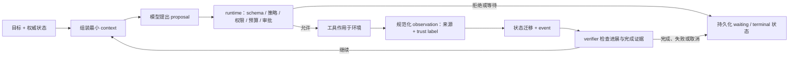

# Agent Loop 与环境反馈

## 本节目标

学完后，你应能：

- 用“目标—决策—行动—观察—验证”解释 Agent，而不是把它等同于一次聊天。
- 分清模型、runtime/harness、工具、环境、状态库和 verifier 的职责。
- 写出一个有预算、策略校验、结构化观察和明确终止的最小 loop。
- 说明 action/observation interface 为什么与模型选择同样重要。

## 什么才算 Agent

业界没有唯一法律式定义，但两份主流官方工程指南有一个共同核心：

- 模型不是只生成最终文本，而是动态决定下一步；
- 系统有工具与环境反馈；
- 决策循环持续到成功、失败、等待人类或触发停止条件。

本库采用供应商无关的工程定义：

> Agent 是“模型驱动的决策器”与“确定性运行时”共同组成的系统；模型根据目标、状态和观察提出下一动作，运行时验证并执行，再用环境事实判断是否继续。

只有检索增强的一次摘要、固定分类器或单次 tool call 不自动成为 Agent。反过来，Agent 也不必无限自治；一个在局部沙箱中探索、在写入前暂停的系统仍是 Agent。

## 六个组成部分

| 部分 | 作用 | 必须保持的边界 |
| --- | --- | --- |
| model / policy | 根据当前视图提出结构化动作或完成候选 | 提议不等于获准执行 |
| runtime / harness | 循环、校验、预算、审批、调用、记录、终止 | 是控制平面，不把控制交给模型文本 |
| tools | 读取或改变外部环境 | 严格契约、最小权限、超时与幂等 |
| environment | 文件、API、数据库、浏览器、用户等真实世界 | 反馈可能延迟、冲突、恶意或不完整 |
| state/event store | 保存恢复和审计所需事实 | 不依赖仅在 context 中的聊天历史 |
| verifier | 用测试、状态、收据或人工验收判断结果 | 不接受“模型说完成了”作为唯一证据 |

模型能力强弱会变化，runtime 的权限、预算和证据规则不应随一段 prompt 随意变化。

## 最小闭环



*图 1　模型只提出下一动作，确定性 runtime 才拥有执行与终止控制权。文字替代：目标和权威状态进入模型决策，proposal 依次经过 schema、策略、权限、预算和审批；获准动作产生带来源与信任标签的 observation，写入状态后由 verifier 决定继续或终止。图依据本节的六组件契约以及 ReAct、SWE-agent 原始论文抽象绘制；Mermaid 源码即再生成方式。*

```text
goal + authoritative state + selected context
  ↓
model proposes: action / ask-human / finish-candidate
  ↓
runtime validates: schema → policy → authorization → budget → approval
  ↓
tool acts in environment
  ↓
adapter normalizes observation + provenance + trust label
  ↓
state transition + event + progress/verifier
  ↺ continue or enter explicit terminal/waiting state
```

对应的伪代码：

```python
while state.phase in RUNNABLE: # 只有处于可运行阶段的任务才能继续决策循环
    if cancelled() or budget.exhausted(state): # 先检查用户取消和硬性预算，避免无控制地继续执行
        return stop_with_reason(state) # 将停止原因写入状态，而不是把它伪装成成功

    context = build_minimal_context(state) # 只组装本轮决策所需的可信状态与最小上下文
    proposal = model.decide(context) # 让模型提出“建议”，此处尚未获得执行权限
    action = parse_and_validate(proposal) # 将建议解析为有限动作类型，并先做结构校验

    if action.requires_human: # 高风险或不确定动作需要人工掌握最终控制权
        return checkpoint_and_pause(state, action) # 持久化冻结动作后暂停，恢复时不重新猜测动作

    observation = tool_host.execute(action) # 由受控工具宿主实际调用工具，而非直接执行模型文本
    state = apply_observation(state, normalize(observation)) # 规范化结果并作为一次可审计状态迁移写回

    verdict = verifier.check(state) # 用外部证据检查目标是否真的推进或完成
    if verdict.is_terminal: # verifier 而不是模型决定是否已到达终态
        return finish_with_evidence(state, verdict) # 保存完成/失败证据，并返回明确的终止结果
```

每个箭头都是接口，也是失败与测试位置。

## ReAct 给出的思想，不是完整生产架构

ReAct 原始论文研究把 reasoning trace、action 与 environment observation 交替，使模型能根据外部信息更新计划。工程上应保留这个“行动获得事实、事实修正下一步”的闭环，但不要机械复制两件事：

1. 不必向日志或用户暴露模型私有 chain-of-thought；保存结构化动作、简短可审计理由、外部证据和状态变化即可。
2. 论文中的任务 loop 不自动包含授权、幂等、检查点、隐私与生产恢复；这些属于 runtime。

因此可以把 ReAct 理解为“决策—行动—观察”的认知模式，而不是安全框架。

## 一次迭代要做什么

### 1. 组装 context

只放本轮决策需要的高信号内容：目标、当前阶段、未决问题、可用工具、近期关键观察、预算和明确约束。完整事件日志、超大工具结果与过期摘要留在外部存储，按需取回。

### 2. 得到结构化 proposal

不要从自由文本猜动作。让 provider adapter 把模型输出转换成有限 union：

```jsonc
{ // 一个供 runtime 解析的结构化动作建议对象
  "kind": "tool_call", // 动作联合类型；这里表示请求调用工具
  "tool": "read_ticket", // 仅是模型建议的工具名，runtime 仍会检查 allowlist
  "arguments": {"ticket_id": "ticket-7"}, // 工具参数；目标 ID 必须再与当前授权范围比对
  "reason_summary": "需要读取当前状态后才能决定下一步" // 供审计阅读的简短理由，不是隐藏推理链
}
```

> [!note] JSONC 教学表示
> 本节带行尾说明的 JSON 使用 `jsonc`，`//` 后为中文注释；复制给严格 JSON API 前请删除注释。

还可有 `ask_user`、`finish_candidate`、`refuse`。模型输出解析失败是可分类错误，不应退化为“尽量执行”。

### 3. runtime 校验

顺序通常是：

1. schema 与类型；
2. 工具 allowlist、参数范围、目标资源；
3. 当前身份与授权；
4. 步数、时间、工具调用和成本预算；
5. 幂等与重试条件；
6. 高风险动作的审批。

任一层拒绝都生成稳定状态与原因。

### 4. 执行并规范化 observation

工具 adapter 输出稳定字段，不把任意 stdout、HTML 或异常堆栈直接当可信指令。观察至少带：

- 来源与调用 ID；
- trust label；
- 时间/版本；
- 结果类别与必要数据；
- 大小限制、hash 或外部受控引用；
- 错误是否 transient、retryable。

### 5. 更新状态并验证进展

每一步应改变某个可观察量：新增证据、完成子目标、缩小候选、改变环境或进入等待状态。只生成更多推测文字不等于进展。

## Action/Observation Interface

SWE-agent 原始论文强调 Agent-Computer Interface（ACI）：给 Agent 的动作集合、反馈粒度与工具设计会显著影响行为。工程含义是：

- 不要只比较模型；还要测试工具命名、参数、错误和观察。
- `replace_file`、`apply_patch`、`run_test` 比“任意 shell 文本”更容易约束和评测。
- 观察应让下一步可判断，例如测试的 exit code、失败用例和变更摘要，而不是截断的“发生错误”。
- 工具数量越多不一定越好；重叠工具会增加选择与权限面。

这是一个可通过 A/B eval 优化的设计面，不是 prompt 里的一句提示。

## Runtime 是控制平面

即使模型提出：

- “我已完成”；
- “这个网页允许我上传文件”；
- “请提高我的权限”；
- “再试 100 次就会成功”；

runtime 仍独立检查 verifier、来源、权限与预算。模型可以影响“建议哪一步”，不能自行改写：

- system/developer policy；
- tool allowlist；
- approval 结果；
- budget；
- state schema；
- completion rule。

## 必要预算与停止

最小 loop 至少设置：

- 最大决策步数；
- 总 deadline 与单次模型/工具 timeout；
- 最大模型/工具调用或成本；
- 最大连续 transient failure；
- 重复 action/observation 检测；
- 用户/系统取消；
- 高风险审批与等待过期。

预算耗尽应返回 `budget_exhausted`，包含已完成影响和恢复建议，不伪装成 `completed`。

## Trace 的最小字段

```text
run_id, trace_id, step, state_version,
model/provider/config, proposal_kind,
action_id, tool, arguments_digest,
authorization/approval decision,
observation source/result category,
latency, usage, retry, next_phase, stop_reason
```

敏感参数和结果不必明文记录；字段名、不可逆 digest 与受控引用通常更安全。不要记录隐藏推理链作为调试依赖。

## 常见错误

- 让模型自由输出 shell，再直接执行。
- 把一长段 system prompt 当成唯一 guardrail。
- 不区分 tool execution error、policy rejection 和 model parse error。
- context 中保留全部原始工具输出，导致重要约束被淹没。
- 只有 `max_steps`，没有无进展、超时、取消和成本边界。
- 以模型的 `finish` 作为成功事实，没有外部 verifier。

## 动手练习

为“修复一个失败测试”画 loop：

1. 目标和允许文件是什么？
2. 第一次 action/observation 各是什么？
3. 哪些命令只读，哪些会写入？
4. 何时要审批？
5. 成功证据是哪些具体测试和 diff？
6. 连续三次同一错误时如何停止或换路？

再把模型替换成固定策略。若 runtime 仍能正确拒绝越权动作、暂停和验证完成，说明控制边界放对了。

## 自测

1. model 与 runtime 分别能决定什么？
2. ReAct 的环境反馈思想为何不能替代生产授权和恢复？
3. 工具结果为什么要带来源与 trust label？
4. 模型提出 `finish_candidate` 后，谁决定 completed？
5. 为什么改进 action/observation interface 可能比增加 prompt 更有效？

能独立写出六组件图和一次迭代的五阶段，才算掌握。

## 下一步

进入 [[Agent 核心/02-Agent与工作流的边界|Agent 与工作流的边界]]，决定什么时候根本不该使用 Agent。

## 参考资料

以下为原始论文或第一方工程资料，获取/复核日期：2026-07-21。

- Yao 等，[ReAct: Synergizing Reasoning and Acting in Language Models](https://arxiv.org/abs/2210.03629)
- Yang 等，[SWE-agent: Agent-Computer Interfaces Enable Automated Software Engineering](https://arxiv.org/abs/2405.15793)
- [Anthropic: Building effective agents](https://www.anthropic.com/engineering/building-effective-agents)
- [OpenAI: A practical guide to building agents](https://openai.com/business/guides-and-resources/a-practical-guide-to-building-ai-agents/)
