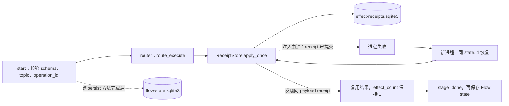

# 项目：真实 CrewAI 持久化 Flow

## 项目目标

这一层直接运行 `crewai==1.15.4`，仍不调用模型、不需要 API key。它验证真实 `Flow`、`@start()`、`@router()`、`@listen()`、`@persist(...)` 与 `SQLiteFlowPersistence`，并注入最危险的恢复窗口：业务效果已经提交，但 Flow state 尚未来得及保存。PyPI 在 2026-07-21 的最新稳定观察为 `1.15.5`，但本项目没有把“可安装的最新版本”误写为“已验证版本”。

[[CrewAI/07-项目-离线研究简报Flow|Layer A 离线研究简报]]继续负责框架无关的 Task、事件、修订预算和发布合同；本项目不会替换它。

## 为什么要把 state ID 与 operation ID 分开

| 标识 | 由谁管理 | 用途 |
| --- | --- | --- |
| `state.id` | CrewAI Flow state 的 UUID | 找到一条持久化执行 lineage |
| `operation_id` | 调用方按业务意图提供 | 幂等、回执与冲突检测 |
| `payload_hash` | 应用按规范化载荷计算 | 防止同一个 operation ID 被用于不同内容 |

离线 Layer A 原先把确定性指纹叫作 `run_id`，容易让人误以为它是每次执行的唯一 UUID；本轮已改名为 `operation_id`。真实 Layer B 同时保留框架 UUID 与业务幂等键。

## 两个 SQLite 的职责



Flow persistence 和业务 receipt 必须是两个概念。`@persist` 在方法成功完成后保存 state；若效果提交后方法抛错，最新 state 仍可能停在 `prepared`。恢复后先查 receipt，才能避免串行重放产生第二次效果。

本项目只有一个 `@start()`，证明的是**单进程、串行恢复**下的幂等回执；它不对多个满足条件的 start 如何调度作出断言。多 worker 并发、远程 API、数据库隔离级别和跨区域故障仍需单独验证。

## 锁定版本下的 API 事实

- `@persist` 是需要调用的装饰器：使用 `@persist()` 或 `@persist(SQLiteFlowPersistence(path))`。在 `1.15.4` 中写成裸 `@persist` 会把类替换为 decorator function。
- 路由标签与 listener 方法名必须分离；本项目使用 `route_execute` / `route_done`，避免 handler 监听自身。
- `kickoff(inputs={"id": uuid})` 会在同一 UUID 下水合最新 state，然后重新进入满足条件的 `@start()` 图；它不是节点级自动跳过。
- `kickoff(restore_from_state_id=uuid)` 会从快照 fork，并分配新 `state.id`。
- 未知 UUID 默认可能静默按新流程启动，所以本项目包装层会在 `resume` **和** `fork` 调用真实 `kickoff` 前先查询 persistence；未知 ID 一律失败关闭。

Checkpointing 是另一套能力。锁定版本的 `Flow.from_checkpoint` 需要 `CheckpointConfig`；它与 `@persist` 水合不能混为一谈，且早期能力/最佳努力写入也不能代替业务 receipt。

## 文件与环境

```text
examples/crewai_layer_b/
├── crewai_persistent_flow.py
├── requirements.txt
└── test_crewai_persistent_flow.py
```

从该目录运行：

```powershell
$practice = Join-Path $env:TEMP ("crewai-layer-b-{0}" -f [guid]::NewGuid())  # 为本次验证创建唯一的 vault 外临时环境目录。
py -3.11 -m venv $practice  # 用课程已复验的 Python 3.11 创建隔离虚拟环境。
$python = Join-Path $practice "Scripts\python.exe"  # 保存该环境解释器的绝对路径，避免依赖 shell 激活状态。
& $python -m pip install --upgrade pip  # 升级临时环境内的 pip，满足本节已知解析前置条件。
& $python -m pip install --requirement .\requirements.txt  # 按示例直接依赖清单安装真实 CrewAI 运行时。
& $python -m pip check  # 检查解析后的依赖图是否存在不满足项。

$env:PYTHONUTF8 = "1"  # 强制 Python 以 UTF-8 处理含中文和 emoji 的测试输出。
$env:CREWAI_DISABLE_TELEMETRY = "true"  # 请求当前测试进程禁用 CrewAI 遥测。
$env:CREWAI_TESTING = "true"  # 启用锁定版本测试中使用的隔离开关。
$env:OTEL_SDK_DISABLED = "true"  # 禁用该测试进程中的 OpenTelemetry SDK。
$env:DO_NOT_TRACK = "1"  # 设定非跟踪意图；生产环境仍需独立验证真实出口。
```

`PYTHONUTF8=1` 避免 Windows 默认 GBK 无法编码 CrewAI 事件输出中的 emoji。`CREWAI_TESTING` 是锁定版本自动测试使用的内部隔离开关，不是生产部署配置；`OTEL_SDK_DISABLED` 与 `DO_NOT_TRACK` 也只用于这个隔离测试进程，不能替代部署环境的出口审计。非测试服务应显式完成非交互 trace opt-out、出口网络和遥测验证。

2026-07-20 的新 Python 3.11 venv 自带 pip 24.0 时，`jsonschema → rpds-py` 解析失败；把**该临时 venv 内**的 pip 升到 26.1.2 后，同一 `crewai==1.15.4` 安装成功且 `pip check` 通过，因此上面的升级步骤属于本轮可复现前置条件。`requirements.txt` 只固定一个直接依赖，不是完整 lockfile；本次解析出 138 个 distribution、环境约 800 MB，并包含 ChromaDB、LanceDB、MCP、OpenAI SDK 与 OpenTelemetry 等传递依赖。生产项目应按实际功能裁剪、生成带哈希的完整锁文件并做许可证与供应链扫描，不能把教学环境成本视为最小部署成本。

## 正常运行、同 lineage 恢复与 fork

```powershell
$stateDb = Join-Path $env:TEMP ("crewai-state-{0}.sqlite3" -f [guid]::NewGuid())  # 创建唯一的 Flow 状态 SQLite 路径。
$effectDb = Join-Path $env:TEMP ("crewai-effect-{0}.sqlite3" -f [guid]::NewGuid())  # 创建与状态分离的业务效果账本路径。

# 启动一条新 lineage，并把 CLI 输出的 JSON 转为可访问属性的 PowerShell 对象。
$fresh = (& $python -B .\crewai_persistent_flow.py `
  --state-db $stateDb --effect-db $effectDb start `
  --topic "Agent reliability" --operation-id "publish-001") | ConvertFrom-Json  # 保存新 Flow 的 UUID，供恢复与 fork 使用。

# 以同一 Flow UUID 重开进程，验证 lineage 恢复不会改变业务效果。
& $python -B .\crewai_persistent_flow.py `
  --state-db $stateDb --effect-db $effectDb resume --flow-id $fresh.flow_id  # 请求恢复已完成的同一状态快照。

# 基于同一快照创建新的运行 UUID，验证 fork 不会重新提交效果。
& $python -B .\crewai_persistent_flow.py `
  --state-db $stateDb --effect-db $effectDb fork --flow-id $fresh.flow_id  # 请求创建独立 lineage 的 fork。
```

正常运行返回 `stage=done`、CrewAI UUID、业务 `operation_id`、receipt 与 `effect_count=1`。同 lineage 恢复保持 UUID 不变；fork 使用新 UUID，但水合的是同一已完成快照，不会重新提交业务效果。

## 注入 receipt 后崩溃

```powershell
# 在效果回执已写入后注入崩溃，并保留 stderr/stdout 中最后一行 JSON 故障载荷。
$failureLine = & $python -B .\crewai_persistent_flow.py `
  --state-db $stateDb --effect-db $effectDb start `
  --topic "Failure recovery" --operation-id "publish-002" `
  --crash-after-receipt 2>&1 | Select-Object -Last 1  # 合并错误流并提取最后的结构化故障记录。
$failure = $failureLine | ConvertFrom-Json  # 解析故障记录，以获得可 inspect/resume 的 Flow UUID。

# 先检查崩溃后的持久状态与效果账本是否处于预期的不同阶段。
& $python -B .\crewai_persistent_flow.py `
  --state-db $stateDb --effect-db $effectDb inspect --flow-id $failure.flow_id  # 只读查看崩溃后的状态。

# 再以同一 UUID 恢复，验证系统查询回执而不是重复产生效果。
& $python -B .\crewai_persistent_flow.py `
  --state-db $stateDb --effect-db $effectDb resume --flow-id $failure.flow_id  # 恢复并观察 recovered_receipt 终态。
```

故障进程退出码为 `3`。inspect 应看到 Flow 仍是 `prepared`，但 effect ledger 已为 1；新进程恢复后 `recovered_receipt=true`、`stage=done`，effect count 仍为 1。

## 运行 9 项真实 CrewAI 测试

```powershell
& $python -B -m unittest -v test_crewai_persistent_flow.py  # 在普通模式执行 9 项真实 CrewAI 回归测试。
& $python -B -O -m unittest -v test_crewai_persistent_flow.py  # 验证生产校验不依赖优化模式会移除的裸 assert。
$env:PYTHONWARNINGS = "error"  # 让未被窄范围允许的 warning 立即使测试失败。
& $python -B -m unittest -v test_crewai_persistent_flow.py  # 在严格 warning 模式重跑普通解释器测试。
& $python -B -O -m unittest -v test_crewai_persistent_flow.py  # 同时组合优化与严格 warning 模式。
Remove-Item Env:PYTHONWARNINGS  # 清理仅为当前会话设置的 warning 策略。
```

测试覆盖锁定版本、无密钥路由、旧 schema 拒绝、同 UUID 水合、`flow_id` 首尾空白规范化、fork、未知 UUID 在 resume/fork 两条路径均失败关闭、receipt 后崩溃恢复与两个独立进程；还验证同一 `operation_id` 不能绑定不同 payload，冲突时不会产生第二次效果，并检查 stderr 没有 Windows codec/CrewAIEventsBus 错误。`1.15.4` 的传递依赖在 Python 3.11 导入时会产生一条 OpenTelemetry `SelectableGroups` deprecation 和一条 `crewai.rag` ImportWarning；测试只按完整消息窄范围 allowlist 这两条，其他 warning 在 `-W error` 下仍会失败，升级时必须重新审阅而不是扩大忽略范围。

2026-07-21 的隔离复验中，9 项测试在 normal、`-O`、`-W error` 与 `-O -W error` 四模式各通过一次。运行日志未出现 API、LLM、HTTP 或遥测错误，但没有做抓包，因此只能证明当前代码路径与日志边界，不能声称网络层绝对零连接。

## 遥测、AMP tracing 与应用日志

这三条通道要分别治理：

- `CREWAI_DISABLE_TELEMETRY=true` 只关闭 CrewAI 匿名遥测，优先于为了单一库而全局关闭 OpenTelemetry。
- `Flow(..., tracing=False)` 是本项目在 `1.15.4` 中关闭 AMP tracing 的显式覆盖。该版本只把 `CREWAI_TRACING_ENABLED=true/1` 当作启用信号；值为 `false` 时仍可能继续读取本机已保存的 `trace_consent`，所以不能把环境变量 `false` 写成可靠 opt-out。生产还应核对并按官方 CLI 管理持久 consent，再验证实际网络外发。
- `OTEL_SDK_DISABLED=true` 会关闭同一进程的全部 OpenTelemetry instrumentation，只有确实需要全局关闭时才用。
- `suppress_flow_events=True` 会禁用 Flow 与方法生命周期事件发射，也会减少本地 listener/可观测性；本 fixture 用它隔离恢复测试，不应复制到需要事件审计的生产 Flow。日志重定向只改变本地输出。两者都不等于匿名 telemetry 已关闭。

测试 fixture 用 CrewAI 专用变量关闭匿名 telemetry，并在每个 Flow 上显式 `tracing=False`。生产环境不要依赖 `CREWAI_TESTING`，也不要因为测试没有外发就推断部署镜像、插件和 exporter 同样安全。

## 验收清单

- [ ] 能解释 state UUID、operation ID 与 payload hash 的不同职责。
- [ ] 同 UUID 恢复和 fork 的 ID/历史语义符合预期。
- [ ] 未知 UUID 由应用层拒绝，而不是静默创建流程。
- [ ] receipt 提交后崩溃再恢复，串行 effect count 仍为 1。
- [ ] 能说明 `@persist` 水合、checkpoint 跳过与外部回执的区别。
- [ ] Windows 测试没有编码错误，匿名 telemetry 与 AMP tracing 分别配置。
- [ ] 不把本地 SQLite 结果推广为并发或分布式 exactly-once。

## 回到目录

返回 [[CrewAI/00-目录|CrewAI 学习目录]]，再根据项目决定是否接入真实 Agent、Task、Crew 与模型提供商。

## 主要参考资料

官方文档、`1.15.4` wheel API 与隔离实跑核对日期：2026-07-21。

- [CrewAI Flows](https://docs.crewai.com/en/concepts/flows)
- [CrewAI Checkpointing](https://docs.crewai.com/en/concepts/checkpointing)
- [CrewAI Telemetry](https://docs.crewai.com/en/telemetry)
- [CrewAI Tracing](https://docs.crewai.com/en/observability/tracing)
- [CrewAI 1.15.4 tracing enablement 源码](https://github.com/crewAIInc/crewAI/blob/1.15.4/lib/crewai/src/crewai/events/listeners/tracing/utils.py)
- [CrewAI 1.15.4 Flow runtime 源码](https://github.com/crewAIInc/crewAI/blob/1.15.4/lib/crewai/src/crewai/flow/runtime/__init__.py)
- [CrewAI 1.15.4 源码](https://github.com/crewAIInc/crewAI/tree/1.15.4)
- [PyPI：crewai 1.15.4](https://pypi.org/project/crewai/1.15.4/)
