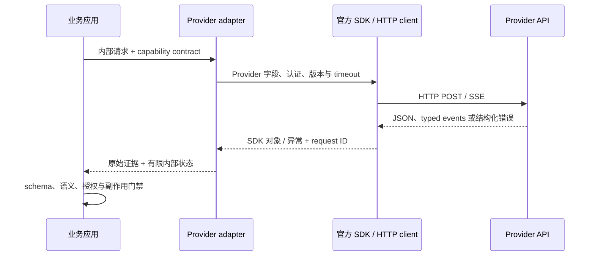

# HTTP、SDK 与请求生命周期

## 本节目标

理解 SDK 是 HTTP API 的封装，能定位序列化、连接、服务端处理、解析与业务验证各阶段的故障。

## 一次调用经过什么

1. 应用验证输入、上下文预算和权限。
2. adapter 把供应商无关请求映射为当前 SDK/HTTP 字段。
3. SDK 序列化 JSON、加入认证与版本头，通过 TLS 发送 HTTP 请求。
4. 服务端鉴权、限流并执行模型推理。
5. 客户端接收完整 JSON 或 SSE 事件流。
6. adapter 转换为统一结果；应用校验 schema、语义与授权。
7. 记录脱敏指标和请求 ID，再返回用户或执行下一步。

知道阶段才能正确分类：本地 JSON 序列化错误不应重试；DNS 或连接中断可能暂时可恢复；HTTP 401 多半需要修复认证；HTTP 429 需要遵循限流信息；响应成功也可能在业务校验阶段失败。

## SDK 还是直接 HTTP

官方 SDK 通常提供类型、认证、连接池、流式迭代和错误类，适合大多数项目。直接 HTTP 便于学习协议或处理 SDK 未覆盖的能力，但你要自己维护版本头、SSE framing、事件解析、错误形状、重试与兼容性。无论哪种，都应把供应商对象限制在 adapter 层。

SDK 可能自带重试和很长的默认超时。若外层、SDK、网关和队列各自重试，最坏请求次数会相乘。以本库锁定的 `openai-python 2.46.0` 为例，官方 README 记录默认 `max_retries=2`：连接错误、408、409、429 与 `>=500` 会自动重试；一次 SDK 调用因此最多可能产生 3 个 transport attempts。默认 timeout 是 10 分钟，timeout 本身也会进入默认重试。外层若再做 3 attempts，最坏就可能是 9 次网络尝试。该结论只属于这个 SDK 基线，不应推广给其他 SDK，也不能据此认定每个 409 都具备业务幂等性。

查阅并记录实际 SDK 版本与默认值，明确唯一重试负责人，再为总 attempts 和业务截止时间设上限。需要自定义时优先使用 SDK 的公开配置接口，不修改私有 transport 状态；禁用 SDK retry 后仍要在应用层保留错误分类、抖动和总预算。

超时也不是一个数字：至少区分连接、读取/流空闲、单次调用和业务总截止时间。SDK 能限制单次网络等待，应用层截止时间决定这次业务请求是否还值得继续。真实副作用应在生成之后由独立、幂等的业务步骤执行。

## Client 与 stream 生命周期

把 client 当作长生命周期资源：进程或 worker 启动时创建并复用连接池，退出时调用公开的 `close()/aclose()` 或使用上下文管理器。不要每次调用都新建 client；这会丢失连接复用并放大 DNS/TLS 成本。同步与异步 client 不要跨错误的事件循环共享。

stream 也有独立生命周期。消费者正常完成、用户取消、deadline 到期和解析失败时都要关闭响应上下文；停止读取不等于连接一定已释放。对异步任务，取消应向下传播并在 `finally`/上下文管理器中收尾，不能让后台 reader 继续消耗 token 或占用 socket。

## 明确三层表示

一次流式调用至少有三种表示，测试时不要混用：

| 层 | 例子 | 能证明什么 |
| --- | --- | --- |
| wire | HTTP headers、SSE `event:`/`data:` 字节 | framing、编码、代理与断线行为 |
| SDK typed object | SDK 解析后的 event/exception | 固定 SDK 版本的类型与公开属性 |
| application canonical | `response.started` 等内部事件 | 业务层稳定合同，不是 Provider 原始协议 |

离线 canonical 测试不能证明 wire framing；由手写 dict 组成的 typed projection 也不能证明 SDK 真能解码 live 响应。生产 adapter 需要分别做 fixture、SDK integration 与 live smoke test。

## 响应元数据

保留服务端请求 ID、HTTP 状态、完成/停止原因、用量、缓存信息与原始错误类型；不要依赖错误消息字符串，因为文案会变化。以当前 `openai-python` 为例，成功响应的公开 `_request_id` 和失败 `APIStatusError.request_id` 可用于排障；不要从其他私有字段猜 ID。其他 SDK 应按各自公开接口适配。原始请求/响应若含个人信息或机密，默认不持久化。

HTTP 请求 ID 与应用 `operation_id` 不同：前者通常每次 attempt 都变化，用于供应商排障；后者在同一业务操作的所有 attempts 中稳定，用于本地去重与追踪。不要用请求 ID 代替业务幂等键。

## 练习与自测

画出一次 SDK 调用的七阶段时序，并把“无密钥、连接超时、429、JSON 字段缺失、模型拒答、业务规则失败”放到对应阶段。自测：哪些失败可自动重试，哪些必须修改请求或请求人工处理？

## 掌握检查

- [ ] 我能把序列化、连接、服务端、流解析、业务校验和授权错误定位到具体层。
- [ ] 我已查明所用 SDK 的版本、默认超时与默认重试，不让多层策略相乘。
- [ ] 连接、读取/流空闲、单次调用和业务截止时间都有明确负责人。
- [ ] client 复用连接池并显式关闭；stream 在完成、取消、deadline 与解析失败时都会收尾。
- [ ] wire SSE、SDK typed event 与 application canonical event 分层测试，不把 projection 冒充 live 证据。
- [ ] 服务端 request ID 与应用 operation ID 分开记录，不把前者当幂等键。
- [ ] 供应商原始对象只存在于 adapter 层，应用合同不依赖其私有字段。

## 下一步

进入 [[LLM API集成/03-消息、配置与版本意识|消息、配置与版本意识]]。

## 参考资料

- [RFC 9110：HTTP Semantics](https://www.rfc-editor.org/rfc/rfc9110)
- [OpenAI：API errors](https://developers.openai.com/api/docs/guides/error-codes)（访问于 2026-07-21）
- [OpenAI：official Python SDK—Retries, timeouts, request IDs and closing](https://github.com/openai/openai-python)（访问于 2026-07-21）
- [Anthropic：API errors](https://platform.claude.com/docs/en/api/errors)（访问于 2026-07-21）
- [Anthropic：Python SDK](https://platform.claude.com/docs/en/cli-sdks-libraries/sdks/python)（client 生命周期，访问于 2026-07-21）
- [Google Gen AI SDK：Client reference](https://googleapis.github.io/python-genai/genai.html)（client 与 async client 关闭，访问于 2026-07-21）
