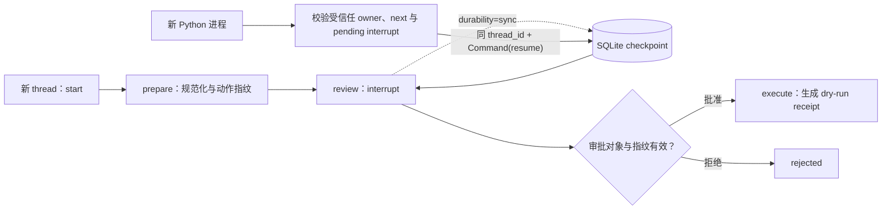

# 项目：LangGraph 可恢复审批流

## 项目目标

这一层直接运行 `langgraph==1.2.9` 与 SQLite checkpointer，不调用模型、不需要 API key。它要证明四件具体的事：图会在 `interrupt()` 暂停；检查点能跨 Python 进程保存；同一 `thread_id` 可通过 `Command(resume=...)` 恢复；包含 interrupt 的节点会从开头重跑。

示例动作只是确定性的文本规范化 dry run。它不会发送邮件、付款或写业务系统，因此不能把“检查点恢复成功”误写成“外部副作用恰好执行一次”。

## 三层项目各自证明什么

| 层 | 文件 | 证明范围 |
| --- | --- | --- |
| Layer A | `offline_agent_loop.py` | 框架无关的工具 schema、allowlist、call ID、预算和失败关闭 |
| Layer B | `langchain_layer_b/` | 锁定版本下真实 `create_agent` 的消息、ToolNode 分派和显式 schema-error 策略；不含 provider 协议证明 |
| Layer C | `langgraph_layer_b/` | 锁定版本下的 `StateGraph`、SQLite checkpointer、interrupt、恢复与 thread 守卫 |

三层缺一不可。Layer A 避免把安全职责交给框架；Layer B 防止课程只讲 `create_agent` 概念；Layer C 则把可恢复控制流放进真实 runtime。为了兼容旧链接，本页保留 `LangGraph Layer B` 别名，但当前学习路线把它定位为 Layer C。

## 图与恢复边界



恢复不是“从 `interrupt()` 下一行继续”。LangGraph 会从 `review` 节点开头重跑，再把 resume 值作为 `interrupt()` 的返回值。示例在测试中用计数器观察两次进入，但实际业务不应在 interrupt 前放非幂等写操作。

## 文件结构与依赖

```text
examples/langgraph_layer_b/
├── langgraph_approval_flow.py
├── requirements.txt
└── test_langgraph_approval_flow.py
```

`requirements.txt` 只固定两个直接依赖：

```text
langgraph==1.2.9
langgraph-checkpoint-sqlite==3.1.0
```

2026-07-22 的隔离安装同时解析到 `langgraph-checkpoint==4.1.1` 与 `langchain-core==1.5.0`。教学文件不是完整生产 lock；下一次解析可能得到不同的传递依赖，长期项目还要保存解析后的完整锁文件。

## 在 vault 外建立环境

以下命令从 `docs/LangChain/00-初学者路线/examples/langgraph_layer_b` 运行：

```powershell
$practice = Join-Path $env:TEMP ("langgraph-layer-b-{0}" -f [guid]::NewGuid())  # 为本次验证创建唯一的 vault 外临时环境目录。
py -3.11 -m venv $practice  # 用课程已验收的 Python 3.11 创建隔离虚拟环境。
$python = Join-Path $practice "Scripts\python.exe"  # 保存解释器绝对路径，避免依赖 PowerShell 激活状态。
& $python -m pip install --upgrade pip  # 升级临时环境中的 pip，确保使用当前解析器。
& $python -m pip install --requirement .\requirements.txt  # 安装 LangGraph 与 checkpoint 示例所需直接依赖。
& $python -m pip check  # 验证安装后的依赖关系没有缺失或冲突。
```

示例会在导入 LangGraph 前于其**子进程**设置 `LANGGRAPH_STRICT_MSGPACK=true`，把 msgpack 反序列化限制在 LangGraph 内置的安全类型 allowlist；若 checkpoint 中出现其他 Python 类型，会失败关闭。生产服务应在导入框架前同样显式设置该策略或传入等价 allowlist，不要依赖交互 shell 的遗留环境变量。它与 `JsonPlusSerializer(pickle_fallback=False)` 的独立 pickle 选项不是同一个开关，后者在当前默认配置本来就是关闭的。strict msgpack 降低恶意类型导入/构造风险，但不提供静态加密、租户授权或数据库访问控制。

## 用两个进程完成暂停与恢复

```powershell
$db = Join-Path $env:TEMP ("langgraph-approval-{0}.sqlite3" -f [guid]::NewGuid())  # 为审批 checkpoint 创建唯一临时 SQLite 文件路径。
$thread = "tenant-a:approval-001"  # 指定示例的持久 thread 标识，不把它当作授权凭据。
$owner = "tenant-a"  # 模拟服务端认证后得到的可信 owner 身份。

# 新进程启动审批 Flow；反引号仅把同一条 CLI 命令分成多行。
& $python -B .\langgraph_approval_flow.py `
  --db $db --thread-id $thread --owner-id $owner `
  start --text "  agent   reliability  "  # 传入会被规范化的草稿文本并停在审批 interrupt。

# 只读检查已持久化的裁剪状态，确认没有直接打印完整 checkpoint。
& $python -B .\langgraph_approval_flow.py `
  --db $db --thread-id $thread --owner-id $owner inspect  # 查询同一 thread 的当前可恢复状态。

# 用同一可信 owner 恢复，并提供明确的人工审批决定与审核者记录。
& $python -B .\langgraph_approval_flow.py `
  --db $db --thread-id $thread --owner-id $owner resume `
  --decision approve --reviewer "reviewer-a"  # 提交批准并让新进程完成恢复路径。
```

第一次命令应返回 `status=awaiting_approval`、`next=["review"]` 和一个绑定动作指纹的 interrupt。第二次只输出裁剪后的状态，不打印完整 checkpoint。第三次由新的 Python 进程重开 SQLite，终态应为 `completed`，并产生 `dry_run_result` 的持久状态和确定性 receipt。

应用包装层先调用 `get_state()`，只允许存在、绑定受信任 `owner_id`、`next == ("review",)`、恰有一个 pending interrupt 的 thread 恢复。它还在 `Command(resume=...)` **之前**拒绝不匹配的 schema、图或策略版本，并重新计算规范化输入、动作指纹与 approval request ID 的绑定；这样旧状态或不一致状态会失败关闭，而不会被交给 runtime 恢复。示例 CLI 的 `--owner-id` 只是模拟服务端从认证会话得到的主体，不会自行完成认证；真实 API 不能让客户端任意声明后就直接信任。这个合同守卫不是针对可直接篡改 SQLite 的攻击者的加密完整性或数据库访问控制；这些仍应由存储、密钥和认证授权层提供。`thread_id` 只是持久游标，不是审批凭据。

## 运行 10 项真实 runtime 测试

```powershell
& $python -B -m unittest -v test_langgraph_approval_flow.py  # 在普通模式运行 10 项真实 runtime 回归测试。
& $python -B -O -m unittest -v test_langgraph_approval_flow.py  # 确认关键校验不依赖优化模式会移除的裸 assert。
& $python -B -W error -m unittest -v test_langgraph_approval_flow.py  # 以 warning 即失败的策略重新运行测试。
& $python -B -O -W error -m unittest -v test_langgraph_approval_flow.py  # 覆盖优化与严格 warning 的组合条件。
```

测试覆盖：暂停载荷、跨连接恢复、拒绝终态、未知 thread、重复 start、`thread_id` 首尾空白规范化、owner 错配、已完成 thread 的错误 resume、审批指纹篡改、节点重放和两个独立 Python 进程。另有两个 pause-shaped snapshot fake：它们证明应用包装层会在调用 runtime 前拒绝不兼容的 schema/graph/policy 版本和不一致的规范化状态，并确认实际 SQLite 中原先暂停的 thread 未被消费。规范化用例会关闭并重开 SQLite，确认 inspect 与 resume 使用同一个持久键；`-O` 证明生产校验没有依赖会被移除的裸 `assert`。

2026-07-22 使用隔离依赖实跑，10 项测试在 normal、`-O`、`-W error` 和 `-O -W error` 模式各通过一次；跨进程用例实际启动 start、inspect、resume 三个 CLI 进程并共享临时 SQLite，测试结束后目录被清理。

## `durability="sync"` 的准确含义

本项目在 `invoke()` 时显式使用 `durability="sync"`，让 checkpoint 在进入下一步前同步写入。当前 runtime 还提供 `async` 与 `exit` 等耐久模式，它们在吞吐与崩溃窗口之间取舍。

同步 checkpoint 仍不是跨系统事务。真实写工具需要独立的幂等键、外部回执查询、未知结果处理和对账；生产 checkpointer 还要验证并发、备份、迁移、删除、加密与租户访问控制。示例中的 `SqliteSaver` 只定位于本地学习和小型同步实验。

## 验收清单

- [ ] 第一次进程停在唯一 `review` interrupt。
- [ ] 新进程用同一 thread 恢复，批准与拒绝进入不同终态。
- [ ] 新、owner 错配、已完成或未暂停的 thread 不能被应用包装层 resume。
- [ ] schema、图和策略版本，以及审批 request ID、动作指纹、决定和 reviewer 形状都经过校验。
- [ ] 测试证明 interrupt 节点重跑，但 interrupt 前没有业务副作用。
- [ ] 能解释 strict msgpack allowlist、默认关闭的 pickle fallback、同步 checkpoint、幂等与加密各自解决什么问题。
- [ ] 不把 SQLite 示例描述为生产 exactly-once 保证。

## 下一步

进入 [[LangChain/00-初学者路线/09-测试评测与升级清单|测试、评测与升级清单]]，把真实恢复测试纳入依赖升级门禁。

## 主要参考资料

API、包版本和隔离实跑核对日期：2026-07-22。

- [LangGraph Interrupts](https://docs.langchain.com/oss/python/langgraph/interrupts)
- [LangGraph Persistence](https://docs.langchain.com/oss/python/langgraph/persistence)
- [LangGraph Checkpointers](https://docs.langchain.com/oss/python/langgraph/checkpointers)
- [LangGraph Testing](https://docs.langchain.com/oss/python/langgraph/test)
- [SqliteSaver API](https://reference.langchain.com/python/langgraph.checkpoint.sqlite/SqliteSaver)
- [PyPI：langgraph 1.2.9](https://pypi.org/project/langgraph/1.2.9/)
- [PyPI：langgraph-checkpoint 4.1.1](https://pypi.org/project/langgraph-checkpoint/4.1.1/)
- [PyPI：langgraph-checkpoint-sqlite 3.1.0](https://pypi.org/project/langgraph-checkpoint-sqlite/3.1.0/)
