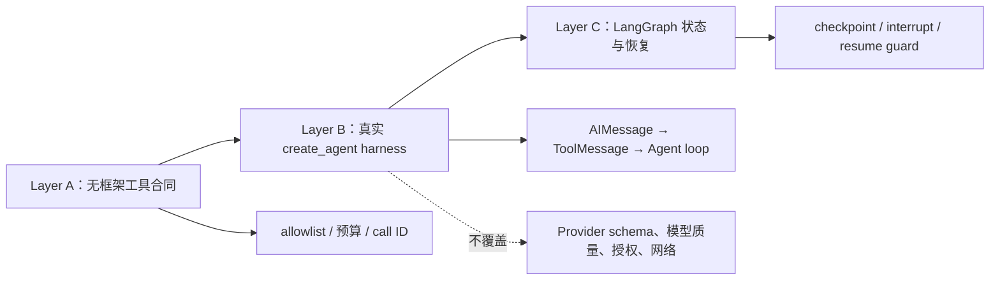

# 项目：无密钥 create_agent 运行时合同

## 项目目标

这一层在锁定的 `langchain==1.3.14` 中实际运行 `create_agent`，却不访问模型提供商、不需要 API key，也不写业务数据。它补在框架无关的 [[LangChain/00-初学者路线/07-项目-离线工具代理骨架|Layer A 离线工具循环]] 与 [[LangChain/00-初学者路线/08-项目-LangGraph可恢复审批流|Layer C LangGraph 恢复流]] 之间：前者固定不依赖框架的安全合同，本节验证当前 LangChain harness 如何把模型消息、工具调用和 `ToolMessage` 接起来。

> [!important] 证据边界
> 本项目的 `ScriptedToolModel` 是对 `FakeMessagesListChatModel` 的小型测试 shim。它为了让 `create_agent` 运行而绕过了真实提供商的 `bind_tools` 序列化。因此，绿灯只证明固定版本中本地 Agent graph、ToolNode 分派、tool call ID 与显式错误策略；它**不能**证明 OpenAI、Anthropic 或其他提供商接受同一 schema，也不能证明真实模型会选对工具、对象级授权正确或网络调用成功。

## 三层项目怎样衔接



不要把三层互相替代：框架运行成功不会自动给 Layer A 的工具加授权，也不会让 Layer C 的 checkpoint 成为跨系统事务。

## 文件与依赖

```text
examples/langchain_layer_b/
├── requirements.txt                 # 三个直接运行时依赖的固定版本
├── scripted_create_agent.py          # 可直接运行的固定轨迹
└── test_scripted_create_agent.py     # 8 项回归测试
```

`requirements.txt` 把本例直接运行所依赖的 `langchain==1.3.14`、`langchain-core==1.4.9` 和 `langgraph==1.2.9` 一并固定。脚本会在构建 Agent **之前**逐一核验这三个已安装版本，任何不匹配都会以非零退出码失败关闭；这是教学合同，不是替代完整解析结果的 lockfile。Pydantic 等传递依赖仍会影响行为，真实项目应保存完整 lockfile，升级时重跑本节和相邻 Layer C。

## 实际运行什么

`scripted_create_agent.py` 对同一个真实 `create_agent` 运行三条预写轨迹：

| 模式 | 模型消息请求 | 预期 ToolMessage | 被测边界 |
| --- | --- | --- | --- |
| `success` | `bounded_add(a=2, b=3)` | `success`、同一 `call-add-2-3`、内容 `5` | 正常工具分派与 call ID 对应 |
| `unknown_tool` | 不在注册表中的工具 | `error`，函数从未执行 | runtime 不把未知名字映射到可用工具 |
| `invalid_arguments` | `bounded_add(a="2", b=3)` | `error`，函数从未执行 | 严格 Pydantic schema 与错误观测 |

示例为 `StructuredTool` 显式设置 `handle_validation_error="invalid_tool_arguments"`。这是本项目选择的失败策略；不要误以为所有 `create_agent` 或 ToolNode 配置都会自动把验证异常转成可继续的消息。需要重试时，应只对已分类的瞬时异常使用有上限的 middleware；输入或权限错误不能通过重试绕过。

## 在隔离环境运行

从仓库根目录执行：

```powershell
$example = Resolve-Path '.\docs\LangChain\00-初学者路线\examples\langchain_layer_b'  # 解析 Layer B 示例目录，确保后续相对文件路径稳定。
Push-Location $example  # 临时进入示例目录。
try {  # 即使某个模式失败，也保证 finally 会恢复当前目录。
    uv run --isolated --with-requirements '.\requirements.txt' python -B '.\scripted_create_agent.py' --mode success  # 验证正常工具调用与 call ID 对应。
    uv run --isolated --with-requirements '.\requirements.txt' python -B '.\scripted_create_agent.py' --mode unknown_tool  # 验证未知工具名在函数执行前被拒绝。
    uv run --isolated --with-requirements '.\requirements.txt' python -B '.\scripted_create_agent.py' --mode invalid_arguments  # 验证不合格参数在 schema 校验阶段被拒绝。

    uv run --isolated --with-requirements '.\requirements.txt' python -B -m unittest -v '.\test_scripted_create_agent.py'  # 在普通解释器模式运行完整合同测试。
    uv run --isolated --with-requirements '.\requirements.txt' python -B -O -m unittest -v '.\test_scripted_create_agent.py'  # 检查生产校验不依赖裸 assert。
    uv run --isolated --with-requirements '.\requirements.txt' python -B -W error -m unittest -v '.\test_scripted_create_agent.py'  # 把警告提升为失败，检查兼容性边界。
    uv run --isolated --with-requirements '.\requirements.txt' python -B -O -W error -m unittest -v '.\test_scripted_create_agent.py'  # 覆盖优化与严格 warning 的组合环境。
} finally {  # 无论脚本或测试结果如何，都执行目录栈恢复。
    Pop-Location  # 回到调用前的项目根目录。
}
```

安装阶段会访问包索引；脚本运行本身不访问网络、不读取密钥、不创建数据库。CLI 明确以 UTF-8 输出 JSON，使含中文的负向路径也能被 Windows 子进程稳定解析，并输出所核验的三项版本。2026-07-22 的隔离实跑中，8 项测试在 normal、`-O`、`-W error` 和 `-O -W error` 模式各通过一次；CLI 子测试对三种轨迹逐一比较 normal 与 `-O` 的完整 JSON 合同。

## 真正的 Provider smoke test 还应另做

在项目自己的测试环境中，另建少量、受费用和凭据控制的 smoke test。它至少应记录：提供商包和模型 ID、传给 `bind_tools` 的 schema、实际工具调用与 `ToolMessage.tool_call_id`、超时/错误分类、结构化输出策略，以及不含原始敏感输入的 trace。这个 smoke test 才能验证 provider 端的 schema 转换；仍不能替代离线的授权、幂等、RAG 或恢复回归。

> [!warning] 不把工具 schema 当授权
> 即使真实 provider 通过了 smoke test，模型传入的 `order_id`、URL、SQL 和路径仍是不可信输入。对象级授权、资源范围、审批、幂等键和结果未知恢复必须在工具/服务端执行，详见 [[Tool Calling（含 Function Calling）/00-目录|Tool Calling（含 Function Calling）]]。

## 验收

- [ ] 已在三个固定运行时依赖的环境运行三个 CLI 模式，并核对其输出版本。
- [ ] 8 项测试在 normal、`-O`、`-W error` 和 `-O -W error` 四种模式通过，且没有依赖裸 `assert`。
- [ ] 能说明 unknown tool 与 schema error 为什么函数不会执行。
- [ ] 能说明 fake shim 证明了什么、没有证明什么。
- [ ] 已把真实 provider smoke、授权和质量评测作为独立门禁，而非把本例的“completed”当作上线证据。

## 下一步

继续运行 [[LangChain/00-初学者路线/08-项目-LangGraph可恢复审批流|LangGraph 可恢复审批流]]，把本节的有限工具循环放进可恢复的显式状态控制中。

## 资料基线

官方事实与隔离实跑核对日期：2026-07-22。

- [LangChain Agents](https://docs.langchain.com/oss/python/langchain/agents)
- [LangChain Tools](https://docs.langchain.com/oss/python/langchain/tools)
- [LangChain v1 migration](https://docs.langchain.com/oss/python/migrate/langchain-v1)
- [LangChain Agent Evals](https://docs.langchain.com/oss/python/langchain/test/evals)
- [PyPI：langchain 1.3.14](https://pypi.org/project/langchain/1.3.14/)
