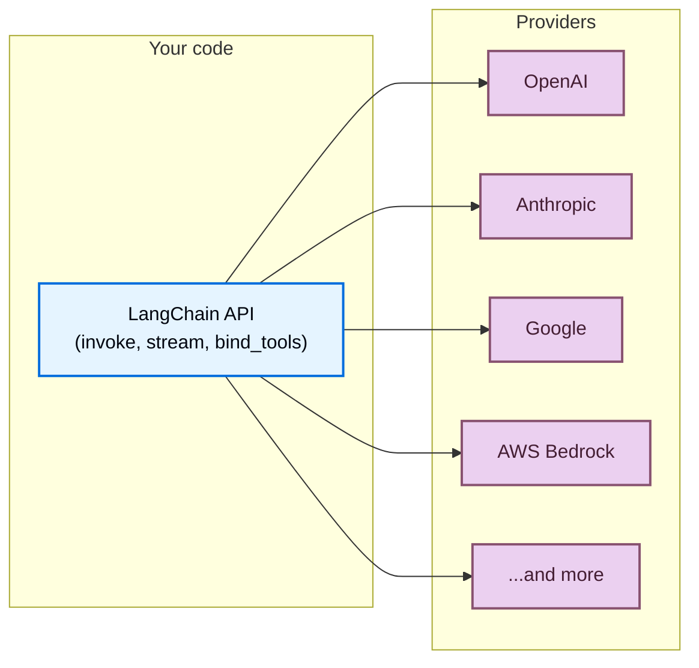

# 提供商和模型

> 了解 LangChain 如何使用提供商为您提供适用于任何提供商的任何模型的单一 API

LangChain 为您提供了一个统一的 API，可以使用任何提供商的模型。安装提供商包，选择模型名称，然后开始构建 - 无论您使用 OpenAI、Anthropic、Google 还是任何其他受支持的提供商，都可以使用相同的代码。

## 适用于任何模型的统一 API

每个LangChain聊天模型，无论提供商如何，都实现相同的接口。这意味着您可以：

* **交换提供商**，无需重写应用程序逻辑
* **使用相同的代码并排比较模型**
* **在所有提供商中使用高级功能**，例如[工具调用](https://docs.langchain.com/oss/python/langchain/tools)、[结构化输出](https://docs.langchain.com/oss/python/langchain/structured-output)和[流](https://docs.langchain.com/oss/python/langchain/streaming)
```python
from langchain.chat_models import init_chat_model

# 初始化 chat model：后续 agent、chain 或 graph 都会通过这个模型向 LLM 发请求。
openai_model = init_chat_model("openai:gpt-5.4")
anthropic_model = init_chat_model("anthropic:claude-opus-4-6")
google_model = init_chat_model("google-genai:gemini-3.1-pro-preview")

for model in [openai_model, anthropic_model, google_model]:
    response = model.invoke("Explain quantum computing in one sentence.")
    print(response.text)
```
## 什么是提供商？

**提供商**是托管 AI 模型并通过 API 公开它们的公司或平台。示例包括 OpenAI、Anthropic、Google 和 AWS Bedrock。

在LangChain中，每个提供商都有一个专用的**集成包**（例如`langchain-openai`，`langchain-anthropic`），为该提供商的模型实现标准LangChain接口。这意味着：

* **针对每个提供商的专用包**，具有适当的版本控制和依赖项管理
* **特定于提供商的功能**在您需要时可用（例如 OpenAI 的 Responses API、Anthropic 的 extended thinking）
* **通过环境变量自动 API 密钥处理**
```shell
# 安装依赖：先把示例需要的包安装到当前 Python 环境。
uv add langchain-openai       # For OpenAI models
uv add langchain-anthropic    # For Anthropic models
uv add langchain-google-genai # For Google models
```
有关提供商包的完整列表，请参阅[集成页面](https://docs.langchain.com/oss/python/integrations/providers/overview)。

## 查找模型名称

每个提供商都支持您在初始化聊天模型时传递的特定模型名称。指定模型有两种方法：
```python
from langchain.chat_models import init_chat_model

# 初始化 chat model：后续 agent、chain 或 graph 都会通过这个模型向 LLM 发请求。
model = init_chat_model("openai:gpt-5.4")
```

```python
from langchain_openai import ChatOpenAI

# 这里创建具体 provider 的聊天模型对象；保留 provider 名称，便于和官方文档对照。
model = ChatOpenAI(model="gpt-5.4")
```
当使用[`init_chat_model`](https://reference.langchain.com/python/langchain/chat_models/base/init_chat_model)和`provider:model`格式时，LangChain会自动解析提供商并加载正确的集成包。如果模型名称可以明确归属（例如 `"gpt-5.4"` 解析为 OpenAI），您还可以省略提供商前缀。

要查找提供商的可用模型名称，请参阅各提供商自己的文档。以下是一些受欢迎的提供商：

| 提供商 | 哪里可以找到模型名称 |
| :-------------------------------------------------------- | :----------------------------------------------------------------------------------------------------- |
| [OpenAI](https://docs.langchain.com/oss/python/integrations/providers/openai) | [OpenAI 模型页面](https://platform.openai.com/docs/models) |
| [Anthropic](https://docs.langchain.com/oss/python/integrations/providers/anthropic) | [Anthropic 模型页面](https://docs.anthropic.com/en/docs/about-claude/models) |
| [谷歌](https://docs.langchain.com/oss/python/integrations/providers/google) | [Google AI 模型页面](https://ai.google.dev/gemini-api/docs/models) |
| [AWS Bedrock](https://docs.langchain.com/oss/python/integrations/providers/aws) | [Bedrock 支持的模型](https://docs.aws.amazon.com/bedrock/latest/userguide/models-supported.html) |
| [Ollama](https://docs.langchain.com/oss/python/integrations/providers/ollama) | [Ollama模型库](https://ollama.com/library) |
| [Groq](https://docs.langchain.com/oss/python/integrations/providers/groq) | [Groq 支持的模型](https://console.groq.com/docs/models) |

## 立即使用新模型

由于 LangChain 提供商包将模型名称直接传递到提供商的 API，因此您可以在提供商发布新模型时使用它们（无需更新 LangChain）。只需传递新的模型名称：
```python
# 初始化 chat model：后续 agent、chain 或 graph 都会通过这个模型向 LLM 发请求。
model = init_chat_model("google_genai:gemini-mythos")
```
只要您的提供商包版本支持模型所需的 API 版本，新模型名称就会立即生效。在大多数情况下，模型版本是向后兼容的并且不需要包更新。

## 模型能力

不同的提供商和模型支持不同的功能。
有关聊天模型集成及其功能的列表，请参阅[聊天模型集成页面](https://docs.langchain.com/oss/python/integrations/chat)。

## 路由器和代理

**路由器**（也称为代理或网关）使您可以通过单个 API 和凭证访问来自多个提供商的模型。它们可以简化计费，让您在不改变集成的情况下在模型之间切换，并提供自动回退和负载平衡等功能。

| 提供商 | 一体化 | 描述 |
| :----------------------------------- | :----------------------------------------------------------- | :------------------------------------------------------------------------------- |
| [OpenRouter](https://openrouter.ai/) | [`ChatOpenRouter`](https://docs.langchain.com/oss/python/integrations/chat/openrouter) | 统一访问来自 OpenAI、Anthropic、Google、Meta 等的模型 |
| [LiteLLM](https://www.litellm.ai/) | [`ChatLiteLLM`](https://docs.langchain.com/oss/python/integrations/chat/litellm) | 为 100 多家提供商提供统一界面，提供路由、回退和支出跟踪功能 |

当您想要执行以下操作时，路由器很有用：

* **使用单个 API 密钥和计费帐户访问许多提供商**
* **动态切换模型**，无需管理多个提供商凭据
* **使用后备模型**，如果主模型失败，会自动使用不同的模型重试
```python
from langchain.chat_models import init_chat_model

# 初始化 chat model：后续 agent、chain 或 graph 都会通过这个模型向 LLM 发请求。
model = init_chat_model("openrouter:anthropic/claude-sonnet-4-6")
response = model.invoke("Hello!")
```
## OpenAI 兼容端点

许多提供商提供与 OpenAI 的 [聊天完成 API](https://platform.openai.com/docs/api-reference/chat) 兼容的端点。您可以使用 [`ChatOpenAI`](https://docs.langchain.com/oss/python/integrations/chat/openai) 和自定义 `base_url` 连接到这些：
```python
from langchain_openai import ChatOpenAI

# 这里创建具体 provider 的聊天模型对象；保留 provider 名称，便于和官方文档对照。
model = ChatOpenAI(
    base_url="https://your-provider.com/v1",
    api_key="your-api-key",
    model="provider-model-name",
)
```
> [!warning]
`ChatOpenAI` 仅针对 [官方 OpenAI API 规范](https://github.com/openai/openai-openapi)。不会提取或保留来自第三方提供商的非标准响应字段。当您需要访问非标准功能时，请使用专用的提供商包或路由器。

## 后续步骤

  - [模型指南](https://docs.langchain.com/oss/python/langchain/models)：学习如何使用模型：调用、流、批处理、工具调用等。

  - [聊天模型集成](https://docs.langchain.com/oss/python/integrations/chat)：浏览所有聊天模型集成及其功能。

  - [所有提供商](https://docs.langchain.com/oss/python/integrations/providers/overview)：查看提供商包和集成的完整列表。

  - [Agents](https://docs.langchain.com/oss/python/langchain/agents)：构建使用模型作为推理引擎的代理。
