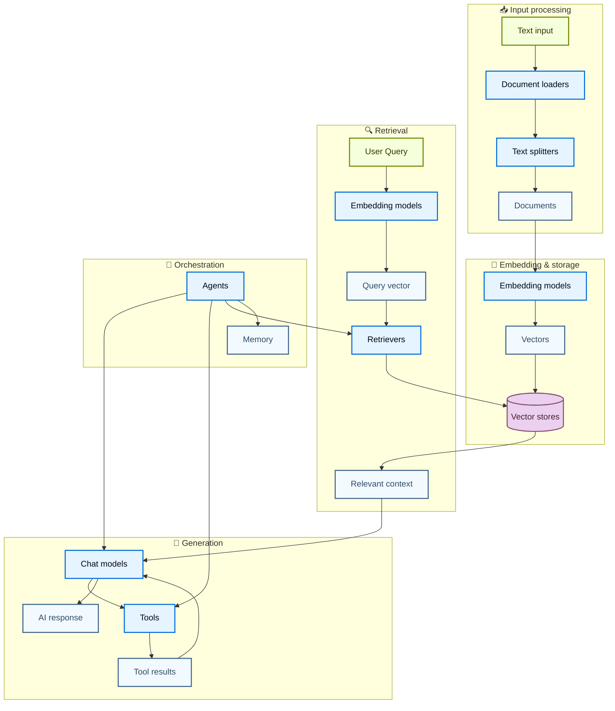
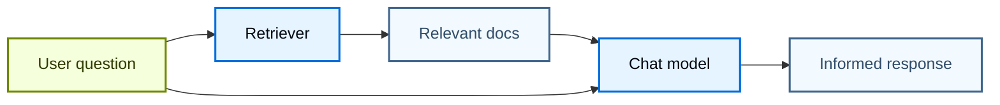
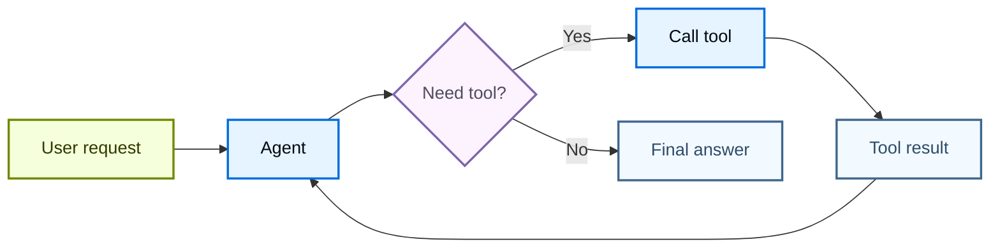
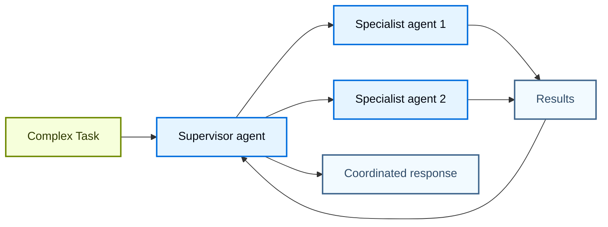

# 组件架构

LangChain 的力量来自于其组件如何协同工作来创建复杂的人工智能应用程序。此页面提供的图显示了不同组件之间的关系。

## 核心组件生态系统

下图展示了LangChain 的主要组件如何连接形成完整的AI 应用：

### 流程解释
- Input processing
	- Text input：指的是你要放进知识库里的原始文本。它包括：普通文本、上传的 TXT / Markdown / PDF / Word 等类型中的文本。
	- Document loaders：将从不同来源读取数据转成 LangChain 统一的 Document 格式。
	- Text splitters：把 Document loader 读进来的长文档，切成一小段一小段，方便后面做检索和向量化。（切分规则可以手动设置）
- Embedding & storage （这个模块不是必须，做“语义检索 / RAG / 知识库问答”的时候，通常才需要向量模型）
	- Vector stores：每个块一个向量。
- Retrieval
	- User Query：指的是用户在系统运行时输入的问题。（上传的附件也包括）
	- Retrievers：检索器，根据用户问题，从知识库 / 向量数据库 / 搜索系统里找出最相关的内容。（Retriever 最常见的设计就是：把 Query vector 和文档向量做相似度计算，然后取最相似的 Top-K 文档块）
	- Relevant context 就是：Retriever 从知识库里找出来的、和用户问题最相关的文本片段。
- Orchestration：编排层 / 调度层。
	- Agent：连接 Chat models、Tools、Retrievers 和 Memory

### 组件如何连接

每个组件层都建立在前面的组件层之上：

1. **输入处理** – 将原始数据转换为结构化文档
2. **嵌入和存储** – 将文本转换为可搜索的向量表示
3. **检索** – 根据用户查询查找相关信息
4. **一代** – 使用人工智能模型来创建响应，可选择使用工具
5. **编排** – 通过代理和记忆系统协调一切

## 组件类别

LangChain 将组件分为以下主要类别：

| 类别 | 目的 | 关键部件 | 使用案例 |
| -------------------------------------------------------------------- | --------------------------- | ----------------------------------- | -------------------------------------------------- |
| **[模型](https://docs.langchain.com/oss/python/langchain/models)** | AI推理与生成 | 聊天模型、LLM、嵌入模型 | 文本生成、推理、语义理解 |
| **[工具](https://docs.langchain.com/oss/python/langchain/tools)** | 外部能力 | API、数据库等 | 网络搜索、数据访问、计算 |
| **[代理](https://docs.langchain.com/oss/python/langchain/agents)** | 编排和推理 | ReAct 代理、工具调用代理 | 不确定性工作流、决策 |
| **[内存](https://docs.langchain.com/oss/python/langchain/short-term-memory)** | 上下文保存 | 消息历史记录、自定义状态 | 对话、有状态的交互 |
| **[检索器](https://docs.langchain.com/oss/python/integrations/retrievers)** | 信息获取 | 向量检索器、网络检索器 | RAG、知识库搜索 |
| **[文件处理](https://docs.langchain.com/oss/python/integrations/document_loaders)** | 数据摄取 | 加载器、分割器、转换器 | PDF 处理、网页抓取 |
| **[向量存储](https://docs.langchain.com/oss/python/integrations/vectorstores)** | 语义搜索 | Chroma、Pinecone、FAISS | 相似性搜索、嵌入存储 |

## 常见模式

### RAG（检索增强生成）

### 带工具的代理

### 多代理系统

## 了解更多

* [创建代理](https://docs.langchain.com/oss/python/langchain/agents)
* [使用工具](https://docs.langchain.com/oss/python/langchain/tools)
* [浏览集成](https://docs.langchain.com/oss/python/integrations/providers/overview)
