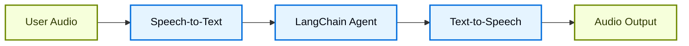
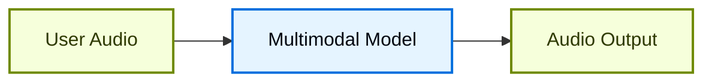

# 语音代理

## 概述

聊天界面主导了我们与人工智能的交互方式，但多模态 AI的最新突破正在开辟令人兴奋的新可能性。现在，高质量的生成模型和富有表现力的文本转语音 (TTS) 系统使得构建感觉不像工具而更像对话伙伴的代理成为可能。

语音代理就是这样的一个例子。您可以使用口语与其进行交互，而不是依靠键盘和鼠标向代理输入输入。这可能是一种更自然、更有吸引力的与人工智能交互的方式，并且对于某些情况特别有用。

### 什么是语音代理？

语音代理是可以与用户进行自然语音对话的[代理](https://docs.langchain.com/oss/python/langchain/agents)。这些代理结合了语音识别、自然语言处理、生成式人工智能和文本转语音技术，以创建无缝、自然的对话。

它们适用于各种用例，包括：

* 客户支持
* 私人助理
* 免提接口
* 辅导和培训

### 语音代理如何工作？

从高层次来看，每个语音代理都需要处理三项任务：

1. **听** - 捕获音频并转录它
2. **思考** - 解释意图、原因、计划
3. **说话** - 生成音频并将其流回给用户

不同之处在于这些步骤的顺序和耦合方式。在实践中，生产代理遵循两种主要架构之一：

#### 1. STT > Agent > TTS 架构（“三明治”）

Sandwich 架构由三个不同的组件组成：语音转文本 (STT)、基于文本的 LangChain 代理和文本转语音 (TTS)。

**优点：**

* 完全控制每个组件（根据需要交换 STT/TTS 提供商）
* 访问现代文本模态模型的最新功能
* 透明的行为，组件之间有清晰的界限

**缺点：**

* 需要编排多个服务
* 管理管道的额外复杂性
* 从语音到文本的转换会丢失信息（例如语气、情绪）

#### 2. 语音到语音架构（S2S）

语音转语音使用多模态模型来处理音频输入并本机生成音频输出。

**优点：**

* 架构更简单，移动部件更少
* 简单交互的延迟通常较低
* 直接音频处理捕捉语音的语气和其他细微差别

**缺点：**

* 模型选择有限，提供商锁定的风险更大
* 特征可能落后于文本模态模型
* 音频处理方式透明度较低
* 降低可控性和定制选项

本指南演示了**三明治架构**来平衡性能、可控性和对现代模型功能的访问。该三明治可以通过一些 STT 和 TTS 提供商实现低于 700 毫秒的延迟，同时保持对模块化组件的控制。

### 演示应用程序概述

我们将逐步使用三明治架构构建基于语音的代理。该代理将管理一家三明治店的订单。该应用程序将演示三明治架构的所有三个组件，使用 [AssemblyAI](https://www.assemblyai.com/) 进行 STT，使用 [Cartesia](https://cartesia.ai/) 进行 TTS（尽管可以为大多数提供商构建适配器）。

[voice-sandwich-demo](https://github.com/langchain-ai/voice-sandwich-demo) 存储库中提供了端到端参考应用程序。我们将在这里详细介绍该应用程序。

该演示使用 WebSockets 在浏览器和服务器之间进行实时双向通信。相同的架构可以适用于其他传输，例如电话系统（Twilio、Vonage）或 WebRTC 连接。

### 建筑学

该演示实现了一个流管道，其中每个阶段异步处理数据：

**客户端（浏览器）**

* 捕获麦克风音频并将其编码为 PCM
* 与后端服务器建立 WebSocket 连接
* 将音频块实时传输到服务器
* 接收并播放合成语音音频

**服务器（Python）**

* 接受来自客户端的 WebSocket 连接

* 协调三步管道：
  * [语音转文本 (STT)](#1-speech-to-text)：将音频转发到 STT 提供商（例如 AssemblyAI），接收转录事件
* [Agent](#2-langchain-agent)：使用 LangChain 代理处理转录文本，并流式传输响应 token
  * [文本转语音 (TTS)](#3-text-to-speech)：将代理响应发送到 TTS 提供商（例如 Cartesia），接收音频块

* 将合成音频返回给客户端进行播放

该管道使用异步生成器在每个阶段启用流式传输。这允许下游组件在上游阶段完成之前开始处理，从而最大限度地减少端到端延迟。

## 设置

有关详细的安装说明和设置，请参阅[存储库自述文件](https://github.com/langchain-ai/voice-sandwich-demo#readme)。

## 1. 语音转文字

STT 阶段将传入的音频流转换为文本转录。该实现使用生产者-消费者模式来同时处理音频流和文字记录接收。

### 关键概念

**生产者-消费者模式**：音频块在接收转录事件的同时发送到 STT 服务。这允许在所有音频到达之前开始转录。

**事件类型**：

* `stt_chunk`：STT 服务处理音频时提供的部分转录内容
* `stt_output`：触发代理处理的最终格式化记录

**WebSocket 连接**：保持与 AssemblyAI 的实时 STT API 的持久连接，配置为具有自动转向格式化功能的 16kHz PCM 音频。

### 执行
```python
from typing import AsyncIterator
import asyncio
from assemblyai_stt import AssemblyAISTT
from events import VoiceAgentEvent

async def stt_stream(
    audio_stream: AsyncIterator[bytes],
) -> AsyncIterator[VoiceAgentEvent]:
    """
    Transform stream: Audio (Bytes) → Voice Events (VoiceAgentEvent)

    Uses a producer-consumer pattern where:
    - Producer: Reads audio chunks and sends them to AssemblyAI
    - Consumer: Receives transcription events from AssemblyAI
    """
    stt = AssemblyAISTT(sample_rate=16000)

    async def send_audio():
        """Background task that pumps audio chunks to AssemblyAI."""
        try:
            # async for 会逐个处理异步事件，常用于 streaming、语音转写和实时 UI。
            async for audio_chunk in audio_stream:
                await stt.send_audio(audio_chunk)
        finally:
            # 音频流结束时发送完成信号。
            await stt.close()

    # 在后台启动音频发送任务。
    send_task = asyncio.create_task(send_audio())

    try:
        # 转写事件一到达就立即产出，便于实时处理。
        async for event in stt.receive_events():
            yield event
    finally:
        # 清理步骤。
        with contextlib.suppress(asyncio.CancelledError):
            send_task.cancel()
            await send_task
        await stt.close()
```
该应用程序实现了 AssemblyAI 客户端来管理 WebSocket 连接和消息解析。请参阅下面的实现；可以为其他 STT 提供商构建类似的适配器。

### AssemblyAI客户端
```python
class AssemblyAISTT:
    def __init__(self, api_key: str | None = None, sample_rate: int = 16000):
        self.api_key = api_key or os.getenv("ASSEMBLYAI_API_KEY")
        self.sample_rate = sample_rate
        self._ws: WebSocketClientProtocol | None = None

    async def send_audio(self, audio_chunk: bytes) -> None:
        """Send PCM audio bytes to AssemblyAI."""
        ws = await self._ensure_connection()
        await ws.send(audio_chunk)

    async def receive_events(self) -> AsyncIterator[STTEvent]:
        """Yield STT events as they arrive from AssemblyAI."""
        # async for 会逐个处理异步事件，常用于 streaming、语音转写和实时 UI。
        async for raw_message in self._ws:
            message = json.loads(raw_message)

            if message["type"] == "Turn":
                # 最终整理后的转写文本。
                if message.get("turn_is_formatted"):
                    yield STTOutputEvent.create(message["transcript"])
                # 当前仍在更新的临时转写文本。
                else:
                    yield STTChunkEvent.create(message["transcript"])

    async def _ensure_connection(self) -> WebSocketClientProtocol:
        """Establish WebSocket connection if not already connected."""
        if self._ws is None:
            url = f"wss://streaming.assemblyai.com/v3/ws?sample_rate={self.sample_rate}&format_turns=true"
            self._ws = await websockets.connect(
                url,
                additional_headers={"Authorization": self.api_key}
            )
        return self._ws
```
## 2.LangChain代理

代理阶段通过 LangChain [agent](https://docs.langchain.com/oss/python/langchain/agents) 处理文本转录并流式传输响应令牌。在这种情况下，我们流式传输由代理生成的所有[文本内容块](https://docs.langchain.com/oss/python/langchain/messages#content-block-reference)。

### 关键概念

**流式响应**：代理使用 [`stream_mode="messages"`](https://docs.langchain.com/oss/python/langchain/streaming#llm-tokens) 在生成响应令牌时发出响应令牌，而不是等待完整的响应。这使得 TTS 阶段能够立即开始合成。

**对话记忆**：[checkpointer](https://docs.langchain.com/oss/python/langchain/short-term-memory) 使用唯一的线程 ID 维护各个轮次的对话状态。这允许代理参考对话中之前的交换。

### 执行
```python
from langchain_core.utils.uuid import uuid7
from langchain.agents import create_agent
from langchain.messages import HumanMessage
from langgraph.checkpoint.memory import InMemorySaver

# 定义 agent 可调用的 tools。
def add_to_order(item: str, quantity: int) -> str:
    """Add an item to the customer's sandwich order."""
    return f"Added {quantity} x {item} to the order."

def confirm_order(order_summary: str) -> str:
    """Confirm the final order with the customer."""
    return f"Order confirmed: {order_summary}. Sending to kitchen."

# 创建带工具和记忆能力的 agent。
agent = create_agent(
    model="google_genai:gemini-3.1-pro-preview",  # 选择要使用的模型。
    tools=[add_to_order, confirm_order],
    system_prompt="""You are a helpful sandwich shop assistant.
    Your goal is to take the user's order. Be concise and friendly.
    Do NOT use emojis, special characters, or markdown.
    Your responses will be read by a text-to-speech engine.""",
    # checkpointer 保存线程内的执行状态，用于多轮对话、暂停恢复和 human-in-the-loop。
    checkpointer=InMemorySaver(),
)

async def agent_stream(
    event_stream: AsyncIterator[VoiceAgentEvent],
) -> AsyncIterator[VoiceAgentEvent]:
    """
    Transform stream: Voice Events → Voice Events (with Agent Responses)

    Passes through all upstream events and adds agent_chunk events
    when processing STT transcripts.
    """
    # 生成唯一 thread_id，用来区分不同会话的记忆。
    thread_id = str(uuid7())

    # async for 会逐个处理异步事件，常用于 streaming、语音转写和实时 UI。
    async for event in event_stream:
        # 透传所有上游事件。
        yield event

        # 把最终转写文本交给 agent 处理。
        if event.type == "stt_output":
            # 带着对话上下文流式生成 agent 回复。
            stream = agent.astream(
                {"messages": [HumanMessage(content=event.transcript)]},
                {"configurable": {"thread_id": thread_id}},
                stream_mode="messages",
            )

            # agent 响应片段一到达就产出。
            async for message, _ in stream:
                if message.text:
                    yield AgentChunkEvent.create(message.text)
```
## 3. 文字转语音

TTS 阶段将代理响应文本合成为音频并将其流式传输回客户端。与 STT 阶段一样，它使用生产者-消费者模式来处理并发文本发送和音频接收。

### 关键概念

**并发处理**：该实现合并两个异步流：

* **上游处理**：传递所有事件并将代理文本块发送到 TTS 提供商
* **音频接收**：从 TTS 提供商接收合成音频块

**流式 TTS**：某些提供商（例如 [Cartesia](https://cartesia.ai/)）在收到文本后立即开始合成音频，从而使音频播放能够在代理完成生成完整响应之前开始。

**事件传递**：所有上游事件不变地流过，允许客户端或其他观察者跟踪完整的管道状态。

### 执行
```python
from cartesia_tts import CartesiaTTS
from utils import merge_async_iters

async def tts_stream(
    event_stream: AsyncIterator[VoiceAgentEvent],
) -> AsyncIterator[VoiceAgentEvent]:
    """
    Transform stream: Voice Events → Voice Events (with Audio)

    Merges two concurrent streams:
    1. process_upstream(): passes through events and sends text to Cartesia
    2. tts.receive_events(): yields audio chunks from Cartesia
    """
    tts = CartesiaTTS()

    async def process_upstream() -> AsyncIterator[VoiceAgentEvent]:
        """Process upstream events and send agent text to Cartesia."""
        # async for 会逐个处理异步事件，常用于 streaming、语音转写和实时 UI。
        async for event in event_stream:
            # 透传所有事件。
            yield event
            # 把 agent 文本发送给 Cartesia 做语音合成。
            if event.type == "agent_chunk":
                await tts.send_text(event.text)

    try:
        # 合并上游事件和 TTS 音频事件。
        # 两个 stream 会并发运行。
        async for event in merge_async_iters(
            process_upstream(),
            tts.receive_events()
        ):
            yield event
    finally:
        await tts.close()
```
该应用程序实现了 Cartesia 客户端来管理 WebSocket 连接和音频流。请参阅下面的实现；可以为其他 TTS 提供商构建类似的适配器。

### 笛卡尔客户端
```python
import base64
import json
import websockets

class CartesiaTTS:
    def __init__(
        self,
        api_key: Optional[str] = None,
        voice_id: str = "f6ff7c0c-e396-40a9-a70b-f7607edb6937",
        model_id: str = "sonic-3",
        sample_rate: int = 24000,
        encoding: str = "pcm_s16le",
    ):
        self.api_key = api_key or os.getenv("CARTESIA_API_KEY")
        self.voice_id = voice_id
        self.model_id = model_id
        self.sample_rate = sample_rate
        self.encoding = encoding
        self._ws: WebSocketClientProtocol | None = None

    def _generate_context_id(self) -> str:
        """Generate a valid context_id for Cartesia."""
        timestamp = int(time.time() * 1000)
        counter = self._context_counter
        self._context_counter += 1
        return f"ctx_{timestamp}_{counter}"

    async def send_text(self, text: str | None) -> None:
        """Send text to Cartesia for synthesis."""
        if not text or not text.strip():
            return

        ws = await self._ensure_connection()
        payload = {
            "model_id": self.model_id,
            "transcript": text,
            "voice": {
                "mode": "id",
                "id": self.voice_id,
            },
            "output_format": {
                "container": "raw",
                "encoding": self.encoding,
                "sample_rate": self.sample_rate,
            },
            "language": self.language,
            "context_id": self._generate_context_id(),
        }
        await ws.send(json.dumps(payload))

    async def receive_events(self) -> AsyncIterator[TTSChunkEvent]:
        """Yield audio chunks as they arrive from Cartesia."""
        # async for 会逐个处理异步事件，常用于 streaming、语音转写和实时 UI。
        async for raw_message in self._ws:
            message = json.loads(raw_message)

            # 解码并逐块产出音频数据。
            if "data" in message and message["data"]:
                audio_chunk = base64.b64decode(message["data"])
                if audio_chunk:
                    yield TTSChunkEvent.create(audio_chunk)

    async def _ensure_connection(self) -> WebSocketClientProtocol:
        """Establish WebSocket connection if not already connected."""
        if self._ws is None:
            url = (
                f"wss://api.cartesia.ai/tts/websocket"
                f"?api_key={self.api_key}&cartesia_version={self.cartesia_version}"
            )
            self._ws = await websockets.connect(url)

        return self._ws
```
### LangSmith

您使用 LangChain 构建的许多应用程序将包含多个步骤以及多次调用 LLM 调用。随着这些应用程序变得越来越复杂，能够检查链或代理内部到底发生了什么变得至关重要。最好的方法是使用 [LangSmith](https://smith.langchain.com?utm_source=docs\&utm_medium=cta\&utm_campaign=langsmith-signup\&utm_content=oss-langchain-voice-agent)。

在上面的链接注册后，请确保设置环境变量以开始记录跟踪：
```shell
# 配置环境变量：示例会从环境变量读取 API key、模型名或服务地址。
export LANGSMITH_TRACING="true"
export LANGSMITH_API_KEY="..."
```
或者，在 Python 中设置它们：
```python
import getpass
import os

os.environ["LANGSMITH_TRACING"] = "true"
os.environ["LANGSMITH_API_KEY"] = getpass.getpass()
```
## 把它们放在一起

完整的管道将三个阶段链接在一起：
```python
from langchain_core.runnables import RunnableGenerator

pipeline = (
    RunnableGenerator(stt_stream)      # 音频输入 -> STT 转写事件。
    | RunnableGenerator(agent_stream)  # STT 转写事件 -> agent 事件。
    | RunnableGenerator(tts_stream)    # agent 事件 -> TTS 语音输出。
)

# 在 WebSocket endpoint 中使用整条音频处理 pipeline。
@app.websocket("/ws")
async def websocket_endpoint(websocket: WebSocket):
    await websocket.accept()

    async def websocket_audio_stream():
        """Yield audio bytes from WebSocket."""
        while True:
            data = await websocket.receive_bytes()
            yield data

    # 通过管道处理音频输入和输出。
    output_stream = pipeline.atransform(websocket_audio_stream())

    # 把 TTS 音频返回给客户端。
    async for event in output_stream:
        if event.type == "tts_chunk":
            await websocket.send_bytes(event.audio)
```
我们使用 [RunnableGenerators](https://reference.langchain.com/python/langchain_core/runnables/#langchain_core.runnables.base.RunnableGenerator) 来组成管道的每个步骤。这是 LangChain 在内部用于管理[跨组件流](https://reference.langchain.com/python/langchain_core/runnables/) 的抽象。

每个阶段独立且并发地处理事件：一旦音频到达，音频转录就开始；一旦转录本可用，代理就开始推理；一旦生成代理文本，语音合成就开始。该架构可以实现低于 700 毫秒的延迟，以支持自然对话。

有关使用 LangChain 构建代理的更多信息，请参阅[代理指南](https://docs.langchain.com/oss/python/langchain/agents)。
