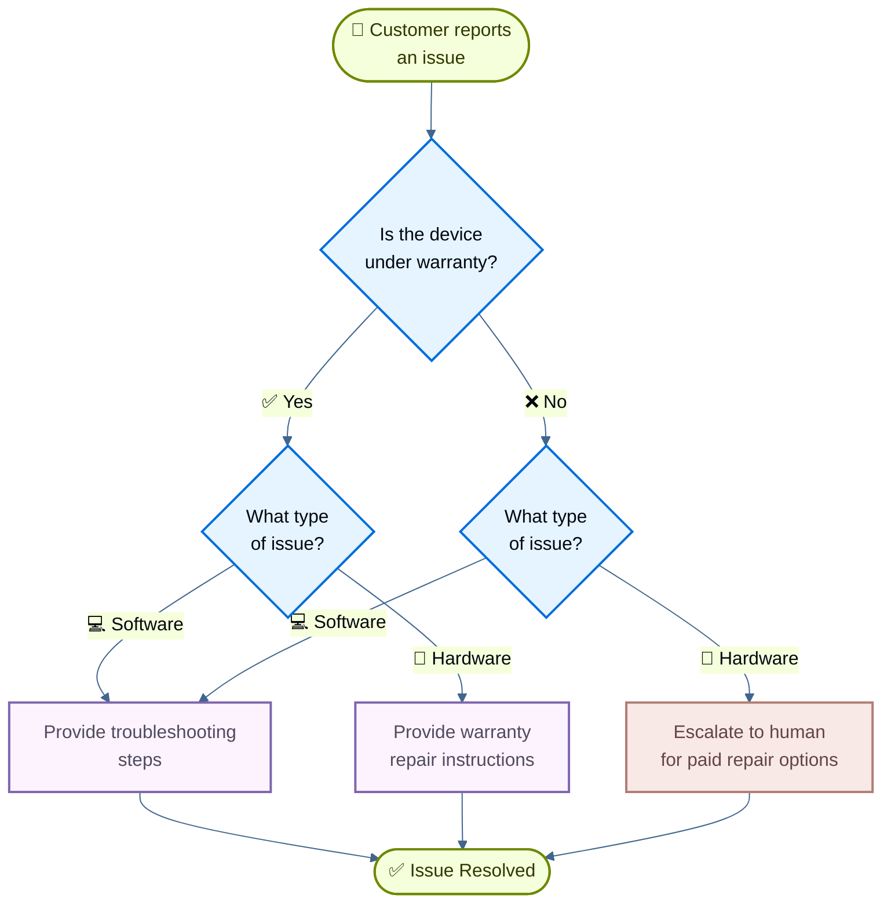

# Handoffs：客户支持

[状态机模式](https://docs.langchain.com/oss/python/langchain/multi-agent/handoffs) 描述了代理的行为随着任务的不同状态而变化的工作流。本教程展示如何通过使用工具调用来动态更改单个代理的配置（根据当前状态更新其可用工具和指令）来实现状态机。状态可以从多个来源确定：代理过去的操作（工具调用）、外部状态（例如 API 调用结果），甚至初始用户输入（例如，通过运行分类器来确定用户意图）。

在本教程中，您将构建一个执行以下操作的客户支持代理：

* 在继续之前收集保修信息。
* 将问题分类为硬件或软件。
* 提供解决方案或升级为人工支持。
* 在多个回合中保持对话状态。

与子代理作为工具被调用的[[01-Subagents Personal Assistant|子代理模式]]不同，**状态机模式**使用单个代理，其配置根据工作流进度而变化。每个“步骤”只是同一底层代理的不同配置（系统提示 + 工具），根据状态动态选择。

这是我们将构建的工作流：

## 设置

### 安装

本教程需要 `langchain` 包：
```bash
# 安装依赖：先把示例需要的包安装到当前 Python 环境。
pip install langchain
```

```bash
# 安装依赖：先把示例需要的包安装到当前 Python 环境。
uv add langchain
```

```bash
conda install langchain -c conda-forge
```
有关更多详细信息，请参阅[安装指南](https://docs.langchain.com/oss/python/langchain/install)。

### LangSmith

设置 [LangSmith](https://smith.langchain.com?utm_source=docs\&utm_medium=cta\&utm_campaign=langsmith-signup\&utm_content=oss-langchain-multi-agent-handoffs-customer-support) 来检查代理内部发生的情况。然后设置以下环境变量：
```bash
# 配置环境变量：示例会从环境变量读取 API key、模型名或服务地址。
export LANGSMITH_TRACING="true"
export LANGSMITH_API_KEY="..."
```

```python
import getpass
import os

os.environ["LANGSMITH_TRACING"] = "true"
os.environ["LANGSMITH_API_KEY"] = getpass.getpass()
```
### 选择LLM

从 LangChain 的集成套件中选择聊天模型：

#### OpenAI
👉 阅读[OpenAI 聊天模型集成文档](https://docs.langchain.com/oss/python/integrations/chat/openai/)
```shell
# 安装依赖：先把示例需要的包安装到当前 Python 环境。
pip install -U "langchain[openai]"
```

```python
import os
from langchain.chat_models import init_chat_model

os.environ["OPENAI_API_KEY"] = "sk-..."

# 初始化 chat model：后续 agent、chain 或 graph 都会通过这个模型向 LLM 发请求。
model = init_chat_model("gpt-5.4")
```

```python
import os
from langchain_openai import ChatOpenAI

os.environ["OPENAI_API_KEY"] = "sk-..."

# 这里创建具体 provider 的聊天模型对象；保留 provider 名称，便于和官方文档对照。
model = ChatOpenAI(model="gpt-5.4")
```
#### Anthropic
👉 阅读[Anthropic聊天模型集成文档](https://docs.langchain.com/oss/python/integrations/chat/anthropic/)
```shell
# 安装依赖：先把示例需要的包安装到当前 Python 环境。
pip install -U "langchain[anthropic]"
```

```python
import os
from langchain.chat_models import init_chat_model

os.environ["ANTHROPIC_API_KEY"] = "sk-..."

# 初始化 chat model：后续 agent、chain 或 graph 都会通过这个模型向 LLM 发请求。
model = init_chat_model("claude-sonnet-4-6")
```

```python
import os
from langchain_anthropic import ChatAnthropic

os.environ["ANTHROPIC_API_KEY"] = "sk-..."

# 这里创建具体 provider 的聊天模型对象；保留 provider 名称，便于和官方文档对照。
model = ChatAnthropic(model="claude-sonnet-4-6")
```
#### Azure
👉 阅读[Azure 聊天模型集成文档](https://docs.langchain.com/oss/python/integrations/chat/azure_chat_openai/)
```shell
# 安装依赖：先把示例需要的包安装到当前 Python 环境。
pip install -U "langchain[openai]"
```

```python
import os
from langchain.chat_models import init_chat_model

os.environ["AZURE_OPENAI_API_KEY"] = "..."
os.environ["AZURE_OPENAI_ENDPOINT"] = "..."
os.environ["OPENAI_API_VERSION"] = "2025-03-01-preview"

# 初始化 chat model：后续 agent、chain 或 graph 都会通过这个模型向 LLM 发请求。
model = init_chat_model(
    "azure_openai:gpt-5.4",
    azure_deployment=os.environ["AZURE_OPENAI_DEPLOYMENT_NAME"],
)
```

```python
import os
from langchain_openai import AzureChatOpenAI

os.environ["AZURE_OPENAI_API_KEY"] = "..."
os.environ["AZURE_OPENAI_ENDPOINT"] = "..."
os.environ["OPENAI_API_VERSION"] = "2025-03-01-preview"

model = AzureChatOpenAI(
    model="gpt-5.4",
    azure_deployment=os.environ["AZURE_OPENAI_DEPLOYMENT_NAME"]
)
```
#### Google Gemini
👉 阅读 [Google GenAI 聊天模型集成文档](https://docs.langchain.com/oss/python/integrations/chat/google_generative_ai/)
```shell
# 安装依赖：先把示例需要的包安装到当前 Python 环境。
pip install -U "langchain[google-genai]"
```

```python
import os
from langchain.chat_models import init_chat_model

os.environ["GOOGLE_API_KEY"] = "..."

# 初始化 chat model：后续 agent、chain 或 graph 都会通过这个模型向 LLM 发请求。
model = init_chat_model("google_genai:gemini-2.5-flash-lite")
```

```python
import os
from langchain_google_genai import ChatGoogleGenerativeAI

os.environ["GOOGLE_API_KEY"] = "..."

model = ChatGoogleGenerativeAI(model="gemini-2.5-flash-lite")
```
#### AWS Bedrock
👉 阅读 [AWS Bedrock 聊天模型集成文档](https://docs.langchain.com/oss/python/integrations/chat/bedrock/)
```shell
# 安装依赖：先把示例需要的包安装到当前 Python 环境。
pip install -U "langchain[aws]"
```

```python
from langchain.chat_models import init_chat_model

# 按这里的步骤配置凭据：
# 参考链接：https://docs.aws.amazon.com/bedrock/latest/userguide/getting-started.html

model = init_chat_model(
    "anthropic.claude-3-5-sonnet-20240620-v1:0",
    model_provider="bedrock_converse",
)
```

```python
from langchain_aws import ChatBedrock

# 这里创建具体 provider 的聊天模型对象；保留 provider 名称，便于和官方文档对照。
model = ChatBedrock(model="anthropic.claude-3-5-sonnet-20240620-v1:0")
```
#### Hugging Face
👉 阅读 [HuggingFace 聊天模型集成文档](https://docs.langchain.com/oss/python/integrations/chat/huggingface/)
```shell
# 安装依赖：先把示例需要的包安装到当前 Python 环境。
pip install -U "langchain[huggingface]"
```

```python
import os
from langchain.chat_models import init_chat_model

os.environ["HUGGINGFACEHUB_API_TOKEN"] = "hf_..."

# 初始化 chat model：后续 agent、chain 或 graph 都会通过这个模型向 LLM 发请求。
model = init_chat_model(
    "microsoft/Phi-3-mini-4k-instruct",
    model_provider="huggingface",
    temperature=0.7,
    max_tokens=1024,
)
```

```python
import os
from langchain_huggingface import ChatHuggingFace, HuggingFaceEndpoint

os.environ["HUGGINGFACEHUB_API_TOKEN"] = "hf_..."

llm = HuggingFaceEndpoint(
    repo_id="microsoft/Phi-3-mini-4k-instruct",
    temperature=0.7,
    max_length=1024,
)
model = ChatHuggingFace(llm=llm)
```
#### OpenRouter
👉 阅读[OpenRouter聊天模型集成文档](https://docs.langchain.com/oss/python/integrations/chat/openrouter/)
```shell
# 安装依赖：先把示例需要的包安装到当前 Python 环境。
pip install -U "langchain-openrouter"
```

```python
import os
from langchain.chat_models import init_chat_model

os.environ["OPENROUTER_API_KEY"] = "sk-..."

# 初始化 chat model：后续 agent、chain 或 graph 都会通过这个模型向 LLM 发请求。
model = init_chat_model(
    "auto",
    model_provider="openrouter",
)
```

```python
import os
from langchain_openrouter import ChatOpenRouter

os.environ["OPENROUTER_API_KEY"] = "sk-..."

model = ChatOpenRouter(model="auto")
```
## 1. 定义自定义状态

首先，定义一个自定义状态 schema来跟踪当前处于活动状态的步骤：
```python
from langchain.agents import AgentState
from typing_extensions import NotRequired
from typing import Literal

# 定义 workflow 可能经过的步骤。
SupportStep = Literal["warranty_collector", "issue_classifier", "resolution_specialist"]  # [!code highlight]

# State schema 定义节点之间传递的数据结构；字段名会影响后续节点能读取和写入什么。
class SupportState(AgentState):  # [!code highlight]
    """State for customer support workflow."""
    current_step: NotRequired[SupportStep]  # [!code highlight]
    warranty_status: NotRequired[Literal["in_warranty", "out_of_warranty"]]
    issue_type: NotRequired[Literal["hardware", "software"]]
```
`current_step` 字段是状态机模式的核心 - 它确定每轮加载哪个配置（提示 + 工具）。

## 2. 创建管理工作流状态的工具

创建更新工作流状态的工具。这些工具允许代理记录信息并过渡到下一步。

关键是使用 `Command` 来更新状态，包括 `current_step` 字段：
```python
from langchain.tools import tool, ToolRuntime
from langchain.messages import ToolMessage
from langgraph.types import Command

# 使用 @tool 可以把普通 Python 函数暴露给 agent，模型会根据函数名、参数和 docstring 判断何时调用。
@tool
def record_warranty_status(
    status: Literal["in_warranty", "out_of_warranty"],
    runtime: ToolRuntime[None, SupportState],
) -> Command:  # [!code highlight]
    """Record the customer's warranty status and transition to issue classification."""
    # Command 可以同时表达 state 更新和下一步跳转，适合工具返回后改变流程的场景。
    return Command(  # [!code highlight]
        update={  # [!code highlight]
            "messages": [
                ToolMessage(
                    content=f"Warranty status recorded as: {status}",
                    tool_call_id=runtime.tool_call_id,
                )
            ],
            "warranty_status": status,
            "current_step": "issue_classifier",  # [!code highlight]
        }
    )

@tool
def record_issue_type(
    issue_type: Literal["hardware", "software"],
    runtime: ToolRuntime[None, SupportState],
) -> Command:  # [!code highlight]
    """Record the type of issue and transition to resolution specialist."""
    return Command(  # [!code highlight]
        update={  # [!code highlight]
            "messages": [
                ToolMessage(
                    content=f"Issue type recorded as: {issue_type}",
                    tool_call_id=runtime.tool_call_id,
                )
            ],
            "issue_type": issue_type,
            "current_step": "resolution_specialist",  # [!code highlight]
        }
    )

@tool
def escalate_to_human(reason: str) -> str:
    """Escalate the case to a human support specialist."""
    # 真实系统中这里通常会创建工单或通知人工客服。
    return f"Escalating to human support. Reason: {reason}"

@tool
def provide_solution(solution: str) -> str:
    """Provide a solution to the customer's issue."""
    return f"Solution provided: {solution}"
```
请注意 `record_warranty_status` 和 `record_issue_type` 如何返回更新数据（`warranty_status`、`issue_type`）和 `current_step` 的 `Command` 对象。这就是状态机的工作原理 - 工具控制工作流的进展。

## 3. 定义步骤配置

为每个步骤定义提示和工具。首先，定义每个步骤的提示：

### 查看完整的提示定义
```python
# 把提示词定义为常量，方便后续引用。
WARRANTY_COLLECTOR_PROMPT = """You are a customer support agent helping with device issues.

CURRENT STAGE: Warranty verification

At this step, you need to:
1. Greet the customer warmly
2. Ask if their device is under warranty
3. Use record_warranty_status to record their response and move to the next step

Be conversational and friendly. Don't ask multiple questions at once."""

ISSUE_CLASSIFIER_PROMPT = """You are a customer support agent helping with device issues.

CURRENT STAGE: Issue classification
CUSTOMER INFO: Warranty status is {warranty_status}

At this step, you need to:
1. Ask the customer to describe their issue
2. Determine if it's a hardware issue (physical damage, broken parts) or software issue (app crashes, performance)
3. Use record_issue_type to record the classification and move to the next step

If unclear, ask clarifying questions before classifying."""

RESOLUTION_SPECIALIST_PROMPT = """You are a customer support agent helping with device issues.

CURRENT STAGE: Resolution
CUSTOMER INFO: Warranty status is {warranty_status}, issue type is {issue_type}

At this step, you need to:
1. For SOFTWARE issues: provide troubleshooting steps using provide_solution
2. For HARDWARE issues:
   - If IN WARRANTY: explain warranty repair process using provide_solution
   - If OUT OF WARRANTY: escalate_to_human for paid repair options

Be specific and helpful in your solutions."""
```
然后使用字典将步骤名称映射到其配置：
```python
# 步骤配置：把步骤名映射到提示词、tools 和必需 state。
STEP_CONFIG = {
    "warranty_collector": {
        "prompt": WARRANTY_COLLECTOR_PROMPT,
        "tools": [record_warranty_status],
        "requires": [],
    },
    "issue_classifier": {
        "prompt": ISSUE_CLASSIFIER_PROMPT,
        "tools": [record_issue_type],
        "requires": ["warranty_status"],
    },
    "resolution_specialist": {
        "prompt": RESOLUTION_SPECIALIST_PROMPT,
        "tools": [provide_solution, escalate_to_human],
        "requires": ["warranty_status", "issue_type"],
    },
}
```
这种基于字典的配置可以轻松地：

* 所有步骤一目了然
* 添加新步骤（只需添加另一个条目）
* 了解工作流依赖性（`requires` 字段）
* 使用带有状态变量的提示模板（例如 `{warranty_status}`）

## 4. 创建基于步骤的中间件

创建从状态读取 `current_step` 并应用适当配置的中间件。我们将使用 `@wrap_model_call` 装饰器来实现干净的实现：
```python
from langchain.agents.middleware import wrap_model_call, ModelRequest, ModelResponse
from typing import Callable

# wrap_model_call 是 middleware 钩子，可在模型调用前后改提示词、换模型或记录请求。
@wrap_model_call  # [!code highlight]
def apply_step_config(
    request: ModelRequest,
    handler: Callable[[ModelRequest], ModelResponse],
) -> ModelResponse:
    """Configure agent behavior based on the current step."""
    # 获取当前步骤；首次交互默认从 warranty_collector 开始。
    current_step = request.state.get("current_step", "warranty_collector")  # [!code highlight]

    # 查找当前步骤的配置。
    stage_config = STEP_CONFIG[current_step]  # [!code highlight]

    # 校验当前步骤所需的 state 是否存在。
    for key in stage_config["requires"]:
        if request.state.get(key) is None:
            raise ValueError(f"{key} must be set before reaching {current_step}")

    # 用 state 值填充提示词模板，支持 {warranty_status}、{issue_type} 等占位符。
    system_prompt = stage_config["prompt"].format(**request.state)

    # 注入系统提示词和当前步骤专属 tools。
    request = request.override(  # [!code highlight]
        system_prompt=system_prompt,  # [!code highlight]
        tools=stage_config["tools"],  # [!code highlight]
    )

    return handler(request)
```
这个中间件：

1. **读取当前步骤**：从状态获取 `current_step` （默认为“warranty\_collector”）。
2. **查找配置**：在 `STEP_CONFIG` 中查找匹配条目。
3. **验证依赖关系**：确保所需的状态字段存在。
4. **格式化提示**：将状态值插入提示模板中。
5. **应用配置**：覆盖系统提示和可用工具。

`request.override()` 方法是关键 - 它允许我们根据状态动态更改代理的行为，而无需创建单独的代理实例。

## 5. 创建代理

现在使用基于步骤的中间件和用于状态持久性的 checkpointer 创建代理：
```python
from langchain.agents import create_agent
from langgraph.checkpoint.memory import InMemorySaver

# 从所有步骤配置中收集 tools。
all_tools = [
    record_warranty_status,
    record_issue_type,
    provide_solution,
    escalate_to_human,
]

# 创建按步骤切换配置的 agent。
agent = create_agent(
    model,
    tools=all_tools,
    state_schema=SupportState,  # [!code highlight]
    middleware=[apply_step_config],  # [!code highlight]
    # checkpointer 保存线程内的执行状态，用于多轮对话、暂停恢复和 human-in-the-loop。
    checkpointer=InMemorySaver(),  # [!code highlight]
)
```
> [!note]
**为什么需要检查点？** 检查点在对话轮次中维护状态。如果没有它，`current_step` 状态将在用户消息之间丢失，从而破坏工作流。

## 6. 测试工作流

测试完整的工作流：
```python
from langchain.messages import HumanMessage
from langchain_core.utils.uuid import uuid7

# 当前会话线程的配置。
thread_id = str(uuid7())
config = {"configurable": {"thread_id": thread_id}}

# 第 1 轮：初始消息，从 warranty_collector 步骤开始。
print("=== Turn 1: Warranty Collection ===")
# 这里是实际运行入口：传入 messages 或 state 后，系统会执行推理、工具调用和状态更新。
result = agent.invoke(
    {"messages": [HumanMessage("Hi, my phone screen is cracked")]},
    config
)
for msg in result['messages']:
    msg.pretty_print()

# 第 2 轮：用户回复保修信息。
print("\n=== Turn 2: Warranty Response ===")
result = agent.invoke(
    {"messages": [HumanMessage("Yes, it's still under warranty")]},
    config
)
for msg in result['messages']:
    msg.pretty_print()
print(f"Current step: {result.get('current_step')}")

# 第 3 轮：用户描述具体问题。
print("\n=== Turn 3: Issue Description ===")
result = agent.invoke(
    {"messages": [HumanMessage("The screen is physically cracked from dropping it")]},
    config
)
for msg in result['messages']:
    msg.pretty_print()
print(f"Current step: {result.get('current_step')}")

# 第 4 轮：给出解决方案。
print("\n=== Turn 4: Resolution ===")
result = agent.invoke(
    {"messages": [HumanMessage("What should I do?")]},
    config
)
for msg in result['messages']:
    msg.pretty_print()
```
预期流量：

1. **保修验证步骤**：询问保修状态
2. **问题分类步骤**：询问问题，确定其硬件
3. **解决步骤**：提供保修维修说明

## 7. 理解状态转换

让我们追踪一下每个回合会发生什么：

### 第 1 回合：初始消息
```python
{
    "messages": [HumanMessage("Hi, my phone screen is cracked")],
    "current_step": "warranty_collector"  # 默认值。
}
```
中间件适用：

* 系统提示：`WARRANTY_COLLECTOR_PROMPT`
* 工具：`[record_warranty_status]`

### 第 2 回合：保修记录后

工具调用：`record_warranty_status("in_warranty")` 返回：
```python
# Command 可以同时表达 state 更新和下一步跳转，适合工具返回后改变流程的场景。
Command(update={
    "warranty_status": "in_warranty",
    "current_step": "issue_classifier"  # 状态流转：下一步进入问题分类。
})
```
下一步，中间件适用：

* 系统提示：`ISSUE_CLASSIFIER_PROMPT`（格式化为`warranty_status="in_warranty"`）
* 工具：`[record_issue_type]`

### 第3回合：问题分类后

工具调用：`record_issue_type("hardware")` 返回：
```python
# Command 可以同时表达 state 更新和下一步跳转，适合工具返回后改变流程的场景。
Command(update={
    "issue_type": "hardware",
    "current_step": "resolution_specialist"  # 状态流转：下一步进入解决方案专家。
})
```
下一步，中间件适用：

* 系统提示：`RESOLUTION_SPECIALIST_PROMPT`（格式为`warranty_status`和`issue_type`）
* 工具：`[provide_solution, escalate_to_human]`

关键见解：**工具通过更新 `current_step` 来驱动工作流**，而**中间件通过在下一轮应用适当的配置来响应**。

## 8.管理消息历史记录

随着代理逐步推进，消息历史记录也会增长。使用[摘要中间件](https://docs.langchain.com/oss/python/langchain/short-term-memory#summarize-messages) 压缩早期消息，同时保留对话上下文：
```python
from langchain.agents import create_agent
from langchain.agents.middleware import SummarizationMiddleware  # [!code highlight]
from langgraph.checkpoint.memory import InMemorySaver

# create_agent 会把模型、tools、系统提示词和 middleware 组装成一个可运行的 agent。
agent = create_agent(
    model,
    tools=all_tools,
    state_schema=SupportState,
    middleware=[
        apply_step_config,
        SummarizationMiddleware(  # [!code highlight]
            model="gpt-5.4-mini",
            trigger=("tokens", 4000),
            keep=("messages", 10)
        )
    ],
    # checkpointer 保存线程内的执行状态，用于多轮对话、暂停恢复和 human-in-the-loop。
    checkpointer=InMemorySaver(),
)
```
有关其他记忆管理技术，请参阅[短期记忆指南](https://docs.langchain.com/oss/python/langchain/short-term-memory)。

## 9. 增加灵活性：返回

某些工作流需要允许用户返回到之前的步骤以更正信息（例如，更改保修状态或问题分类）。然而，并非所有转换都有意义，例如，一旦退款处理完成，您通常就无法返回。对于此支持工作流，我们将添加工具以返回保修验证和问题分类步骤。

> [!tip]
如果您的工作流需要在大多数步骤之间进行任意转换，请考虑您是否需要结构化工作流。当步骤遵循清晰的顺序进展并偶尔向后过渡以进行修正时，此模式效果最佳。

在解决步骤中添加“返回”工具：
```python
# 使用 @tool 可以把普通 Python 函数暴露给 agent，模型会根据函数名、参数和 docstring 判断何时调用。
@tool
def go_back_to_warranty() -> Command:  # [!code highlight]
    """Go back to warranty verification step."""
    # Command 可以同时表达 state 更新和下一步跳转，适合工具返回后改变流程的场景。
    return Command(update={"current_step": "warranty_collector"})  # [!code highlight]

@tool
def go_back_to_classification() -> Command:  # [!code highlight]
    """Go back to issue classification step."""
    return Command(update={"current_step": "issue_classifier"})  # [!code highlight]

# 更新 resolution_specialist 配置，把这些 tools 加进去。
STEP_CONFIG["resolution_specialist"]["tools"].extend([
    go_back_to_warranty,
    go_back_to_classification
])
```
更新解决专家的提示以提及这些工具：
```python
RESOLUTION_SPECIALIST_PROMPT = """You are a customer support agent helping with device issues.

CURRENT STAGE: Resolution
CUSTOMER INFO: Warranty status is {warranty_status}, issue type is {issue_type}

At this step, you need to:
1. For SOFTWARE issues: provide troubleshooting steps using provide_solution
2. For HARDWARE issues:
   - If IN WARRANTY: explain warranty repair process using provide_solution
   - If OUT OF WARRANTY: escalate_to_human for paid repair options

If the customer indicates any information was wrong, use:
- go_back_to_warranty to correct warranty status
- go_back_to_classification to correct issue type

Be specific and helpful in your solutions."""
```
现在代理可以处理更正：
```python
# 这里是实际运行入口：传入 messages 或 state 后，系统会执行推理、工具调用和状态更新。
result = agent.invoke(
    {"messages": [HumanMessage("Actually, I made a mistake - my device is out of warranty")]},
    config
)
# agent 会调用 go_back_to_warranty，并重新开始保修验证步骤。
```
## 完整示例

以下是可运行脚本中的所有内容：

### 完整代码
```python
"""
Customer Support State Machine Example

This example demonstrates the state machine pattern.
A single agent dynamically changes its behavior based on the current_step state,
creating a state machine for sequential information collection.
"""

from langchain_core.utils.uuid import uuid7

from langgraph.checkpoint.memory import InMemorySaver
from langgraph.types import Command
from typing import Callable, Literal
from typing_extensions import NotRequired

from langchain.agents import AgentState, create_agent
from langchain.agents.middleware import wrap_model_call, ModelRequest, ModelResponse, SummarizationMiddleware
from langchain.chat_models import init_chat_model
from langchain.messages import HumanMessage, ToolMessage
from langchain.tools import tool, ToolRuntime

# 初始化 chat model：后续 agent、chain 或 graph 都会通过这个模型向 LLM 发请求。
model = init_chat_model("google_genai:gemini-3.1-pro-preview")

# 定义 workflow 可能经过的步骤。
SupportStep = Literal["warranty_collector", "issue_classifier", "resolution_specialist"]

# State schema 定义节点之间传递的数据结构；字段名会影响后续节点能读取和写入什么。
class SupportState(AgentState):
    """State for customer support workflow."""

    current_step: NotRequired[SupportStep]
    warranty_status: NotRequired[Literal["in_warranty", "out_of_warranty"]]
    issue_type: NotRequired[Literal["hardware", "software"]]

# 使用 @tool 可以把普通 Python 函数暴露给 agent，模型会根据函数名、参数和 docstring 判断何时调用。
@tool
def record_warranty_status(
    status: Literal["in_warranty", "out_of_warranty"],
    runtime: ToolRuntime[None, SupportState],
) -> Command:
    """Record the customer's warranty status and transition to issue classification."""
    # Command 可以同时表达 state 更新和下一步跳转，适合工具返回后改变流程的场景。
    return Command(
        update={
            "messages": [
                ToolMessage(
                    content=f"Warranty status recorded as: {status}",
                    tool_call_id=runtime.tool_call_id,
                )
            ],
            "warranty_status": status,
            "current_step": "issue_classifier",
        }
    )

@tool
def record_issue_type(
    issue_type: Literal["hardware", "software"],
    runtime: ToolRuntime[None, SupportState],
) -> Command:
    """Record the type of issue and transition to resolution specialist."""
    return Command(
        update={
            "messages": [
                ToolMessage(
                    content=f"Issue type recorded as: {issue_type}",
                    tool_call_id=runtime.tool_call_id,
                )
            ],
            "issue_type": issue_type,
            "current_step": "resolution_specialist",
        }
    )

@tool
def escalate_to_human(reason: str) -> str:
    """Escalate the case to a human support specialist."""
    # 真实系统中这里通常会创建工单或通知人工客服。
    return f"Escalating to human support. Reason: {reason}"

@tool
def provide_solution(solution: str) -> str:
    """Provide a solution to the customer's issue."""
    return f"Solution provided: {solution}"

# 把提示词定义为常量，便于复用和维护。
WARRANTY_COLLECTOR_PROMPT = """You are a customer support agent helping with device issues.

CURRENT STEP: Warranty verification

At this step, you need to:
1. Greet the customer warmly
2. Ask if their device is under warranty
3. Use record_warranty_status to record their response and move to the next step

Be conversational and friendly. Don't ask multiple questions at once."""

ISSUE_CLASSIFIER_PROMPT = """You are a customer support agent helping with device issues.

CURRENT STEP: Issue classification
CUSTOMER INFO: Warranty status is {warranty_status}

At this step, you need to:
1. Ask the customer to describe their issue
2. Determine if it's a hardware issue (physical damage, broken parts) or software issue (app crashes, performance)
3. Use record_issue_type to record the classification and move to the next step

If unclear, ask clarifying questions before classifying."""

RESOLUTION_SPECIALIST_PROMPT = """You are a customer support agent helping with device issues.

CURRENT STEP: Resolution
CUSTOMER INFO: Warranty status is {warranty_status}, issue type is {issue_type}

At this step, you need to:
1. For SOFTWARE issues: provide troubleshooting steps using provide_solution
2. For HARDWARE issues:
   - If IN WARRANTY: explain warranty repair process using provide_solution
   - If OUT OF WARRANTY: escalate_to_human for paid repair options

Be specific and helpful in your solutions."""

# 步骤配置：把步骤名映射到提示词、tools 和必需 state。
STEP_CONFIG = {
    "warranty_collector": {
        "prompt": WARRANTY_COLLECTOR_PROMPT,
        "tools": [record_warranty_status],
        "requires": [],
    },
    "issue_classifier": {
        "prompt": ISSUE_CLASSIFIER_PROMPT,
        "tools": [record_issue_type],
        "requires": ["warranty_status"],
    },
    "resolution_specialist": {
        "prompt": RESOLUTION_SPECIALIST_PROMPT,
        "tools": [provide_solution, escalate_to_human],
        "requires": ["warranty_status", "issue_type"],
    },
}

# wrap_model_call 是 middleware 钩子，可在模型调用前后改提示词、换模型或记录请求。
@wrap_model_call
def apply_step_config(
    request: ModelRequest,
    handler: Callable[[ModelRequest], ModelResponse],
) -> ModelResponse:
    """Configure agent behavior based on the current step."""
    # 获取当前步骤；首次交互默认从 warranty_collector 开始。
    current_step = request.state.get("current_step", "warranty_collector")

    # 查找当前步骤的配置。
    step_config = STEP_CONFIG[current_step]

    # 校验当前步骤所需的 state 是否存在。
    for key in step_config["requires"]:
        if request.state.get(key) is None:
            raise ValueError(f"{key} must be set before reaching {current_step}")

    # 用 state 中的值填充提示词模板。
    system_prompt = step_config["prompt"].format(**request.state)

    # 注入系统提示词和当前步骤专属 tools。
    request = request.override(
        system_prompt=system_prompt,
        tools=step_config["tools"],
    )

    return handler(request)

# 从所有步骤配置中收集 tools。
all_tools = [
    record_warranty_status,
    record_issue_type,
    provide_solution,
    escalate_to_human,
]

# 创建按步骤切换配置并支持摘要的 agent。
agent = create_agent(
    model,
    tools=all_tools,
    state_schema=SupportState,
    middleware=[
        apply_step_config,
        SummarizationMiddleware(
            model="gpt-5.4-mini",
            trigger=("tokens", 4000),
            keep=("messages", 10)
        )
    ],
    # checkpointer 保存线程内的执行状态，用于多轮对话、暂停恢复和 human-in-the-loop。
    checkpointer=InMemorySaver(),
)

# ============================================================================
# 测试 workflow。
# ============================================================================

if __name__ == "__main__":
    thread_id = str(uuid7())
    config = {"configurable": {"thread_id": thread_id}}

    # 这里是实际运行入口：传入 messages 或 state 后，系统会执行推理、工具调用和状态更新。
    result = agent.invoke(
        {"messages": [HumanMessage("Hi, my phone screen is cracked")]},
        config
    )

    result = agent.invoke(
        {"messages": [HumanMessage("Yes, it's still under warranty")]},
        config
    )

    result = agent.invoke(
        {"messages": [HumanMessage("The screen is physically cracked from dropping it")]},
        config
    )

    result = agent.invoke(
        {"messages": [HumanMessage("What should I do?")]},
        config
    )
    for msg in result['messages']:
        msg.pretty_print()
```
## 后续步骤

* 了解集中编排的[[01-Subagents Personal Assistant|子代理模式]]
* 探索[中间件](https://docs.langchain.com/oss/python/langchain/middleware)以获得更多动态行为
* 阅读[多代理概述](https://docs.langchain.com/oss/python/langchain/multi-agent) 来比较模式
* 使用 [LangSmith](https://smith.langchain.com?utm_source=docs\&utm_medium=cta\&utm_campaign=langsmith-signup\&utm_content=oss-langchain-multi-agent-handoffs-customer-support) 调试和监控您的多代理系统
