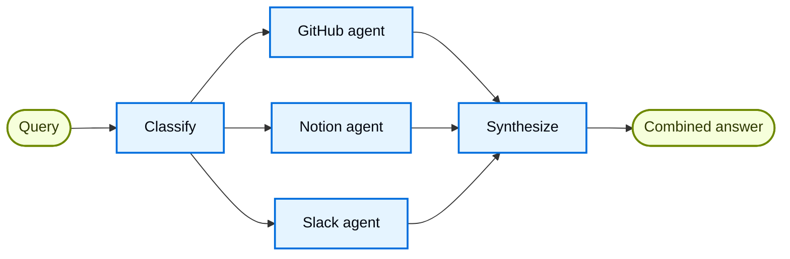

# Router：知识库

## 概述

**路由器模式**是一种[多代理](https://docs.langchain.com/oss/python/langchain/multi-agent)架构，其中路由步骤对输入进行分类并将其定向到专门的代理，并将结果合成为组合响应。当您的组织的知识分布在不同的**垂直领域**（独立的知识领域，每个知识领域都需要自己的代理以及专门的工具和提示）时，此模式非常有用。

在本教程中，您将构建一个多源知识库路由器，通过实际的企业场景展示这些优势。该系统将协调三名专家：

* 一个 **GitHub 代理**，用于搜索代码、问题和拉取请求。
* 一个 **Notion 代理**，用于搜索内部文档和 wiki。
* 一个搜索相关主题和讨论的 **Slack 代理**。

当用户询问“如何验证 API 请求？”时，路由器会将查询分解为特定于源的子问题，将它们并行路由到相关代理，并将结果合成为连贯的答案。

### 为什么要使用路由器？

路由器模式有几个优点：

* **并行执行**：同时查询多个源，与顺序方法相比减少了延迟。
* **专业代理**：每个垂直领域都有针对其领域优化的重点工具和提示。
* **选择性路由**：并非每个查询都需要每个源 - 路由器会智能地选择相关的垂直领域。
* **有针对性的子问题**：每个代理都会收到一个针对其领域定制的问题，从而提高结果质量。
* **干净的合成**：来自多个来源的结果被组合成一个单一的、连贯的响应。

### 概念

我们将涵盖以下概念：

* [多智能体系统](https://docs.langchain.com/oss/python/langchain/multi-agent)
* [[06-Graph API|StateGraph]] 用于工作流编排
* [发送 API](https://docs.langchain.com/oss/python/langgraph/graph-api#send) 用于并行执行

> [!tip]
**路由器与子代理**：[子代理模式](https://docs.langchain.com/oss/python/langchain/multi-agent/subagents) 也可以路由到多个代理。当您需要专门的预处理、自定义路由逻辑或想要对并行执行进行显式控制时，请使用路由器模式。当您希望 LLM 决定动态调用哪些代理时，请使用子代理模式。

## 设置

### 安装

本教程需要 `langchain` 和 `langgraph` 包：
```bash
# 安装依赖：先把示例需要的包安装到当前 Python 环境。
pip install langchain langgraph
```

```bash
# 安装依赖：先把示例需要的包安装到当前 Python 环境。
uv add langchain langgraph
```

```bash
conda install langchain langgraph -c conda-forge
```
有关更多详细信息，请参阅[安装指南](https://docs.langchain.com/oss/python/langchain/install)。

### LangSmith

设置 [LangSmith](https://smith.langchain.com?utm_source=docs\&utm_medium=cta\&utm_campaign=langsmith-signup\&utm_content=oss-langchain-multi-agent-router-knowledge-base) 来检查代理内部发生的情况。然后设置以下环境变量：
```bash
# 配置环境变量：示例会从环境变量读取 API key、模型名或服务地址。
export LANGSMITH_TRACING="true"
export LANGSMITH_API_KEY="..."
```

```python
import getpass
import os

os.environ["LANGSMITH_TRACING"] = "true"
os.environ["LANGSMITH_API_KEY"] = getpass.getpass()
```
### 选择LLM

从 LangChain 的集成套件中选择聊天模型：

#### OpenAI
👉 阅读[OpenAI 聊天模型集成文档](https://docs.langchain.com/oss/python/integrations/chat/openai/)
```shell
# 安装依赖：先把示例需要的包安装到当前 Python 环境。
pip install -U "langchain[openai]"
```

```python
import os
from langchain.chat_models import init_chat_model

os.environ["OPENAI_API_KEY"] = "sk-..."

# 初始化 chat model：后续 agent、chain 或 graph 都会通过这个模型向 LLM 发请求。
model = init_chat_model("gpt-5.4")
```

```python
import os
from langchain_openai import ChatOpenAI

os.environ["OPENAI_API_KEY"] = "sk-..."

# 这里创建具体 provider 的聊天模型对象；保留 provider 名称，便于和官方文档对照。
model = ChatOpenAI(model="gpt-5.4")
```
#### Anthropic
👉 阅读[Anthropic聊天模型集成文档](https://docs.langchain.com/oss/python/integrations/chat/anthropic/)
```shell
# 安装依赖：先把示例需要的包安装到当前 Python 环境。
pip install -U "langchain[anthropic]"
```

```python
import os
from langchain.chat_models import init_chat_model

os.environ["ANTHROPIC_API_KEY"] = "sk-..."

# 初始化 chat model：后续 agent、chain 或 graph 都会通过这个模型向 LLM 发请求。
model = init_chat_model("claude-sonnet-4-6")
```

```python
import os
from langchain_anthropic import ChatAnthropic

os.environ["ANTHROPIC_API_KEY"] = "sk-..."

# 这里创建具体 provider 的聊天模型对象；保留 provider 名称，便于和官方文档对照。
model = ChatAnthropic(model="claude-sonnet-4-6")
```
#### Azure
👉 阅读[Azure 聊天模型集成文档](https://docs.langchain.com/oss/python/integrations/chat/azure_chat_openai/)
```shell
# 安装依赖：先把示例需要的包安装到当前 Python 环境。
pip install -U "langchain[openai]"
```

```python
import os
from langchain.chat_models import init_chat_model

os.environ["AZURE_OPENAI_API_KEY"] = "..."
os.environ["AZURE_OPENAI_ENDPOINT"] = "..."
os.environ["OPENAI_API_VERSION"] = "2025-03-01-preview"

# 初始化 chat model：后续 agent、chain 或 graph 都会通过这个模型向 LLM 发请求。
model = init_chat_model(
    "azure_openai:gpt-5.4",
    azure_deployment=os.environ["AZURE_OPENAI_DEPLOYMENT_NAME"],
)
```

```python
import os
from langchain_openai import AzureChatOpenAI

os.environ["AZURE_OPENAI_API_KEY"] = "..."
os.environ["AZURE_OPENAI_ENDPOINT"] = "..."
os.environ["OPENAI_API_VERSION"] = "2025-03-01-preview"

model = AzureChatOpenAI(
    model="gpt-5.4",
    azure_deployment=os.environ["AZURE_OPENAI_DEPLOYMENT_NAME"]
)
```
#### Google Gemini
👉 阅读 [Google GenAI 聊天模型集成文档](https://docs.langchain.com/oss/python/integrations/chat/google_generative_ai/)
```shell
# 安装依赖：先把示例需要的包安装到当前 Python 环境。
pip install -U "langchain[google-genai]"
```

```python
import os
from langchain.chat_models import init_chat_model

os.environ["GOOGLE_API_KEY"] = "..."

# 初始化 chat model：后续 agent、chain 或 graph 都会通过这个模型向 LLM 发请求。
model = init_chat_model("google_genai:gemini-2.5-flash-lite")
```

```python
import os
from langchain_google_genai import ChatGoogleGenerativeAI

os.environ["GOOGLE_API_KEY"] = "..."

model = ChatGoogleGenerativeAI(model="gemini-2.5-flash-lite")
```
#### AWS Bedrock
👉 阅读 [AWS Bedrock 聊天模型集成文档](https://docs.langchain.com/oss/python/integrations/chat/bedrock/)
```shell
# 安装依赖：先把示例需要的包安装到当前 Python 环境。
pip install -U "langchain[aws]"
```

```python
from langchain.chat_models import init_chat_model

# 按这里的步骤配置凭据：
# 参考链接：https://docs.aws.amazon.com/bedrock/latest/userguide/getting-started.html

model = init_chat_model(
    "anthropic.claude-3-5-sonnet-20240620-v1:0",
    model_provider="bedrock_converse",
)
```

```python
from langchain_aws import ChatBedrock

# 这里创建具体 provider 的聊天模型对象；保留 provider 名称，便于和官方文档对照。
model = ChatBedrock(model="anthropic.claude-3-5-sonnet-20240620-v1:0")
```
#### Hugging Face
👉 阅读 [HuggingFace 聊天模型集成文档](https://docs.langchain.com/oss/python/integrations/chat/huggingface/)
```shell
# 安装依赖：先把示例需要的包安装到当前 Python 环境。
pip install -U "langchain[huggingface]"
```

```python
import os
from langchain.chat_models import init_chat_model

os.environ["HUGGINGFACEHUB_API_TOKEN"] = "hf_..."

# 初始化 chat model：后续 agent、chain 或 graph 都会通过这个模型向 LLM 发请求。
model = init_chat_model(
    "microsoft/Phi-3-mini-4k-instruct",
    model_provider="huggingface",
    temperature=0.7,
    max_tokens=1024,
)
```

```python
import os
from langchain_huggingface import ChatHuggingFace, HuggingFaceEndpoint

os.environ["HUGGINGFACEHUB_API_TOKEN"] = "hf_..."

llm = HuggingFaceEndpoint(
    repo_id="microsoft/Phi-3-mini-4k-instruct",
    temperature=0.7,
    max_length=1024,
)
model = ChatHuggingFace(llm=llm)
```
#### OpenRouter
👉 阅读[OpenRouter聊天模型集成文档](https://docs.langchain.com/oss/python/integrations/chat/openrouter/)
```shell
# 安装依赖：先把示例需要的包安装到当前 Python 环境。
pip install -U "langchain-openrouter"
```

```python
import os
from langchain.chat_models import init_chat_model

os.environ["OPENROUTER_API_KEY"] = "sk-..."

# 初始化 chat model：后续 agent、chain 或 graph 都会通过这个模型向 LLM 发请求。
model = init_chat_model(
    "auto",
    model_provider="openrouter",
)
```

```python
import os
from langchain_openrouter import ChatOpenRouter

os.environ["OPENROUTER_API_KEY"] = "sk-..."

model = ChatOpenRouter(model="auto")
```
## 1. 定义状态

首先，定义状态 schema。我们使用三种类型：

* **`AgentInput`**：传递给每个子代理的简单状态（只是一个查询）
* **`AgentOutput`**：每个子代理返回的结果（源名称+结果）
* **`RouterState`**：跟踪查询、分类、结果和最终答案的主工作流状态
```python
from typing import Annotated, Literal, TypedDict
import operator

class AgentInput(TypedDict):
    """Simple input state for each subagent."""
    query: str

class AgentOutput(TypedDict):
    """Output from each subagent."""
    source: str
    result: str

class Classification(TypedDict):
    """A single routing decision: which agent to call with what query."""
    source: Literal["github", "notion", "slack"]
    query: str

# State schema 定义节点之间传递的数据结构；字段名会影响后续节点能读取和写入什么。
class RouterState(TypedDict):
    query: str
    classifications: list[Classification]
    results: Annotated[list[AgentOutput], operator.add]  # reducer 会收集并合并并行分支的结果。
    final_answer: str
```
`results` 字段使用 **reducer**（Python 中的 `operator.add`，JS 中的 concat 函数）将并行代理执行的输出收集到单个列表中。

## 2. 为每个垂直领域定义工具

为每个知识领域创建工具。在生产系统中，这些将调用实际的 API。在本教程中，我们使用返回模拟数据的存根实现。我们定义了 3 个垂直领域的 7 个工具：GitHub（搜索代码、问题、PR）、Notion（搜索文档、获取页面）和 Slack（搜索消息、获取线程）。
```python
from langchain.tools import tool

# 使用 @tool 可以把普通 Python 函数暴露给 agent，模型会根据函数名、参数和 docstring 判断何时调用。
@tool
def search_code(query: str, repo: str = "main") -> str:
    """Search code in GitHub repositories."""
    return f"Found code matching '{query}' in {repo}: authentication middleware in src/auth.py"

@tool
def search_issues(query: str) -> str:
    """Search GitHub issues and pull requests."""
    return f"Found 3 issues matching '{query}': #142 (API auth docs), #89 (OAuth flow), #203 (token refresh)"

@tool
def search_prs(query: str) -> str:
    """Search pull requests for implementation details."""
    return f"PR #156 added JWT authentication, PR #178 updated OAuth scopes"

@tool
def search_notion(query: str) -> str:
    """Search Notion workspace for documentation."""
    return f"Found documentation: 'API Authentication Guide' - covers OAuth2 flow, API keys, and JWT tokens"

@tool
def get_page(page_id: str) -> str:
    """Get a specific Notion page by ID."""
    return f"Page content: Step-by-step authentication setup instructions"

@tool
def search_slack(query: str) -> str:
    """Search Slack messages and threads."""
    return f"Found discussion in #engineering: 'Use Bearer tokens for API auth, see docs for refresh flow'"

@tool
def get_thread(thread_id: str) -> str:
    """Get a specific Slack thread."""
    return f"Thread discusses best practices for API key rotation"
```
## 3.创建专门的代理

为每个垂直领域创建一个代理。每个代理都有特定领域的工具和针对其知识源优化的提示。所有这三个都遵循相同的模式 - 只是工具和系统提示不同。
```python
from langchain.agents import create_agent
from langchain.chat_models import init_chat_model

# 初始化 chat model：后续 agent、chain 或 graph 都会通过这个模型向 LLM 发请求。
model = init_chat_model("openai:gpt-5.4")

# create_agent 会把模型、tools、系统提示词和 middleware 组装成一个可运行的 agent。
github_agent = create_agent(
    model,
    tools=[search_code, search_issues, search_prs],
    system_prompt=(
        "You are a GitHub expert. Answer questions about code, "
        "API references, and implementation details by searching "
        "repositories, issues, and pull requests."
    ),
)

notion_agent = create_agent(
    model,
    tools=[search_notion, get_page],
    system_prompt=(
        "You are a Notion expert. Answer questions about internal "
        "processes, policies, and team documentation by searching "
        "the organization's Notion workspace."
    ),
)

slack_agent = create_agent(
    model,
    tools=[search_slack, get_thread],
    system_prompt=(
        "You are a Slack expert. Answer questions by searching "
        "relevant threads and discussions where team members have "
        "shared knowledge and solutions."
    ),
)
```
## 4. 构建路由器工作流

现在使用 StateGraph 构建路由器工作流。工作流有四个主要步骤：

1. **分类**：分析查询并确定针对哪些子问题调用哪些代理
2. **路由**：使用 `Send` 并行扇出到选定的代理
3. **查询代理**：每个代理接收一个简单的 `AgentInput` 并返回一个 `AgentOutput`
4. **综合**：将收集到的结果组合成一致的响应
```python
from pydantic import BaseModel, Field
from langgraph.graph import StateGraph, START, END
from langgraph.types import Send

# 初始化 chat model：后续 agent、chain 或 graph 都会通过这个模型向 LLM 发请求。
router_llm = init_chat_model("openai:gpt-5.4-mini")

# 为分类器定义结构化输出 schema。
class ClassificationResult(BaseModel):  # [!code highlight]
    """Result of classifying a user query into agent-specific sub-questions."""
    classifications: list[Classification] = Field(
        description="List of agents to invoke with their targeted sub-questions"
    )

def classify_query(state: RouterState) -> dict:
    """Classify query and determine which agents to invoke."""
    # with_structured_output 要求模型按指定 schema 返回结构化结果，后续代码可以稳定读取字段。
    structured_llm = router_llm.with_structured_output(ClassificationResult)  # [!code highlight]

    result = structured_llm.invoke([
        {
            "role": "system",
            "content": """Analyze this query and determine which knowledge bases to consult.
For each relevant source, generate a targeted sub-question optimized for that source.

Available sources:
- github: Code, API references, implementation details, issues, pull requests
- notion: Internal documentation, processes, policies, team wikis
- slack: Team discussions, informal knowledge sharing, recent conversations

Return ONLY the sources that are relevant to the query. Each source should have
a targeted sub-question optimized for that specific knowledge domain.

Example for "How do I authenticate API requests?":
- github: "What authentication code exists? Search for auth middleware, JWT handling"
- notion: "What authentication documentation exists? Look for API auth guides"
(slack omitted because it's not relevant for this technical question)"""
        },
        {"role": "user", "content": state["query"]}
    ])

    return {"classifications": result.classifications}

def route_to_agents(state: RouterState) -> list[Send]:
    """Fan out to agents based on classifications."""
    return [
        # Send 用于创建并行分支，每个分支可以携带自己的局部 state。
        Send(c["source"], {"query": c["query"]})  # [!code highlight]
        for c in state["classifications"]
    ]

def query_github(state: AgentInput) -> dict:
    """Query the GitHub agent."""
    result = github_agent.invoke({
        "messages": [{"role": "user", "content": state["query"]}]  # [!code highlight]
    })
    return {"results": [{"source": "github", "result": result["messages"][-1].content}]}

def query_notion(state: AgentInput) -> dict:
    """Query the Notion agent."""
    result = notion_agent.invoke({
        "messages": [{"role": "user", "content": state["query"]}]  # [!code highlight]
    })
    return {"results": [{"source": "notion", "result": result["messages"][-1].content}]}

def query_slack(state: AgentInput) -> dict:
    """Query the Slack agent."""
    result = slack_agent.invoke({
        "messages": [{"role": "user", "content": state["query"]}]  # [!code highlight]
    })
    return {"results": [{"source": "slack", "result": result["messages"][-1].content}]}

def synthesize_results(state: RouterState) -> dict:
    """Combine results from all agents into a coherent answer."""
    if not state["results"]:
        return {"final_answer": "No results found from any knowledge source."}

    # 整理结果，供后续综合分析使用。
    formatted = [
        f"**From {r['source'].title()}:**\n{r['result']}"
        for r in state["results"]
    ]

    synthesis_response = router_llm.invoke([
        {
            "role": "system",
            "content": f"""Synthesize these search results to answer the original question: "{state['query']}"

- Combine information from multiple sources without redundancy
- Highlight the most relevant and actionable information
- Note any discrepancies between sources
- Keep the response concise and well-organized"""
        },
        {"role": "user", "content": "\n\n".join(formatted)}
    ])

    return {"final_answer": synthesis_response.content}
```
## 5. 编译工作流

现在通过将节点与边连接来组装工作流。关键是使用 `add_conditional_edges` 和路由函数来启用并行执行：
```python
workflow = (
    # StateGraph 用来定义 LangGraph 工作流：node 负责计算，edge 负责控制执行顺序。
    StateGraph(RouterState)
    # add_node 注册一个 graph 节点；节点通常接收 state，并返回要写回 state 的局部更新。
    .add_node("classify", classify_query)
    .add_node("github", query_github)
    .add_node("notion", query_notion)
    .add_node("slack", query_slack)
    .add_node("synthesize", synthesize_results)
    # add_edge 定义固定执行顺序，表示一个节点完成后继续运行下一个节点。
    .add_edge(START, "classify")
    .add_conditional_edges("classify", route_to_agents, ["github", "notion", "slack"])
    .add_edge("github", "synthesize")
    .add_edge("notion", "synthesize")
    .add_edge("slack", "synthesize")
    .add_edge("synthesize", END)
    .compile()
)
```
`add_conditional_edges` 调用通过 `route_to_agents` 函数将分类节点连接到代理节点。当 `route_to_agents` 返回多个 `Send` 对象时，这些节点并行执行。

## 6.使用路由器

使用跨越多个知识领域的查询来测试您的路由器：
```python
result = workflow.invoke({
    "query": "How do I authenticate API requests?"
})

print("Original query:", result["query"])
print("\nClassifications:")
for c in result["classifications"]:
    print(f"  {c['source']}: {c['query']}")
print("\n" + "=" * 60 + "\n")
print("Final Answer:")
print(result["final_answer"])
```
预期输出：
```
Original query: How do I authenticate API requests?

Classifications:
  github: What authentication code exists? Search for auth middleware, JWT handling
  notion: What authentication documentation exists? Look for API auth guides

============================================================

Final Answer:
To authenticate API requests, you have several options:

1. **JWT Tokens**: The recommended approach for most use cases.
   Implementation details are in `src/auth.py` (PR #156).

2. **OAuth2 Flow**: For third-party integrations, follow the OAuth2
   flow documented in Notion's 'API Authentication Guide'.

3. **API Keys**: For server-to-server communication, use Bearer tokens
   in the Authorization header.

For token refresh handling, see issue #203 and PR #178 for the latest
OAuth scope updates.
```
路由器分析查询，对其进行分类以确定要调用哪些代理（GitHub 和 Notion，但对于此技术问题不使用 Slack），并行查询两个代理，并将结果合成为连贯的答案。

## 7. 理解架构

路由器工作流遵循清晰的模式：

### 分类阶段

`classify_query` 函数使用**结构化输出**来分析用户的查询并确定要调用哪些代理。这就是路由智能所在的地方：

* 使用 Pydantic 模型 (Python) 或 Zod 模式 (JS) 确保有效输出
* 返回 `Classification` 对象的列表，每个对象都有一个 `source` 和目标 `query`
* 只包含相关来源——不相关的被简单地省略

这种结构化方法比自由格式的 JSON 解析更可靠，并且使路由逻辑更明确。

### 与发送并行执行

`route_to_agents` 函数将分类映射到 `Send` 对象。每个 `Send` 指定目标节点和要传递的状态：
```python
# 分类结果示例：每个查询会被分配到对应的数据源。
# 会变成：
[Send("github", {"query": "..."}), Send("notion", {"query": "..."})]
# 两个 agent 会同时执行，并且各自只接收自己需要的查询。
```
每个代理节点都会收到一个简单的 `AgentInput` ，其中只有一个 `query` 字段，而不是完整的路由器状态。这使界面保持干净和明确。

### 使用reducer收集结果

代理结果通过 **reducer** 流回主状态。每个代理返回：
```python
{"results": [{"source": "github", "result": "..."}]}
```
reducer（Python 中的 `operator.add`）连接这些列表，将所有并行结果收集到 `state["results"]` 中。

### 合成阶段

所有代理完成后，`synthesize_results` 函数将迭代收集的结果：

* 等待所有并行分支完成（LangGraph 自动处理此问题）
* 引用原始查询以确保答案满足用户的要求
* 合并所有来源的信息，无冗余

> [!note]
**部分结果**：在本教程中，所有选定的代理必须在合成之前完成。

## 8. 完整的工作示例

以下是可运行脚本中的所有内容：

### 查看完整代码
```python
"""
Multi-Source Knowledge Router Example

This example demonstrates the router pattern for multi-agent systems.
A router classifies queries, routes them to specialized agents in parallel,
and synthesizes results into a combined response.
"""

import operator
from typing import Annotated, Literal, TypedDict

from langchain.agents import create_agent
from langchain.chat_models import init_chat_model
from langchain.tools import tool
from langgraph.graph import StateGraph, START, END
from langgraph.types import Send
from pydantic import BaseModel, Field

# state 定义。
class AgentInput(TypedDict):
    """Simple input state for each subagent."""
    query: str

class AgentOutput(TypedDict):
    """Output from each subagent."""
    source: str
    result: str

class Classification(TypedDict):
    """A single routing decision: which agent to call with what query."""
    source: Literal["github", "notion", "slack"]
    query: str

# State schema 定义节点之间传递的数据结构；字段名会影响后续节点能读取和写入什么。
class RouterState(TypedDict):
    query: str
    classifications: list[Classification]
    results: Annotated[list[AgentOutput], operator.add]
    final_answer: str

# 分类器使用的结构化输出 schema。
class ClassificationResult(BaseModel):
    """Result of classifying a user query into agent-specific sub-questions."""
    classifications: list[Classification] = Field(
        description="List of agents to invoke with their targeted sub-questions"
    )

# 工具列表。
@tool
def search_code(query: str, repo: str = "main") -> str:
    """Search code in GitHub repositories."""
    return f"Found code matching '{query}' in {repo}: authentication middleware in src/auth.py"

@tool
def search_issues(query: str) -> str:
    """Search GitHub issues and pull requests."""
    return f"Found 3 issues matching '{query}': #142 (API auth docs), #89 (OAuth flow), #203 (token refresh)"

@tool
def search_prs(query: str) -> str:
    """Search pull requests for implementation details."""
    return f"PR #156 added JWT authentication, PR #178 updated OAuth scopes"

@tool
def search_notion(query: str) -> str:
    """Search Notion workspace for documentation."""
    return f"Found documentation: 'API Authentication Guide' - covers OAuth2 flow, API keys, and JWT tokens"

@tool
def get_page(page_id: str) -> str:
    """Get a specific Notion page by ID."""
    return f"Page content: Step-by-step authentication setup instructions"

@tool
def search_slack(query: str) -> str:
    """Search Slack messages and threads."""
    return f"Found discussion in #engineering: 'Use Bearer tokens for API auth, see docs for refresh flow'"

@tool
def get_thread(thread_id: str) -> str:
    """Get a specific Slack thread."""
    return f"Thread discusses best practices for API key rotation"

# 模型与 agent 配置。
model = init_chat_model("openai:gpt-5.4")
router_llm = init_chat_model("openai:gpt-5.4-mini")

# create_agent 会把模型、tools、系统提示词和 middleware 组装成一个可运行的 agent。
github_agent = create_agent(
    model,
    tools=[search_code, search_issues, search_prs],
    system_prompt=(
        "You are a GitHub expert. Answer questions about code, "
        "API references, and implementation details by searching "
        "repositories, issues, and pull requests."
    ),
)

notion_agent = create_agent(
    model,
    tools=[search_notion, get_page],
    system_prompt=(
        "You are a Notion expert. Answer questions about internal "
        "processes, policies, and team documentation by searching "
        "the organization's Notion workspace."
    ),
)

slack_agent = create_agent(
    model,
    tools=[search_slack, get_thread],
    system_prompt=(
        "You are a Slack expert. Answer questions by searching "
        "relevant threads and discussions where team members have "
        "shared knowledge and solutions."
    ),
)

# workflow 节点。
def classify_query(state: RouterState) -> dict:
    """Classify query and determine which agents to invoke."""
    # with_structured_output 要求模型按指定 schema 返回结构化结果，后续代码可以稳定读取字段。
    structured_llm = router_llm.with_structured_output(ClassificationResult)

    result = structured_llm.invoke([
        {
            "role": "system",
            "content": """Analyze this query and determine which knowledge bases to consult.
For each relevant source, generate a targeted sub-question optimized for that source.

Available sources:
- github: Code, API references, implementation details, issues, pull requests
- notion: Internal documentation, processes, policies, team wikis
- slack: Team discussions, informal knowledge sharing, recent conversations

Return ONLY the sources that are relevant to the query."""
        },
        {"role": "user", "content": state["query"]}
    ])

    return {"classifications": result.classifications}

def route_to_agents(state: RouterState) -> list[Send]:
    """Fan out to agents based on classifications."""
    return [
        # Send 用于创建并行分支，每个分支可以携带自己的局部 state。
        Send(c["source"], {"query": c["query"]})
        for c in state["classifications"]
    ]

def query_github(state: AgentInput) -> dict:
    """Query the GitHub agent."""
    result = github_agent.invoke({
        "messages": [{"role": "user", "content": state["query"]}]
    })
    return {"results": [{"source": "github", "result": result["messages"][-1].content}]}

def query_notion(state: AgentInput) -> dict:
    """Query the Notion agent."""
    result = notion_agent.invoke({
        "messages": [{"role": "user", "content": state["query"]}]
    })
    return {"results": [{"source": "notion", "result": result["messages"][-1].content}]}

def query_slack(state: AgentInput) -> dict:
    """Query the Slack agent."""
    result = slack_agent.invoke({
        "messages": [{"role": "user", "content": state["query"]}]
    })
    return {"results": [{"source": "slack", "result": result["messages"][-1].content}]}

def synthesize_results(state: RouterState) -> dict:
    """Combine results from all agents into a coherent answer."""
    if not state["results"]:
        return {"final_answer": "No results found from any knowledge source."}

    formatted = [
        f"**From {r['source'].title()}:**\n{r['result']}"
        for r in state["results"]
    ]

    synthesis_response = router_llm.invoke([
        {
            "role": "system",
            "content": f"""Synthesize these search results to answer the original question: "{state['query']}"

- Combine information from multiple sources without redundancy
- Highlight the most relevant and actionable information
- Note any discrepancies between sources
- Keep the response concise and well-organized"""
        },
        {"role": "user", "content": "\n\n".join(formatted)}
    ])

    return {"final_answer": synthesis_response.content}

# 构建 workflow。
workflow = (
    # StateGraph 用来定义 LangGraph 工作流：node 负责计算，edge 负责控制执行顺序。
    StateGraph(RouterState)
    # add_node 注册一个 graph 节点；节点通常接收 state，并返回要写回 state 的局部更新。
    .add_node("classify", classify_query)
    .add_node("github", query_github)
    .add_node("notion", query_notion)
    .add_node("slack", query_slack)
    .add_node("synthesize", synthesize_results)
    # add_edge 定义固定执行顺序，表示一个节点完成后继续运行下一个节点。
    .add_edge(START, "classify")
    # conditional edge 会根据条件函数返回值动态选择下一步节点。
    .add_conditional_edges("classify", route_to_agents, ["github", "notion", "slack"])
    .add_edge("github", "synthesize")
    .add_edge("notion", "synthesize")
    .add_edge("slack", "synthesize")
    .add_edge("synthesize", END)
    .compile()
)

if __name__ == "__main__":
    result = workflow.invoke({
        "query": "How do I authenticate API requests?"
    })

    print("Original query:", result["query"])
    print("\nClassifications:")
    for c in result["classifications"]:
        print(f"  {c['source']}: {c['query']}")
    print("\n" + "=" * 60 + "\n")
    print("Final Answer:")
    print(result["final_answer"])
```
## 9. 高级：有状态路由器

到目前为止，我们构建的路由器是**无状态**（每个请求都是独立处理的，调用之间没有内存）。对于多轮对话，您需要一种**有状态**的方法。

### 工具包装方法

添加会话记忆的最简单方法是将无状态路由器包装为会话代理可以调用​​的工具：
```python
from langgraph.checkpoint.memory import InMemorySaver

# 使用 @tool 可以把普通 Python 函数暴露给 agent，模型会根据函数名、参数和 docstring 判断何时调用。
@tool
def search_knowledge_base(query: str) -> str:
    """Search across multiple knowledge sources (GitHub, Notion, Slack).

    Use this to find information about code, documentation, or team discussions.
    """
    result = workflow.invoke({"query": query})
    return result["final_answer"]

# create_agent 会把模型、tools、系统提示词和 middleware 组装成一个可运行的 agent。
conversational_agent = create_agent(
    model,
    tools=[search_knowledge_base],
    system_prompt=(
        "You are a helpful assistant that answers questions about our organization. "
        "Use the search_knowledge_base tool to find information across our code, "
        "documentation, and team discussions."
    ),
    # checkpointer 保存线程内的执行状态，用于多轮对话、暂停恢复和 human-in-the-loop。
    checkpointer=InMemorySaver(),
)
```
这种方法使路由器保持无状态，而会话代理处理内存和上下文。用户可以进行多轮对话，代理会根据需要调用路由器工具。
```python
config = {"configurable": {"thread_id": "user-123"}}

result = conversational_agent.invoke(
    {"messages": [{"role": "user", "content": "How do I authenticate API requests?"}]},
    config
)
print(result["messages"][-1].content)

result = conversational_agent.invoke(
    {"messages": [{"role": "user", "content": "What about rate limiting for those endpoints?"}]},
    config
)
print(result["messages"][-1].content)
```
> [!tip]
对于大多数用例，建议使用工具包装器方法。它提供了干净的分离：路由器处理多源查询，而会话代理处理上下文和内存。

### 完全持久化方法

如果您需要路由器本身维护状态（例如，在路由决策中使用以前的搜索结果），请使用 [persistence](https://docs.langchain.com/oss/python/langchain/short-term-memory) 在路由器级别存储消息历史记录。

> [!warning]
**有状态路由器增加了复杂性。** 当轮流路由到不同的代理时，如果代理具有不同的音调或提示，对话可能会感觉不一致。请考虑使用[切换模式](https://docs.langchain.com/oss/python/langchain/multi-agent/handoffs) 或[子代理模式](https://docs.langchain.com/oss/python/langchain/multi-agent/subagents) — 两者都为与不同代理的多轮对话提供更清晰的语义。

## 10. 要点

当您满足以下条件时，路由器模式会表现出色：

* **不同的垂直领域**：独立的知识领域，每个领域都需要专门的工具和提示
* **并行查询需求**：从同时查询多个源中受益的问题
* **综合要求**：来自多个来源的结果需要组合成一致的响应

该模式分为三个阶段：**分解**（分析查询并生成目标子问题）、**路由**（并行执行查询）和**合成**（组合结果）。

> [!tip]
**何时使用路由器模式**

当您拥有多个独立的知识源、需要低延迟并行查询并希望对路由逻辑进行显式控制时，请使用路由器模式。

对于具有动态工具选择的简单情况，请考虑[子代理模式](https://docs.langchain.com/oss/python/langchain/multi-agent/subagents)。对于代理需要按顺序与用户交谈的工作流，请考虑[切换](https://docs.langchain.com/oss/python/langchain/multi-agent/handoffs)。

## 后续步骤

* 了解客服代理之间对话的[交接](https://docs.langchain.com/oss/python/langchain/multi-agent/handoffs)
* 探索用于集中编排的[[01-Subagents Personal Assistant|子代理模式]]
* 阅读[多代理概述](https://docs.langchain.com/oss/python/langchain/multi-agent) 来比较不同的模式
* 使用 [LangSmith](https://smith.langchain.com?utm_source=docs\&utm_medium=cta\&utm_campaign=langsmith-signup\&utm_content=oss-langchain-multi-agent-router-knowledge-base) 调试和监控您的路由器
