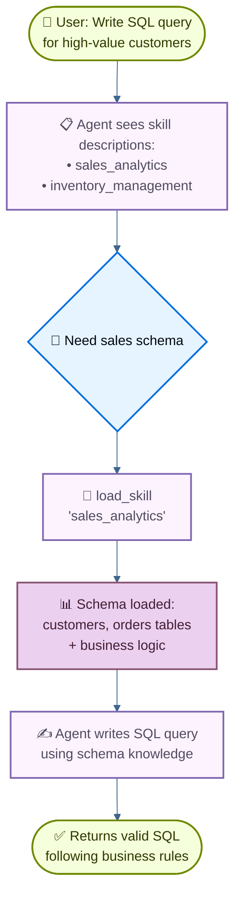

# Skills：SQL 助手

本教程展示如何使用**渐进式披露**（一种上下文管理技术，代理按需加载信息而不是预先加载信息）来实现**技能**（基于提示的专门指令）。代理通过工具调用加载技能，而不是动态更改系统提示，仅发现并加载每个任务所需的技能。

**用例：** 想象一下构建一个代理来帮助在大型企业中跨不同业务垂直领域编写 SQL 查询。您的组织可能为每个垂直行业拥有单独的数据存储，或者具有数千个表的单个整体数据库。无论哪种方式，预先加载所有 schema都会淹没上下文窗口。渐进式披露通过在需要时仅加载相关 schema来解决这个问题。此架构还使不同的产品所有者和利益相关者能够独立贡献和维护其特定业务垂直领域的技能。

**您将构建什么：** 具有两项技能（销售分析和库存管理）的 SQL 查询助手。代理在其系统提示中看到轻量级技能描述，然后仅在与用户查询相关时通过工具调用加载完整的数据库 schema和业务逻辑。

> [!note]
有关具有查询执行、纠错和验证功能的 SQL 代理的完整示例，请参阅 [[03-SQL Agent|SQL 代理教程]]。本教程重点介绍可应用于任何领域的渐进式披露模式。

> [!tip]
渐进式披露被 Anthropic 推广为一种构建可扩展代理技能系统的技术。这种方法使用三级架构（元数据→核心内容→详细资源），其中代理仅根据需要加载信息。有关此技术的更多信息，请参阅[为现实世界的代理配备代理技能](https://www.anthropic.com/engineering/equipping-agents-for-the-real-world-with-agent-skills)。

## 它是如何运作的

以下是用户请求 SQL 查询时的流程：

**为什么渐进式披露：**

* **减少上下文使用** - 仅加载任务所需的 2-3 个技能，而不是所有可用技能
* **实现团队自治** - 不同的团队可以独立开发专业技能（类似于其他多代理架构）
* **有效扩展** - 添加数十或数百项技能，而无需压倒上下文
* **简化对话历史记录** - 单个代理具有一个对话线程

**什么是技能：** 正如Claude Code (Claude Code) 所推广的那样，技能主要是基于提示的：针对特定业务任务的专门指令的独立单元。在 Claude Code 中，技能被公开为文件系统上包含文件的目录，通过文件操作发现。技能通过提示指导行为，并可以提供有关工具使用的信息或包括供编码代理执行的示例代码。

> [!tip]
渐进式披露的技能可以被视为 [[02-RAG Agent|RAG（检索增强生成）]] 的一种形式，其中每个技能都是一个检索单元，尽管不一定由嵌入或关键字搜索支持，但由浏览内容的工具（如文件操作或在本教程中的直接查找）支持。

**权衡：**

* **延迟**：按需加载技能需要额外的工具调用，这会增加需要每种技能的第一个请求的延迟
* **工作流控制**：基本实现依靠提示来指导技能使用 - 如果没有自定义逻辑，您无法强制执行诸如“始终在技能 B 之前尝试技能 A”之类的硬约束

> [!tip]
**实施自己的技能系统**

在构建您自己的技能实现时（正如我们在本教程中所做的那样），核心概念是渐进式披露 - 按需加载信息。除此之外，您在实施方面拥有完全的灵活性：

  * **存储**：数据库、S3、内存数据结构或任何后端
  * **发现**：直接查找（本教程）、大型技能集合的 RAG、文件系统扫描或 API 调用
  * **加载逻辑**：自定义延迟特征并添加逻辑以搜索技能内容或排名相关性
  * **副作用**：定义加载技能时会发生什么，例如公开与该技能相关的工具（第 8 节中介绍）

这种灵活性使您可以针对性能、存储和工作流控制方面的特定要求进行优化。

## 设置

### 安装

本教程需要 `langchain` 包：
```bash
# 安装依赖：先把示例需要的包安装到当前 Python 环境。
pip install langchain
```

```bash
# 安装依赖：先把示例需要的包安装到当前 Python 环境。
uv add langchain
```

```bash
conda install langchain -c conda-forge
```
有关更多详细信息，请参阅[安装指南](https://docs.langchain.com/oss/python/langchain/install)。

### LangSmith

设置 [LangSmith](https://smith.langchain.com?utm_source=docs\&utm_medium=cta\&utm_campaign=langsmith-signup\&utm_content=oss-langchain-multi-agent-skills-sql-assistant) 来检查代理内部发生的情况。然后设置以下环境变量：
```bash
# 配置环境变量：示例会从环境变量读取 API key、模型名或服务地址。
export LANGSMITH_TRACING="true"
export LANGSMITH_API_KEY="..."
```

```python
import getpass
import os

os.environ["LANGSMITH_TRACING"] = "true"
os.environ["LANGSMITH_API_KEY"] = getpass.getpass()
```
### 选择LLM

从 LangChain 的集成套件中选择聊天模型：

#### OpenAI
👉 阅读[OpenAI 聊天模型集成文档](https://docs.langchain.com/oss/python/integrations/chat/openai/)
```shell
# 安装依赖：先把示例需要的包安装到当前 Python 环境。
pip install -U "langchain[openai]"
```

```python
import os
from langchain.chat_models import init_chat_model

os.environ["OPENAI_API_KEY"] = "sk-..."

# 初始化 chat model：后续 agent、chain 或 graph 都会通过这个模型向 LLM 发请求。
model = init_chat_model("gpt-5.4")
```

```python
import os
from langchain_openai import ChatOpenAI

os.environ["OPENAI_API_KEY"] = "sk-..."

# 这里创建具体 provider 的聊天模型对象；保留 provider 名称，便于和官方文档对照。
model = ChatOpenAI(model="gpt-5.4")
```
#### Anthropic
👉 阅读[Anthropic聊天模型集成文档](https://docs.langchain.com/oss/python/integrations/chat/anthropic/)
```shell
# 安装依赖：先把示例需要的包安装到当前 Python 环境。
pip install -U "langchain[anthropic]"
```

```python
import os
from langchain.chat_models import init_chat_model

os.environ["ANTHROPIC_API_KEY"] = "sk-..."

# 初始化 chat model：后续 agent、chain 或 graph 都会通过这个模型向 LLM 发请求。
model = init_chat_model("claude-sonnet-4-6")
```

```python
import os
from langchain_anthropic import ChatAnthropic

os.environ["ANTHROPIC_API_KEY"] = "sk-..."

# 这里创建具体 provider 的聊天模型对象；保留 provider 名称，便于和官方文档对照。
model = ChatAnthropic(model="claude-sonnet-4-6")
```
#### Azure
👉 阅读[Azure 聊天模型集成文档](https://docs.langchain.com/oss/python/integrations/chat/azure_chat_openai/)
```shell
# 安装依赖：先把示例需要的包安装到当前 Python 环境。
pip install -U "langchain[openai]"
```

```python
import os
from langchain.chat_models import init_chat_model

os.environ["AZURE_OPENAI_API_KEY"] = "..."
os.environ["AZURE_OPENAI_ENDPOINT"] = "..."
os.environ["OPENAI_API_VERSION"] = "2025-03-01-preview"

# 初始化 chat model：后续 agent、chain 或 graph 都会通过这个模型向 LLM 发请求。
model = init_chat_model(
    "azure_openai:gpt-5.4",
    azure_deployment=os.environ["AZURE_OPENAI_DEPLOYMENT_NAME"],
)
```

```python
import os
from langchain_openai import AzureChatOpenAI

os.environ["AZURE_OPENAI_API_KEY"] = "..."
os.environ["AZURE_OPENAI_ENDPOINT"] = "..."
os.environ["OPENAI_API_VERSION"] = "2025-03-01-preview"

model = AzureChatOpenAI(
    model="gpt-5.4",
    azure_deployment=os.environ["AZURE_OPENAI_DEPLOYMENT_NAME"]
)
```
#### Google Gemini
👉 阅读 [Google GenAI 聊天模型集成文档](https://docs.langchain.com/oss/python/integrations/chat/google_generative_ai/)
```shell
# 安装依赖：先把示例需要的包安装到当前 Python 环境。
pip install -U "langchain[google-genai]"
```

```python
import os
from langchain.chat_models import init_chat_model

os.environ["GOOGLE_API_KEY"] = "..."

# 初始化 chat model：后续 agent、chain 或 graph 都会通过这个模型向 LLM 发请求。
model = init_chat_model("google_genai:gemini-2.5-flash-lite")
```

```python
import os
from langchain_google_genai import ChatGoogleGenerativeAI

os.environ["GOOGLE_API_KEY"] = "..."

model = ChatGoogleGenerativeAI(model="gemini-2.5-flash-lite")
```
#### AWS Bedrock
👉 阅读 [AWS Bedrock 聊天模型集成文档](https://docs.langchain.com/oss/python/integrations/chat/bedrock/)
```shell
# 安装依赖：先把示例需要的包安装到当前 Python 环境。
pip install -U "langchain[aws]"
```

```python
from langchain.chat_models import init_chat_model

# 按这里的步骤配置凭据：
# 参考链接：https://docs.aws.amazon.com/bedrock/latest/userguide/getting-started.html

model = init_chat_model(
    "anthropic.claude-3-5-sonnet-20240620-v1:0",
    model_provider="bedrock_converse",
)
```

```python
from langchain_aws import ChatBedrock

# 这里创建具体 provider 的聊天模型对象；保留 provider 名称，便于和官方文档对照。
model = ChatBedrock(model="anthropic.claude-3-5-sonnet-20240620-v1:0")
```
#### Hugging Face
👉 阅读 [HuggingFace 聊天模型集成文档](https://docs.langchain.com/oss/python/integrations/chat/huggingface/)
```shell
# 安装依赖：先把示例需要的包安装到当前 Python 环境。
pip install -U "langchain[huggingface]"
```

```python
import os
from langchain.chat_models import init_chat_model

os.environ["HUGGINGFACEHUB_API_TOKEN"] = "hf_..."

# 初始化 chat model：后续 agent、chain 或 graph 都会通过这个模型向 LLM 发请求。
model = init_chat_model(
    "microsoft/Phi-3-mini-4k-instruct",
    model_provider="huggingface",
    temperature=0.7,
    max_tokens=1024,
)
```

```python
import os
from langchain_huggingface import ChatHuggingFace, HuggingFaceEndpoint

os.environ["HUGGINGFACEHUB_API_TOKEN"] = "hf_..."

llm = HuggingFaceEndpoint(
    repo_id="microsoft/Phi-3-mini-4k-instruct",
    temperature=0.7,
    max_length=1024,
)
model = ChatHuggingFace(llm=llm)
```
#### OpenRouter
👉 阅读[OpenRouter聊天模型集成文档](https://docs.langchain.com/oss/python/integrations/chat/openrouter/)
```shell
# 安装依赖：先把示例需要的包安装到当前 Python 环境。
pip install -U "langchain-openrouter"
```

```python
import os
from langchain.chat_models import init_chat_model

os.environ["OPENROUTER_API_KEY"] = "sk-..."

# 初始化 chat model：后续 agent、chain 或 graph 都会通过这个模型向 LLM 发请求。
model = init_chat_model(
    "auto",
    model_provider="openrouter",
)
```

```python
import os
from langchain_openrouter import ChatOpenRouter

os.environ["OPENROUTER_API_KEY"] = "sk-..."

model = ChatOpenRouter(model="auto")
```
## 1. 定义技能

首先，定义技能的结构。每个技能都有名称、简要描述（在系统提示中显示）和完整内容（按需加载）：
```python
from typing import TypedDict

class Skill(TypedDict):  # [!code highlight]
    """A skill that can be progressively disclosed to the agent."""
    name: str  # skill 的唯一标识符。
    description: str  # 显示在系统提示词中的 1-2 句简介。
    content: str  # 完整 skill 内容，包含详细说明。
```
现在定义 SQL 查询助手的示例技能。这些技能的设计是**描述轻量级**（预先向代理显示），但**内容详细**（仅在需要时加载）：

### 查看完整的技能定义
```python
SKILLS: list[Skill] = [
    {
        "name": "sales_analytics",
        "description": "Database schema and business logic for sales data analysis including customers, orders, and revenue.",
        "content": """# Sales Analytics Schema

## Tables

### customers
- customer_id (PRIMARY KEY)
- name
- email
- signup_date
- status (active/inactive)
- customer_tier (bronze/silver/gold/platinum)

### orders
- order_id (PRIMARY KEY)
- customer_id (FOREIGN KEY -> customers)
- order_date
- status (pending/completed/cancelled/refunded)
- total_amount
- sales_region (north/south/east/west)

### order_items
- item_id (PRIMARY KEY)
- order_id (FOREIGN KEY -> orders)
- product_id
- quantity
- unit_price
- discount_percent

## Business Logic

**Active customers**: status = 'active' AND signup_date <= CURRENT_DATE - INTERVAL '90 days'

**Revenue calculation**: Only count orders with status = 'completed'. Use total_amount from orders table, which already accounts for discounts.

**Customer lifetime value (CLV)**: Sum of all completed order amounts for a customer.

**High-value orders**: Orders with total_amount > 1000

## Example Query

-- Get top 10 customers by revenue in the last quarter
SELECT
    c.customer_id,
    c.name,
    c.customer_tier,
    SUM(o.total_amount) as total_revenue
FROM customers c
JOIN orders o ON c.customer_id = o.customer_id
WHERE o.status = 'completed'
  AND o.order_date >= CURRENT_DATE - INTERVAL '3 months'
GROUP BY c.customer_id, c.name, c.customer_tier
ORDER BY total_revenue DESC
LIMIT 10;
""",
    },
    {
        "name": "inventory_management",
        "description": "Database schema and business logic for inventory tracking including products, warehouses, and stock levels.",
        "content": """# Inventory Management Schema

## Tables

### products
- product_id (PRIMARY KEY)
- product_name
- sku
- category
- unit_cost
- reorder_point (minimum stock level before reordering)
- discontinued (boolean)

### warehouses
- warehouse_id (PRIMARY KEY)
- warehouse_name
- location
- capacity

### inventory
- inventory_id (PRIMARY KEY)
- product_id (FOREIGN KEY -> products)
- warehouse_id (FOREIGN KEY -> warehouses)
- quantity_on_hand
- last_updated

### stock_movements
- movement_id (PRIMARY KEY)
- product_id (FOREIGN KEY -> products)
- warehouse_id (FOREIGN KEY -> warehouses)
- movement_type (inbound/outbound/transfer/adjustment)
- quantity (positive for inbound, negative for outbound)
- movement_date
- reference_number

## Business Logic

**Available stock**: quantity_on_hand from inventory table where quantity_on_hand > 0

**Products needing reorder**: Products where total quantity_on_hand across all warehouses is less than or equal to the product's reorder_point

**Active products only**: Exclude products where discontinued = true unless specifically analyzing discontinued items

**Stock valuation**: quantity_on_hand * unit_cost for each product

## Example Query

-- Find products below reorder point across all warehouses
SELECT
    p.product_id,
    p.product_name,
    p.reorder_point,
    SUM(i.quantity_on_hand) as total_stock,
    p.unit_cost,
    (p.reorder_point - SUM(i.quantity_on_hand)) as units_to_reorder
FROM products p
JOIN inventory i ON p.product_id = i.product_id
WHERE p.discontinued = false
GROUP BY p.product_id, p.product_name, p.reorder_point, p.unit_cost
HAVING SUM(i.quantity_on_hand) <= p.reorder_point
ORDER BY units_to_reorder DESC;
""",
    },
]
```
## 2.创建技能加载工具

创建一个工具来按需加载完整的技能内容：
```python
from langchain.tools import tool

# 使用 @tool 可以把普通 Python 函数暴露给 agent，模型会根据函数名、参数和 docstring 判断何时调用。
@tool  # [!code highlight]
def load_skill(skill_name: str) -> str:
    """Load the full content of a skill into the agent's context.

    Use this when you need detailed information about how to handle a specific
    type of request. This will provide you with comprehensive instructions,
    policies, and guidelines for the skill area.

    Args:
        skill_name: The name of the skill to load (e.g., "expense_reporting", "travel_booking")
    """
    # 查找并返回请求的 skill。
    for skill in SKILLS:
        if skill["name"] == skill_name:
            return f"Loaded skill: {skill_name}\n\n{skill['content']}"  # [!code highlight]

    # 没有找到对应 skill。
    available = ", ".join(s["name"] for s in SKILLS)
    return f"Skill '{skill_name}' not found. Available skills: {available}"
```
`load_skill` 工具以字符串形式返回完整的技能内容，该内容作为 ToolMessage 成为对话的一部分。有关创建和使用工具的更多详细信息，请参阅[工具指南](https://docs.langchain.com/oss/python/langchain/tools)。

## 3. 构建技能中间件

创建自定义中间件，将技能描述注入系统提示中。该中间件使技能可以被发现，而无需预先加载其完整内容。

> [!note]
本指南演示了创建自定义中间件。有关中间件概念和模式的综合指南，请参阅[自定义中间件文档](https://docs.langchain.com/oss/python/langchain/middleware/custom)。
```python
from langchain.agents.middleware import ModelRequest, ModelResponse, AgentMiddleware
from langchain.messages import SystemMessage
from typing import Callable

class SkillMiddleware(AgentMiddleware):  # [!code highlight]
    """Middleware that injects skill descriptions into the system prompt."""

    # 把 load_skill tool 注册为类变量，方便 middleware 复用。
    tools = [load_skill]  # [!code highlight]

    def __init__(self):
        """Initialize and generate the skills prompt from SKILLS."""
        # 根据 SKILLS 列表构建 skills 提示词。
        skills_list = []
        for skill in SKILLS:
            skills_list.append(
                f"- **{skill['name']}**: {skill['description']}"
            )
        self.skills_prompt = "\n".join(skills_list)

    def wrap_model_call(
        self,
        request: ModelRequest,
        handler: Callable[[ModelRequest], ModelResponse],
    ) -> ModelResponse:
        """Sync: Inject skill descriptions into system prompt."""
        # 构建 skills 附加说明。
        skills_addendum = ( # [!code highlight]
            f"\n\n## Available Skills\n\n{self.skills_prompt}\n\n" # [!code highlight]
            "Use the load_skill tool when you need detailed information " # [!code highlight]
            "about handling a specific type of request." # [!code highlight]
        )

        # 追加到系统消息的 content blocks 中。
        new_content = list(request.system_message.content_blocks) + [
            {"type": "text", "text": skills_addendum}
        ]
        new_system_message = SystemMessage(content=new_content)
        modified_request = request.override(system_message=new_system_message)
        return handler(modified_request)
```
中间件将技能描述附加到系统提示中，使客服代理无需加载完整内容即可了解可用技能。 `load_skill` 工具注册为类变量，使其可供代理使用。

> [!note]
**生产考虑**：为了简单起见，本教程加载 `__init__` 中的技能列表。在生产系统中，您可能希望在 `before_agent` 挂钩中加载技能，从而允许定期刷新它们以反映最新的更改（例如，当添加新技能或修改现有技能时）。有关详细信息，请参阅 [before\_agent hook 文档](https://docs.langchain.com/oss/python/langchain/middleware/custom#node-style-hooks)。

## 4. 创建具有技能支持的代理

现在使用技能中间件和状态持久性检查点创建代理：
```python
from langchain.agents import create_agent
from langgraph.checkpoint.memory import InMemorySaver

# 创建支持 skill 的 agent。
agent = create_agent(
    model,
    system_prompt=(
        "You are a SQL query assistant that helps users "
        "write queries against business databases."
    ),
    middleware=[SkillMiddleware()],  # [!code highlight]
    # checkpointer 保存线程内的执行状态，用于多轮对话、暂停恢复和 human-in-the-loop。
    checkpointer=InMemorySaver(),
)
```
代理现在可以在其系统提示中访问技能描述，并可以在需要时调用 `load_skill` 来检索完整的技能内容。检查点维护各回合的对话历史记录。

## 5. 测试渐进式披露

使用需要特定技能知识的问题来测试代理：
```python
from langchain_core.utils.uuid import uuid7

# 当前会话线程的配置。
thread_id = str(uuid7())
config = {"configurable": {"thread_id": thread_id}}

# 让模型生成 SQL 查询。
result = agent.invoke(  # [!code highlight]
    {
        "messages": [
            {
                "role": "user",
                "content": (
                    "Write a SQL query to find all customers "
                    "who made orders over $1000 in the last month"
                ),
            }
        ]
    },
    config
)

# 打印 the conversation。
for message in result["messages"]:
    if hasattr(message, 'pretty_print'):
        message.pretty_print()
    else:
        print(f"{message.type}: {message.content}")
```
预期输出：
```
================================ Human Message =================================

Write a SQL query to find all customers who made orders over $1000 in the last month
================================== Ai Message ==================================
Tool Calls:
  load_skill (call_abc123)
 Call ID: call_abc123
  Args:
    skill_name: sales_analytics
================================= Tool Message =================================
Name: load_skill

Loaded skill: sales_analytics

# Sales Analytics Schema

## Tables

### customers
- customer_id (PRIMARY KEY)
- name
- email
- signup_date
- status (active/inactive)
- customer_tier (bronze/silver/gold/platinum)

### orders
- order_id (PRIMARY KEY)
- customer_id (FOREIGN KEY -> customers)
- order_date
- status (pending/completed/cancelled/refunded)
- total_amount
- sales_region (north/south/east/west)

[... rest of schema ...]

## Business Logic

**High-value orders**: Orders with `total_amount > 1000`
**Revenue calculation**: Only count orders with `status = 'completed'`

================================== Ai Message ==================================

Here's a SQL query to find all customers who made orders over $1000 in the last month:

\`\`\`sql
SELECT DISTINCT
    c.customer_id,
    c.name,
    c.email,
    c.customer_tier
FROM customers c
JOIN orders o ON c.customer_id = o.customer_id
WHERE o.total_amount > 1000
  AND o.status = 'completed'
  AND o.order_date >= CURRENT_DATE - INTERVAL '1 month'
ORDER BY c.customer_id;
\`\`\`

This query:
- Joins customers with their orders
- Filters for high-value orders (>$1000) using the total_amount field
- Only includes completed orders (as per the business logic)
- Restricts to orders from the last month
- Returns distinct customers to avoid duplicates if they made multiple qualifying orders
```
代理在系统提示中看到了轻量级技能描述，认识到该问题需要销售数据库知识，调用 `load_skill("sales_analytics")` 来获取完整的架构和业务逻辑，然后使用该信息按照数据库约定编写正确的查询。

## 6. 高级：添加自定义状态约束

### 可选：跟踪加载的技能并强制执行工具限制
您可以添加约束以强制某些工具仅在加载特定技能后才可用。这需要跟踪哪些技能已加载到自定义代理状态。

### 定义自定义状态

首先，扩展代理状态以跟踪加载的技能：
```python
from langchain.agents.middleware import AgentState

# State schema 定义节点之间传递的数据结构；字段名会影响后续节点能读取和写入什么。
class CustomState(AgentState):  # [!code highlight]
    skills_loaded: NotRequired[list[str]]  # 跟踪已经加载过的 skill，避免重复加载。  # [!code highlight]
```
### 更新 load_skill 来修改状态

修改 `load_skill` 工具以在加载技能时更新状态：
```python
from langgraph.types import Command  # [!code highlight]
from langchain.tools import tool, ToolRuntime
from langchain.messages import ToolMessage  # [!code highlight]

# 使用 @tool 可以把普通 Python 函数暴露给 agent，模型会根据函数名、参数和 docstring 判断何时调用。
@tool
def load_skill(skill_name: str, runtime: ToolRuntime) -> Command:  # [!code highlight]
    """Load the full content of a skill into the agent's context.

    Use this when you need detailed information about how to handle a specific
    type of request. This will provide you with comprehensive instructions,
    policies, and guidelines for the skill area.

    Args:
        skill_name: The name of the skill to load
    """
    # 查找并返回请求的 skill。
    for skill in SKILLS:
        if skill["name"] == skill_name:
            skill_content = f"Loaded skill: {skill_name}\n\n{skill['content']}"

            # 更新 state，用来记录已经加载的 skill。
            return Command(  # [!code highlight]
                update={  # [!code highlight]
                    "messages": [  # [!code highlight]
                        ToolMessage(  # [!code highlight]
                            content=skill_content,  # [!code highlight]
                            tool_call_id=runtime.tool_call_id,  # [!code highlight]
                        )  # [!code highlight]
                    ],  # [!code highlight]
                    "skills_loaded": [skill_name],  # [!code highlight]
                }  # [!code highlight]
            )  # [!code highlight]

    # 没有找到对应 skill。
    available = ", ".join(s["name"] for s in SKILLS)
    return Command(
        update={
            "messages": [
                ToolMessage(
                    content=f"Skill '{skill_name}' not found. Available skills: {available}",
                    tool_call_id=runtime.tool_call_id,
                )
            ]
        }
    )
```
### 创建约束工具

创建一个仅在加载特定技能后才可用的工具：
```
@tool
def write_sql_query(  # [!code highlight]
    query: str,
    vertical: str,
    runtime: ToolRuntime,
) -> str:
    """Write and validate a SQL query for a specific business vertical.

    This tool helps format and validate SQL queries. You must load the
    appropriate skill first to understand the database schema.

    Args:
        query: The SQL query to write
        vertical: The business vertical (sales_analytics or inventory_management)
    """
    # Check if the required skill has been loaded
    skills_loaded = runtime.state.get("skills_loaded", [])  # [!code highlight]

    if vertical not in skills_loaded:  # [!code highlight]
        return (  # [!code highlight]
            f"Error: You must load the '{vertical}' skill first "  # [!code highlight]
            f"to understand the database schema before writing queries. "  # [!code highlight]
            f"Use load_skill('{vertical}') to load the schema."  # [!code highlight]
        )  # [!code highlight]

    # Validate and format the query
    return (
        f"SQL Query for {vertical}:\n\n"
        f"```sql\n{query}\n```\n\n"
        f"✓ Query validated against {vertical} schema\n"
        f"Ready to execute against the database."
    )
````

### Update middleware and agent

Update the middleware to use the custom state schema:

```python theme={"theme":{"light":"catppuccin-latte","dark":"catppuccin-mocha"}}
class SkillMiddleware(AgentMiddleware[CustomState]):  # [!code highlight]
    """Middleware that injects skill descriptions into the system prompt."""

    state_schema = CustomState  # [!code highlight]
    tools = [load_skill, write_sql_query]  # [!code highlight]

    # 省略：middleware 的其余实现保持不变。
```
使用注册受约束工具的中间件创建代理：
```python
# create_agent 会把模型、tools、系统提示词和 middleware 组装成一个可运行的 agent。
agent = create_agent(
    model,
    system_prompt=(
        "You are a SQL query assistant that helps users "
        "write queries against business databases."
    ),
    middleware=[SkillMiddleware()],  # [!code highlight]
    # checkpointer 保存线程内的执行状态，用于多轮对话、暂停恢复和 human-in-the-loop。
    checkpointer=InMemorySaver(),
)
```
现在，如果代理在加载所需技能之前尝试使用 `write_sql_query`，它将收到一条错误消息，提示其首先加载适当的技能（例如 `sales_analytics` 或 `inventory_management`）。这可确保代理在尝试验证查询之前拥有必要的架构知识。

## 完整示例

### 查看完整的可运行脚本
这是一个完整的、可运行的实现，结合了本教程中的所有部分：
```python
from langchain_core.utils.uuid import uuid7
from typing import TypedDict, NotRequired
from langchain.tools import tool
from langchain.agents import create_agent
from langchain.agents.middleware import ModelRequest, ModelResponse, AgentMiddleware
from langchain.messages import SystemMessage
from langgraph.checkpoint.memory import InMemorySaver
from typing import Callable

# 定义 skill 的数据结构。
class Skill(TypedDict):
    """A skill that can be progressively disclosed to the agent."""
    name: str
    description: str
    content: str

# 定义带 schema 和业务逻辑的 skills。
SKILLS: list[Skill] = [
    {
        "name": "sales_analytics",
        "description": "Database schema and business logic for sales data analysis including customers, orders, and revenue.",
        "content": """# Sales Analytics Schema

## Tables

### customers
- customer_id (PRIMARY KEY)
- name
- email
- signup_date
- status (active/inactive)
- customer_tier (bronze/silver/gold/platinum)

### orders
- order_id (PRIMARY KEY)
- customer_id (FOREIGN KEY -> customers)
- order_date
- status (pending/completed/cancelled/refunded)
- total_amount
- sales_region (north/south/east/west)

### order_items
- item_id (PRIMARY KEY)
- order_id (FOREIGN KEY -> orders)
- product_id
- quantity
- unit_price
- discount_percent

## Business Logic

**Active customers**: status = 'active' AND signup_date <= CURRENT_DATE - INTERVAL '90 days'

**Revenue calculation**: Only count orders with status = 'completed'. Use total_amount from orders table, which already accounts for discounts.

**Customer lifetime value (CLV)**: Sum of all completed order amounts for a customer.

**High-value orders**: Orders with total_amount > 1000

## Example Query

-- Get top 10 customers by revenue in the last quarter
SELECT
    c.customer_id,
    c.name,
    c.customer_tier,
    SUM(o.total_amount) as total_revenue
FROM customers c
JOIN orders o ON c.customer_id = o.customer_id
WHERE o.status = 'completed'
  AND o.order_date >= CURRENT_DATE - INTERVAL '3 months'
GROUP BY c.customer_id, c.name, c.customer_tier
ORDER BY total_revenue DESC
LIMIT 10;
""",
    },
    {
        "name": "inventory_management",
        "description": "Database schema and business logic for inventory tracking including products, warehouses, and stock levels.",
        "content": """# Inventory Management Schema

## Tables

### products
- product_id (PRIMARY KEY)
- product_name
- sku
- category
- unit_cost
- reorder_point (minimum stock level before reordering)
- discontinued (boolean)

### warehouses
- warehouse_id (PRIMARY KEY)
- warehouse_name
- location
- capacity

### inventory
- inventory_id (PRIMARY KEY)
- product_id (FOREIGN KEY -> products)
- warehouse_id (FOREIGN KEY -> warehouses)
- quantity_on_hand
- last_updated

### stock_movements
- movement_id (PRIMARY KEY)
- product_id (FOREIGN KEY -> products)
- warehouse_id (FOREIGN KEY -> warehouses)
- movement_type (inbound/outbound/transfer/adjustment)
- quantity (positive for inbound, negative for outbound)
- movement_date
- reference_number

## Business Logic

**Available stock**: quantity_on_hand from inventory table where quantity_on_hand > 0

**Products needing reorder**: Products where total quantity_on_hand across all warehouses is less than or equal to the product's reorder_point

**Active products only**: Exclude products where discontinued = true unless specifically analyzing discontinued items

**Stock valuation**: quantity_on_hand * unit_cost for each product

## Example Query

-- Find products below reorder point across all warehouses
SELECT
    p.product_id,
    p.product_name,
    p.reorder_point,
    SUM(i.quantity_on_hand) as total_stock,
    p.unit_cost,
    (p.reorder_point - SUM(i.quantity_on_hand)) as units_to_reorder
FROM products p
JOIN inventory i ON p.product_id = i.product_id
WHERE p.discontinued = false
GROUP BY p.product_id, p.product_name, p.reorder_point, p.unit_cost
HAVING SUM(i.quantity_on_hand) <= p.reorder_point
ORDER BY units_to_reorder DESC;
""",
    },
]

# 创建用于加载 skill 的 tool。
@tool
def load_skill(skill_name: str) -> str:
    """Load the full content of a skill into the agent's context.

    Use this when you need detailed information about how to handle a specific
    type of request. This will provide you with comprehensive instructions,
    policies, and guidelines for the skill area.

    Args:
        skill_name: The name of the skill to load (e.g., "sales_analytics", "inventory_management")
    """
    # 查找并返回请求的 skill。
    for skill in SKILLS:
        if skill["name"] == skill_name:
            return f"Loaded skill: {skill_name}\n\n{skill['content']}"

    # 没有找到对应 skill。
    available = ", ".join(s["name"] for s in SKILLS)
    return f"Skill '{skill_name}' not found. Available skills: {available}"

# 创建 skill middleware。
class SkillMiddleware(AgentMiddleware):
    """Middleware that injects skill descriptions into the system prompt."""

    # 把 load_skill tool 注册为类变量，方便 middleware 复用。
    tools = [load_skill]

    def __init__(self):
        """Initialize and generate the skills prompt from SKILLS."""
        # 根据 SKILLS 列表构建 skills 提示词。
        skills_list = []
        for skill in SKILLS:
            skills_list.append(
                f"- **{skill['name']}**: {skill['description']}"
            )
        self.skills_prompt = "\n".join(skills_list)

    def wrap_model_call(
        self,
        request: ModelRequest,
        handler: Callable[[ModelRequest], ModelResponse],
    ) -> ModelResponse:
        """Sync: Inject skill descriptions into system prompt."""
        # 构建 skills 附加说明。
        skills_addendum = (
            f"\n\n## Available Skills\n\n{self.skills_prompt}\n\n"
            "Use the load_skill tool when you need detailed information "
            "about handling a specific type of request."
        )

        # 追加到系统消息的 content blocks 中。
        new_content = list(request.system_message.content_blocks) + [
            {"type": "text", "text": skills_addendum}
        ]
        new_system_message = SystemMessage(content=new_content)
        modified_request = request.override(system_message=new_system_message)
        return handler(modified_request)

# 初始化聊天模型；实际使用时替换为自己的模型。
# 示例：from langchain_anthropic import ChatAnthropic。
# 示例：model = ChatAnthropic(model="claude-3-5-sonnet-20241022")。
from langchain_openai import ChatOpenAI
# 这里创建具体 provider 的聊天模型对象；保留 provider 名称，便于和官方文档对照。
model = ChatOpenAI(model="gpt-4")

# 创建支持 skill 的 agent。
agent = create_agent(
    model,
    system_prompt=(
        "You are a SQL query assistant that helps users "
        "write queries against business databases."
    ),
    middleware=[SkillMiddleware()],
    # checkpointer 保存线程内的执行状态，用于多轮对话、暂停恢复和 human-in-the-loop。
    checkpointer=InMemorySaver(),
)

# 示例用法。
if __name__ == "__main__":
    # 当前会话线程的配置。
    thread_id = str(uuid7())
    config = {"configurable": {"thread_id": thread_id}}

    # 让模型生成 SQL 查询。
    result = agent.invoke(
        {
            "messages": [
                {
                    "role": "user",
                    "content": (
                        "Write a SQL query to find all customers "
                        "who made orders over $1000 in the last month"
                    ),
                }
            ]
        },
        config
    )

    # 打印 the conversation。
    for message in result["messages"]:
        if hasattr(message, 'pretty_print'):
            message.pretty_print()
        else:
            print(f"{message.type}: {message.content}")
```
这个完整的示例包括：

* 具有完整数据库 schema 的技能定义
  * 用于按需加载的 `load_skill` 工具
  * `SkillMiddleware` 将技能描述注入系统提示中
  * 使用中间件和检查点创建代理
  * 显示代理如何加载技能和编写 SQL 查询的示例用法

要运行它，您需要：

  1. 安装所需的包：`pip install langchain langchain-openai langgraph`
  2. 设置您的 API 密钥（例如 `export OPENAI_API_KEY=...`）
  3. 将模型初始化替换为您首选的 LLM 提供商

## 实施变化

### 查看实施选项和权衡
本教程将技能实现为通过工具调用加载的内存中 Python 字典。然而，有几种方法可以通过技能来实现渐进式披露：

**存储后端：**

  * **内存中**（本教程）：定义为 Python 数据结构的技能，快速访问，无 I/O 开销
  * **文件系统**（Claude Code 方法）：作为带有文件的目录的技能，通过 `read_file` 等文件操作发现
  * **远程存储**：S3、数据库、概念或 API 方面的技能，按需获取

**技能发现**（代理如何了解存在哪些技能）：

  * **系统提示列表**：系统提示中的技能说明（本教程中使用）
  * **基于文件**：通过扫描目录发现技能（Claude Code 方法）
  * **基于注册表**：查询技能注册表服务或 API 以获取可用技能
  * **动态查找**：通过工具调用列出可用技能

**渐进式披露策略**（技能内容如何加载）：

  * **单一加载**：在一次工具调用中加载整个技能内容（本教程中使用）
  * **分页**：在多个页面/块中加载大型技能的技能内容
  * **基于搜索**：在特定技能的内容中搜索相关部分（例如，对技能文件使用 grep/read 操作）
  * **分层**：首先加载技能概述，然后深入到特定的小节

**尺寸注意事项**（未校准的心智模型 - 针对您的系统进行优化）：

  * **小技巧**（\< 1K tokens / \~750 个单词）：可以直接包含在系统提示中，并通过提示缓存进行缓存，以节省成本并加快响应速度
  * **中等技能**（1-10K 标记/\~750-7.5K 单词）：受益于按需加载以避免上下文开销（本教程）
  * **大型技能**（> 10K 标记/\~7.5K 单词，或 > 上下文窗口的 5-10%）：应使用渐进式披露技术，如分页、基于搜索的加载或分层探索，以避免消耗过多的上下文

选择取决于您的要求：内存中速度最快，但需要重新部署以进行技能更新，而基于文件或远程存储可实现动态技能管理，无需更改代码。

## 渐进式披露和背景工程

### 结合少量提示和其他技术
渐进式披露从根本上来说是一种**[上下文工程](https://docs.langchain.com/oss/python/langchain/context-engineering) 技术** - 您正在管理代理可以使用哪些信息以及何时可以使用。本教程重点介绍加载数据库 schema，但相同的原则也适用于其他类型的上下文。

### 与少量提示相结合

对于 SQL 查询用例，您可以扩展渐进式披露以动态加载与用户查询匹配的**少量示例**：

**方法示例：**

  1. 用户询问：“查找 6 个月内未订购的客户”
  2. 代理加载 `sales_analytics` 架构（如本教程所示）
  3. 代理还加载 2-3 个相关示例查询（通过语义搜索或基于标签的查找）：
     * 查询查找不活跃客户
     * 基于日期的过滤查询
     * 查询连接客户和订单表
  4. 代理使用 schema 知识和示例模式编写查询

渐进式披露（按需加载 schema）和动态少样本提示（加载相关示例）的结合创建了强大的上下文工程模式，可以扩展到大型知识库，同时提供高质量、扎实的输出。

## 后续步骤

* 了解 [中间件](https://docs.langchain.com/oss/python/langchain/middleware) 以获取更动态的代理行为
* 探索管理代理上下文的[上下文工程](https://docs.langchain.com/oss/python/langchain/context-engineering)技术
* 探索顺序工作流的[[02-Handoffs Customer Support|交接模式]]
* 阅读并行任务路由的[[01-Subagents Personal Assistant|子代理模式]]
* 有关专门代理的其他方法，请参阅[多代理模式](https://docs.langchain.com/oss/python/langchain/multi-agent)
* 使用 [LangSmith](https://smith.langchain.com?utm_source=docs\&utm_medium=cta\&utm_campaign=langsmith-signup\&utm_content=oss-langchain-multi-agent-skills-sql-assistant) 调试和监控技能加载
