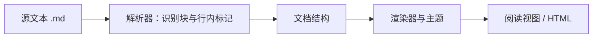

# Markdown 基础语法与可读源文件

## 本节目标

学完本节，你应能从零写出一篇不依赖特殊主题也能读懂的技术笔记，并解释同一份 `.md` 文件为何会在不同工具中略有不同。本节只讲高频核心；需要查某个符号时，使用 [[Markdown/Markdown 教程|Markdown 完整教程]] 作为参考手册。

## 先建立正确心智模型

本 vault 约定 `.md` 使用 **UTF-8 纯文本**。CommonMark 按字符定义解析规则，并不规定文件的字节编码；跨工具交换时仍要由项目明确编码。`#`、`-`、反引号等字符只是给解析器的标记；Obsidian、GitHub 或文档站点再把解析结果渲染成标题、列表和代码块。



因此要分开判断三件事：

1. **源文本是否清楚**：不渲染时还能否理解层级、命令和证据？
2. **语法是否属于当前方言**：它是 CommonMark 核心、GFM 扩展，还是 Obsidian 专用能力？
3. **宿主是否支持并启用**：主题、插件、宿主版本和安全设置都可能影响最终显示。

Markdown 不是执行环境。代码围栏只表示“这是代码”，不会自动运行其中命令，也不会隔离恶意内容。

## 块结构与行内结构

解析器通常先识别块（block），再处理块内部的行内内容（inline）。这解释了许多看似奇怪的结果。

| 层级 | 常见元素 | 关键边界 |
| --- | --- | --- |
| 块结构 | 标题、段落、列表、引用、代码块、分隔线 | 行首标记、空行、缩进、围栏 |
| 行内结构 | 强调、链接、图片、行内代码 | 成对定界符、转义、目标地址 |

例如，行首的 `- ` 会先建立列表项；其中的 `**重点**` 才会被识别为粗体。若列表下面的代码块缩进错误，问题在块结构，而不是 Python 代码本身。

## 日常必会语法

### 标题与段落

- `#` 到 `######` 表示一至六级标题，`#` 后留一个空格。
- 一篇独立笔记通常只有一个一级标题，正文从二级标题开始。
- 两段之间保留空行。不要靠连续空格或大量空行“推开”内容。
- 标题表示信息层级，不只是字号；不要从二级直接跳到四级。

### 列表、引用与任务

```markdown
- 无先后关系的项目
  - 子项目保持一致缩进

1. 有先后关系的步骤
2. 每一步只表达一个动作

> 引用或需要保留来源边界的文字

- [ ] 待检查
- [x] 已完成
```

任务列表是常见扩展，不应代替状态说明。`- [x] 已测试` 仍需写清测试了什么、证据在哪里。

### 强调、行内代码与代码围栏

- `**粗体**` 用于少量重点，`*斜体*` 常用于轻度强调或术语。
- `` `config.json` `` 适合文件名、命令、字段和短代码。
- 多行命令、程序和输出使用围栏，并写语言标记，如 `powershell`、`python`、`json`、`text`。

命令与输出必须分开：

```powershell
python --version
```

```text
Python 3.x.y
```

这里的 `3.x.y` 是占位示例，不是本课程声称的实测版本。技术文档要明确区分“命令”“预期输出”和“实际记录”。

### 链接、图片与表格

- 外部网页：`[CommonMark](https://spec.commonmark.org/)`。
- vault 内部笔记：使用路径明确的 Obsidian wikilink，下一课会详细说明。
- 外部图片：``；替代文字应描述信息，而不是写“图片”。
- 表格适合逐列比较；步骤、长解释和嵌套内容更适合列表或小节。

表格单元格需要显示 `|` 时写成 `\|`。不要在表格里塞多段操作步骤，因为窄屏和纯文本 diff 都会变得难读。

## 空白、换行与转义

这是初学者最容易踩坑的区域。

| 目的 | 推荐写法 | 说明 |
| --- | --- | --- |
| 新段落 | 中间留一个空行 | 最稳定、最易读 |
| 同段强制换行 | 行尾两个空格或反斜杠 | 依赖解析规则，少量使用 |
| 显示特殊字符 | 前置反斜杠，如 `\#` | 代码跨度内通常无需转义 |
| 嵌套代码围栏 | 外层使用更多反引号 | 外层长度必须大于内层 |

Obsidian 的换行显示还受 **Strict line breaks** 设置影响。跨平台文档不要依赖“在编辑器里按一次 Enter 看起来换行”；用段落空行表达结构更可靠。

下面用四反引号展示一个包含三反引号代码块的 Markdown 文档：

````markdown
# 本地工具运行记录

## 前置条件

- Windows 11
- PowerShell 7
- Python 3

## 命令

```powershell
python --version
```

## 结果边界

上面的命令需要读者自行执行；本文没有记录实际输出。
````

## 最小可读性检查

写完一篇笔记后，先不切换阅读视图，直接检查源文件：

1. 文件名和一级标题能否说明主题？
2. 只看标题能否复述文章结构？
3. 命令、输出、占位符和解释是否分开？
4. 列表是否表达并列项，编号是否真的表示顺序？
5. 删除主题样式后，信息是否仍成立？
6. 是否存在真实凭据、个人数据或无法证明的“已验证”？

## 动手练习：建立渲染实验

新建一篇临时笔记 `Markdown-渲染实验.md`，依次加入：

- 相邻两行文本与中间有空行的两段文本；
- 二级标题后紧跟列表，以及列表后有空行的代码块；
- 含 `|` 的表格单元格；
- 三反引号代码块，以及用四反引号包住它的展示块；
- 一个外部链接和一个指向本目录的完整路径 wikilink。

为每个实验记录三列：源文本、阅读视图观察、你推断的原因。不要把观察写成所有渲染器都保证的事实。

## 常见误区

- **“编辑器显示正常，所以文件没问题”**：编辑高亮不是目标渲染器。
- **“空格越多越容易对齐”**：比例字体和不同窗口宽度会破坏手工对齐。
- **“语言标记会执行代码”**：它通常只选择语法高亮。
- **“Markdown 只有一种标准”**：现实中有 CommonMark、GFM 和宿主扩展。
- **“README 越长越完整”**：可执行顺序、边界和证据比篇幅重要。

## 自测与掌握检查

1. 源文本、解析器和渲染器分别负责什么？
2. 为什么列表里的代码块首先是块结构问题？
3. 软换行、新段落和硬换行有何区别？
4. 为什么命令和输出应使用不同围栏？
5. 如何在文档中展示另一个三反引号代码块？

- [ ] 能独立写出标题、段落、列表、引用、链接、表格和代码块。
- [ ] 能仅看源文本判断文档结构。
- [ ] 能解释至少三个渲染差异来源。
- [ ] 能明确标记预期输出与实际验证。

下一步：[[Markdown/02-CommonMark、GFM与Obsidian语法边界|CommonMark、GFM 与 Obsidian 语法边界]]。

## 参考资料

核对日期：**2026-07-14**。

- [CommonMark Specification 0.31.2](https://spec.commonmark.org/0.31.2/)
- [GitHub Flavored Markdown Specification 0.29-gfm](https://github.github.com/gfm/)
- [Obsidian：Basic formatting syntax](https://obsidian.md/help/syntax)
