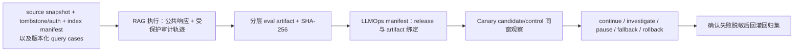

# 端到端评测与监控

## 本节目标

- 分别测量路由、过滤、检索、上下文、回答、引用和系统指标；
- 构建包含无答案、冲突、权限与时效的离线集；
- 正确使用人工、规则和模型 judge；
- 用发布门禁、线上切片和回滚形成闭环。

## 为什么不能只看“答案正确率”

端到端正确率告诉你结果，不告诉你原因。相同错答可能来自：

- 语料没有事实；
- 事实被解析或 chunk 错；
- 候选没召回；
- 重排或预算裁掉；
- 生成歪曲；
- 引用指向错误 span；
- 权限本应拒绝却放行。

因此评测既要分层，又要回到真实任务。

## 双管线八层指标

| 层 | 代表指标/检查 | 关键切片 |
| --- | --- | --- |
| 摄取/内容 | 来源准入/许可/owner、parse/span 完整、ACL 元数据继承、新鲜度、墓碑传播、generation 对账 | connector、格式、来源、分类、trust tier、pipeline revision |
| 路由 | route accuracy、澄清率、工具误路由 | 知识/实时/操作/高风险 |
| 过滤 | 越权放行 0、合法过度拒绝率 | tenant、角色、时间 |
| 召回 | Recall@k、MRR、nDCG、candidate coverage | query 类型、来源、语言 |
| 上下文 | evidence recall/precision、重复率、预算使用 | 长文、多跳、冲突 |
| 回答 | 正确、完整、相关、可读 | 常见/长尾/高风险 |
| 引用 | citation validity、claim support、source accessibility | 数字、否定、时间 |
| 系统 | p50/p95/p99、错误、fallback、token、成本 | 依赖、地区、版本 |

指标定义、聚合方式和阈值都应版本化。平均值可能掩盖某一 tenant 或高风险类别的严重回归。

“0 次泄露”是一个需要分母和覆盖范围的观察值，不是权限机制正确性的证明。安全门禁应同时报告跨 tenant/角色/时效/缓存命中等负例数、实际执行的策略 revision，以及任何无法测量或被跳过的切片；没有覆盖到的风险必须如实标为未知。

## 检索与回答要联结

一个最小 query 样本可记录：

```json
{
  "query_id": "Q-refund",
  "query": "退款多久到账？",
  "route": "knowledge",
  "as_of": "2026-07-14",
  "subject_groups": ["public"],
  "authorization_revision": "auth-policy-v3",
  "relevant_fact_ids": ["F-refund-current"],
  "forbidden_document_ids": ["S4"],
  "forbidden_output_substrings": ["refund-2024-01", "退款审核通过后当天到账。"],
  "expected_status": "answered",
  "answer_rubric": {
    "must_include": ["一至三个工作日"],
    "must_not_include": ["当天保证到账"]
  }
}
```

上面的 JSON 是离线评测 oracle，因此必须保持为合法数据：`query_id/query/route` 标识测试输入，`as_of/subject_groups/authorization_revision` 只能由可信测试执行上下文使用，`relevant_fact_ids` 给出 gold，`forbidden_*` 是泄露 canary，`expected_status` 是期望状态，`answer_rubric` 定义可检查的包含与禁止文本。运行时问答器不能读取这些 oracle 字段。

这样既可测 candidate 是否包含 gold，也可测回答是否使用正确版本、是否泄露 forbidden source。`expected_*`、forbidden canary 和 critical/slice 都是离线 oracle；运行时回答器只能接收 query 与可信执行上下文，不能读取这些期望字段。

## 离线集怎样构建

### 来源

- 真实需求经过脱敏和同意后抽样；
- 内容专家编写关键业务场景；
- 事故与用户纠错经审查后转回归；
- 合成数据补充稀有组合，但不能替代真实分布。

### 必备覆盖

- 高频与长尾；
- 缩写、错别字、多语言和多轮指代；
- 无答案与域外；
- 当前/过期来源；
- 同主题冲突；
- 多 tenant、不同 ACL；
- 间接提示注入与敏感信息诱导；
- 实时状态、工具调用和高风险拒绝；
- 检索、rerank、生成依赖故障。

对于权限与缓存，测试集应包含只改变可信身份、授权 revision、删除/撤权状态或知识 generation 的成对 case：相同 query 不能因旧答案缓存返回另一主体的内容，也不能在撤权后继续命中。运行时输入只接收 query 和可信执行上下文；`forbidden_*`、gold、rubric 与风险标签仍只属于受保护的离线 oracle。

### 数据划分

开发集用于调参，测试集冻结用于发布门禁。相同 source、模板化 query 或近重复问法跨集合会产生泄漏。每次 source 大改也要审查 gold 是否仍有效。

## RAGAS、ARES 与模型 Judge

RAGAS 提出从 context relevance、faithfulness 等维度自动评估 RAG；ARES 使用合成训练数据、轻量 judge 和少量人工标注配合 prediction-powered inference。它们说明评测可以分解，但不意味着：

- 任意 judge 都与人类一致；
- 参考无关的自动分数适合所有业务；
- 一个总分可替代权限、安全和确定性检查；
- 论文中的阈值可直接复制。

使用模型 judge 时应固定：

- judge model 与 API revision；
- rubric、示例和输出 schema；
- 候选顺序与温度；
- 人工对齐集、置信区间和分歧处理；
- 失败/解析率与成本。

数字、ID、权限、citation ID 存在性等应优先用确定性代码测。

Judge 也是一个外部数据处理方。把私有 prompt、retrieved context 或用户反馈送给托管 judge 前，需要确认其允许的数据类别、区域/保留策略、访问控制和脱敏边界；不能为了获得一个便利分数而绕开知识库和日志的最小披露规则。

## 线上监控

### 请求级

- route、stage latency、candidate count；
- 受保护审计面中的 filter 原因/数量与空召回；
- selected/dropped reason、context tokens；
- fallback、依赖错误和 retry；
- answer status、citation validator；
- token/成本与 trace_id。

若一个 document 同时承载多个 gold fact，retrieval/context 的 fact recall 仍应逐 fact 计数：分母是 expected fact 数，分子也必须是“其所属证据已进入该阶段”的 expected fact 数，不能用唯一 document 数除以 fact 数。

公共响应不能携带上述内部候选和过滤统计。生产公开端只给稳定业务状态、授权后答案/引用与 opaque `trace_id`；否则即使没有正文，计数变化也可能泄露私有语料是否存在。本库离线样例的 `trace_id` 是为确定性测试保留的可复算教学值，不具备生产随机性。

### 系统级

- source/index 新鲜度和删除传播延迟；
- p95/p99、队列、限流与容量；
- 各版本质量/成本/拒答趋势；
- 用户纠错、人工升级和任务完成；
- 安全告警与越权尝试。

日志只保存必要字段。敏感原文、完整 prompt、凭据和用户数据需要访问控制、脱敏与保留期。

线上指标还要区分“采集器仍在上报”与“业务证据仍然新鲜”：例如 connector 最后成功时间、授权策略传播延迟、墓碑应用延迟、被评测样本的 source generation 年龄和用户结果到达延迟。只监控 HTTP 成功率会错过“系统稳定地回答了过期资料”。

## 实验与发布门禁

1. 定义假设：例如“加入 reranker 可提高含数字 query 的 nDCG 与 claim support”；
2. 锁定其余主要组件；
3. 在开发集调参数；
4. 在冻结集报告总体与关键切片、置信区间；
5. 验证权限、安全、fallback、p99 和成本无不可接受回归；
6. 影子或小流量发布；
7. 监控预先定义的停止/回滚条件；
8. 记录决策和版本。

“离线总分提高”不能覆盖越权放行或高风险切片退化。

## 从评测报告到发布证据

评测程序不能只在终端打印“通过”。至少输出并绑定：report schema、suite/harness、fixture 或 dataset 摘要、pipeline revisions、source snapshot、tombstone state、authorization revision、index manifest、逐 case 非敏感结果、分层指标、门禁动作和完整 SHA-256。只有回答侧 fixture 而没有当次知识快照与索引代际，无法证明评测针对线上实际可服务证据。发布清单再记录该 artifact 的 subject release、摘要与比较契约；baseline/candidate 的 dataset、rubric、grader 或 harness 不一致时，正确状态是 `INCOMPARABLE`，不是直接比较两个均值。



该 Mermaid 是本项目对课程证据链的原创流程抽象，不复刻第三方图。文字替代：source snapshot、tombstone/auth 状态、index manifest 与版本化 query cases 先产生带公共响应/受保护审计的 RAG 执行记录，再生成带完整 SHA-256 的分层评测 artifact；LLMOps 将 artifact 绑定到 release，以 candidate/control 同窗观察决定继续、调查、暂停、降级或回滚，最终把已脱敏且已确认的失败样本回灌回归集。

> [!warning] 当前示例尚未实现 RAG → LLMOps wire protocol
> 图中的箭头表达控制面依赖，不表示两个教学示例已经可直接交换 JSON。RAG 的 `artifact_sha256` 由其受限 canonicalization revision 重算；LLMOps 当前只校验清单里的外部摘要引用，不读取 RAG artifact 本体，也不验证其产生者、source/index/auth lineage 或 tombstone 状态。接入前应由版本化 adapter 重算并声明来源摘要格式，将 subject release、suite/dataset/rubric/grader/harness 与 RAG 的 snapshot、index、授权和删除身份显式绑定；在该 adapter 及篡改/未知格式/release-lineage mismatch 测试实现前，不能把相同的 SHA-256 字符串当作可互换制品或已获批准。

第 8 课 `evaluate` 绑定回答 fixture、pipeline 与分层结果；[[RAG/09-项目-从来源到引用证据链|第 9 课]]再把 artifact 绑定 source snapshot、tombstone、authorization 与 index manifest。通用比较、审批和 Canary 进入 [[评测体系/00-目录|评测体系]] 与 [[LLMOps/00-目录|LLMOps]]。LLMOps 决策中的短 evidence fingerprint 只方便复算本地声明，不能证明 artifact 来源真实、已签名或已获批。

## 最小发布门禁示例

| 维度 | 门禁思路 |
| --- | --- |
| 安全 | 跨 tenant / ACL forbidden-source 泄露为 0 |
| 检索 | 关键 query 的 Recall@k 不下降 |
| Grounding | claim support 与 citation validity 达标 |
| 拒答 | 无答案乱答率、答案题误拒率均受控 |
| 鲜度 | 指定同步/删除传播 SLO 达标 |
| 性能 | p95/p99 不超过预算 |
| 稳定性 | timeout/畸形输出 fallback 经测试 |
| 成本 | 单成功任务成本在预算内 |

具体阈值由风险和业务基线决定，不应凭空抄一个百分比。

## 动手实践

设计 30 条最小回归集：

- 10 条常见可回答；
- 4 条无答案/域外；
- 4 条权限/跨 tenant；
- 3 条过期/版本；
- 3 条冲突；
- 3 条实时工具；
- 3 条攻击/故障。

为每条写 route、qrels/facts、forbidden sources、expected status 与 answer rubric。然后为一次 Embedding 升级列出必须报告的：

- Recall@k、MRR/nDCG；
- claim support 与拒答混淆；
- 权限泄露；
- p95/p99；
- token/调用/成本；
- fallback 比率。

## 常见错误

- 只有可回答样本，系统被奖励“凡问必答”；
- 用同一批样本反复调参又称为测试集；
- 只看 judge 平均分，不看解析失败和人工分歧；
- 只测正常模型，不测依赖失败；
- 只看离线，不看真实任务完成与人工升级；
- 把用户点赞直接当事实正确。

## 自测

1. Candidate recall 提升为何可能不改善回答？
2. 权限过滤适合用 LLM judge 还是确定性测试？为什么？
3. 无答案题要同时关注哪两种错误？
4. 自动 judge 为什么需要人工对齐集？
5. 发布门禁为何必须包含 fallback、p99 和成本？
6. 为什么“本期观测到 0 次泄露”还不足以证明权限控制正确？

## 小结与下一步

RAG 评测既分层诊断，也以真实任务、安全和成本收口。先用[[RAG/08-项目-离线可引用问答|项目：离线可引用问答]]串起在线路由、过滤、检索、上下文、引用、冲突与故障，再用[[RAG/09-项目-从来源到引用证据链|来源到引用证据链]]验证上游来源、span、generation、撤权与墓碑不会断链。

## 参考资料

- Es et al., [RAGAS: Automated Evaluation of Retrieval Augmented Generation](https://arxiv.org/abs/2309.15217)
- Saad-Falcon et al., [ARES: An Automated Evaluation Framework for RAG Systems](https://arxiv.org/abs/2311.09476)
- Thakur et al., [BEIR](https://arxiv.org/abs/2104.08663)
- [OWASP LLM08:2025 Vector and Embedding Weaknesses](https://genai.owasp.org/llmrisk/llm082025-vector-and-embedding-weaknesses/)
- [OWASP RAG Security Cheat Sheet](https://cheatsheetseries.owasp.org/cheatsheets/RAG_Security_Cheat_Sheet.html)：覆盖来源准入、chunk 级访问控制、缓存与输出验证的生产测试面。
- [NIST AI RMF Playbook](https://airc.nist.gov/airmf-resources/playbook/)：以 Govern、Map、Measure、Manage 组织持续风险测量与管理；它是自愿性指导，不是可直接照抄的 RAG 阈值清单。

来源获取日期：2026-07-22。自动评测方法应在本地风险与人工样本上重新校准；NIST 正在修订 AI RMF 1.0，实施时应核对所采用版本。
