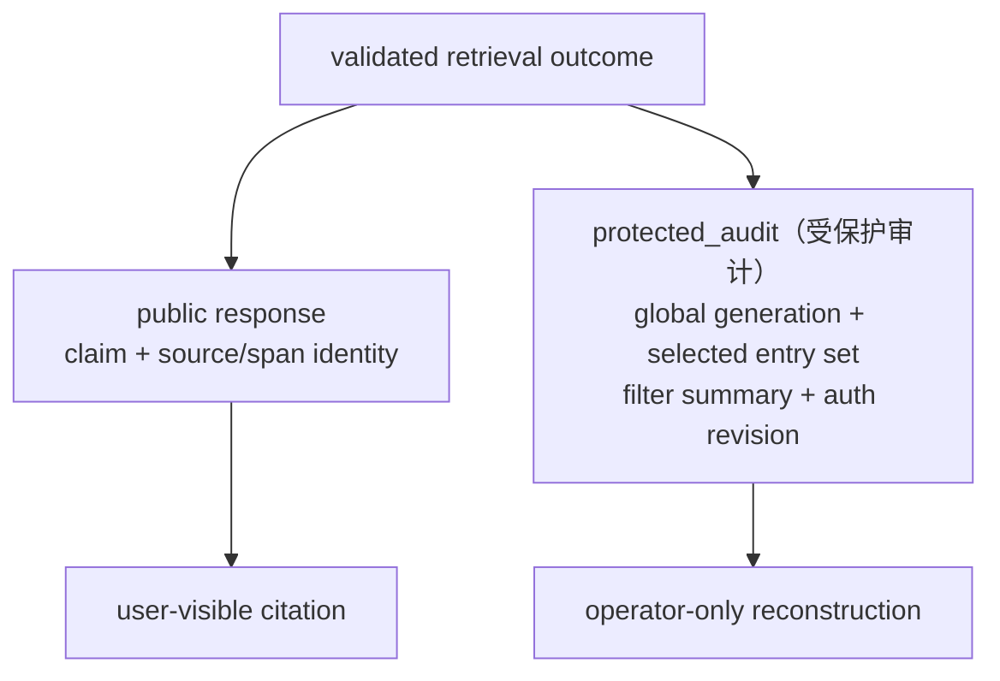
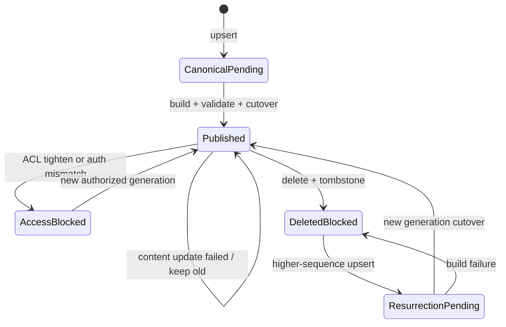

# 项目：从来源到引用的离线证据链

## 项目目标

第 8 课验证“在线回答各阶段是否守约”；本课继续向上游追问：一个 claim 能否从本次已发布索引，逐层复算到精确原文 span？来源更新、撤权、删除、重建或投影篡改后，旧引用会不会被错误复用？

项目用 Python 3 标准库实现一条窄而完整的 Layer B 教学链：

```mermaid
flowchart LR
    E["source event<br/>sequence + raw SHA-256"] --> C["canonical revision<br/>LF + NFC"]
    C --> P["parse revision<br/>parser + config"]
    P --> L["element<br/>exact character span"]
    L --> K["chunk<br/>content / retrieval 双表示"]
    K --> I["index entry<br/>retrieval hash + ACL"]
    I --> G["staged generation<br/>snapshot + tombstone + auth"]
    G -->|validation gate| U["published generation"]
    U --> R["ACL before score → lexical retrieval"]
    R --> Q["extractive claim + public citation"]
    Q --> V["protected generation binding<br/>and span reconstruction"]
```



它解决的是 lineage、完整性和生命周期合同，不是搜索质量竞赛。词法分数只是确定性候选基线；项目没有 Embedding、ANN、LLM、网络或 API key。

> [!important] 可证明范围
> Fixture connector 已把来源表示为精确 UTF-8 字符串，`raw_sha256` 绑定的是该 `content` 字段的 UTF-8 bytes，不是 PDF/Office 容器或 HTTP 原始响应。只有 UTF-8 Markdown、LF + NFC 规范文本和逐行可精确映射的标题/段落，才声明 `canonical-text-lf-nfc-char-v1` 字符 span。项目没有为 HTML 清洗、PDF、OCR、表格重排或视觉抽取虚构 raw byte span。
>
> Query 的 tenant 与 `subject_groups` 仍被视为 host 已可信解析的输入；项目只验证已知 `authorization_revision` 与 generation 的匹配、ACL-before-score 和撤权后的失败关闭，没有实现 AuthN、token、policy resolver 或 group membership 证明。

## 为什么现有四个项目还不等于端到端证据链

[[文档解析/00-目录|文档解析]]、[[知识库构建/00-目录|知识库构建]]、[[Chunking策略/00-目录|Chunking]]和[[RAG/08-项目-离线可引用问答|离线可引用问答]]各自验证了局部合同，但局部绿灯不能自动推出跨层结论：

| 局部能力 | 仍需贯通的问题 |
| --- | --- |
| raw hash 与 parser manifest | element 身份是否绑定 parser/config 与精确 span |
| canonical revision、outbox、发布指针 | chunk、索引代际和引用是否继承同一 revision |
| content/retrieval 双哈希 | 标题上下文变化后旧索引记录是否必然失效 |
| claim-level fixture 引用 | citation 能否回到真实来源位置，而非手写 fact 标签 |
| ACL、墓碑与失败发布 | 旧 generation 会不会在撤权、删除或 stale rebuild 后复活 |

本课不替代这些专题项目，而是用一套独立 reference model 把它们的核心不变量表达在同一条可执行链中。

> [!warning] 概念参考模型，不是四个脚本的 wire integration
> 本课是独立、端到端的 reference model；它没有直接导入文档解析、知识库构建、Chunking 或第 8 课的 Python 模块。前置项目验证相同类别的不变量，但 ID 前缀、revision 类型、坐标空间和 JSON schema 并不 wire-compatible。不能把四个项目的输出直接拼接后声称已经形成证据链。

| 前置项目 | 当前可执行合同 | 与本课的映射边界 |
| --- | --- | --- |
| 文档解析 | `parse_revision_sha256`、`elm_...`、`normalized-text-lines-1-based-inclusive-v1` | 本课使用 `par_...`、`el_...` 与半开 canonical character span；生产 adapter 必须显式转换并保留原坐标 |
| 知识库构建 | SQLite 整数 `revision_id`、current/published pointer 与 search projection | 本课使用内容派生 `can_...` 和 generation manifest；不能把数据库主键当作内容身份 |
| Chunking | fixture 自带 element ID，span 是 lexical-unit 区间，另派生 `index_entry_id` | 本课从自己的 canonical element 派生 char span；需要显式 element/coordinate mapping 才能互通 |
| RAG 第 8 课 | fixture fact/revision 引用与 `privileged_audit` | 本课改为 source span citation 与 `protected_audit`；两个 enum 属于不同 schema，不可混用 |

生产集成时，应先定义 versioned adapter schema 和迁移测试，再把各层 artifact 接到同一 manifest；本课提供的是目标不变量与反例，不是已完成的跨模块适配器。下一课[[RAG/10-项目-跨模块来源适配与发布|跨模块来源适配与原子发布]]会 fresh 调用三个现有模块并实现第一版 bridge；[[RAG/11-项目-External-Provenance-Artifact-v2|External Provenance Artifact v2]]再给该 bridge 增加完整 protected bundle 与独立 consumer。第 11 课不是本 reference engine 的 v1 artifact 自动迁移器，因此“尚未导入本课 provenance engine 外部 chunk”的能力边界仍保留。

## 身份与派生合同

本项目所有 `H(...)` 都是受限 JSON 域上的 canonical JSON + 完整 SHA-256。为避免不同运行时对浮点数表示不一致，哈希域只接受 `null`、布尔、整数、字符串、数组和字符串键对象；这不是 RFC 8785 的通用实现。

```text
canonical_revision_id
  = H(document identity + source version + raw/normalized hash
      + normalizer revision + ACL snapshot hash)

parse_revision_id
  = H(canonical revision + parser revision + parser config hash)

element_id
  = H(parse revision + kind + coordinate space
      + [char_start, char_end) + element text hash)

chunk_id
  = H(canonical/parse revision + chunker revision
      + element ID + content hash + ACL snapshot hash)

index_entry_id
  = H(chunk ID + retrieval hash + index revision + ACL snapshot hash)

index_generation_id
  = H(source snapshot + tombstone state + authorization revision
      + pipeline fingerprint + sorted entry-set hash)
```

这里同时保留 `content_text/content_sha256` 与 `retrieval_text/retrieval_sha256`。标题路径可以帮助检索，但 citation 只能引用规范原文 span；即使 chunk 业务身份策略选择保持稳定，检索表示变化也会得到新 `index_entry_id`，不能静默复用旧向量或词法记录。

W3C PROV 提供了 entity、activity、agent 与 derivation 的通用词汇。本项目可把 source/canonical/element/chunk/index/claim 看作 entities，把 normalize/parse/chunk/index/retrieve 看作 activities；这是建模映射，不表示一个 SHA-256 字段就自动满足治理、签名或跨组织信任要求。

## 公共引用与受保护审计是两个投影

公共 citation 保留用户核验所需的来源 URI/version、raw hash、canonical/parse/element/chunk/entry 身份与半开字符 span。全局 `index_generation_id`、`selected_entry_ids` 与聚合 `filter_summary` 只进入 `protected_audit`；项目不会持久化完整 visible/retrieved/ranked 候选集：



这样新增一篇当前主体无权读取的文档并重新发布后，只要原证据未变，公共响应仍保持逐字节相同；全局 generation 的变化只在受保护审计中可见。若产品选择公开全局快照版本，应把“可推断更新时间或语料变化”写入威胁模型，而不是把 opaque ID 当作无泄露证明。

每个 claim 在返回前执行以下复算：

1. citation 的 `index_entry_id` 必须出现在本次 audit 的 selected entry set；
2. audit 指向的 generation 必须仍是当前 published pointer；新 generation 切换后旧版显式进入 `superseded`，旧 citation 不能自证；
3. entry 必须绑定 canonical/parse/element/chunk 与 ACL snapshot；
4. `[char_start, char_end)` 必须在声明的 canonical coordinate space 内；
5. 验证器从可信 query、当前 ACL 与词法规则重新计算 visible candidates、filter summary 和 top-k，不能相信 audit 自报 selected set；
6. 从 canonical text 切出的原文必须逐字等于 claim，且 span SHA-256 一致；
7. `trace_id` 必须从可信 runtime query、status 与 claims 重算。

本项目的确定性 `trace_id` 会哈希完整教学 runtime query，因此也间接绑定 tenant、groups 与 authorization revision；它只用于离线篡改复算，不能作为生产公共 request ID。生产系统应生成随机、不可推导授权上下文的 opaque ID，把主体和授权绑定只保留在受保护审计中，并对审计存储实施访问控制、脱敏和保留期。

SHA-256 在这里证明同一受信任流水线内的一致性，不提供跨服务认证。跨信任边界持久化 manifest 时，还需 MAC、数字签名或等价 attestation，并保护密钥和验证者。

## 发布、更新、撤权与删除

`current canonical revision` 与 `published generation` 是两个状态。内容构建失败与权限收紧不能采取同一种可用性策略：

| 事件 | cutover 前查询行为 | 发布门禁 |
| --- | --- | --- |
| 首次 upsert | 不可检索 | 完整 staged generation 通过后才可见 |
| 相同事件重放 | no-op | 不产生新 revision |
| 更高 sequence、相同状态 | 只推进 checkpoint | 不伪造新内容版本 |
| 内容更新、ACL 不变 | 可继续服务旧 published revision | 新 generation 完整后原子切换 |
| ACL 收紧 | 旧 generation 立即 fail closed | 新 ACL 投影发布后按新组恢复 |
| delete | 旧 entry 立即不可见 | tombstone 必须进入新 generation 状态 |
| delete 后复活 | 在新发布前保持阻断 | 必须使用更高 sequence |
| auth revision 轮换 | generation/auth 不匹配即 fail closed | 以新 auth revision 重建发布 |
| stale snapshot 重建 | 不得切换 | snapshot/tombstone hash 不一致即 `BLOCK` |

`event_id` 也是不可重绑的投递身份：同一 ID 与同一类型化事件重放为 `noop`，同一 ID 若绑定不同 tenant/document/sequence/content/ACL 则失败。内存去重窗口达到 10,000 个 ID 后会停止接收新事件，而不是静默遗忘旧身份；生产实现应把事件指纹、保留期、归档与轮换策略持久化，并让窗口耗尽成为可观测运维事件。



## 项目文件

| 文件 | 作用 |
| --- | --- |
| [[RAG/examples/provenance/offline_provenance_pipeline.py\|offline_provenance_pipeline.py]] | 严格 fixture、身份派生、generation 发布门、检索、引用重算、对账与 CLI |
| [[RAG/examples/provenance/provenance-fixture.json\|provenance-fixture.json]] | 两租户、公开/私有 ACL、恶意字符串、runtime query 与独立 oracle |
| [[RAG/examples/provenance/provenance-artifact.schema.json\|provenance-artifact.schema.json]] | eval artifact v2 的 JSON Schema 2020-12 结构合同；不验证真实性 |
| [[RAG/examples/provenance/test_offline_provenance_pipeline.py\|test_offline_provenance_pipeline.py]] | 72 项输入资源边界、Unicode/身份、span、生命周期、完整性、外部类型/路由/failure/artifact 篡改、非泄露、报告与 CLI 测试 |

## 运行项目

从本项目根目录运行：

```powershell
$env:PYTHONDONTWRITEBYTECODE = '1'  # 禁止来源链实验生成 __pycache__。
$env:PYTHONIOENCODING = 'utf-8'  # 固定 CLI 编码，确保中文和 JSON 可重复读取。
$script = '.\docs\RAG\examples\provenance\offline_provenance_pipeline.py'  # 保存第 9 课 provenance 管线脚本路径。
$fixture = '.\docs\RAG\examples\provenance\provenance-fixture.json'  # 保存本项目独立、严格的来源 fixture。

python -B -W error $script --fixture $fixture demo  # 执行所有内置来源/引用/发布场景。
python -B -W error $script --fixture $fixture ask --query-id Q-refund  # 查看公共 citation 投影。
python -B -W error $script --fixture $fixture inspect --query-id Q-refund --operator-view  # 查看退款案例受保护轨迹。
python -B -W error $script --fixture $fixture manifest --operator-view  # 查看 generation、授权和发布诊断。
python -B -W error $script --fixture $fixture evaluate  # 运行正常可信重建并生成 PASS artifact。
python -B -W error $script --fixture $fixture evaluate --failure retrieval_unavailable  # 注入故障，验证 BLOCK 不会发布。
```

正常 `evaluate` 输出 `PASS` 并返回 `0`；检索故障注入输出 `BLOCK` 并返回 `1`。`ask/demo` 只输出公共投影；`inspect --operator-view` 显示受保护教学轨迹，`manifest --operator-view` 显示 generation、授权与发布诊断。两个开关都是防误用的教学确认，不是身份认证。

## 运行四种解释器模式回归

```powershell
$tests = '.\docs\RAG\examples\provenance'  # 指向 provenance 项目的相邻单元测试目录。

python -B -m unittest discover -s $tests -p 'test_offline_provenance_pipeline.py' -v  # 正常模式详细执行 72 项来源链测试。
python -O -B -m unittest discover -s $tests -p 'test_offline_provenance_pipeline.py'  # 优化模式验证校验不依赖 assert。
python -B -W error -m unittest discover -s $tests -p 'test_offline_provenance_pipeline.py'  # warnings-as-errors 模式暴露运行期告警。
python -O -B -W error -m unittest discover -s $tests -p 'test_offline_provenance_pipeline.py'  # 同时运行优化与严格 warning 组合。
```

测试覆盖：

- JSON 重复键、非有限数值、转义孤立 surrogate、bool-as-int、未知字段、文件/深度/来源/query/top-k/列表边界、ACL 顺序与 raw hash；
- parser config、source span、重复句消歧、content/retrieval/index/generation 身份；
- no-op、不可重绑 event ID、去重窗口耗尽、checkpoint、sequence conflict、stale event、失败保活与原子切换；
- ACL 即时阻断、删除墓碑、复活等待、stale snapshot 与 auth revision；
- canonical、projection、claim、span、source hash、selected entry 与 trace 篡改；
- pairwise 交换两个租户 entry 的自报 tenant/document 路由字段也必须失败；entry 必须回绑 canonical revision 的逻辑文档与 ACL，而不能只验证自报 hash；
- `retrieval_unavailable` 与 `authorization_snapshot_mismatch` 必须各自匹配固定 status、空 claim/selected set 和 filter summary；不能把旧 answer 或低相关 citation 塞进 failure 分支绕过可信重算；
- runtime/oracle 隔离、未授权语料非干扰、公共/审计字段隔离；
- raw fixture SHA-256 与类型化 fixture model SHA-256 双重绑定；严格加载后的内存对象发生变化必须重新验证；
- eval artifact v2 同时绑定 raw fixture 与类型化 fixture model，并精确验证 case 字段、类型、唯一 query、failure code 和计数；CLI 退出码进入回归。

> [!warning] Schema、自校验与可信评测不是一回事
> JSON Schema 和 `validate_artifact()` 只检查结构与内部一致性。攻击者若能重写 case 并重算无密钥 `artifact_sha256`，自哈希不能证明 oracle、当前 evidence 或 producer 身份；release gate 必须在可信环境重新运行 `evaluate_fixture()`，跨信任边界还需 MAC、签名或等价 attestation。

`-O` 通过只能证明关键校验不依赖会被移除的裸 `assert`；`-W error` 通过只能证明当前路径没有未处理 warning。它们不等于形式化证明或生产压测。

## 读实验结果时不要越界

### 已验证

- 指定输入域内，claim 可复算到精确 canonical span；
- parser/config、chunk 表示、ACL、index revision 与 generation 状态分别进入身份链；
- 内容更新失败可保留旧版，撤权和删除立即阻断旧投影；
- stale snapshot、过期 auth revision 和投影/来源篡改会 fail closed；
- tenant/ACL 在相关性评分前执行；未授权语料变化不改变公共响应；
- fixture oracle 不进入 runtime query。

### 未验证

- PDF/OCR/HTML/Office 到 raw byte、页面、bbox 或 DOM selector 的精确映射；
- 真实向量索引、Embedding 漂移、分布式 outbox、并发 cutover 与缓存失效；
- IdP、层级角色、deny、ABAC、token audience、策略决策点和对象级授权；
- LLM claim 拆分、语义蕴含、冲突事实合成或提示注入鲁棒性；
- 对象存储、备份、日志和第三方索引中的物理擦除；
- 跨服务签名、密钥轮换、透明日志或硬件 attestation。

> [!warning] 恶意字符串不是注入防护证明
> fixture 中的“忽略系统指令”只作为不可信文档数据被抽取；由于项目根本没有调用 LLM，它只能证明该字符串没有进入控制字段，不能证明真实模型会忽略间接提示注入。进入模型前仍需来源信任、内容隔离、最小权限、输出验证与下一动作重新授权。

## 生产化扩展顺序

1. 把 `source_uri + char span` 扩展为按媒体类型定义的 locator union：page/text layer、DOM selector、JSON Pointer、CSV row/column、bbox；每种适配器单独声明 coordinate space。
2. 将 canonical、parse、chunk 与 generation manifest 放入不可变对象存储；数据库只保存状态和发布指针。
3. 把 generation build 放入隔离 worker，通过 transactional outbox、幂等任务和 compare-and-swap 发布。
4. 将 authorization snapshot 绑定到真实策略决策点、主体、资源、tenant 和 token audience；权限变化触发即时阻断与重建。
5. 对关键词、向量、图索引和缓存分别建立 entry manifest、删除确认与抽样对账。
6. 将 traces、metrics、logs 联结到同一 pipeline/generation/evidence 身份；对外日志仍执行数据最小化。
7. 为签名 manifest、密钥管理、保留期、诉讼保全和物理擦除建立独立控制面。

## 与其他知识库的关系

| 知识库 | 本课如何衔接 |
| --- | --- |
| [[文档解析/00-目录\|文档解析]] | raw hash、parse revision、元素身份与位置合同 |
| [[知识库构建/00-目录\|知识库构建]] | source sequence、canonical revision、发布指针、ACL 与墓碑 |
| [[Chunking策略/00-目录\|Chunking 策略]] | 原文/检索双表示、element span 与 index entry 失效身份 |
| [[RAG/05-引用生成与拒答\|引用、生成与拒答]] | claim-level 引用从标签升级为可复算 source span |
| [[RAG/07-端到端评测与监控\|端到端评测与监控]] | eval artifact 绑定 snapshot、tombstone、auth 与 index manifest |
| [[AI安全/00-目录\|AI 安全]] | 未信任来源、越权检索、投毒、撤权与删除传播 |
| [[运行监控/00-目录\|运行监控]] | 用 generation/evidence 身份关联 trace、metric 与 log |

## 主要参考资料

- [W3C PROV Overview](https://www.w3.org/TR/prov-overview/) 与 [PROV-O](https://www.w3.org/TR/prov-o/)：provenance 的实体、活动、主体与派生关系。
- [OWASP LLM08:2025 Vector and Embedding Weaknesses](https://genai.owasp.org/llmrisk/llm082025-vector-and-embedding-weaknesses/)：可信来源、permission-aware store、多租户泄露与投毒边界。
- [OWASP LLM01:2025 Prompt Injection](https://genai.owasp.org/llmrisk/llm01-prompt-injection/)：外部文档作为间接注入载体的风险。
- [OpenTelemetry Signals](https://opentelemetry.io/docs/concepts/signals/)：traces、metrics、logs 与 baggage 的信号边界。
- [SLSA Build Provenance v1.2](https://slsa.dev/spec/v1.2/build-provenance/)：subject、build definition 与 run details 的软件供应链模型；本课只借用“派生产物绑定构建输入”的类比，不把文档引用等同于软件构建 provenance。
- [JSON Schema Draft 2020-12](https://json-schema.org/draft/2020-12)：评测 artifact 的机器可读结构合同。

来源获取日期：2026-07-22。本页为原创教学实现与整理；未复刻第三方教程、代码或图。外部规范用于定义术语和边界，动态页面与版本应在生产实施时重新核验。
