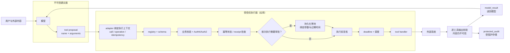

# Tool Calling（含 Function Calling）

## 知识库简介

Tool Calling（工具调用）让模型用结构化输出表达“希望使用哪个能力、参数是什么”。Function Calling 通常指由应用以 JSON Schema 声明的函数工具。它把自然语言理解与数据库、API、文件、搜索或业务动作连接起来，是 Agent 从“会说”走向“能查、能做”的关键接口。

最重要的边界是：

> [!important] 调用建议不等于执行
> 对客户端函数工具，模型只产生候选调用。你的受信任应用负责解析、allowlist、schema、业务校验、认证、授权、审批、幂等、超时、执行、审计和结果回传。Schema 合规不授予权限，提示词也不能替代这些关卡。

## 稳定概念与供应商适配

截至 2026-07-21，OpenAI 官方文档把 function calling 也称为 tool calling，并区分 JSON Schema function、自由文本 custom tool 与平台内置工具；Anthropic 区分客户端执行与服务端执行工具；Gemini 文档也明确客户端函数由应用执行。三者具体消息块、结束原因、严格模式、并行能力和内置工具不同，但稳定流程相同：

```text
应用声明能力 → 模型提出调用 → 应用验证/授权/执行
             → 应用关联并回传结果 → 模型继续或终止
```

本库先学习供应商无关的执行合同，再把 OpenAI `function_call/function_call_output`、Anthropic `tool_use/tool_result` 等放入 adapter。不要让供应商字段形状渗入业务 handler。

OpenAI 当前文档还有一个容易遗漏的默认值差异：Chat Completions 的函数默认非 strict；Responses 省略 `strict` 时会尝试把 schema 规范化为 strict，不兼容时回退到 best effort，并在解析后的 tool 上显示 `strict: false`。生产接入应显式设置并验证目标行为，不能把“Responses 默认尝试 strict”写成无条件保证。

## 可信执行边界



图中信任边界的含义是：模型只提供工具名与参数。Provider call ID 由 adapter 从供应商事件提取并按主体作用域记录，operation ID 与 idempotency key 由应用/编排层生成；模型不能把这些可信元数据塞进参数后自行决定。权限、审批、幂等和真正执行都留在模型之外。外部系统返回的数据即使经过结构校验，内容本身仍可能过时、错误或含提示注入。

## 内容来源与维护状态

本课程的讲解结构、威胁模型、离线 dispatcher、fixture 与测试均为项目原创；官方文档、规范和 OWASP 资料用于核对产品行为与工程边界，未复刻第三方正文或图片。由于供应商 API 与模型能力持续变化，本课程标记为 `content_status: dynamic`。来源类型与状态含义见 [[维护记录/内容质量与来源标记规范|内容质量与来源标记规范]]。

## 在总路线中的位置

本库位于“Agent 运行时”知识域，是 Agent 应用、Agent 平台与多模态实时三条角色路径的核心入口。

- [[JSON/00-目录|JSON]]与[[API/00-目录|API]]提供结构、错误与网络基础；
- [[LLM API集成/00-目录|LLM API集成]]负责供应商请求、流式事件和错误适配；
- [[RAG/00-目录|RAG]]负责外部知识证据，实时状态与副作用更适合受控工具；
- 本库建立单次/多次调用的可信执行边界；
- [[Agent 核心/00-目录|Agent 核心]]把调用放进有状态、有预算、有终止条件的循环；
- [[MCP/00-目录|MCP]]标准化能力发现与调用协议，但不替代业务授权和幂等。

## 学习目标

完成本库后，你应能：

- 区分 tool、function tool、custom tool、内置工具与客户端/服务端执行；
- 用明确名称、描述和受支持的 JSON Schema 设计输入合同；
- 解释 strict/schema 只约束结构，不能证明业务正确、所有权或权限；
- 让 tenant、subject、roles 和服务凭据来自可信会话而非模型参数；
- 建立 allowlist → schema → business → authn/authz → idempotency state → approval for first execution → execute 流水线；
- 把审批绑定到确切主体、工具、参数摘要、operation/call、schema/policy revision 和过期时间；
- 用 call ID 关联结果，用 operation ID 追踪任务，用 idempotency key 抑制重复副作用；
- 正确处理零、一个、多个、并行、有依赖和部分失败的调用；
- 把工具结果视为不可信数据，限制大小、类型、来源和下一步权限；
- 把模型可见结果与受保护审计拆成双投影，并重算 request/result/call 三重绑定；
- 处理超时后“不知道是否已执行”的不确定状态；
- 用 SQLite 唯一约束、operation ledger、transactional outbox、lease 和 receipt reconciliation 把幂等/恢复状态持久化；
- 说明为何这些措施仍不能宣称分布式 exactly-once；
- 用路由、参数、授权、执行、恢复、安全和端到端指标评测系统。

## 前置知识

- [[JSON/00-目录|JSON]]：类型、严格解析与 schema；
- [[API/00-目录|API]]：认证、HTTP、限流、超时与重试；
- [[提示词工程/00-目录|提示词工程]]：模型指令边界；
- [[上下文工程/00-目录|上下文工程]]：外部数据与状态管理；
- 基础 Python dataclass、异常和单元测试。

项目只用 Python 3 标准库，不调用真实模型、网络或业务服务。

## 核心术语

| 术语 | 初学者解释 | 不解决什么 |
| --- | --- | --- |
| tool definition | 给模型看的名称、描述和输入结构 | 不实现函数 |
| tool call | 模型提出的工具名与参数 | 不表示已执行 |
| tool result | 应用或服务执行后的结构化结果 | 不自动可信 |
| handler | 受信任应用中真正执行逻辑的代码 | 不应由模型动态指定 |
| registry/allowlist | 工具名到 schema、风险与 handler 的显式映射 | 不等于资源授权 |
| call ID | 本轮调用与结果的关联 ID | 不阻止重复业务动作 |
| operation ID | 跨回合/服务追踪一项业务任务 | 不提供幂等 |
| idempotency key | 重试时识别同一业务意图 | 同 key 不同参数必须冲突 |
| approval | 人对确切高风险动作的授权记录 | 不是永久通行证 |
| adapter | 将供应商消息转换为内部有限状态 | 不承载业务规则 |

## 推荐学习顺序

| 顺序 | 课程 | 学习产出 |
| --- | --- | --- |
| 1 | [[Tool Calling（含 Function Calling）/01-工具契约与Schema设计\|工具契约与 Schema 设计]] | 工具分类、输入/输出合同与版本策略 |
| 2 | [[Tool Calling（含 Function Calling）/02-调用建议、校验与授权\|调用建议、校验与授权]] | 信任边界、身份注入、资源授权与审批绑定 |
| 3 | [[Tool Calling（含 Function Calling）/03-执行循环与调用关联\|执行循环与调用关联]] | 供应商无关状态机、ID 关联与循环上限 |
| 4 | [[Tool Calling（含 Function Calling）/04-多调用、并行与依赖\|多调用、并行与依赖]] | DAG、汇合策略、部分成功和补偿 |
| 5 | [[Tool Calling（含 Function Calling）/05-结果、错误与不可信数据\|结果、错误与不可信数据]] | 双投影、逐工具输出 schema、三重摘要绑定、错误目录和 provider adapter |
| 6 | [[Tool Calling（含 Function Calling）/06-幂等、超时与可观测性\|幂等、超时与可观测性]] | 重复抑制、超时歧义、审计与 SLO |
| 7 | [[Tool Calling（含 Function Calling）/07-工具调用评测与离线项目\|工具调用评测与离线项目]] | 18 场景、23 步 Tool Result v2 fixture 与 120 项资源边界、审批和 adapter 回归测试 |
| 8 | [[Tool Calling（含 Function Calling）/08-项目-SQLite持久化幂等与Outbox恢复\|SQLite 持久化幂等与 Outbox 恢复]] | v2 上层的 ledger/outbox/lease/receipt adapter，94 项 current-claims、审批上下文、多连接与崩溃回归测试 |

## 动手实践入口

| 文件 | 用途 |
| --- | --- |
| [[Tool Calling（含 Function Calling）/examples/tool-cases.json\|tool-cases.json]] | `tool-cases-v2`：18 个场景、23 个 dispatch/query-status 步骤与双投影期望 |
| [[Tool Calling（含 Function Calling）/examples/tool_dispatcher.py\|tool_dispatcher.py]] | proposal/context 分离、逐工具输入/输出合同、授权/审批/幂等、显式状态对账、双投影、三重绑定与三家 adapter |
| [[Tool Calling（含 Function Calling）/examples/test_tool_dispatcher.py\|test_tool_dispatcher.py]] | 120 项 fixture 资源边界、授权者绑定、业务状态复核、异常恢复、输出污染、交换攻击、摘要重算、provider profile 隔离、adapter 与 CLI 测试 |
| [[Tool Calling（含 Function Calling）/examples/persistence/persistence-case.json\|persistence-case.json]] | 持久化写操作的严格 JSON 场景 |
| [[Tool Calling（含 Function Calling）/examples/persistence/persistent_tool_runtime.py\|persistent_tool_runtime.py]] | SQLite operation ledger、transactional outbox、lease、receipt 对账与 PASS/BLOCK CLI |
| [[Tool Calling（含 Function Calling）/examples/persistence/test_persistent_tool_runtime.py\|test_persistent_tool_runtime.py]] | 94 项 JSON/DB 边界、current-principal、审批者与 provider 上下文证据、业务状态、调用用途、幂等、崩溃、授权/合同漂移、CLI/审计脱敏、篡改与多连接测试 |

从本仓库根目录运行：

```powershell
$env:PYTHONDONTWRITEBYTECODE = '1' # 让本会话的 Python 不产生 __pycache__，避免污染知识库
$env:PYTHONIOENCODING = 'utf-8' # 强制 CLI 使用 UTF-8，保证中文 JSON 输出可读
$examples = '.\docs\Tool Calling（含 Function Calling）\examples' # 保存示例根目录，减少后续路径重复

python -B -W error "$examples\tool_dispatcher.py" --fixture "$examples\tool-cases.json" # 运行无网络 dispatcher fixture；警告视为失败
python -B -W error -m unittest discover -s $examples -p 'test_tool_dispatcher.py' -v # 发现并详细运行 dispatcher 回归测试

$persistence = Join-Path $examples 'persistence' # 定位 SQLite 持久化子项目目录
# 续行反引号必须位于行尾；此路径在系统临时目录创建一次性数据库，而非写入仓库。
$db = Join-Path ([IO.Path]::GetTempPath()) `
  ("tool-persistence-learning-{0}.sqlite3" -f [guid]::NewGuid().ToString('N')) # 用随机 GUID 防止并行运行互相覆盖
# 运行持久化 dispatcher 的正常 dispatch 链路；续行参数见下一行。
python -B -W error "$persistence\persistent_tool_runtime.py" `
  --db $db --fixture "$persistence\persistence-case.json" dispatch # 传入临时库、离线 fixture 与 dispatch 子命令
python -B -W error -m unittest discover -s $persistence -p 'test_persistent_tool_runtime.py' -v # 详细运行 SQLite/outbox 回归测试
```

## 掌握标准

- [ ] 能说明模型、adapter、dispatcher、handler 与业务服务各自责任。
- [ ] 工具只从显式 registry 解析，未知名称不会动态 import/eval。
- [ ] Schema 拒绝缺失、额外、错误类型和非法枚举。
- [ ] Tenant、subject、roles 与服务凭据不由模型提供。
- [ ] 无权限资源对外使用一致、不可枚举的错误。
- [ ] 写操作在无审批、审批过期、参数、provider/API/adapter 上下文或 schema/policy revision 变化时不会执行。
- [ ] 同幂等键同意图可跨 SQLite connection/runtime 重放；同 key 不同意图明确冲突，且 ledger/outbox 在同一本地事务。
- [ ] 能解释 outbox worker lease 过期重投为何仍要求下游幂等，也不宣称 exactly-once。
- [ ] 能区分确认未执行的超时与提交后结果未知；后者先对账，不盲目重试。
- [ ] 幂等键有明确租户/主体/工具作用域，不能被其他租户占用命名空间。
- [ ] 多调用只在独立、无竞争且失败策略明确时并行。
- [ ] 工具结果被视为不可信数据，不能扩大下一步权限。
- [ ] 逐工具输出 schema 会拒绝额外控制字段、敏感字段、错误来源和输入/输出错配。
- [ ] `model_result` 与 `protected_audit` 分离，provider payload 不泄露审计投影。
- [ ] 能重算完整 request/result/call SHA-256；call binding 同时覆盖 downstream request/receipt/status reference，并拒绝跨调用、跨响应或证据替换。
- [ ] 能区分 `fresh`、`local_replay`、`receipt_reconciled`，unknown 只通过显式状态查询恢复。
- [ ] 循环有回合、调用、时间、成本和重复进度上限。
- [ ] 能运行 v2 的 120 项与持久化层的 94 项测试，并区分离线执行合同、SQLite 本地竞争、at-least-once-compatible primitives 与真实 provider/分布式交付边界。

## 与其他知识库的关系

| 知识库 | 关系 |
| --- | --- |
| [[LLM API集成/00-目录\|LLM API集成]] | 解析供应商输出、流式事件与 API 失败 |
| [[RAG/00-目录\|RAG]] | 提供有来源知识；工具负责实时数据或动作 |
| [[MCP/00-目录\|MCP]] | 提供标准化能力目录与传输，不替代业务控制 |
| [[Agent 核心/00-目录\|Agent 核心]] | 将调用放入观测—决策—动作循环 |
| [[工作流自动化/00-目录\|工作流自动化]] | 固定路径任务使用可靠编排、重试与补偿 |
| [[评测体系/00-目录\|评测体系]] | 测路由、参数、执行、恢复和任务成功 |
| [[AI安全/00-目录\|AI安全]] | 覆盖提示注入、越权、数据泄露和工具滥用 |

## 主要参考资料

- [OpenAI API：Function calling](https://developers.openai.com/api/docs/guides/function-calling)
- [Anthropic：How tool use works](https://platform.claude.com/docs/en/agents-and-tools/tool-use/how-tool-use-works)
- [Anthropic：Handle tool calls](https://platform.claude.com/docs/en/agents-and-tools/tool-use/handle-tool-calls)
- [Google AI：Function calling with the Gemini API](https://ai.google.dev/gemini-api/docs/function-calling)
- [JSON Schema 2020-12 Core](https://json-schema.org/draft/2020-12/json-schema-core)
- [RFC 9110：HTTP Semantics](https://www.rfc-editor.org/rfc/rfc9110.html)
- [OWASP GenAI：LLM01:2025 Prompt Injection](https://genai.owasp.org/llmrisk/llm01-prompt-injection/)
- [SQLite：Transaction](https://www.sqlite.org/lang_transaction.html)
- [SQLite：Write-Ahead Logging](https://www.sqlite.org/wal.html)
- [SQLite：UPSERT](https://www.sqlite.org/lang_upsert.html)
- [Stripe API：Idempotent requests](https://docs.stripe.com/api/idempotent_requests)

来源获取日期：2026-07-21。工具字段、严格模式、并行限制、服务端工具和模型兼容性都可能变化；接入时应锁定 API/SDK/model 版本并重新查官方文档。
