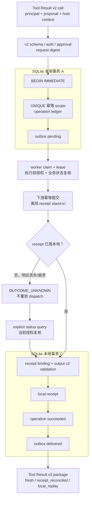

# 项目：SQLite 持久化幂等与 Outbox 恢复

## 项目定位

[[Tool Calling（含 Function Calling）/07-工具调用评测与离线项目|Tool Result v2 离线项目]]已完成 proposal/context 分离、输入输出合同、授权、审批、状态查询、双投影和三重摘要绑定，但它故意用内存映射演示顺序语义。本项目是其 **Layer B 持久化 adapter**：不改写 v2 的 `request_sha256` 或 `call_binding_sha256`，而是用 SQLite 把幂等记录、operation ledger、outbox、lease 和 receipt 对账变成跨连接、跨进程重启可观测的状态。

> [!important] 本项目不宣称 exactly-once
> SQLite 唯一约束只能约束本地 ledger，lease 过期后的处理可能重投。真实下游必须自己支持相同 key 的幂等执行或可绑定的状态查询。本项目实现的是 **at-least-once-compatible building blocks**：持久 intent/outbox、重复抑制、可 reclaim lease 与 receipt 对账；它没有持续枚举 pending/expired event 的调度器，因而不证明交付活性。只有外部 worker 持续轮询/重试、告警和人工恢复都成立时，系统才可在明确故障假设下声称 at-least-once delivery；它仍不是跨数据库、网络和业务服务的原子“正好一次”事务。

## 学习目标

完成后，你应能：

- 解释为何业务 request digest 不包含 idempotency key，而 call binding 必须包含 key；
- 用 `BEGIN IMMEDIATE` 和唯一约束原子预占 `(tenant, subject, tool, key)`；
- 识别同 key 同意图的 replay 与同 key 异意图的 conflict；
- 在一个本地事务里同时写 operation intent 与 outbox；
- 使用可过期 lease 处理 worker 在 claim 后崩溃；
- 对“下游已提交、本地 receipt 未落库”保持 `OUTCOME_UNKNOWN`；
- 在 intent 接收时及 worker 提交前分别复核业务状态，避免审批后的 TOCTOU；
- 在预占、replay 和 worker 提交前通过同一个 current-principal resolver 重取 claims，而不是持久化创建时 roles；
- 仅通过独立、purpose-bound 的显式 status query 重做当前授权并对账 receipt；
- 在多连接竞争测试中区分“本地唯一”与“分布式 exactly-once”。

## 完整管线与事务边界



图中有三个不能被一笔带过的提交点：

| 提交点 | 持久化事实 | 崩溃后的安全解释 |
| --- | --- | --- |
| A：intent + outbox | 系统已接受一项待处理意图 | 不能当成业务成功；查状态，或由外部调度器枚举后交给 worker 恢复 |
| B：下游 receipt | 副作用可能已发生 | 本地不能猜测成功/失败，必须保持 unknown |
| C：local receipt + ledger + outbox | 本地已有可重算的成功证据 | 后续同意图可 replay，但返回前仍复核当前资源授权 |

## 为何是 `BEGIN IMMEDIATE`

SQLite 官方文档说明：同一时刻可以有多个读事务，但只有一个写事务；`BEGIN IMMEDIATE` 会在事务开始时申请写事务，而不是先读后在写入时升级。本项目因此在同一个事务里执行：

```sql
BEGIN IMMEDIATE; -- 立即取得 SQLite 写事务，避免两个 worker 同时保留同一幂等键

INSERT INTO operations (...) -- 记录经过 schema/授权/审批 gate 后的操作 intent
VALUES (...) -- 这里的值必须包含 tenant、subject、工具、参数摘要和合同版本
ON CONFLICT (tenant_id, subject_id, tool_name, idempotency_key) -- 以调用主体和工具范围内的幂等键检测重放
DO NOTHING; -- 已存在时不新建副作用；后续必须比较 digest，而不是直接当作成功

-- 对已存在行重算/比较 request digest 与合同 revision，防止同 key 被调包为另一请求
-- 仅新 intent 写入与其同事务的 outbox event，保证“操作记录”与“待投递事件”一致
COMMIT; -- 只有所有数据库写入成功才提交；异常时事务应回滚
```

`ON CONFLICT DO NOTHING` 不是“冲突就成功”。代码必须随后读出权威行，并逐项比较：

```text
request_sha256
input/output/effect/handler/producer/policy revision
canonical arguments JSON
tenant / subject / tool / idempotency key
approval 的 provider / API family / adapter revision
```

任一项不一致都是 conflict 或存储合同破坏，不能选择性相信新请求或旧记录。

## WAL 和多连接的真实边界

WAL 模式允许 reader 与 writer 并行，但仍然只有一个 writer。本项目每个工作线程使用独立 SQLite connection，设置：

```text
PRAGMA journal_mode = WAL
PRAGMA synchronous = FULL
PRAGMA foreign_keys = ON
PRAGMA busy_timeout = 5000
```

> [!warning] WAL 不是网络文件系统协调器
> SQLite 官方 WAL 文档明确要求参与进程在同一主机上共享 wal-index。不要把本地 `.sqlite3` 放到网络文件系统上当分布式幂等服务。跨主机部署应改用能承担该一致性模型的数据库/队列。

## 严格 JSON 与数据库边界

项目不把“能 `json.loads`”当成可信证据：

- fixture 必须是 UTF-8，最大 65,536 bytes；在递归 decoder 前以线性扫描把容器嵌套限制为 32 层。深嵌但未超字节上限的文件会成为受控的 fixture 合同错误，不向 CLI 泄露 `RecursionError`/traceback；
- fixture 还拒绝重复键、`NaN/Infinity`、额外字段、未登记 provider profile 和布尔时间戳；
- 入库 JSON 先经过 v2 受支持 JSON 域，再用排序键、紧凑分隔符和 UTF-8 生成项目内规范表示；
- 从数据库读取时重新严格解析、重新编码并比较原文，非规范 JSON 不会进入 handler/result；
- SQLite 表使用 `STRICT`、`NOT NULL`、`CHECK`、`UNIQUE` 与 `FOREIGN KEY`；
- SQL 值只通过 placeholder 绑定，不拼接模型输入；
- 本地和下游 receipt 都重新执行 v2 的逐工具输出 schema 与 input binding 校验。

这是项目内确定性 JSON，仍未宣称为 RFC 8785。若多语言服务共享 digest，应先锁定跨语言规范化协议和测试向量。

## 幂等与 call binding 不能混为一个摘要

本项目直接调用 v2 `request_digest()`：

$$
d_{request}=H(tenant,subject,tool,arguments,inputRev,outputRev,effectRev)
$$

它不包含 idempotency key，因为 key 是执行/重试身份，不是业务意图。但 v2 `call_binding_sha256` 仍绑定 provider turn、call、operation、idempotency key、工具合同、request/result digest 与 downstream request/receipt/status reference。因此：

| 请求 | 结果 |
| --- | --- |
| 同 scope/key + 同 request digest/合同 | `local_replay` 或继续 unknown，不重复新建 intent |
| 同 scope/key + 不同 digest/合同 | `IDEMPOTENCY_CONFLICT` |
| 同业务意图 + 不同 key | 是两个执行身份，可形成两项副作用 |
| 合法 package 被换到另一 key/call | call binding 重算失败 |

### 审批的持久化语义

新 intent 只能在 v2 approval 绑定当前 subject、provider/API family/adapter revision、call/operation/response、idempotency key、request digest、合同 revision、有资格的 `approver_id` 且尚未过期时入库。Ledger 保存 `approval_id`、`approver_id`、`approval_digest`、`approval_expires_at`、`approved_at` 与首次 provider/API/adapter/call/response 标识；worker 在外部效果前用这些持久化身份重算审批摘要，形状合法但被换成另一个 provider、API family、adapter revision 或摘要也会 fail closed。有效期采用 `approved_at < approval_expires_at` 的右开边界。

### 当前 claims 不是 ledger 字段

`operations` 只保存 tenant/subject 作用域，不保存创建时的 `roles`。每一次预检会先读取当前 principal；预占事务开始前再用**同一个** resolver 重读一次，worker 在下游效果前第三次重读。示例未注入 resolver 时把 roles 固定为空，因而默认 owner-only；只有部署显式接入 current-claims resolver 后，`support_admin` 才能访问同 tenant 他人订单。若角色在 intent 已接受后被撤销，worker 保持 operation/lease 为待恢复状态并返回 `authorization_denied`，不会创建下游 receipt。这个离线实现不把外部 IAM 查询放进 SQLite 写事务；生产系统仍需缩短该检查与提交的窗口，使用目标 IAM/policy 的一致性语义。

> [!note] 本项目把“有效审批下原子接受不可变 intent”定义为审批的消费点
> `approval_expires_at` 必须覆盖 `approved_at/intent commit`，但已接受 outbox 的投递不因 worker 排队超过该时间就自动变成另一个意图。如果业务规则要求“真正下游提交时审批仍未过期”，必须把该规则纳入 policy revision，过期时持久化 `reapproval_required`/人工状态，不能无记录地重创 intent。

## Outbox、lease 与恢复

### 原子写 intent + outbox

对新 key，`operations` 和 `outbox` 必须在同一本地事务中提交。否则可能出现“有业务 intent 却永远没事件”或“有事件却无权威 intent”。

### 可过期 lease

Worker 在 `BEGIN IMMEDIATE` 中将 outbox 从 `pending` 改为 `processing`，同时保存 `lease_owner/lease_until/attempt_count`。

- lease 未到期：第二个 worker 不能 claim；
- lease 到期：另一 worker 可 reclaim；
- reclaim 意味着可能重投，因而下游仍必须按同一执行 scope 幂等；
- 生产实现还需要 heartbeat/续租、最大 attempts、dead-letter/人工处置和积压指标。

> [!warning] 教学时间不是生产信任边界
> 为使故障测试可重复，示例把 `now` 作为调用方注入的 deterministic control input；这不证明多个进程的时钟可信或一致。生产 claim/reclaim 应使用受控 wall-clock 或数据库时间，监控 clock skew，并结合 fencing token/状态条件更新。单调时钟适合单进程测量间隔，却不能直接持久化后供不同进程比较；仅靠 lease 到期仍可能让旧 worker 与新 owner 并发执行。

> [!warning] 本项目没有 outbox poller
> `process_operation(status_ref, ...)` 只处理调用方已知的 operation；CLI 也只有定向的 `dispatch`、`status` 与 `audit`。代码证明 event 可持久、可 claim、可过期 reclaim 和可安全对账，但不会自行枚举 backlog，也不保证 pending event 最终被调度。生产系统必须补充持续 poll/claim/retry loop、进程监督、backoff、DLQ/人工处置和 lag SLO。

Claim 成功不等于可以执行。Worker 在下游提交前会先用当前 registry 重算 request digest/输入、输出、effect、handler、producer、policy revision，再用 ledger 中的 tenant/subject/resource 调用当前 authorization resolver，并重新执行当前业务状态 validator；模型参数和创建时 roles 快照都不能作为当前权限或业务事实。合同已漂移、授权已撤回或订单不再可退款时均 fail closed，不产生下游 receipt；operation 保持 unknown/可审计的 lease 状态。教学默认 resolver 与订单状态都来自本地 mock，生产应改为当前 IAM/policy 与权威业务事务。

### 崩溃点

| failure | 持久化状态 | 返回/恢复 |
| --- | --- | --- |
| `after_intent_commit` | ledger + pending outbox，无下游 receipt | `OUTCOME_UNKNOWN`；等待外部调度器枚举并调用 worker |
| `after_claim` | processing + 未到期 lease | `OUTCOME_UNKNOWN`；过期后 reclaim |
| `after_downstream_commit` | 下游 receipt 已存在，local receipt 不存在 | 仍是 `OUTCOME_UNKNOWN`；显式 status query 对账 |

`dispatch()` 看到未完成 ledger 时只返回原 `status_ref` 和 unknown，不会顺手调 worker、查 receipt 或再次执行。这使“调用工具”和“观测已提交操作”成为两个可审计动作。

## 显式 status query 的安全顺序

```text
strict call + current principal
  → registry / input schema
  → 当前 resource authorization
  → 独立 provider response/call identity + query_status purpose binding
  → opaque status_ref 和 tenant/subject scope
  → expected_request_sha256 重算
  → idempotency key + 合同 revision 绑定
  → downstream receipt + 逐工具输出合同
  → 同事务写 local receipt / succeeded / outbox delivered
  → Tool Result v2 receipt_reconciled
```

即使 ledger 已经 `succeeded`，status query 和 replay 也会先重做当前资源授权。撤权后返回与资源不存在同形的 `NOT_FOUND`，不能通过幂等缓存继续读取结果。replay 与 status query 都必须保留已批准 operation 的 provider/API family/adapter revision；跨上下文则返回 conflict，不能把一条 provider 路径的批准或结果带到另一条路径上。教学 helper 会从原调用与 `status_ref` 派生独立 host-owned provider identity；该 identity 的 fingerprint 固定为 `query_status`，之后不能被复用为 dispatch。

## 项目文件

| 文件 | 作用 |
| --- | --- |
| [[Tool Calling（含 Function Calling）/examples/persistence/persistence-case.json\|persistence-case.json]] | 严格 UTF-8 JSON 的单项写操作场景 |
| [[Tool Calling（含 Function Calling）/examples/persistence/persistent_tool_runtime.py\|persistent_tool_runtime.py]] | SQLite ledger/outbox/lease/receipt 运行时与 PASS/BLOCK CLI |
| [[Tool Calling（含 Function Calling）/examples/persistence/test_persistent_tool_runtime.py\|test_persistent_tool_runtime.py]] | 94 项 JSON/DB、v2 兼容、current-principal/审批上下文、幂等、崩溃、授权/合同漂移、时间边界、审计与 CLI 脱敏、篡改、多连接和 CLI 回归测试 |

实现仅依赖 Python 3.11 标准库，实测 SQLite 3.45.1；代码要求 SQLite 3.37.0+，因为该版本开始支持 `STRICT` 表。

## 运行 PASS 路径

从仓库根目录执行：

```powershell
$env:PYTHONDONTWRITEBYTECODE = '1' # 防止 CLI 生成 __pycache__，不把本机状态混入教材
$env:PYTHONIOENCODING = 'utf-8' # 让中文结构化输出在 PowerShell 中保持 UTF-8
$project = '.\docs\Tool Calling（含 Function Calling）\examples\persistence' # 记录 SQLite 项目目录
$db = Join-Path $env:TEMP ("tool-persistence-pass-{0}.sqlite3" -f [guid]::NewGuid()) # 在系统临时目录生成唯一数据库，避免覆盖任何已有文件

# 运行持久化 runtime 的正常 dispatch 命令；续行反引号必须保持为该行最后一个字符。
python -B -W error "$project\persistent_tool_runtime.py" `
  --db $db --fixture "$project\persistence-case.json" dispatch # 指定临时数据库、离线 fixture 和要执行的子命令
```

结果必须包含：

```json
{
  "code": "OK",
  "delivery": "fresh",
  "gate": "PASS",
  "status": "succeeded"
}
```

## 运行 BLOCK 与显式对账

使用一个新数据库注入“下游提交后丢失本地响应”：

```powershell
$unknownDb = Join-Path $env:TEMP ("tool-persistence-unknown-{0}.sqlite3" -f [guid]::NewGuid()) # 为“下游已提交但本地结果未知”实验创建独立临时库
# 捕获 runtime 输出的 JSON 文本，并复用同一临时库保留可后续对账的状态。
$blockedJson = python -B -W error "$project\persistent_tool_runtime.py" `
  --db $unknownDb --fixture "$project\persistence-case.json" `
  dispatch --failure after_downstream_commit # 故意在下游提交后注入失败，模拟最危险的 crash window
$blocked = $blockedJson | ConvertFrom-Json # 把 JSON 文本解析为对象，便于读取受控状态字段

$blocked.gate # 预期为 BLOCK：runtime 没有把结果未知伪装成成功
$blocked.code # 预期为 OUTCOME_UNKNOWN：提示需要显式 reconciliation
$blocked.status_ref # 保存状态引用，下一步只能用它查询，不能直接换 key 重试

# 调用显式 status 查询而非再次 dispatch 写操作，并连接到同一个产生未知结果的数据库。
python -B -W error "$project\persistent_tool_runtime.py" `
  --db $unknownDb --fixture "$project\persistence-case.json" `
  status --status-ref $blocked.status_ref # 使用受控 status_ref 查询下游结果并完成对账
```

退出码合同为：`0` 表示已验证成功或 audit 通过；`1` 表示预期的业务/审计 `BLOCK`（例如 `OUTCOME_UNKNOWN`）；`2` 表示 fixture、SQLite、持久合同或本地 I/O 失败，并只把稳定、无路径的 `error.code` 摘要写到 stderr（例如 `FIXTURE_IO_ERROR`、`SQLITE_ERROR`），不回显原始 `OSError`、数据库路径或 fixture 路径。不要把 `2` 当成业务拒绝，也不要为了让 shell 全绿而把 unknown 改成伪成功。

## 测试矩阵

```powershell
python -B -m unittest discover -s $project -p 'test_persistent_tool_runtime.py' # 普通模式运行 SQLite/outbox 回归测试
python -O -B -m unittest discover -s $project -p 'test_persistent_tool_runtime.py' # 优化模式验证 runtime gate 不依赖 bare assert
python -B -W error -m unittest discover -s $project -p 'test_persistent_tool_runtime.py' # 将资源和 SQLite 警告转为失败
python -O -B -W error -m unittest discover -s $project -p 'test_persistent_tool_runtime.py' # 组合最严格模式重新运行完整持久化测试
```

94 项测试覆盖：

| 层 | 可执行反例/不变量 |
| --- | --- |
| JSON fixture | 重复键、非有限数、非 UTF-8、超限、4,096 层且不超 65,536 bytes 的嵌套、extra field、provider revision |
| SQLite schema | WAL、FULL synchronous、STRICT、foreign key、CHECK、`persistent-tool-runtime-v3`；audit 用一个显式 read transaction 统一 integrity/FK/语义/count snapshot 并把 FULL 纳入 gate；portable UTC/approval/lease overflow 在 reservation 前拒绝，intent/outbox 与 receipt/ledger/outbox 失败注入整体回滚，孤立 receipt 审计只输出 opaque ref |
| v2 兼容 | request digest 完全复用、key 与 downstream evidence 进入 call binding、package 重算通过；审批者身份及 provider/API/adapter 上下文持久化并重算，status-query purpose 不可复用为 dispatch |
| 幂等 | 首次 fresh、同意图 replay、跨 provider/API/adapter replay conflict、异意图 conflict、重启后 replay、撤权后拒绝 |
| 崩溃恢复 | intent commit、claim、lease expiry、预占与 worker 使用同一 current-principal resolver 复核当前授权/业务状态与合同 revision、downstream commit、explicit reconciliation |
| 篡改 | 非规范/重复键 JSON、receipt digest、输出/输入绑定 |
| 多连接 | 8 连接同意图预占、异意图竞争、8 worker claim、跨连接 replay |
| CLI | `PASS`、`BLOCK → status → PASS`、database audit、fixture/DB 失败的无路径稳定错误码 |

`-O` 通过说明关键校验没有依赖裸 `assert`；`-W error` 通过用于暴露资源/弃用警告。它们不能证明断电耐久性、网络分区或真实下游 API 幂等。

## 项目已验证与未验证边界

### 已验证

- Python 3.11 标准库、SQLite 3.45.1，normal/`-O`/`-W error`/`-O -W error` 四模式 94/94；
- ledger 和 outbox 同本地事务，receipt/ledger/outbox 对账也同事务；两条路径的中途失败都已用 trigger 注入验证整体回滚；
- 同 key 同意图跨 runtime 重启 replay，异意图 conflict；
- lease 未过期时不可重新 claim，过期后可恢复；
- 下游 receipt 已提交但本地未对账时，重复 dispatch 仍为 unknown；
- 预占与 outbox worker 都通过同一 current-principal resolver 重取当前 claims；默认 owner-only，`support_admin` 成功路径与角色撤销后的无 receipt 路径均有回归；worker 在下游效果前重算当前合同 revision，并重做当前资源授权与业务状态；合同漂移、撤权或订单状态变化时都不产生 receipt；
- approval digest 和持久化重算都覆盖 provider、API family、adapter revision；跨上下文 replay 发生 conflict，篡改任一持久化上下文会在 worker 副作用前 fail closed；
- explicit status query 使用独立 purpose-bound call identity，重做当前授权、request/合同/receipt/输出绑定后才 `receipt_reconciled`。
- database audit 的 integrity、foreign key、semantic rows 与 counts 来自同一 read snapshot，WAL 与 FULL synchronous 都进入 CLI PASS gate。

### 未验证

- 不连接真实 provider SDK、HTTP API、队列或业务数据库；
- `downstream_receipts` 是同一 SQLite 文件中的独立提交 stand-in，不是分布式下游；
- 未注入真实进程 kill、机器断电、磁盘满/损坏、WAL checkpoint 停顿或网络分区；
- 无 lease heartbeat、最大 attempts、dead-letter queue、保留/清理策略和数据库迁移工具；旧 `persistent-tool-runtime-v1` 数据库会被当前 v3 运行时明确拒绝，不能原地静默升级；
- `now` 是调用方注入的确定性测试控制量；未验证跨进程可信时钟、clock skew 监控或 fencing；
- 无持续 outbox 枚举/poll/retry 调度器，不证明 pending event 的最终交付活性；
- 无跨主机并发，不宣称 exactly-once、线性化的外部效果或多数据库原子性。

## 生产延伸检查表

- [ ] 把 authorization resolver 接入当前 IAM/policy revision，不使用创建时角色快照代替当前授权。
- [ ] 确认下游是接受同 key 幂等请求，还是只提供 status/receipt API。
- [ ] 记录下游 key 作用域、TTL、异参数冲突语义和哪些错误会被保存。
- [ ] 使用受控 wall-clock/数据库时间并监控 clock skew；设计 lease heartbeat、worker fencing token 或状态条件更新，防止过期 worker 覆盖新 owner。
- [ ] 把 outbox lag、claim attempt、lease expiry、unknown age、receipt conflict 和 duplicate effect 纳入指标/告警。
- [ ] 定义 key/ledger/receipt 保留期；清理后重用 key 是一项显式业务策略。
- [ ] 对数据库备份、WAL checkpoint、schema migration、磁盘容量和恢复时间做故障演练。

## 自测

1. `BEGIN IMMEDIATE` 解决了哪个本地竞争，又没解决哪个外部竞争？
2. 为什么 `ON CONFLICT DO NOTHING` 后还要重读并比较 request digest？
3. 为什么 `after_downstream_commit` 不能返回失败，也不能返回伪成功？
4. lease 过期重投为什么要求下游也理解同一幂等 scope？
5. 为什么 local replay/status query 仍要做当前资源授权？
6. 8 个 SQLite connection 的竞争测试能证明什么，不能证明什么？

## 内容来源与版权边界

课程文本、Mermaid 图、SQLite 表设计、Python 实现、fixture 和测试均为本项目原创。第三方文档仅用于核对产品/数据库行为与工程边界，未复制其正文、示例或图片。

## 核心参考资料

- [SQLite：Transaction](https://www.sqlite.org/lang_transaction.html)
- [SQLite：Write-Ahead Logging](https://www.sqlite.org/wal.html)
- [SQLite：UPSERT](https://www.sqlite.org/lang_upsert.html)
- [SQLite：STRICT Tables](https://www.sqlite.org/stricttables.html)
- [Python 3.11：`sqlite3` — DB-API 2.0 interface for SQLite](https://docs.python.org/3.11/library/sqlite3.html)
- [Python 3.11：`json` — JSON encoder and decoder](https://docs.python.org/3.11/library/json.html)
- [Stripe API：Idempotent requests](https://docs.stripe.com/api/idempotent_requests)
- [AWS ECS：Ensuring idempotency](https://docs.aws.amazon.com/AmazonECS/latest/developerguide/ECS_Idempotency.html)
- [RFC 9110：Idempotent Methods](https://www.rfc-editor.org/rfc/rfc9110.html#name-idempotent-methods)

来源获取日期：2026-07-21。SQLite 页面与 Python 3.11 文档用于核对事务、WAL、UPSERT、STRICT、DB-API 事务控制和不可信 JSON 的资源边界；Stripe/AWS 页面用于比较实际 API 的“同 key 同参数重放、不同参数冲突”合同。`65,536 bytes` 与 32 层为本项目的可测教学上限，不能从 Python 文档推导为任何生产系统的通用阈值。下游保留期、错误保存和重试规则不能从这些案例类推，必须以当前目标服务文档为准。

返回 [[Tool Calling（含 Function Calling）/00-目录|Tool Calling 目录]]；下一站进入 [[Agent 核心/00-目录|Agent 核心]]，把可恢复工具操作放入带预算、停止条件和人工节点的 Agent 循环。
