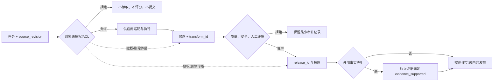

# 工作流与 API 边界

## 本节目标

设计不依赖单个模型名的生成服务边界，让需求审核、供应商调用、结果存储和人工审批可以独立变化。

## 分层而不是在业务代码里直接调用

推荐五层：

1. **任务层**：用途、提示、输入引用、风险、预算和验收标准；冻结需求的 `source_revision`。
2. **策略层**：对象级授权/ACL、权利、安全、隐私与审批门禁；在评分、预览或模型读取前拒绝不合格输入。
3. **适配层**：把通用任务映射到某供应商当前的端点和参数。
4. **执行层**：超时、限流、重试、状态轮询、下载和校验；每次生成、编辑或后期变换都有 `transform_id`。
5. **评审与发布层**：候选筛选、人工批准、`release_id`、披露和审计记录；外部事实性声明必须独立满足 `evidence_supported`。

在 2026-07-22 核对的 OpenAI 官方文档中，单次生成/编辑可走 Image API，会话式多轮编辑可通过 Responses API 中的图像工具；输出大小、质量、格式和压缩等选项依模型而定。这里的工程结论不是“永远用某端点”，而是**适配层必须声明能力矩阵与文档核对日期**。

## 供应商无关请求

通用对象可以包含：`task_type`、结构化 prompt、输入资产的 `asset_id`、`source_revision` 与 `acl_reference`、输出规格、候选数量上限、预算、审查规则、`transform_id` 和候选 `release_id`。对象级 ACL、授权依据、保存期限和撤权/删除传播计划属于业务治理数据，不应让供应商返回值替代。不要在通用 schema 里写死 `gpt-image-*`、某家 seed 参数或具体价格。适配器返回：

- 接受后的内部作业 ID；
- 实际供应商与模型快照（响应后记录）；
- 状态 `queued/running/succeeded/failed/cancelled`；
- 标准错误分类与原始错误的脱敏摘要；
- 输出哈希、来源记录和用量元数据。

## 超时、重试与幂等

图像请求可能同步返回，也可能经历排队。连接超时不代表供应商没有创建任务；盲目重试会重复计费和生成。客户端应发送自己的 `request_id`，在本地记录“提交意图—供应商 ID”映射。只对瞬时错误按指数退避重试；认证失败、内容拒绝、无效参数和余额不足应直接进入人工或配置处理。

下载时检查 MIME 类型、长度上限和哈希，不信任文件扩展名。日志只记录资产 ID 和哈希，不记录私密原图、完整提示或密钥。临时输入与输出应有明确删除期限；撤权或删除不能只删原文件，还要按 `asset_id → transform_id → release_id` 传播到候选、缓存、搜索索引和可访问链接。

## 能力探测与降级

执行前比较任务需求与适配器能力：是否支持编辑、透明背景、多图输入、目标格式和所需比例。不能支持时提供可解释降级，例如“先生成底图，透明抠图由后期完成”；不得悄悄改变用途关键要求。

## 常见错误与排查

- 429 就无限重试：读取当前限流信息，加入抖动、最大次数和总时限。
- 把安全拒绝当网络失败：错误分类应保留语义。
- 下载成功即完成：还要做文件校验、质量评审和人工批准。
- 日志泄露输入：对人脸、客户素材和提示做最小化与访问控制；ACL 决策要绑定对象、用途和 `source_revision`，不能只用项目级“已授权”。
- 模型升级无回归：固定任务集，版本变更先跑小规模评测。

## 练习与自测

画出从“提交任务”到“人工批准”的状态机，并为超时、内容拒绝、输出损坏和评审不通过分别确定下一状态。回答：为什么 HTTP 重试与创意重试不是同一概念？

下一步：[[图像生成/02-工程与质量/06-质量评测与人工评审|质量评测与人工评审]]。

## 参考资料

- [OpenAI Image generation guide](https://developers.openai.com/api/docs/guides/image-generation)（核对于 2026-07-22）
- [[API/00-目录|API]]
