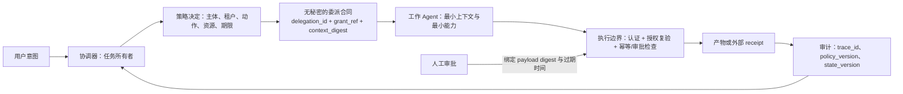
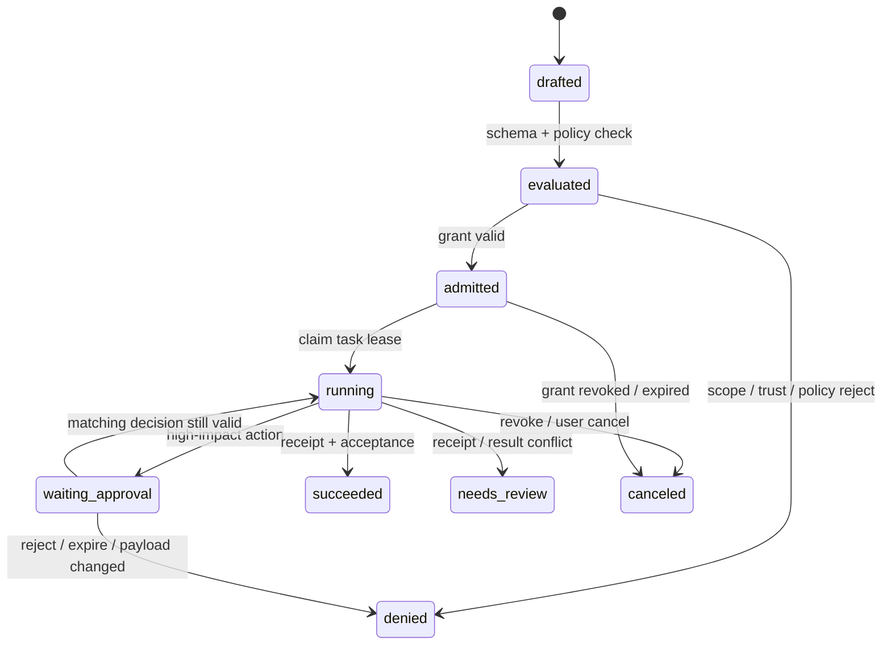

# 身份、授权与跨边界信任

## 本节目标

把角色、发现、身份、授权、审批和审计拆成可独立验证的合同。能说明为什么“Agent A 把任务交给 B”不能自动让 B 获得 A、用户或协调器的全部权限。

## 六个易混淆的概念

| 概念 | 回答的问题 | 不能证明什么 |
| --- | --- | --- |
| 角色/Agent 名称 | 谁负责哪类产物？ | 运行进程是谁、能访问什么 |
| Agent Card/能力描述 | 远端声称提供什么接口和技能？ | 该描述已可信、调用者有权使用 |
| 运行时主体（principal） | 本次请求以谁的身份抵达执行边界？ | 该主体可以无限委派 |
| 授权 grant | 对哪一动作、资源、租户、时间窗作了什么允许？ | 下游副作用已经正确发生 |
| 审批决定 | 谁在何种风险说明下同意了哪份输入？ | 同一决定可复用于修改后的请求 |
| 证据/receipt | 哪个外部系统确认过什么事实？ | 其他资源或下一次尝试也被允许 |

显示名、模型提示词和自然语言“已获批准”都不是访问控制输入。让模型选择工具或专家可以是编排决策；真正的授权应在工具、数据或远端 Agent 的执行边界用经过认证的主体、资源和策略重新检查。

## 一条可审计的委派链

*图 1　委派不是凭据转移。文字替代：协调器在策略决定后向工作 Agent 传递没有秘密的、有期限委派合同；执行边界独立复验身份、授权、审批和幂等条件，产物与 receipt 回写可审计状态。此图是基于本节合同的原创抽象，不是某一协议的标准时序图。*

### 最小委派合同

下面是应用内部的教学结构，不是 A2A、MCP 或任一 SDK 的 wire format：

~~~json
{
  "delegation_id": "D-20260722-001",
  "parent_task_id": "T-100",
  "issuer": {"principal_id": "orchestrator-service", "tenant_id": "demo"},
  "delegatee": {"agent_id": "research-agent", "principal_id": "research-worker"},
  "grant_ref": "grant:demo-read-001",
  "scope": {"actions": ["evidence.search"], "resources": ["catalog:public"]},
  "validity": {"issued_at": "2026-07-22T08:00:00Z", "expires_at": "2026-07-22T08:10:00Z"},
  "context_digest": "sha256:...",
  "acceptance_ref": "evidence-list-v1",
  "audit": {"trace_id": "trace-demo-001", "policy_version": "policy-v3"}
}
~~~

它传递的是**可核验引用和受限范围**，不是 bearer token、密码、完整会话或“代表用户永久行动”的泛化许可。真实系统还需要把 `grant_ref` 解析到自己的 IAM/策略系统，并确认签发者只在它自身获准的范围内做权限收缩（attenuation），而非权限放大。

## 每一次执行都要重新判定

即使调度器已经验收了委派合同，执行边界仍应检查：

1. 当前请求是否由预期的主体认证，且属于正确租户/工作区；
2. action、resource、数据分类和网络目的地是否仍在最小 scope 内；
3. grant、策略版本、租约和审批是否未过期，审批绑定的 payload/revision 是否仍相同；
4. 当前 task/state 允许该动作，幂等键和 receipt 不存在冲突；
5. 输出和审计事件是否去敏、可关联到 `trace_id`、`delegation_id` 与策略决定。

第 3 点尤其重要：审批只对其审过的动作、资源和摘要有效。草稿或收款对象变了，就要重新决定，不能把旧的“允许”贴到新 payload 上。它与 [[多Agent协作/02-工程与质量/06-预算、停止与人工介入|人工审批]] 和 [[多Agent协作/02-工程与质量/05-冲突、同步与失败恢复|幂等冲突冻结]] 配合，分别防止越权与错误重放。

## 跨进程、跨组织时增加什么

A2A 的 Agent Card 用于发现能力、服务端点和认证方案；它不替代你的业务授权模型。A2A 要求服务端在每个操作上做授权检查，并把任务及资源结果限制在经过认证调用者的授权边界内；边界可按用户、角色、项目或租户定义，但具体策略由 Agent 实现者决定。因此客户端不应把 Card 的技能描述当作“全员可调用”的许可清单。[A2A Protocol Specification](https://a2a-protocol.org/latest/specification/)（访问于 2026-07-22）

对于敏感能力：

- 只公开最小 Agent Card；将详细技能通过认证后的 extended card 或私有注册表按身份披露。
- 缓存 Card 时记录版本/ETag；变更认证方式、能力或撤销时使缓存失效。
- 将远端端点、信任根、认证方案、协议/扩展版本和租户路由写入受控配置，不让模型从网页或工具输出决定。
- 如使用签名 Card，验证签名、密钥来源、过期/撤销与期望提供者；签名完整性也不代替调用权限。

A2A 的发现指南建议敏感 Card 使用认证与授权，并建议动态凭据在带外获得，而不是嵌入 Card；规范还说明客户端在信任 Card 前应验证至少一个签名（若有）。[A2A Agent Discovery](https://a2a-protocol.org/latest/topics/agent-discovery/)（访问于 2026-07-22）

## 与 MCP 的边界

MCP 是 Agent 到工具/数据的能力接入协议，不是多 Agent 任务所有权系统。HTTP MCP 的授权规范要求资源服务器验证 token 的受众，并禁止接受或透传并非为自身签发的 token；上游 API 所需 token 应由 MCP server 作为独立 OAuth client 获取。把用户或协调器的 bearer token 塞进 Agent 消息、`metadata`、长期 checkpoint 或远端 Agent Card，既扩大泄漏面，也会形成 token passthrough 反模式。[MCP Authorization](https://modelcontextprotocol.io/specification/2025-11-25/basic/authorization)；[MCP Security Best Practices](https://modelcontextprotocol.io/docs/tutorials/security/security_best_practices)（访问于 2026-07-22）

因此，在此课程的合同中只保留 `grant_ref`、已脱敏 scope 与审计引用；实际凭据由对应的执行边界保管、轮换并按受众绑定。STDIO、本机进程和 HTTP 的凭据处理方式也不同，不能把 HTTP 示例机械复制到本地工具。

## 生命周期与撤销

*图 2　教学运行时的授权相关状态。文字替代：合同先被校验和策略判定，再获得执行租约；高风险动作进入与 payload 绑定的审批等待，撤销、过期和冲突不会被自动重试。`needs_review` 是本课程内部状态，不是 A2A 的标准状态。*

撤销应影响尚未开始的调度和正在等待的审批；已经发出的不可逆副作用需依赖 receipt 和补偿流程，而不是假定“撤销 token 就收回了邮件”。在恢复时重新读取授权和租约状态，不能仅凭旧 checkpoint 继续。

## 常见失效模式

| 失效 | 误解 | 收敛方式 |
| --- | --- | --- |
| 角色名就是身份 | “reviewer” 被任何进程冒用 | 认证运行主体，角色只作为策略属性 |
| 委派继承全部权限 | 协调器把用户全量 token 交给 worker | 引用式、短期、收缩 scope 的 grant；执行边界复验 |
| Card 就是信任 | 根据网页/注册表条目直接调用写工具 | 固定信任配置、认证、签名/版本核验与最小披露 |
| 审批可以重放 | 输入或目标变了仍用旧批准 | 绑定 payload digest、revision、动作、过期和 decision ID |
| 只在入口做权限检查 | 迟到任务或恢复 worker 继续写入 | 每个工具/远端操作检查当前主体、scope、状态和租约 |
| token 出现在消息或 trace | 为方便调试保留完整凭据 | 仅记录引用/哈希，凭据由专门密钥系统管理 |

## 练习与自测

1. 为“研究者查询公开资料、发布者发送外部邮件”各写一份 scope，说明为什么后者需要 payload 绑定审批。
2. 外部 Agent 的 Card 宣称有 `publish` 技能；哪些额外证据才能让本地系统实际调用它？
3. 运行任务恢复时，grant 已过期但 checkpoint 显示 `running`，应该做什么？
4. 为你的运行时写三条拒绝路径：跨信任域却没有可验证策略决定、资源范围从单一对象扩大为通配符、审批到期或其绑定的 payload digest 已改变；每条都要断言没有 adapter 调用或外部副作用。

## 下一步

继续 [[多Agent协作/02-工程与质量/04-消息协议与共享状态|消息协议与共享状态]]，把 `delegation_id`、`trace_id`、状态版本和无秘密证据引用放入可重放的消息与状态模型。

## 参考资料

- [A2A Protocol Specification](https://a2a-protocol.org/latest/specification/)（访问于 2026-07-22）
- [A2A Agent Discovery](https://a2a-protocol.org/latest/topics/agent-discovery/)（访问于 2026-07-22）
- [MCP Authorization](https://modelcontextprotocol.io/specification/2025-11-25/basic/authorization)（访问于 2026-07-22）
- [MCP Security Best Practices](https://modelcontextprotocol.io/docs/tutorials/security/security_best_practices)（访问于 2026-07-22）
- [OpenAI Agents SDK：Handoffs](https://openai.github.io/openai-agents-python/handoffs/)（访问于 2026-07-22）
