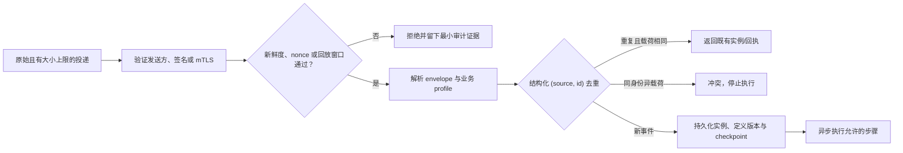
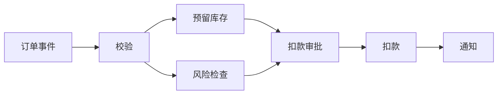

# 触发器、步骤与 DAG

## 本节目标

从业务叙述中识别触发器、步骤、依赖和终止状态，并判断某个环节应是确定性代码、受限 LLM 节点还是完整 Agent 子流程。

## 先选对自动化形态

| 形态 | 适合问题 | 控制权 | 主要风险 |
| --- | --- | --- | --- |
| 脚本 | 单机、短时、顺序固定，可整体重跑 | 程序代码 | 中途失败后缺少状态 |
| 工作流 | 长时、跨系统、有等待/恢复/审批 | 预定义图或状态机 | 重复副作用与版本迁移 |
| Agent | 下一步取决于开放环境和动态探索 | 模型在边界内选择 | 不可预测路径、预算和权限 |
| 混合系统 | 大流程固定，局部任务需语义判断 | 工作流控制外壳，Agent 控制局部 | 两类失败语义混在一起 |

如果流程能写成“审核通过才扣款，扣款成功才通知”，优先用工作流。若某一步是“在若干资料中寻找证据并选择下一种检索策略”，可把它封装成有预算和输出 schema 的 Agent 节点。**不要因为使用了 LLM 就把整个过程都交给 Agent。**

## 三个基本对象

### 触发器

触发器把外部发生的事转换成一个工作流实例。常见来源有 HTTP 请求、消息、文件到达、数据库变更、人工启动和时间调度。

CloudEvents 1.0 要求事件至少有 `id`、`source`、`specversion` 和 `type`；生产者必须保证 `source + id` 对每个不同事件唯一，消费者可以把相同对视为重复。`source` 是非空 URI-reference，`time` 是可选字段，存在时使用 RFC 3339。这里是**规范事实**，但 CloudEvents 不规定去重保留期、发送方认证或业务如何处理重复。

`source + id` 是**事件身份**，不是可信的调用者身份，也不是授权结果。只有在入口先验证发送方、签名或双向认证之后，才可以把这两个字段交给去重账本；攻击者自行构造相同字段并不能获得已有实例、审批或副作用的权限。去重键应保存为结构化二元组（或其规范化编码），不要用 `source + "::" + id` 之类的字符串拼接，否则不同字段组合可能碰撞。

本课程的离线项目实现的是一个**严格的字段与业务 profile**：只接收订单事件所需的 `id/source/specversion/type/data` 与可选 `time`，故意拒绝 CloudEvents 的可选属性和扩展属性；它也只接受可由标准库解析、带显式 UTC 偏移的 RFC 3339 子集，不处理闰秒。为避免把手写 URI 检查伪装成完整规范实现，示例只要求 `source` 非空；它不是通用 CloudEvents 网关。接入真实协议时，应使用所选 binding/SDK 的完整校验器，再把结果收窄为自己的业务 profile。

触发入口通常按以下顺序处理：

1. 在 JSON 解析或格式化请求体之前，按受限长度读取原始字节并验证调用方身份、签名或 mTLS。
2. 检查签名覆盖的时间戳/nonce 是否在允许窗口内；这防止恶意回放，不替代业务去重。
3. 限制大小、类型和速率，再验证事件 envelope 与业务 payload。
4. 用稳定的**结构化**事件键查重；同键不同载荷应报冲突，而非静默覆盖。
5. 绑定明确的工作流定义版本并持久化创建实例；该事务应同时记录去重结果。
6. 返回可查询的实例 ID 或已接收回执，而不是等待整个长流程结束。

### 步骤

步骤是可独立观察的工作单元。一个好步骤有：

- 明确输入、输出和错误码；
- 单一业务责任；
- attempt 超时和总截止时间；
- 副作用声明与幂等键；
- 若需要，明确补偿动作；
- 可记录但不泄露敏感数据的事件；
- handler、schema、提示或模型配置版本。

“处理订单”过大，应拆为校验、库存预留、风险检查、扣款和通知；“读取订单总额第一个字符”又太小，会让调度和状态成本盖过业务价值。

### DAG

DAG 是 Directed Acyclic Graph，即“有向无环图”。边 `A -> B` 表示 B 依赖 A。没有依赖的根节点可先运行；没有下游的叶节点通常通向完成或显式终止。

DAG 本身不能直接表达无限循环。批量分页或多轮 Agent 应使用有上限的迭代状态、子工作流或显式循环构造，并记录终止条件和预算。

## 从需求到图的六步法

1. 写出触发事件和最终业务结果。
2. 圈出所有外部副作用：写数据库、付款、发消息、发布内容。
3. 把副作用前的校验和审批独立出来。
4. 为每一步写依赖，不先考虑并行优化。
5. 列出完成、拒绝、失败、取消、超时和人工处理等终止状态。
6. 静态检查重复节点、未知依赖、自依赖、环和无有效终点。

## LLM/Agent 节点的正确位置

LLM 调用属于可能超时、限流、返回无效结构或产生不可靠内容的外部活动。工作流应记录它的输入引用、提示版本、模型配置、结果指纹和评测版本。模型输出先被当作**不可信候选数据**，通过 schema 和业务规则后才能影响允许的分支。

如果局部 Agent 能调用工具，还需额外约束：工具 allowlist、目标资源范围、最大步数/成本/时间、停止条件、审批点和完成验证器。工作流只接收已验证的最终结果，而不是 Agent 的自然语言自述。

## 常见错误与排查

- **每次收到消息都新建实例**：检查稳定事件键和去重存储是否跨进程持久。
- **把 `source/id` 当作认证信息**：先验证原始投递的签名/调用方，再使用事件字段；信封字段可被攻击者伪造。
- **用连接符拼接事件键**：改为规范化数组/对象或两个独立数据库列，并测试分隔符字符组合。
- **模型生成任意节点名**：改为枚举允许分支，并对输出做 schema 校验。
- **图无环但流程卡住**：检查条件分支是否给所有输入提供默认路径。
- **步骤边界包含多个副作用**：失败时难以判断已完成到哪里，拆分并为每个副作用建立记录。
- **把工作流 ID 当业务幂等键**：同一业务动作可能跨重试或迁移，键还应绑定步骤、资源和意图版本。

## 练习

为“上传发票后入账”画图，至少包含：解析、字段校验、重复检测、金额门槛、人工审批、写入财务系统和通知。逐项写出：

1. 触发事件键是什么？
2. 哪些步骤是纯计算，哪些有外部副作用？
3. OCR/LLM 节点输出如何验证？
4. 同一文件重复上传会创建几个业务实例？
5. 审批拒绝、过期和财务系统超时分别到哪个终止状态？

## 自测

1. DAG 中“无环”为什么不等于“流程一定能完成”？
2. 什么情况下一个局部 Agent 节点比固定步骤更合适？
3. CloudEvents 的 `source + id` 解决了什么，又没有解决什么？
4. 为什么“发通知并写数据库”通常不应放在一个不可分辨结果的步骤里？

## 下一步

继续 [[工作流自动化/02-数据契约与版本演进|数据契约与版本演进]]。

## 参考资料

- [CloudEvents Specification](https://github.com/cloudevents/spec)（稳定发布仍为 1.0.2；主线是 WIP，访问于 2026-07-22）
- [CloudEvents Core Specification](https://github.com/cloudevents/spec/blob/main/cloudevents/spec.md)（`source + id` 唯一性与 `source` URI-reference，访问于 2026-07-22）
- [Open Workflow Specification 1.0.3](https://serverlessworkflow.io/)（访问于 2026-07-22）
- [GitHub：Validating webhook deliveries](https://docs.github.com/en/webhooks/using-webhooks/validating-webhook-deliveries)（原始 body、HMAC 与恒定时间比较，访问于 2026-07-22）
- [RFC 9421：HTTP Message Signatures](https://www.rfc-editor.org/rfc/rfc9421)（覆盖范围、nonce、创建/过期时间与回放边界，访问于 2026-07-22）
- [Anthropic：Building Effective Agents](https://www.anthropic.com/engineering/building-effective-agents)（工作流与 Agent 区分，访问于 2026-07-14）
