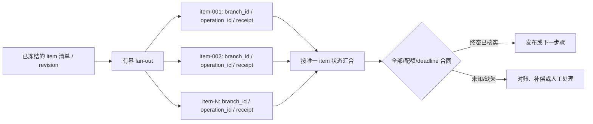

# 条件、并行与汇合

## 本节目标

设计穷尽且可测试的条件、真正独立的并行分支和明确的汇合策略，并正确处理取消、迟到和部分失败。

## 条件分支先定义输入域

分支条件应读取已验证字段，而不是从自然语言里临时搜索关键词。例如风险节点输出：

```jsonc
{ // 条件节点的结构化判定结果，供后续 DAG 边选择而非让文本隐式控制流程
  "decision": "manual_review", // 命中人工复核分支；不能把它误当作自动批准或拒绝
  "reason_code": "AMOUNT_THRESHOLD", // 稳定机器原因码，便于指标、审计和规则版本对照
  "score": 0.82 // 仅作为决策证据/阈值输入；实际分支仍由明确规则决定
}
```

> [!note] JSONC 教学表示
> 这是逐行说明版；传给严格 JSON 工作流接口前请删除 `//` 注释。

`decision` 必须属于允许枚举；工作流根据 `approve / manual_review / reject` 选择固定边。若 LLM 生成该对象，schema 通过也只证明结构合法，仍需业务规则检查和风险回退。

每个 switch 都要回答：

- 空值、未知枚举和新版本值走哪里？
- 多个条件同时为真时是优先级还是错误？
- 没有条件命中时是否有安全默认分支？
- 条件依赖的数据是否在重放时保持一致？

## 什么才可以并行

两个节点在图上没有依赖，不代表业务上可以安全并行。至少检查：

1. 不读取对方尚未产生的数据；
2. 不以不受控方式写同一资源；
3. 各自有独立超时、幂等键和错误分类；
4. 一个失败时，另一个已完成结果有明确处理策略；
5. 总并发受到租户、依赖和成本预算限制。

库存检查和风险检查通常可并行；扣款必须等待二者成功。两个节点同时修改同一订单状态时，需事务、条件更新或状态版本，不能靠“通常很快”避免竞态。

## 汇合不是只有“等全部”

| 汇合方式 | 继续条件 | 必须定义的失败语义 |
| --- | --- | --- |
| `all` | 所有必需分支成功 | 任一失败是否取消、等待或补偿其他分支 |
| first success | 任一成功 | 其余分支如何取消，晚到结果是否忽略 |
| quorum | 达到明确数量/权重 | 重复结果、超时和未达阈值如何处理 |
| best effort | 收集期限内可用结果 | 输出必须显式列出缺失和失败项 |

“取消”通常是协作信号，不保证正在执行的外部调用立即停止。已经提交的迟到结果必须经过状态版本和幂等规则，不能覆盖汇合后的最终状态。

## Fan-out / Fan-in

批量处理 10 万个文件时，不要一次创建 10 万个内存任务。安全做法是：

1. 分页产生工作项并记录总量或游标；
2. 使用有上限的并发和每依赖限流；
3. 每项有稳定 ID、attempt 和结果状态；
4. fan-in 去重并核对成功、失败、跳过和仍在运行的数量；
5. 到达截止时间后执行预先声明的 all/quorum/best-effort 策略。

消息系统可能重复投递；fan-in 计数不能简单 `count += 1`，应按唯一工作项记录状态，否则重复成功会让汇合提前满足。



每个 branch 应有稳定 `branch_id`，每个外部副作用另有 `operation_id`/幂等键。`receipt` 仅表示下游接受了哪个意图；汇合只能按受控状态表中的已核实 `outcome` 计数。这样既能识别重复消息，也能避免把“请求已发出”或 Agent 的自然语言声称误算为成功。

## Agent 并行的额外约束

多个 Agent 并发检索或分析时，还要控制共享上下文污染、重复工具调用、同一文件写入和冲突结论。推荐让每个分支只产出不可变结果，汇合节点执行确定性校验与去重；若要合并自然语言结论，保留来源、`branch_id`、检索/模型版本和证据边界，不让“最后完成者”覆盖所有证据。跨分支写同一资源时，仍须在执行点重新授权并以版本/CAS 决定胜者；trace 或分支标签只用于关联，不能授权写入。

## 一个可验证的部分失败表

| 场景 | 工作流状态 | 自动动作 | 人工可见证据 |
| --- | --- | --- | --- |
| 风险检查暂时超时 | running/retrying | 有限重试 | attempt 与错误码 |
| 库存永久不足 | business_rejected | 不执行扣款 | 库存拒绝原因 |
| 风险通过、库存未知 | waiting/reconciliation | 查询幂等记录与外部终态 | `operation_id`、最后回执与状态 |
| 一项批处理失败 | failed/partial | 依策略重试或转人工 | 失败 item ID 列表 |
| 汇合后收到旧结果 | unchanged | 拒绝旧状态版本 | 迟到事件审计记录 |

## 常见错误与排查

- **并行列表每次顺序不同**：执行与日志排序使用稳定定义顺序，不依赖集合遍历。
- **first success 后重复提交**：结果提交做 compare-and-set，其他分支迟到结果只记录不生效。
- **best effort 对下游伪装成完整结果**：合同中加入 `missing_items`、`failed_items` 与 `complete`。
- **fan-in 提前结束**：按唯一 item ID 去重，核对期望集合而不是累加消息数。
- **把回执计为成功**：记录 `receipt` 与 `outcome` 两个字段；只有后者满足汇合合同才推进。
- **模型分支没有安全默认**：未知输出转验证失败或人工处理，不自动选择高风险动作。

## 练习

设计“并行检查 100 个文件，全部通过后发布”的 fan-out/fan-in：

1. 定义每个 item 的稳定 ID。
2. 设定最大并发、单项超时和整体 deadline。
3. 说明第 99 项超时、第 100 项迟到时的状态。
4. 模拟第 50 项成功消息重复到达，验证不会提前发布。
5. 将策略改成 95% quorum，说明哪些失败仍必须阻止发布。

## 自测

1. “图上无依赖”为什么不足以证明可以并行？
2. 取消信号为何不能替代幂等和迟到结果检查？
3. all、quorum 和 best effort 的输出合同有何不同？
4. Agent 分支结果汇合时为什么要保留证据来源？

## 下一步

继续 [[工作流自动化/04-调度、超时、重试与背压|调度、超时、重试与背压]]。

## 参考资料

- [Open Workflow Specification 1.0.3](https://serverlessworkflow.io/)（访问于 2026-07-22）
- [OpenTelemetry：Messaging Spans](https://opentelemetry.io/docs/specs/semconv/messaging/messaging-spans/)（页面仍标注 Development，访问于 2026-07-22）
- [Microsoft：Queue-Based Load Leveling Pattern](https://learn.microsoft.com/en-us/azure/architecture/patterns/queue-based-load-leveling)（访问于 2026-07-22）
