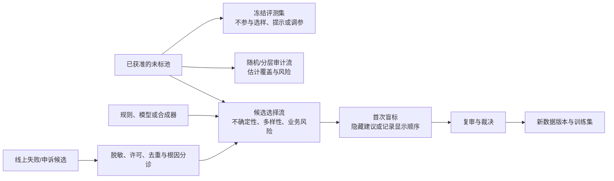

# 主动学习、弱监督与人机协同

## 本节目标

设计“候选选择—人独立判断—复审—版本化再训练”的闭环。主动学习、规则投票、模型预标注和合成样本都可以节省人工，但只能产生**候选或弱证据**；它们不能自行成为 gold、冻结评测结果或隐私/许可结论。

## 先分开四条数据流

候选选择流的标签分布不代表线上自然分布；随机/分层审计流也不等于冻结评测集。三者的来源、抽样概率、时间窗、组级切分和用途必须分开记录。

## 主动学习：选择什么，不能证明什么

当未标池很大时，主动学习可优先选择：

- **不确定性**：当前模型最拿不准的样本；
- **多样性/代表性**：覆盖不同区域，避免只标同一种难例；
- **预期价值/风险**：优先高伤害、高成本或新版本场景；
- **覆盖缺口**：补齐已知语言、来源、时间或长尾层。

只选不确定样本会聚集噪声、离群点和本来就不可判的区域；只选高风险样本会扭曲总体比例。一个实际批次应预先写出随机、分层、风险、不确定和新版本样本各自的配额/概率，并分别报告标注率、冲突率、`cannot_judge`/`exclude` 比例和下游表现。

主动选样批次不能直接估计总体发生率、线上准确率或公平性。若需要总体估计，保留独立概率样本，并使用与采样设计相符的估计方法；即使这样，未覆盖来源和拒绝访问内容仍是外推边界。

## 模型预标注与人为锚定

预标注能减少重复操作，却会让人倾向接受模型，特别是在难例上。至少保留一个预注册的盲标对照：同一层中一部分人先看原始证据、一部分按既定顺序看到建议；记录显示与否、模型/提示版本、人工初标、复审和最终标签。不要用最终裁决反推“人工第一次就同意模型”。

控制方式包括：隐藏置信度、延迟显示建议、随机抽查高/低置信预测、让裁决者看不到身份与产量信息。模型只能处理去重候选、排序和格式检查；高风险标签、伤害判断和升级规则仍需人按任务卡承担责任。

## 弱监督：规则投票不是人工真值

弱监督把关键词、知识库匹配、启发式、远程监督或已有模型输出编码为会弃权/会冲突的标注函数。它适合快速生成候选、覆盖已知模式或探索标签本体；它的输出会有未知准确度和相关性，多个规则“投同一票”也可能只是复制同一偏差。

最小控制：

1. 给每条弱标签保存 `weak_source_id`、规则/模型版本、输入版本、投票/置信信息和生成时间；不要覆盖人工初标。
2. 用独立、人工标注且不参与反复调规则的验证/审计样本检查覆盖、冲突和关键切片错误。
3. 把规则相关、来源泄漏和错误高发层当作调查对象；label model 的概率不是 gold，也不是人类同意率。
4. 若弱标签进入训练，发布时明确它与人工裁决样本的比例、用途和限制；冻结评测集仍使用独立协议下的人工/专家证据。

## 合成样本：覆盖候选，不是现实分布

模板、模拟器或生成模型可构造稀有组合、对抗条件和协议测试样本。必须保存 `origin=synthetic`、生成器/模型与提示或模板版本、条件、过滤/人工复核记录和来源/授权状态引用。合成样本可扩展覆盖，却不能证明其发生频率、真实效用、无版权风险或隐私安全；更不能用生成器的自评替代人工裁决。

合成样本进入训练前仍需检查标签正确性、近重复、组级泄漏和真实留出效用；进入评测前要和真实/历史 case 分层报告。更完整的生成、隐私和发布边界见 [[数据合成/00-目录|数据合成]]。

## 生产回流不是自动训练

线上失败、申诉、人工覆盖和异常轨迹可揭示缺口，但它们首先是受控的**候选**。在进入标注队列前，需要按最小化、访问控制、来源/许可、脱敏、去重、组级泄漏和根因进行分诊；再按新任务卡分派、盲标、复审与版本化发布。不得把日志、模型建议或最终用户行为直接写成训练/评测“真标签”，也不得原地修改冻结集。

详细的发布与回流关系见 [[数据标注/09-版本、发布与生产反馈|版本、发布与生产反馈]] 与 [[评测体系/02-方法与质量/08-离线到线上证据交接与回归闭环|离线到线上证据交接与回归闭环]]。

## 练习

为 10 万条 Agent 轨迹设计每轮 500 条的采样协议：明确随机、风险、不确定、多样性和新版本样本占比；列出要记录的选择概率/原因、冻结集隔离规则、一个盲标对照和一条线上候选的分诊路径。再为两条弱监督规则写出验证样本和停止条件。

## 掌握检查

- [ ] 我会把冻结评测、随机审计、候选选择和线上回流分为独立数据流。
- [ ] 我能说明主动学习批次为什么不能直接代表线上总体，并记录其选择原因/概率。
- [ ] 我会用盲标对照检查预标注锚定，而不是只看标注速度和一致率。
- [ ] 我会把弱监督/合成输出保存为可追溯候选，不把其概率、投票或自评写成 gold。
- [ ] 我不会让生产日志自动进入训练或冻结评测集。

下一步：[[数据标注/08-数据治理、隐私、许可与劳动安全|数据治理、隐私、许可与劳动安全]]。

## 参考资料

资料核验日期：2026-07-22。Label Studio 的 UI、预标注和采样功能依部署版本而变；工具设置不能取代本节的数据流、盲标和发布协议。

- Lewis, D. D., & Gale, W. A. (1994). [A Sequential Algorithm for Training Text Classifiers](https://aclanthology.org/P94-1019/)
- Ratner et al. (2017). [Snorkel: Rapid Training Data Creation with Weak Supervision](https://arxiv.org/abs/1711.10160)
- [Label Studio：机器学习管线集成](https://labelstud.io/guide/ml.html)、[项目设置与任务采样](https://labelstud.io/guide/setup_project)
- [Google PAIR：People + AI Guidebook](https://pair.withgoogle.com/guidebook/)
- [NIST AI RMF Core：数据选择、人工监督与持续监控](https://airc.nist.gov/airmf-resources/airmf/5-sec-core/)
