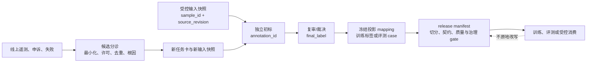

# 版本、发布与生产反馈

## 本节目标

把标注从可编辑的表格升级为可追溯的发布物：区分输入快照、初标、裁决、训练/评测投影和冻结 release；让线上失败成为受控候选，而不反向污染已冻结的标签或评测证据。

## 五层工件，不要相互覆盖

| 层 | 最小内容 | 关键边界 |
| --- | --- | --- |
| 输入快照 | `sample_id`、`source_revision`、来源/访问引用、抽样层、内容指纹或受控 URI | 输入 URL、文档或媒体变化后不能假装仍是同一证据 |
| 标注事件 | `annotation_id`、输入版本、指南/标签/界面版本、匿名角色、标签、证据、时间 | 初标是观察，不是最终真值；应追加而非覆盖 |
| 裁决事件 | 初标 ID、可见证据、规则引用、`final_label`、裁决理由、是否触发指南变更 | 裁决不能抹去分歧、模型建议或原始版本 |
| 下游投影 | 由冻结 mapping 生成的训练 label、`expected_label`、rubric、禁止动作或权重 | `cannot_judge`/`exclude` 不可无声压缩为正/负类 |
| 发布物 | `release_id`、不可变 manifest、schema、切分映射、质量/治理 gate、变更日志、用途/访问范围 | “已通过”只覆盖 manifest 声明的检查，不证明永远代表线上 |

这是一种适合工程实现的最小 lineage，而不是要求每个项目完整实现某个本体。W3C PROV 的 entity、activity、agent 与 derivation 概念可帮助区分“哪个数据”“谁做了什么”“从哪里派生”，但仍要由本项目定义字段、权限和保留策略。

## 从输入到可消费 release

*图示文字替代：每次生产反馈先经分诊和新的任务/输入版本，再走独立标注、裁决和发布流程；已发布 release 不被线上数据原地改写。*

## 发布前的硬门与调查门

| 检查 | 例子 | 失败后的默认动作 |
| --- | --- | --- |
| 契约与完整性 | Schema、重复 ID、输入快照、标签/指南/界面版本、必填证据 | 拒绝发布，修复记录或重新导出 |
| 切分与污染 | 实体/会话/近重复组、时间窗、冻结评测隔离、训练提示泄漏 | 阻止消费，重新分组/分割 |
| 标签质量 | 重叠覆盖、冲突、gold/专家审计、分层分母、裁决缺口 | 进入 review、补标、修指南或重标 |
| 来源与人员边界 | `access_scope`、许可/授权状态、留存、撤回、内容风险 | 未明或硬失败时隔离/BLOCK，不把状态猜为通过 |
| 可复现与用途 | `release_id` manifest、代码/工具版本、mapping、责任人、允许用途 | 不允许复现/责任不明时不发布为可消费版本 |

“质量门通过”必须带检查名称、版本、时间、分母、例外和责任人。一个哈希可证明字节未变；它不证明来源合规、标签正确、统计有代表性或审批仍有效。

## 版本规则：变化的是测量对象还是修补记录？

- **输入更新**：原文、检索语料、媒体或可见工具结果变了，创建新的 `source_revision`；必要时重新标注，不能复用旧判断冒充新输入。
- **指南/标签空间/界面 major 变化**：可能改变测量对象。通过桥接样本比较旧/新规则，决定重标范围；不能只把版本号改大后合并趋势图。
- **裁决或数据缺陷**：追加裁决/纠错事件，标记旧 release 是否被 supersede 或 deprecated；保留最小审计链和影响范围。
- **发布映射变化**：即使 `final_label` 未变，训练/评测的投影规则、split 或权重变了也应生成新 release。
- **来源撤回/到期**：发出 tombstone、停止新消费、查询关联 release 和下游用途，再按批准计划隔离、替换、重建、重新训练或通知。不要声称“模型已删除该知识”，除非有可核验证据。

## 生产反馈的可控入口

线上日志、用户申诉、人工覆盖、红队发现和监控漂移可以告诉团队“什么值得调查”，不能自动告诉团队“正确标签是什么”。最低限度要做：

1. 按 [[数据标注/08-数据治理、隐私、许可与劳动安全|治理边界]] 确认最小化、访问、来源/许可和内容风险；不复制完整生产内容到开放队列。
2. 去重并按用户、会话、文档、工具/模型版本和时间关联根因；记录其是事故、申诉、随机监控还是主动选样候选。
3. 判断它是否会泄漏冻结评测答案或把模型输出当作标签；必要时放入隔离池或创建新的评测/训练版本。
4. 用新的任务卡、指南和独立标注生成候选标签，经过复审/裁决后才进入下一个 `release_id`。
5. 报告新旧 release 的比较边界、已知未覆盖层与回滚/撤回方式，而不是以线上单个成功/失败宣布模型进步。

与 Agent/RAG 评测的衔接见 [[评测体系/02-方法与质量/08-离线到线上证据交接与回归闭环|离线到线上证据交接与回归闭环]]。RAG 语料更新、ACL 和墓碑传播还需遵循 [[RAG/07-端到端评测与监控|RAG 端到端评测与监控]] 的摄取边界。

## 项目落实与限制

[[数据标注/07-项目-Agent回答质量标注|本课项目]]的 JSONL 审计器故意只验证“固定双人、同一输入快照、统一合同版本”的最小教学合同。它不实现人员身份映射、gold 答案、裁决账本、访问控制、切分、统计区间、许可证或生产写入。接入真实系统时应把这些工件置于受控存储，避免将敏感正文或凭据打包进公开数据集。

## 练习

为一个 RAG 相关性标注发布包设计 manifest：写出 `release_id`、用途、输入快照范围、`guideline_version → rubric_version` mapping、组级 split、质量门、`access_scope`、撤回影响查询和一条线上失败如何变成候选的流程。然后说明哪一项变化会强制产生新 release，哪一项只是追加裁决。

## 掌握检查

- [ ] 我能区别输入快照、初标、裁决、下游投影和 release，不原地覆盖历史。
- [ ] 我会把训练/评测隔离、组级切分和来源/访问 gate 写入可审计 manifest。
- [ ] 我知道指南 major 变化、输入变化、映射变化和撤回各自为何可能要求新 release 或影响评估。
- [ ] 我不会把线上失败、用户行为、模型自评或申诉自动写成训练/评测真标签。

下一步：[[数据标注/07-项目-Agent回答质量标注|项目：Agent 回答质量标注]]。

## 参考资料

资料核验日期：2026-07-22。

- [W3C PROV-O](https://www.w3.org/TR/prov-o/)
- [NIST AI RMF Core：文档、数据选择、评测与生产监控](https://airc.nist.gov/airmf-resources/airmf/5-sec-core/)
- Gebru et al. (2021). [Datasheets for Datasets](https://arxiv.org/abs/1803.09010)
- [Label Studio：导入 task](https://labelstud.io/guide/tasks)、[导出 annotation](https://labelstud.io/guide/export.html)
