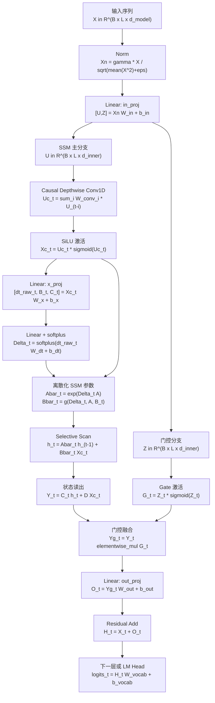

# Mamba 模型

<!-- graph-links:start -->
## 关联笔记
- 同目录笔记：[[Transformer模型|Transformer 模型]]
<!-- graph-links:end -->

## 一句话理解

Mamba 是一种基于 **Selective State Space Model（选择性状态空间模型，Selective SSM）** 的序列建模架构。它想解决的问题是：在保留长序列线性复杂度优势的同时，让模型能够根据当前 token 的内容决定“记住什么、忘掉什么、传递什么”。

它常被放在和 [[Transformer模型|Transformer]] 对比的位置：Transformer 依赖 attention 显式比较所有 token，表达力强但长序列代价高；Mamba 把历史信息压进一个不断更新的状态里，推理时更像递归模型，长序列和流式场景更省。

> [!note] 关键来源
>
> 原始 Mamba 论文提出 selective SSM，并强调线性长度扩展、快速推理和长序列表现；Mamba-2 进一步用 State Space Duality 解释 SSM 与 attention 的联系；Mamba-3 则从推理效率和状态表达能力继续改进 Mamba 系列。

## 背景：为什么要有 Mamba

Transformer 的 self-attention 会计算序列中每个 token 与其他 token 的关系。若序列长度是 $L$，完整 attention 的计算和显存通常随 $L^2$ 增长。对短文本或中等上下文，这个代价可以接受；但到百万长度 DNA、长音频、长日志、超长文档时，attention 会变成主要瓶颈。

在 Mamba 之前，研究者已经尝试过很多低于二次复杂度的序列模型，例如线性 attention、卷积模型、RNN 变体和 Structured State Space Model（SSM）。问题是，这些模型虽然更省，但在语言等离散、高信息密度任务上往往不如 attention。Mamba 的核心判断是：旧 SSM 的一个主要弱点在于参数太固定，不能充分根据输入内容做选择性推理。

## 从 SSM 到 Selective SSM

传统状态空间模型可以写成：

$$
h_t = A h_{t-1} + B x_t
$$

$$
y_t = C h_t
$$

其中：

- $x_t$ 是第 $t$ 个输入 token 或特征。
- $h_t$ 是模型保存的隐藏状态，可以理解为压缩后的历史记忆。
- $A$ 决定旧状态如何保留或衰减。
- $B$ 决定当前输入如何写入状态。
- $C$ 决定从状态中读出什么输出。

如果 $A$、$B$、$C$ 基本固定，模型处理每个位置时使用的是同一套状态更新规则。这样做很高效，但对离散文本这类任务不够灵活，因为不同 token 的重要性差异很大。

Mamba 的 Selective SSM 把部分 SSM 参数变成输入相关的函数。直观地说：

- 遇到重要 token 时，模型可以把更多信息写入状态。
- 遇到无关 token 时，模型可以快速遗忘或跳过。
- 不同位置可以使用不同的信息传播方式。

所以 Mamba 的“selective”不是简单筛掉 token，而是让状态更新机制随输入内容变化。

## 完整计算步骤流程图

下面的图按“一个 Mamba block 如何处理一段序列”来画。实际模型会把这个 block 堆叠很多层，block 外通常还有 normalization、residual connection、embedding 和最终输出头。

## 每一步在做什么

图中已经把每个计算节点的主要公式写出来了，下面只解释每一步的作用。

1. **输入序列 X**：输入形状通常可理解为 `batch x length x d_model`。每个位置是一个 token embedding 或上一层 block 的输出。

2. **Norm**：对每个 token 的通道维做归一化，让不同层的数值尺度更稳定。很多现代序列模型使用 pre-norm，即先归一化再进入核心计算。

3. **输入线性投影 in_proj**：把 $d_{model}$ 维表示投影到更大的内部维度，并拆成两条分支。主分支负责状态空间计算，门控分支负责决定最后输出多少信息。

4. **主分支 u**：这是进入 Mamba SSM 的主要内容流。后续的卷积、参数生成和 selective scan 都围绕这条分支进行。

5. **门控分支 z**：这条分支不直接写入状态，而是在最后作为 gate 调节输出。它的作用类似“当前 token 允许多少 SSM 输出通过”。

6. **Causal depthwise Conv1D**：在不看未来 token 的前提下，对每个通道做短窗口卷积。它补充局部邻域信息，让模型在进入长程状态更新前先看到附近上下文。

7. **SiLU 激活**：给卷积后的特征加入非线性。没有非线性时，多层线性变换表达力会明显受限。

8. **x_proj 生成选择性参数**：Mamba 的关键在这里。模型根据当前 token 的特征生成 $\Delta_t$、$B_t$、$C_t$ 等参数，使每个位置可以有不同的状态更新方式。

9. **dt_proj + softplus**：$\Delta_t$ 可以理解为当前 token 的状态更新步长。`softplus` 保证步长为正，避免出现不合理的时间步。

10. **离散化 A、B**：连续形式的 SSM 参数需要变成离散序列计算可用的参数。直观上，$A$ 决定旧状态如何衰减或保留，$B_t$ 决定当前输入如何写入状态。

11. **Selective Scan**：这是 Mamba 的核心计算。它沿序列从左到右更新隐藏状态：

    $$
    h_t = \bar{A}_t h_{t-1} + \bar{B}_t u_t
    $$

    其中 $\bar{A}_t$、$\bar{B}_t$ 会受当前输入影响。训练时这个 scan 会用并行算法加速；推理时可以只保留当前状态，逐 token 更新。

12. **读出 y_t**：根据当前状态生成输出：

    $$
    y_t = C_t h_t + D u_t
    $$

    $C_t h_t$ 是从状态记忆中读出的内容，$D u_t$ 是一条直接跳连，保留当前输入的局部信息。

13. **门控输出**：门控分支经过 SiLU 后与 $y_t$ 逐元素相乘。这样模型可以动态压低无用输出，或放大当前更重要的信息。

14. **输出线性投影 out_proj**：把内部维度映射回 $d_{model}$，保证可以和 block 输入做残差相加，也能接到下一层。

15. **Residual Add**：把 block 输入加回输出，形成残差连接。它能减少深层训练难度，也让模型在不需要复杂变换时保留原表示。

16. **下一层表示或最终输出**：如果还有后续 Mamba block，就继续重复这个流程；如果是语言模型最后一层，则通常接 normalization 和 LM head，把隐藏表示映射成词表 logits。

其中 selective scan 是工程关键点。参数依赖输入以后，传统 SSM 常用的高效卷积形式不再直接适用；Mamba 使用硬件友好的并行 scan 算法，让训练阶段仍然能高效并行，推理阶段则可以像 RNN 一样逐 token 更新状态。

## 和 Transformer 的核心差别

| 维度 | Transformer | Mamba |
|---|---|---|
| 核心机制 | self-attention 显式比较 token 之间关系 | selective SSM 递归更新压缩状态 |
| 长度复杂度 | 标准 attention 通常是 $O(L^2)$ | 序列长度方向近似线性 |
| 推理缓存 | 需要保存 KV cache，长度越长缓存越大 | 主要保存固定大小状态 |
| 长程依赖 | 可以直接访问历史 token 表示 | 依赖状态是否保留了足够信息 |
| 适合场景 | 通用语言建模、多模态、需要显式检索历史关系 | 长序列、流式推理、音频、基因组、低延迟生成 |

这个对比不是说 Mamba 一定优于 Transformer。更准确的说法是：Mamba 用压缩状态换取长序列效率；Transformer 用显式 token-token 交互换取更直接的全局建模能力。

## 为什么 Mamba 推理更省

自回归生成时，Transformer 每生成一个新 token 都要让当前 token 查询历史 KV cache。虽然历史 key/value 不需要重新计算，但 cache 会随上下文长度增长。

Mamba 的推理方式更像：

$$
state \leftarrow update(state, x_t)
$$

每来一个 token，只更新固定规模的状态。因此它的推理内存不会像 KV cache 那样随上下文长度线性膨胀。代价是：历史信息已经被压缩进状态，不能像 attention 那样随时回看所有 token 的原始表示。

## Mamba 系列的后续发展

Mamba-2 论文提出 State Space Duality（SSD）框架，把 SSM 与 attention 的若干变体联系起来，并在此基础上设计了更快的 Mamba-2 核心层。它的重要意义不只是“更快”，还在于解释了为什么某些 SSM 结构可以接近 attention 的建模行为。

Mamba-3 进一步从推理优先的角度改进线性模型，重点包括更强的 SSM 递归表达、复数状态更新和 MIMO（multi-input multi-output）形式。它反映出 Mamba 系列的方向：不是简单替换 Transformer，而是在长上下文、低缓存、推理效率和状态建模能力之间寻找更好的折中。

## 什么时候优先考虑 Mamba

Mamba 更适合这些场景：

- 序列很长，标准 attention 的计算或 KV cache 成本太高。
- 数据天然是连续流，例如音频、时间序列、传感器日志。
- 任务需要低延迟自回归推理。
- 输入长度可能远超训练时常见上下文长度。
- 想在语言、基因组、音频等高信息密度序列上尝试 sub-quadratic backbone。

不应简单认为 Mamba 能替代所有 Transformer。对于需要精确复制长上下文片段、显式检索多个远距离 token、复杂工具调用轨迹或高度依赖原始上下文细节的任务，attention 仍然有明显优势。

## 常见误解

- **“线性复杂度等于一定更强”**：不是。线性复杂度主要是效率优势，表达能力仍取决于结构、规模、训练数据和任务。
- **“Mamba 没有 attention，所以不能建模长程依赖”**：也不准确。Mamba 可以通过状态传播长程信息，只是信息以压缩状态形式存在。
- **“Mamba 的状态就是完整记忆”**：不是。状态是压缩表示，必然存在信息取舍。
- **“Selective SSM 就是简单的门控 RNN”**：过于简化。Mamba 的关键还包括 SSM 参数化、离散化、硬件友好的 scan，以及与现代深度网络 block 的结合。

## 学习抓手

理解 Mamba 可以抓住三句话：

1. 它把序列历史压缩到一个不断更新的状态里。
2. 它让状态更新参数依赖当前输入，从而具备内容选择能力。
3. 它通过硬件友好的 selective scan，把递归状态模型做成可训练、可扩展的现代 backbone。

## 参考资料

- Gu, A., & Dao, T. **Mamba: Linear-Time Sequence Modeling with Selective State Spaces**. arXiv:2312.00752.
- Dao, T., & Gu, A. **Transformers are SSMs: Generalized Models and Efficient Algorithms Through Structured State Space Duality**. arXiv:2405.21060.
- Lahoti, A., Li, K. Y., Chen, B., Wang, C., Bick, A., Kolter, J. Z., Dao, T., & Gu, A. **Mamba-3: Improved Sequence Modeling using State Space Principles**. arXiv:2603.15569.
- `state-spaces/mamba` GitHub repository: <https://github.com/state-spaces/mamba>
